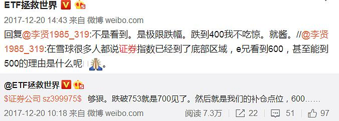

# 遵守投资纪律，根据预案操作

## 一、我不会用主观判断指导投资（2018-01-25）

给个别朋友写几句话，还请认真看。

今天，有朋友给我发了个贴图，是某个群在讨论投资。群主发言说，「我不喜欢 E 大，证券 ETF 他在 0.99 买入（我买的比这个价格低很多好吗——E注释），却说了很多看空的话，什么看到 400 看到 600，严重影响了我的判断。我看不惯他现在又嘚瑟。」

如果是其它人，我会一笑置之——谁都不是人民币，不可能每个人都喜欢，不喜欢就不喜欢呗。然而这位朋友，却有些不一样。当初他有事请我帮忙，在雪球私信我，做为一个素不相识的人，一口答应，并按照承诺完成。没想到一转身就会这样。

这都无所谓，让我来谈谈他说的，关于「预期」吧。

在我的投资逻辑中，从来不会用主观判断去作为主要依据指导投资。因为我知道作为人类有太多缺点，这些缺点会导致我们在投资决策的时候犯错。所以*我更相信投资体系和投资策略的机械化操作。*

但是，*投资体系中的参数需要我们去设计。「最差」情境就是其中一环。我会做出一个判断，即当我买的东西出现最差情况的时候，我会不会死。甚至，即使比我预期最差的还要差，出现了黑天鹅，我会不会死。*

所以，每个品种我都会提出一个最坏的情况。每次发车的时候也会写清楚，「该品种最大下跌幅度 xx%」。我从来不会「看到」多少，谁会无知到这个地步，认为人类可以预测某个品种的最高最低价格？我只是说，我做好准备到那里了，到了那里，我不会吃惊。

这是第一个原因，我再说第二个。

我不知道这是一个优点还是缺点，我这个人总是会有一些莫名其妙的「责任心」。阴差阳错，2010 年开始公布自己的指数基金投资计划。到了八年后，2018 年，居然已经有那么多人，那么多资金在参考。具体有多少，我就不说了。总之一定会比绝大多数人能想到的还要多很多倍。

这些资金只是在参考我的计划，无论涨了跌了，赚了赔了，其实跟我一点关系都没有。赚了没人会分一分钱提成给我，赔了我也没有任何法律责任。但我的莫名其妙责任感又总是挥之不去，我总是不希望有任何一个人因我赔钱。

这导致两个后果，第一个是发布的计划会特别保守，因为那么多人里面风险承受能力低的不在少数。

第二，我要经常的进行预期管理。其实投资这件事分两个层面。第一个叫做交易，第二个叫做心理。有了正确的交易，没有良好的心理，也不可能成功。所以我经常在失败的时候做好更加悲观的预期，防止卖在底部。成功的时候会通过各种方式鼓励，这样才能坚持拿住，不会赚一点就跑失去了真正的大利润。

这样的用心良苦，我想不是每个人都能了解。不理解也没有问题，只是今天知道了这个情况，是让我本人心情不是太好。

知恩图报在这个社会中当然很难，能够不过河拆桥背后使坏就已经阿弥陀佛。

但无论如何，未来有我能帮的忙我还是会继续帮。计划也会继续公布下去，至少会走完这一轮。

也再次祝各位都赚大钱吧。

> 原文发表于雪球：《[我不会用主观判断指导投资](https://xueqiu.com/4776750571/10021351)》

## 二、根据预案操作（2020-10-12）

各位到市场上投资，你不可能买到所有品种在所有时间都是大牛。

那么当你买到大牛、肉鸡和辣鸡的时候，该怎么做，就得分别有预案。

然后根据你的预案进行操作。

换句话说，当你点击买入按钮之后发生的所有可能，你都已经做好准备了。这种时候无论发生什么，你都能游刃有余，按照预案执行就可以了。

最怕是什么，最怕是买的时候也不知道为什么买，涨了、横盘、跌了……也不知道该怎么办。赚了点狂喜，赔了点抑郁。涨的时候哆哆嗦嗦不知道该落袋还是继续持有，跌的时候不知道该割肉还是继续赔。

浮浮沉沉，确认过眼神，自己是一根被收割的海草。

所以无论买到什么，几个月、半年、一两年后，你打开账户一看：

99% 的品种全是红的！而且每个品种都知根知底，都有操作预案——这就说明你入门了。

> 原文发表于微博：《[根据预案操作](https://weibo.com/5687069307/JoQIVfYae?from=page_1005055687069307_profile&wvr=6&mod=weibotime&type=comment)》

我特别特别希望大家明白的一件事，做投资，不是说你买完了过一段时间去看是赚了还是赔了。不是这样的。而应该是*你买的那一刹那，就应该知道自己会赚还是会赔*。

当你知道你买的这个东西不会死，买的价格也便宜，即使未来还有下跌，无非是因为货币或者情绪的原因，那你就知道极大概率自己一定会赚。

这样，未来跌了你心里会毫无波澜。因为你已经知道终点的风景很美，又怎么会在意路途上的颠簸。

相反，你买的时候乱买，买完了一个波动你就懵了。不停地到处找人问：赔钱了，我该怎么办？割肉还是持有？

当你进入这个状态，基本上已经可以判定：这个牌桌上，你就是送钱的那个人。

我自己买的东西，我都很有信心。当然不能保证 100% 每个品种都一定会赚钱，但绝大多数品种会赚钱这个没有任何问题，更何况后面还有一整套交易体系在支撑。

无非就是时间问题，早涨晚涨而已。

所以，那些质疑我买的品种不涨的人，在我看来都挺可笑的：门儿都没入。

> 原文发表于微博：《[买的时候就该知道自己会赚还是会赔](https://weibo.com/5687069307/Kc3lMyAr3?filter=hot&root_comment_id=0&type=comment)[》](https://weibo.com/5687069307/Kc3lMyAr3?filter=hot&root_comment_id=0&type=comment》)

> 本文章所载信息仅供参考，不构成任何投资建议。如转载使用，请参考 [《文章转载声明》](https://youzhiyouxing.cn/agreements/ARTICLE_REPRINTED)。
