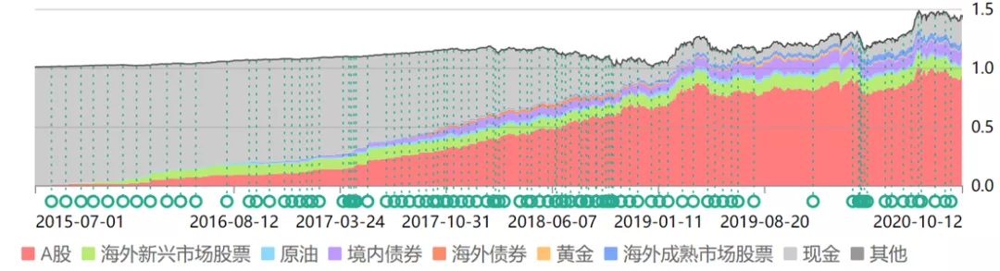

# 设计适合你自己的资产配置组合

## 一、上篇（2020-10-13）

知道不知道我已经有多久没写发车文章了？

126 天，整整 4 个月了。

主要原因不是懒或者忙（绝对不是），而是因为行情非常稳定，即使中间有过大涨大跌，在我们的眼中，也不过是小波动而已。不需要大量买入，不需要大量卖出，所以也不用说太多。佛系持有就行，各位大爷吃好喝好。

前几天，我发了一篇关于千万资产的文章，评论里有不少富豪朋友问到关于如何稳定获取 x% 收益率的问题。加上今天我们又买了一份债券，那我就简单展开说说资产配置的问题。

我们从获取无风险或低风险收益率开始说。

世界上没有绝对的无风险投资。银行存款算是最安全的投资了吧？难道银行没有倒闭的可能吗。万分之一，十万分之一的可能也是可能。所以我们讨论的「无风险」，只能是相对来说的无风险，或者说，低风险。

每个人的风险偏好是不同的：

资产千万亿万的人，重视的是如何让自己的资产稳定增值，因为几个点的收益，绝对值就已经非常高；

资产较少的人，会追求相对较高的收益率，因为收益率太低意义不是太大。比如你拿 5000 元来投资，每年收益 10%，已经非常非常不错了吧，绝对值也只有 500 元，吃两顿饭或者买两件衣服就没了，更别提 10% 的低风险年收益率已经非常困难。

同样，年纪大的人会追求稳定，因为留给他们的犯错空间越来越小了。一旦投资不利，会影响退休后稳定安逸的生活；而刚毕业的年轻人则不同，他们即使在一次牛熊中损失大半，也依然有至少 5～7 次大牛市在前面等着他。所以相对来说他们会激进一些。

所以你的需求是独一无二的。你可以把自己代入四个象限，分别是：

*钱多的年轻人、钱少的年轻人、钱多的中老年人、钱少的中老年人。*

找准自己的定位后，再开始制定适合你自己的投资组合。

四个象限中，除了钱少的年轻人，其他三类我都建议认真研究无风险或低风险组合（以下简称低风险组合），因为这类组合适合你们。同时，即使你追求高风险组合，也应该在低风险的基础上进化。这样，你才对投资会有一个大局观。

我之前说过很多次，老一代国人对于投资的态度分为两种：

第一种是认为金融投资都是骗子，一定赚不到钱。所以他们只敢存银行、买理财、买国债。

第二种是赌徒。他们疯狂追求高收益，他们牛市入场买股票、买 P2P、买数字货币、买任何他们认为能快速获利的东西。

我衷心希望，新一代的中国年轻人不再重复这两条路。什么是资产配置？如果你注意到我们每次发车文章的这张图，你就会懂：

注意这张图从内开始第二圈的类别，分别是：

A股、货币、债券、海外新兴市场股票、海外成熟市场股票、商品。

第三圈更加细分，在以上大类中，再次细分为：

A股价值股、A股大盘股、A股中小盘股、A股行业股、国内债券、海外债券、港股、海外互联、欧洲、美国、原油、黄金。

第四层则分得更细。

这，就是资产配置。

也许看到这里你的头已经开始疼了。别急，这已经是相当高级、复杂的资产配置方式。一开始，你完全没有必要这样设计。你只要这样做，就能做好一个低风险组合配置：

*第一层：85% 债券 + 15%A股（沪深300），每年年末再平衡。*

是不是非常简单？每年只要花费很少很少的时间，就可以取得极低风险下的可接受收益率。这个组合，在过去十年中，只有 2013 年股债双杀的情况下亏损了不到 5%，其它所有年份都取得了盈利，年化收益率 4%~5%。

你是不是觉得太低了？确实不高。不要急，我们一层一层来。从最简单的开始，每个人根据自己的情况各取所需。

*第二层：动态平衡。你有没有发现我们的 150 计划仓位是不断变化的。*

2015 年 7 月，股灾前最高点时，我们的现金仓位几乎占了 100%，A股基本没有。之后，随着市场不断下跌，我们的权益类资产占比越来越大，最终在 2018 年钻石坑前附近大幅提升。一直到现在，没有再发生大的变化。

这就是「动态」平衡。

这时，不再将债券与A股的比例固定,而是根据市场估值状态动态调整。*在低风险配置概念中，我建议你将债券的波动范围设置在 70%~95%，股票的波动范围设置在 5%~30%。*如果你愿意提升风险容忍度，获取更高的收益率，可以加大股票仓位波动范围。第一层的固定比例也是如此，可以设置 80：20 或者 75：25 等。

动态平衡后，风险并未大幅增加，依然可以做到除了 2013 年外每年盈利，但年化收益率已经可以提升到超过 7%。

写着写着发现已经太多了，一次写不完，我们就下次继续说吧。再说一次，资产配置是由浅入深，循序渐进。从固定比例到动态比例，到后面操作难度和收益率加大、也更加有趣的配置方式，相信至少会给你一些启发，完善自己的系统。

有人说，搞这么复杂干嘛，我直接买个配置基金不行吗？

不行。

你以前不会，现在不会，以后也绝对不会把所有资金买入一只或一类品种。只要你手上还有钱，那你就需要「资产配置」的理念。

当你在熊市低位，看着手里那只配置基金浮亏 30% 却不得不拿钱出来买房、结婚、治病、孩子上学的时候，你才会知道资产配置的重要性。即使你那只配置基金之后在牛市中赚了 70%，也与你无关了。

因为，熊市中急用钱的你，把它亏损卖掉了。

除非你穷困一生，永远没有闲钱进行金融投资。不然的话，资产配置是你必须上的一节必修课。我愿意与你分享我十几年配置经验的一些心得，希望你喜欢，更希望对你有用。

下次接着说。

> 原文发表于公众号：《[2020年10月ETF计划（一）：150买入一份；S不操作](https://mp.weixin.qq.com/s/bwwYxdl3Ytvg6UrdqlFIXw)》

## 二、下篇（2020-10-30 ）

上次我们讨论了资产配置最基本的两种方式：固定股债比例，以及根据估值动态调整股债比例两种方法。今天我们继续讨论更深层次的资产配置方式。

在正式讨论大餐之前，我们先上个小甜点。

上次的公众号文章发布后，有人在评论里说：

看完这条留言，我不由得感叹，这得无知和逻辑混乱到什么地步才能说出这样的话啊。

首先咱们分析逻辑。

在那篇文章里，我通篇介绍的是如何做资产配置。即，最基本的股债再平衡与高一级的动态平衡。除了作为例子举出的 80:20，以及后面提到可以根据你的情况变化比例外，一个字都没写你的股债「应该」是多少。

我写的是大的策略，你来跟我讨论股债比例具体是多少？我不禁满脸问号。

其次，您推崇的这位告诉您的这个方法，100 年前就已经有人在书里写过了。它是不是最合适、最科学，是不是适合每个人的确定仓位方法我不知道，我只知道，您是真的无知无畏。

甜点时间结束，下一拨名媛请就位，正餐来了。

你是不是经常听人说，股票是收益率最高的投资品种？如果是，那么为什么我们要配置股票和债券两个品种？为什么要「再平衡」？

第一个原因，在于配置两种不相关的品种后，你的收益率会变得更加平缓、波动降低，同时长期收益率也会提高。2008 年和 2015 年下半年，两市股票平均跌幅超过 60%。你千万不要低估这个跌幅的杀伤力以及高估你自己的承受力。如果你不幸高位满仓买入，那么你需要赚 100% 以上才能回本。（之后我会专门写一篇有趣的投资数学文章）然而如果你做了动态平衡，则回本的时间以及资产损失的幅度会大幅降低。

同时，再平衡天然的低买高卖动作也会极大提高你的长期收益率。

第二个原因，在于会大幅降低你的焦虑心态。这个老朋友都懂，不多说了。

在掌握最基础的两种配置方法后，我们需要考虑的是如何在这个基础上进一步提高收益率。

再平衡本质上是一种「低买高卖」策略。当某类资产跌幅较大后，其在你的资产配置中比例会降低。这时候你进行再平衡，则等于低位买入。同时，高位卖出了上涨的那个不相关品种，客观上实现了股神级别的操作。

动态仓位平衡则是进一步提出了低位加大仓位，高位降低仓位的理念。

那么再进一步呢？再进一步就是在「品种」上下手。

之前我们举的再平衡 4~6%，动态再平衡接近 8% 的十年收益率，是基于「沪深300」这个指数。这个指数基本能代表A股的走势，但它当然不算表现很好的指数。如果你希望进一步提升收益率，就要选一些能够战胜它的品种。

*我的推荐第一位是「增强指数基金」；第二位是优质的行业基金；第三位是优质的主动基金。*

在A股，第一位的增强指基以及第三类的优质主动基金，能够跑赢基准的原因有两个：

*第一是因为A股是个散户市场，*85% 以上的成交量都由散户贡献，这样机构割韭菜就会很方便高效，客观上让这两类基金取得超越指数的收益。

*第二是因为机构会「抱团」。*目前A股市场的抱团效应已经达到历史最高区域。也就是说，大量机构将资金集中在几十只股票以及几个行业上。这样，这几十只以及这些行业的股票就会不断上涨，最终导致主动基金业绩表现不错。（这样的状态会有很大的后遗症，未来各位会懂）

*第三种优质行业基金不用说了。*记得我几年前提出的几个行业吗？依然没有变。医药 + 消费 + 信息产业（科技 + 中概互联）。未来 10～20 年记住这三个行业就可以了。

这三个品种中，*配置难度从小到大是：行业小于增强指基小于优质主动基金。*也就是说，行业最好选择，增强指基选择难度中等，优质主动基金难度最大。这是因为目前A股有超过 4000 只主动基金，为什么难选我也在过去的文章中说过了，可以去翻翻。

总而言之，到了这一步，资产配置第三层级已经呼之欲出：

*用动态平衡的方式，操作优质行业 + 优质增强指基（标准指基亦可，大小平衡，如300 + 500）+ 优质主动基金。*

我相信一直到这一步，对 70% 以上的朋友来说都不难。具体操作步骤如下：

*首先，确定你的调仓周期。*最低不要低于三个月，最高不要超过一年。原因我不解释，我建议经验少的朋友可以六个月调整一次。

*其次，确定你的最高、最低仓位。*你可以参考前面小甜点那里介绍的方法，也可以用其它方法（以后有机会也要介绍），确定自己的仓位上下限。我建议除非特别激进的朋友，股票仓位最好不要超过80%-85%。如果你只是个普通投资者，那么 5:5 或者 6:4 都很适合。

*第三，确定你的品种。*我的建议是增强或标准宽基指数基金（50、300、500、1000、创业、科创）与优质行业基金结合。有能力可以再去找几个优质主动基金加入配置。这里要注意，这只是我的建议，如果你学有余力，这部分的配置甚至可以延伸到个股上。买了好股票赚钱，同时可以有打新收益。只要是股票类资产，都可以算作仓位。只是我强烈建议 70% 的普通投资者就不要买个股了。

也就是说，只要是A股股票类资产，无论你买入什么都可以。只是我本人会推荐上述几个品种给普通投资者而已。

*第四，考虑目前合适的仓位。*这个可以考虑估值，也可以参考我经常会给出的仓位建议。

*第五，定期实施你的计划。*

是不是看起来很麻烦？其实一点都不麻烦。更何况，开始制定策略后，半年以上才需要调整一次仓位比例，简直不要太轻松。

如果一切顺利，你的长期年化收益率已经可以达到 8%～10% 以上了。

第三层的资产配置就到这里吧。后面还有第四以及第五层。

敬请期待。

PS：我介绍的资产配置方法，不止适用于你投入股市的那点钱，即使你用在除了应急准备金的所有家庭流动资产上，也是非常合适的。请一定根据自己的情况认真思考、实践以及总结。

PPS：我发现把干货放到发车文章里看的人就少，单独拿出来看的人就多。这不科学。

坚持不发水文的公众号已经不多了！救救孩子！

> 原文发表于公众号：《[2020年11月ETF计划（一）：150买入三份；S买入一份；资产配置3.0](https://mp.weixin.qq.com/s/fWZgeUCE2eg_S3dER9KPZg)》

> 本文章所载信息仅供参考，不构成任何投资建议。如转载使用，请参考 [《文章转载声明》](https://youzhiyouxing.cn/agreements/ARTICLE_REPRINTED)。
