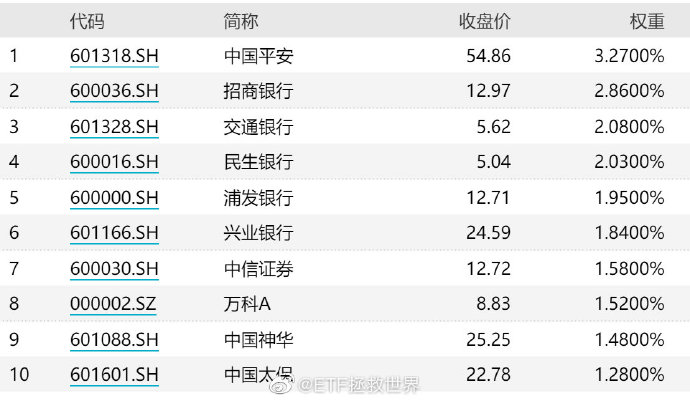

# 常聊的A股指数

## 一、我的六位指数知己（2015-08-25）

经常看我写的东西的朋友，会发现我的 200 篇东西，围绕三个主题：数据、鸡汤、段子。段子基本上每个月都会清理一次，数据和鸡汤总是保留。

有朋友觉得只有数据、干货值得看。但，亲爱的朋友，对于很多很多人来说，把鸡汤里的东西弄懂，更加重要。

先悟了「道」，才去研究「术」吧。

朋友，我们来雪球，不是找同党抱团取暖的。一个人的见识总是有限，所以我们才要不停地读书，不停的交一些某方面比我们优秀的朋友，扩展我们的视野，增加我们的深度。

如果你来雪球，只是找一些与自己看法相同的朋友，粉了他，天天赞。那我说，你只是找同盟军，找安慰，来雪球的意义不大。

很多时候，最珍贵的观点，恰恰正是与自己观点不同的意见。有人喜欢某些股票，听到有人说这些股票不好，有问题，马上肾上腺素飙升，抄起键盘慰问别人，这样，真的好吗？

如果持不同意见的人，能够有理有据，认真的表达了自己研究过的成果，你是不是也应该过脑子想想，会不会是我错了？

亲爱的，很多时候，正是不同意见能让我们活下去。

找到一个与自己想法相同的领袖，跟着他摇旗呐喊，觉得天下我最对，谁敢说一个不字谁就要死，那么，非常有可能，离死就不远了。

最好关注什么人？

能够让你进步的人，能够让你变得理性的人，能够拿出自己研究成果分享的人，能够提出新的策略，让你豁然开朗的人。这样的人，不偏执、不骑墙。顺应趋势，进退有序。有自己的原则，又从善如流，日日精进。

可惜，找到这些人，太难。

高手本来就少，愿意分享的，简直凤毛麟角。

证券投资，有了理性，也就成功了一半。

本人非常不喜欢与股票谈恋爱，因为，太感性。恋爱中的人，都是傻子。

很多人经常忘了自己来股市是干什么的了。亲爱的，你是来赚钱的，你不是来爱上一只股票的。对，你也许会举很多例子，说明某人爱一只股票多少年，资产翻了多少倍。但是啊，聪明的你要知道，一将功成万股枯，有一个概念叫做：幸存者偏差。

不要爱上它，不管它曾经让你赚了多少钱、不管你花费了多少心血研究它，最终它可能让你伤痕累累。

*一定要爱，请多爱几只。股市上，没有婚姻法。*

我也有投资股票，但从不会在雪球谈论。做为一家公司，随时会出现意想不到的黑天鹅，我希望对自己说的每一句话负责。但我很愿意谈谈我的六位指数知己。

我的三位红颜知己:

*医药指数*：秀外慧中，大家闺秀，心地善良，救死扶伤。这是我最爱的一位姑娘，如果不是今年6月它被土豪拉到了90倍的PE，我实在不想让她走。某一天，我会把最多的资产留给她。

*消费指数*：小家碧玉。大家生活每天都离不开她。喜欢。

*信息指数*：年方二八，朝气蓬勃，聪明伶俐。她的能力是所有行业中最有机会进入世界一流的。他日不再如此高估，必收。

三位知己，能共度一生。

我的三位好友：

*上证50*：大哥、霸气、有钱有势、价格平易近人。但由于近些年大哥大部分资产进了金融这样的高杠杆行业，不免让人替他捏一把汗。

*中证500*：年富力强，中流砥柱！私交最好的一位知己，可以共患难，同荣华。除了医药妹子，最多的资产会给他。

*创业板*：聪明的小朋友，非常有前途。可惜，太年轻，经常头脑发热，不够冷静。但是年轻人，可以理解。等他冷静下来，也会给他点天使投资让他海阔天空，鹰击长空。

虽是知己，但我深知，他们富贵之时，我愿静静离开，在远处深深为他们祝福。有朝一日他们落魄街头，我愿分陋室一间、米粥一碗，助他们度过黑暗，共赴下一次辉煌。

有很多朋友私信问，满仓被套，怎么办？

说实话，不知道。这几个月天天喊空，你们不烦，我自己都烦了。回到估值平均，我也不会喊了。现在，也快到平均了，被套的怎么办，我也不知道。

送大家一首歌吧。

我知道并不是 所有鸟儿都飞翔 当夏天过去后 还有鲜花未曾开放

我害怕看到你 独自一人绝望 更害怕看不到你 不能和你一起迷惘

我知道并不是 耕耘就有收获 当泪水流干后 生命还是那么脆弱

多残忍你和我 就像流星滑落 多绚烂飞驰而过 点亮黑夜最美烟火

多想你在我身旁 看命运变幻无常 体会这默默忍耐的力量 当春风掠过山岗 依然能感觉寒冷 却无法阻挡对温暖的向往

> 原文发表于雪球：《[不得不写的文章：批发干货与鸡汤](https://xueqiu.com/4776750571/55241308?from=singlemessage)》

## 二、沪深300十大权重股变化的两点感想（2021-01-05）

看看这两张图。分别是沪深300十年前的十大权重以及目前的。

有两点感想：

*第一，指数真的有优胜劣汰的天然属性。*

*第二，目前的沪深300已经与十年前完全不同*。已经不是当年的「金融300」指数了。这非常好。不要说什么金融地产低估导致权重下降。我不希望沪深300是一个金融300指数，相比而言，目前的权重我更喜欢。当然，目前的问题是消费比例又大了一些，不过问题比 10 年前好很多。

我的六大目标指数目前调整为*300、500、创业、科创、科技、消费、医药。*

去掉 50 加入 300，信息产业换成科技，涵盖国内外信息技术。

> 原文发表于微博：《[沪深300十大权重股变化的两点感想](https://weibo.com/5687069307/JBLvxcoGm?from=page_1005055687069307_profile&wvr=6&mod=weibotime&type=comment#_rnd1614312351726)》

## 三、长期看好的几个品种（2020-06-30）

真心地再说一次，特别特别重要：

一个品种跌很多的时候，必然有很多很多人看衰它，会找很多很多理由解释为什么跌很多，然后告诉你它永远没希望。

相反，一个品种越涨越高，也会有很多人看好它。告诉你只有它才是天选之子，一定会永远涨下去。

对于个股来说，真的有可能出现上述的情况。但是对于不会死的指数来说，千万不要轻易被情绪左右。

风水轮流转。跌得越多未来赚钱的机会就越大，即使你在底部不敢再买，也不要轻易卖掉，即使全世界都告诉你毫无希望了。

当然，有些品种是未来几十年都可以长期看好的，只要有大幅回调就可以买，然后长期持有+波段降成本不会错。这几个品种也是几年前就说的：

*医药、消费、信息产业。*

目前看，医药和以中概互联为代表的科技略高，策略是越涨越卖。

以食品饮料为代表的消费已经涨到我已经不是很懂。手里也没有了，不看了。

> 原文发表于微博：《[长期看好的几个品种](https://weibo.com/5687069307/J4TLqvDhV?from=page_1005055687069307_profile&wvr=6&mod=weibotime&type=comment)》

## 四、创业板是天使还是魔鬼？（2017-06-29 ）

2012 年 11 月底，以创业板为代表的中小股票开始了长达两年半的大牛市。

两年半的时间，创业板指从 585 点涨到了 4037 点，涨幅接近 7 倍（创业板综指涨幅更大），这是一个堪比 2006、2007 年大牛市的巨大涨幅。

那个时候，创业板是天使。

2015 年 6 月起，它变成了魔鬼。还是创业板指，两年后的 2017 年 6 月，从 4037 点跌到了 1800 点，跌幅超过 55%。而且，更可怕的是这个指数的估值依然在四十多倍，趋势上看，毫无止跌的迹象。

在大白马们熠熠生辉的 2017 年上半年，创业板指数，创业板股票被继续踏上一万只脚。小股票已经成了永远也没有希望的辣鸡。

不好意思，这个时候，爱捡辣鸡的我们又要出现了。

「漂亮50」在今时今日，再一次成了时髦的词汇。而一年多前我们买入的时候，它们几乎无人问津。目前我们的收益率 23%。

港股似乎又成了「全世界最便宜的价值洼地」，同样，一年多前我们越跌越买的时候，它是「毫无希望的边缘化市场」。目前我们收益率 35%。

当然，目前的创业板和当时的 50、港股不能相提并论。它并没有便宜到那个地步。所以，我们不会给它多少仓位，先买一份顶着先。

未来，创业板反弹也好，继续价值回归下跌 50% 也好，又或者再来一次莫名其妙的疯牛也好，我们统统笑纳了。

创业板不是天使也不是魔鬼。重要的是，你愿意在它失意的时候去帮助它，还是在它春风得意马蹄轻的时候去追捧它。

至于这次的两个买入品种选择，都可以。159915 的优势是流动性好，159952 的优势是没有持仓「薯片」，未来薯片开盘暴跌的话，受伤会较轻。

> 原文发表于公众号：《[创业板是天使还是魔鬼？](https://mp.weixin.qq.com/s/zQK-ACzhmrNVwIWOyVNM7Q)》

## 五、创业板、涨跌（2017-07-30）

从创业板在资本市场诞生那天起，关于它的争论就从未停止。

到了现在，买不买创业板，依然是争论不休的一个话题。

本月，ETF 计划第一次买入一份创业板。不出意外，目前，我们买的那份浮亏了。

这太正常。*在一个下跌趋势如此明显的品种上，大概率当然会浮亏*。不过，很有意思的，我想到了两个真实的案例。

很多朋友是 2014、2015 年被那轮大牛市卷进了资本市场。那你现在回想一下，当时是不是犹如股神附身，买什么什么涨，每天买的股票就像坐了火箭一样不停地涨？赚快钱是不是很开心？当然了，你也一定不会忘记，后来发生的一切。

又有很多朋友 2015 年 7 月开始参考第三轮计划。一开始，我们买的 50、恒生，买了就跌，不停地跌。我们开开心心吃着火锅继续买，大跌大买，小跌小买。虽然浮亏了好几个月，但你现在打开自己的账户，或者是抬头看看上面的表格里面恒生和 50 的浮盈幅度，那么之前浮亏的感受，还会让你痛苦吗？

资本市场，要赚短线快钱并不难——找到一个上升趋势良好的品种，买进去就是了。趋势这个东西，一旦形成，要想改变其实并不容易。所以，你在相对低位买入一个上升趋势好的品种，大概率会赚到快钱。然而我更喜欢的，其实是捡垃圾——*捡那些别人不要的，被不停卖出的垃圾*。我知道只要我把这些垃圾的成本价控制好，必有一天会有人用黄金甚至钻石的价格把这些「垃圾」买走。

至于别人对我买的东西怎么评论，我真的毫不在意。如果不是大多数人说不好，它的价格也不会是垃圾的价格。听别人的？那我注定将和大多数人一样亏得内衣都没了。

做好最坏的打算，买进别人不看好的「垃圾」。

无论未来买的这一两份创业板如何涨跌，各位，放轻松。投资从来都应该是一件很快乐的事。

> 原文发表于公众号：《[2017年8月ETF计划（一）：卖出一份；买入三份](https://mp.weixin.qq.com/s/JUfURmzJB8voG6FYJUFpUA)》

## 六、现在的创业板指，已经进入我严格定义的「必死」区域（2020-06-24）

看了一眼创业板。

之前卖出一份是在 1.2014，现在 1.2965，距离当时上涨 7.9%。没想到，这一届网友已经如此严格了。 更别说，我们卖掉后创业板曾大幅暴跌 30% 以上。

我不明白一件事，为什么这样一个必然会死的透透的东西，我不继续持有是罪。现在的创业板指，已经进入我严格定义的「必死」区域。为什么我知道一个品种在必死区域，还要继续持有？

有些人买卖，并不是看本质，而是看走势。他会觉得你买了还在跌就是 SB，完全不管已经在钻石坑，随时会大涨，也不会管你卖了还涨你就是 loser（失败者），完全不管已经到了哈迪斯顶。

现在已经好多了。回想起 2015 年 4～5 月，我清仓后在雪球被骂成筛子，被无数人骂踏空狗，现在这一两个出来蹦跶的，已经不算什么了。

巴菲特 2007 年赚了几倍后在 12 块清仓中石油，在中石油涨到 21 的时候还不是被各路「股神」甚至央视抓出来道歉？

我就想吃中间一段，多出来的疯狂我不想吃怎么就不行呢？到底为什么不行呢？我几十个点的利润走了为什么不行呢？一定要跟你一起疯狂到爆炸死无全尸才好吗？

再说一次，创业板指，这个 PE 70 多倍，PB 7 倍多的牛指，某些人眼中的不持有就是犯罪的牛指，必然崩溃。

这话我本来不想说，就怕让别人觉得我现在没有是踏空狗为自己找借口。但你逼我说，以后看，也算是造福很多人了。

> 原文发表于微博：《[现在的创业板指，已经进入我严格定义的「必死」区域](https://weibo.com/5687069307/J854m1KCG?from=page_1005055687069307_profile&wvr=6&mod=weibotime&type=comment#_rnd1615104642171)》

## 七、医药指数（2020-06-10）

2018 年 1 月底、2 月初，大盘见顶。绝大多数股票开始跌。

然而一直到 5 月底，医药依然在一枝独秀的创新高。

6 月，开始出台「一致性评价」政策。同时医保开始控费，医药开始下跌。

之后，随着「4+7 带量采购」等政策持续推出，医药不断下跌。

到了 2019 年 1 月，各种配套改革政策频繁出台，加上A股进入钻石底，医药被杀到了 7000 点以下，估值达到十年最低。

当时已经几乎没有人再看好医药，医药在基金配置中连标配都达不到。你打开各种微信公众号自媒体，都是对医药行业的悲观。所以当时有朋友发私信要「救我一命」，其实是可以理解的。因为当时你找不到看好医药的人。

2019 年，医药上涨 34%，医疗上涨 48%；2020 年，医药上涨 27%，医疗上涨 37%。

直到今天，依然在创新高。

我想说的，还是之前说过无数次的。

有时候，你看越多信息，只会让你的收益变低。每天都有信息给你，并不意味着能提高你的收益率，尤其是很多信息源根本毫无价值，只是因为数量多，善于拼凑信息，才会有机会浪费你的时间。

不会死的品种，大幅暴跌后的利空，未必是最后一根稻草。也许那是最好的机会。

最后再说一次。

价格与「利好利空」，很多时候并不一一对应。股价反映的是若干时间以后的信息，而非现在。

做分析，要分析第一层信息，第二层价格，第三层反馈。如果你只停留在第一层，那就是低位斩仓高位接盘的善财童子。

> 原文发表于微博：《[医药指数](https://weibo.com/5687069307/J5XMK8Eaj?from=page_1005055687069307_profile&wvr=6&mod=weibotime&ty=&type=comment)》

## 八、证券行业估值怎么样？（2016-08-14）

网友提问：请教 E 大，证券行业估值怎么样，PE、PB 处在历史什么位置？

「证券行业」的估值，我想可以理解为最近上市的证券 ETF 对应的中证全指证券公司的估值吧。

很多人说证券公司用 PE 来考虑无效，应该用 PB 。实际上，由于券商是强周期，用 PE 来考虑确实意义不大。有意思的是，在我统计券商历史 PB估值的时候，发现它的 PB 变化也与大盘走势以及券商行业自身的行情走势也并不完全吻合。也就是说，行情低点通常与 PB 值的低点并不完全同步。

作为金融行业，券商的净资产变化非常大。牛市中，某些时段它的净资产增加远远高于股价涨幅，所以，看 PB 也不能完全精确把握券商的高点和低点。

不过，从 PB 角度来进行模糊的正确判断是没问题的。

现在券商的 PB 情况，低于过去五年平均 14%，处于过去五年最贵 48% 的位置。

也就是说，券商的估值比过去五年平均要低。如果非常喜欢和看好，分批投入是问题不大。建议分批投入的时候不仅考虑时间因素，还要加上空间因素。这个行业弹性太大了。

我个人还是喜欢在熊市中后期布局券商。这个行业确实是牛市利器。

未勘误。声明：本回复仅代表该作者观点，不构成任何投资建议。

> 原文发表于雪球：《[证券行业估值怎么样？](https://xueqiu.com/4776750571/73414833)》

> 本文章所载信息仅供参考，不构成任何投资建议。如转载使用，请参考 [《文章转载声明》](https://youzhiyouxing.cn/agreements/ARTICLE_REPRINTED)。
