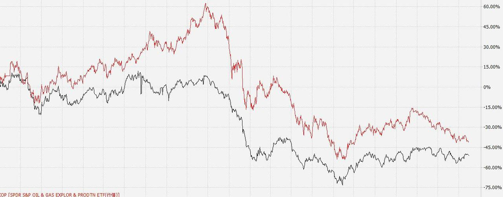

# 谈谈黄金和油气

## 一、为什么我在黄金上赚了好几倍？（2017-09-28 ）

有人说，黄金是没有持有价值的资产。

对这个说法我总是将信将疑——为什么我曾经在黄金上面赚了好几倍？（博客记录了全过程，没有公开记录的东西我从不会事后说）

上一次计划开车的文章中，我说，「之所以在这个位置买入美元债，最大的考虑还是从资产组合和汇率的角度出发。」然后，我们买入美元债后，这半个月美元/人民币的走势是这样的：

这也是我们的美元债迅速开始盈利的主要原因。

那么，这次为什么我们要买黄金？

之所以在这个位置买黄金，最大的考虑还是从资产组合和对冲风险的角度出发。

对冲什么风险？不可描述。

当然，对冲这回事，可能对，也可能错。无所谓。但资产组合，资产配置这件事就绝对没有错。这次买了黄金后，基本上我们计划里面应该持有的东西，除了美股外，就都齐了。以后，就是在这些品种上增增减减。

*黄金，超长期看，有没有拿到好收益的可能我不敢说。但是，它在特定时期内一定是有交易价值。这个，我非常确信。*

这次买入的 518880，可以做两融担保品，有两融账户的朋友可以两融账户买。没有的，场外买就挺好。另外，该品种支持换取实物。

> 原文发表于公众号：《[2017年10月ETF计划（一）：买入两份](https://mp.weixin.qq.com/s/_9KUMNPq0o5M9hOOF9rAFg)》

## 二、黄金适合逢低买入吗？（2016-10-08 ）

2005 年我第一次买黄金，当时用了自己闲置资金的一半。2011 年清仓后到现在还没有大量配置。未来黄金我自己会超长期配置一部分，根据高低会有持仓增减。今年主要做的白银，到现在手里黄金白银都几乎没有了。

首先要说明的是，下面这些只是根据观察历史得到的经验主义想法，虽然历史会告诉我们很多，但历史不代表未来。*未来的决策不能完全由历史而来，这点非常重要。同时个人能力和眼界所限，说的不一定对，做个参考即可。*

*黄金是大周期品种，一个上涨或者下跌周期可能超过 20 年。*也就是说可能人这一辈子也就赶上一次上涨、一次下跌周期，所以我不打算长期配置太多。配置 5% 金融资产应该是正常水平，即使价格特别低，也不会超过 8%～10%。短期交易除外。

至于价格，我通常用金/油比大致衡量金价的高低。前些年我用 1:8 或者 1:10 最多 1:12，这也是为什么到现在也没有大量买入黄金的原因——跟原油比金价还是高。

至于是买黄金还是白银，我用金/银比价。一般来说 60 是比较均衡的位置。数字越高则白银相对于黄金来说就越低。

*说到方法，我会用定幅投入。*比如 1000 美金买入第一笔，那么可能是 800、600、400……分别买入，越买越多。数字不一定是这些，只说方法。

A股的话，黄金ETF（518880）可以考虑。（声明：本回复仅代表该作者观点，不构成任何投资建议）

> 原文发表于雪球：《[黄金适合逢低买入吗？](https://xueqiu.com/4776750571/75729038)》

## 三、谈谈QDIILOF 基金：投资华宝油气和南方原油你需要知道的一些事（2016-08-02 ）

本月 ETF 计划准备投入的品种，南方原油（501018）8 月 2 日上午已经成功买入。价位在 0.9 左右。这个品种是 QDII LOF 基金，很多朋友并不了解这个基金的特点，我大概简要谈一谈。本人不希望朋友们稀里糊涂的投资一个品种。

QDII：是「Qualified Domestic Institutional Investor」的首字缩写，合格境内机构投资者，是指在人民币资本项下不可兑换、资本市场未开放条件下，在一国境内设立，经该国有关部门批准，有控制地，允许境内机构投资境外资本市场的股票、债券等有价证券投资业务的一项制度安排。

简单来说，QDII 就是一个国家对境外资本市场投资的机构投资者。

LOF：全称是「Listed Open-Ended Fund」，汉语称为「上市型开放式基金」。也就是上市型开放式基金发行结束后，投资者既可以在指定网点申购与赎回基金份额，也可以在交易所买卖该基金。不过投资者如果是在指定网点申购的基金份额，想要上网抛出，须办理一定的转托管手续；同样，如果是在交易所网上买进的基金份额，想要在指定网点赎回，也要办理一定的转托管手续。

简单来说，LOF 就是既可以在交易所买卖，又可以与普通开放式基金一样申购赎回的开放式基金。

南方石油，包括之前我们投资的华宝油气、石油基金都是 QDII LOF 品种。

这篇文章里，我不想讲太多 QDII LOF 的细节。我只是想用最深入浅出的文字，让你知道这样的品种有什么特点，如何操作。这篇文章很有价值，请认真看，全是干货。

首先 LOF 有一些别的品种不具备的特殊属性。最具特色的就是它既可以在交易所像买卖股票一样交易，也可以像普通开放式基金一样申购和赎回。

这个属性我们应该如何应用？

举例来说，某只 LOF 净值 1 元，交易所交易价格为 1.5 元。这时候我们想拥有这只 LOF，应该申购还是交易所买入？很简单，当然是用 1 块钱的净值申购。

这个应该不难理解。

*QDIILOF 与普通 LOF 比，有一些特殊性。最大的特殊性是时间因素。*

普通投资A股的 LOF，净值是根据当天A股走势确定。这个很好理解。8 月 2 日 LOF 的净值，是根据 8 月 2 日走势确定。

而 QDII LOF 则不同。它的净值是由当天晚上境外资本市场的走势确定。举例来说，你 8 月 2 日沪深股市交易时间申购一个 QDII LOF，比如南方原油，它的净值是北京时间 8 月 2 日晚至 8 月 3 日凌晨美国 NYMEX 以及英国布伦特原油走势确定的。也就是说，当你 8 月 2 日申购的时候，根本不知道申购价格是多少。

如果北京时间当天晚上油价跌了，则你的申购成本会降低。如果北京时间当天晚上油价涨了，则你的申购成本会提高。

这里要注意，基金公司公布 QDII基金净值的时间。大多数基金公司会在 T 日晚公布 T-1 日的 QDII 净值。也就是说，你在 8 月 2 日白天看到的基金净值，是 7 月 29 日的。要等到 8 月 2 日晚，才能看到 8 月 1 日的净值。

那么，怎么才能在 8 月 2 日白天知道 8 月 1 日的净值？很简单，自己算。举例来说，一个基金 7 月 29 日净值 1 块钱，而北京时间 8 月 1 日晚它跟踪的标的上涨了 5%，如果跟踪的没问题，则你可以知道，它 8 月 1 日的净值就是 1.05。那么就无需等基金公司在 8 月 2 日晚公布了。

根据 LOF 的特性，有两种方法投资 QDII LOF：交易所买入或者申购。

什么时候买入，什么时候申购？

回头看上面的「二」。很简单，当交易所交易价格大幅高于净值的时候，则按照净值申购。当交易所价格大幅低于净值的时候，则在交易所按照交易价格买入。

那么，这个「大幅」如何界定？

首先说「大幅」。

各位要清楚，大多数情况下，交易所买卖佣金远远小于在交易所申购赎回（也就是在你的券商软件里申购赎回）。一般来说，现在交易所买卖的佣金不会超过万三。而南方原油的交易所申购费是 1.2%。

这种情况下，大家可以理解，当交易所交易价格较之净值溢价 1.2% 的时候，算上手续费两者实际上是一样的。

那么，是不是交易所交易价格较之净值溢价 1.2% 以上就应该申购？

我的答案还是 NO。

很简单，你不知道今晚跟踪标的的涨跌。如果今晚跟踪标的大跌还好，你的申购价格会很低。如果油价大涨 5%，则你的申购价格会远远大于交易买入价格。

一般来说，申购费 1.2% 的情况下，交易所交易价格至少溢价 4% 以上，我才会考虑按照净值申购QDII LOF。

这完全是我的习惯，各位可以制定自己的规则。

有同学说，那么很多场外平台，比如天天等，申购 LOF 打一折，申购费只要 0.12%，如果有一些溢价，是不是应该去那里申购？

我个人来说，还是喜欢在交易所申购。很简单，可以套利。

简单来说吧。当场内 LOF 交易价格是 1.05，而净值是 1 的时候，我会考虑直接卖出手里的 LOF 基金，同时申购相同数量。只要当晚标的不大涨超过 3.8%（5% - 1.2%），则我的套利就是成功的。

而你在第三方平台或者基金官网购买基金，想要转托管入场内非常麻烦。也要耽误几个工作日。所以一般情况下，即使是申购，我也会在场内申购。

我知道今天的文章对很多朋友来说比较难以理解。不过我是建议你试着多看几遍。因为这里面有很多赚钱的机会，另外，也不至于稀里糊涂参考 ETF 计划，好歹能学点东西，您说呢。

当然，不愿意学也没有什么大问题。我们每份计划投入只占总资金的 0.67%。成本怎么都不会增加太多。

祝各位投资顺利，以后有机会可以更加深入的探讨这个问题。今天时间比较紧张，上文没有仔细勘误，有笔误的话还请谅解。

最后再强调一下，投资都是有风险的。各位谨记。

> 原文发表于公众号：《[谈谈QDII LOF基金——投资华宝油气和南方原油你需要知道的一些事](https://mp.weixin.qq.com/s/oJZT6a8GIZXALh2TZnWjSA)》

## 四、为什么华宝油气与油价走势不符？（2017-08-15）

关于有些朋友不停地说华宝油气与油价走势不符。只说两点，加个图，以后不用再讨论。

*第一，油气跟踪的不是油价本身，原油没有办法像黄金ETF一样持有现货，因为它不易保存。*

解决的办法两个，*一个是跟踪期货，*比如南方油。但是换期有损耗，我不敢长期持有。*第二个是跟踪上游或者全产业链公司，*比如 XOP 和油气。

第二，短期看，当然不可能精准的每天对应涨跌幅，毕竟跟踪的不是一个东西。但长期看，70% 以上是有的。而且从历史看，XOP 和油气的弹性更大一些。

图是过去五年 XOP 和油价的对比，黑油，红 XOP。

油气与 XOP 比，又多了一个汇率的问题。用的好是双击，用不好是双杀。

但因为持仓的是股票，长期持有怕什么呢。我是不怕的。

> 原文发表于雪球：《[为什么华宝油气与油价走势不符？](https://xueqiu.com/4776750571/90577837)》

## 五、油气和投资心理学（2017-09-28 ）

说到油气，很有意思的，盈利了。

在这一个多月刚开始参考计划的朋友，有些在油气上已经盈利十几个点。而收益最低的，目前也有几个点的盈利。要知道，不久前在计划账户上它还是显示 -15%。然而就是非常神奇的，经过十几天反弹，我们已经盈利。

这就是我之前不断强调的，我会努力把各个品种的成本控制在距离最底部 10%～15% 的地方。然后在牛市到来的一个月内，或者只要一个小反弹，就可以做到盈利。这个很重要吗，当然很重要。你的投资收益，相当大程度上在你买入的一瞬间就决定了。跌 50%，需要 100% 才能回本。你放任自己持有的品种下跌 50%，就要让它涨一倍才回本。涨一倍有多难？很难的。

*所以，我们用各种办法控制每个品种的成本。这一方面是收益率的要求，一方面，也是投资心理学的要求。*

*想要投资成功，除了应该有完整的投资体系、策略系统，成熟的心理必不可少。*即使你的投资体系再完善，操作的人心理素质不好的话也不会有好的结果。这次油气很多朋友看着账户上的数字变成 -15%的时候，难免会有些负面的情绪产生。之所以没有崩溃，一个是因为买的少，一个是因为我这里不停的心理按摩。

是的，也许现在你已经忘了自己当时的紧张心情，不过请你记住我今天说的，以及你现在的心情。这就是理论与经验的结合。我再次提请各位注意，我们计划中的每一个品种，都是正常情况下不会「死」的品种。无论未来它们跌到哪里，都不要怕。因为你的恐惧会让你做出一些极其不理智的动作，最终这些动作会将财富从你的未来抹去。

*不要怕，它不会死。坚持正确的投资策略，它一定会帮你赚钱。*最黑暗的时候，一定要记起这句话。

这次油气，只是个演习。未来，更大的跌幅，更多的浮亏还会出现。然而，你经过一次次的演习，就会成熟起来，你会发现，在资本市场中，「正常人」的那些恐惧，是多么不值一提。

> 原文发表于公众号：《[2017年10月ETF计划（一）：买入两份](https://mp.weixin.qq.com/s/_9KUMNPq0o5M9hOOF9rAFg)》

> 本文章所载信息仅供参考，不构成任何投资建议。如转载使用，请参考 [《文章转载声明》](https://youzhiyouxing.cn/agreements/ARTICLE_REPRINTED)。
