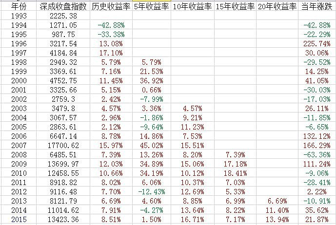

# A股的历史表现有多好？

## 一、A股是个聚宝盆（2015-04-02）

最近，A股是不是一个「吃人不吐骨头」的市场似乎在雪球引起了不小的争议。在这个市场上，只有 10% 的投资者挣钱似乎是个颠簸不破的真理。

那么，到底A股是否真的有那么不堪？到底是什么造成了 70% 的人亏损？

想知道答案，非常简单，看下图。

注释：表中所列「收益率」，为年化复合收益率。

开始解读这张注定会使很多人感到震惊的表：

1、之所以选用深成指，是因为这个指数从一开始就是一个固定样本量的指数。同时，打开 K 线，同中证500等牛指比，它并不是最好的指数。再加上历史够悠久，所以我们选它。选其他的也一样，大家可以自己试试做个表看看。

2、从当年指数变动率来说，*A股真是一个上蹿下跳的猴市。*涨幅 100%，跌幅 30%、40% 跟玩儿一样。想要在这样的市场中不亏钱，似乎需要很高的技术。但是……

3、如果你投资深成指，一动不动，*持有 10 年、15 年、20 年，居然绝对不会赔钱！*而且，最低收益率也有 4.57%，持有 10 年最高会有 18.41% 的收益率。除了巴菲特、索罗斯和彼得林奇，谁比你更牛？

4、持有深成指 5 年不动，*在 23 年中，会有 5 次机会是亏钱的。*5 年啊，持有5 年还亏钱，这对你一定是个心灵上与生理上双重的打击，还不如存银行！但是，仔细观察一下，为什么你持有 5 年会亏钱？

5、A股历史上，*从未发生过连涨 3 年的情况。*而连涨两年的情况，一共发生过 4 次。他们分别是：9697、9900、0607、1415。好了，我们来看看，当你在前三次连涨两年的尾声买入，发生了什么？

6、97 + 5 = 02（五年亏）、00 + 5 = 05（五年亏）、07 + 5 = 12（五年亏）……*每次连涨两年你再买入，持有五年都是亏损的！*只要你不是在连涨两年之后买入，持有五年（除 04、14 两次）、十年、十五年、二十年你必然会赚钱！而且收益率非常好。

7、也就是说，*只要不在大牛市后期买入，你什么时候买，长期都会赚大钱。*

8、同理，*A股从未连跌三年。*大家如果在连跌两年的时候买入，收益率会如何？自己看吧。

9、那么，到底是什么造成了 70% 的人亏损？这 70% 的人，大概率是牛市进来，熊市出去的人。

10、我的 ID，ETF拯救世界，不是一句玩笑。如果你还年轻，二三十岁，那就*找个熊市，不管是大熊还是小熊，*把钱买入一只指数，关上账户，等 5 年、10 年、20 年，再次打开。你会发现，你眼前出现了一座金矿。

11、雪球上满地的、每年翻番的股神们除外。

> 原文发表于雪球：《[A股是个聚宝盆](https://xueqiu.com/4776750571/39611266)》

## 二、过去十年A股表现有多好？（2017-02-04）

过去十年A股表现差？很让人震惊的结论啊。所以咱们看到一个问题，首先想的不应该是如何解答，而是：这个问题对不对？

2007 年 2 月 4 日至今，当时已经上市的 1382 只股票中，只有 45 只是下跌的，上涨股票超过 97%。

涨幅中位数是 220%。也就是说，你闭着眼睛买十只，至今大概率收益率会超过 2 倍。年化多少？接近13%！

涨幅超过 300% 的股票有 495 只，占比 36%；

涨幅超过 400% 的股票有 341 只，占比 25%。

再看指数。2007 年 2 月 5 日，中证500收于 2152，现在是多少？6207。涨幅基本与中位数涨幅一致。

再看全指医药。2007 年 2 月 5 日，全指医药点位收于 2014，现在是多少？9455。这是多少倍的涨幅？

消费、信息、医疗、军工……没有一个指数年化在 10% 以下的。

同期，标普500指数不过从 1446 涨到了现在的 2297 而已，这个涨幅连给A股提鞋都不配。

所以，过去十年A股差这个结论到底因何而得出，实在是不太明白啊。

> 原文发表于雪球：《[过去十年A股表现有多好？](https://xueqiu.com/4776750571/80766107)》

## 三、中国股市过去的十年，是超级牛市，而不是长熊（2016-01-16）

在 2006 年到 2015 年这十年中，8 年都在上涨的指数有 500、200、800等权、全指医药、养老产业等等……

不仅如此，有些指数简直是强到逆天。比如养老产业，十年中有六年涨幅在 20% 以上，有五年涨幅在 40% 以上，三年涨幅超过 80% ，两年涨幅超过 100% 。

*中国股市过去的十年，是大多数股票超级特大的一轮牛市。*绝不是有些人说的长熊。*中国的A股真实地反映了中国的经济增长，是名副其实的中国经济温度计。*

为什么很多人觉得中国股市是长熊？因为权重股表现太差太差了。沪深300十年中有四年下跌，上证50十年中甚至有五年在下跌。被权重股把持的上证指数表现就不用说了。

可以说，在A股过去十年这轮超级大牛市中如果没有赚到大钱，就是浪费了青春。如果这样的大牛市都赚不到大钱，未来确实比较麻烦。

另外，这样的牛市后，跌一跌有什么奇怪的？上面这几只指数已经连涨 4 年了！

> 原文发表于雪球：《[中国股市过去的十年，是超级牛市，而不是长熊](https://xueqiu.com/4776750571/63708706)》

> 本文章所载信息仅供参考，不构成任何投资建议。如转载使用，请参考[《文章转载声明》](https://youzhiyouxing.cn/agreements/ARTICLE_REPRINTED)。
