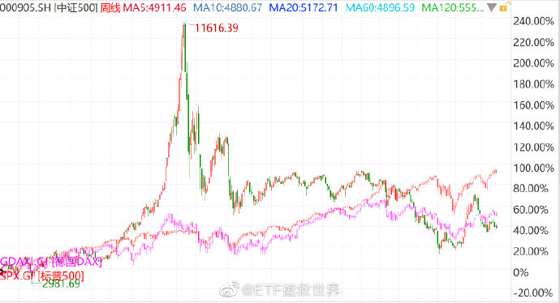
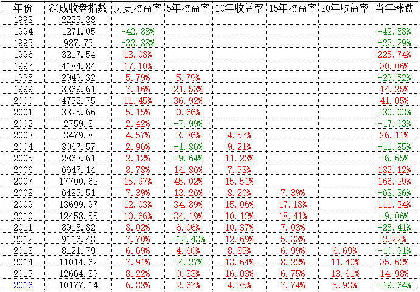

# A股的波动有多大？

## 一、A股的特点是波动极大（2019-07-23）

其实吧，也不是A股不行。不信？看三张图：

分别是 2005、2009、2013 年至今，中证500与标普500、DAX30（DAX是全收益指数）的走势对比。

你会惊讶地发现，我 A 一点都不弱，2005 年至今远远跑赢美国德国，虽然 2009、2013 年至今大家走的差不多，但 2015 年 500 可是一飞冲天发过大财的。

结论很简单，A股的特点和别人就不同。它就是上蹿下跳波动极大，其实最后大家都差不多。

所以有两点你要思考：

*第一，如何利用这样的极大波动率提高收益率；*

*第二，如何不在波峰买入一套很多年；如何在谷底不要害怕坚定买入，坚定持有。*

> 原文发表于微博：《[A股的特点是波动极大](https://weibo.com/5687069307/HEPudBJJI?type=comment#_rnd1618229021796)》

## 二、便宜的A股几年就会出现一次（2016-01-28）

还有十几分钟数据才跑出来，趁着这个时间聊两句未来一段时间的思路。

之前说过，*便宜是最大的利好，贵是最大的利空。*现阶段A股的利好就是：越来越便宜了。

便宜的A股几年就会出现一次。从内心讲，当然是希望这次也能到 2012 年，甚至 2008 年的便宜程度。但本人一向悲观，怕自己没那么好命，所以考虑未来一段时间稍微走快一点。

虽然今天的数据还没跑出来，但不出意外的话，上证180指数也已经进入了过去十年最低估值区域。那么现在进入这个区域的指数就是恒生、50和180。当然，这些指数便宜，并不能说明什么大问题。

*影响中国A股估值最关键的，是一千多两千只中小股票。*26 日暴跌后，中小板才刚刚离开过去十年最高估值区域，现在的总体情况可想而知。

是，我知道，A股雷非常多：质押、票据、杠杆、清盘、宏观、大股东减持……

这些只是爆出来的。*真正具有杀伤力的，是黑天鹅。*黑天鹅的意思，是你根本想不到的事情。A股有没有黑天鹅？也许有，也许没有。

然而，这些我并不在意。

在这个即将不贵的时候，我们应该将视线转移到 5000 点时候很多人谈到的「更大的局」。那时候他们说，没事，贵点而已，要有更大的大局观，中国一定强。

现在没人说了，但我们应该记起来。

我们的 ETF 计划 150 份中，7 个月过去只买了 14 份。我们像最出色的猎手一样在等。等什么？等这个充满疯子、傻子、骗子的地方冷却下来，让我们看清猎物，扣动扳机。现在，猎物渐渐地出来了。

这里，我不会给任何人投资建议。但我会在下周将我的仓位提高到 15%～20%。买入一些心仪已久的好东西。（这些好东西，也许是之前我提过的，也许是没有提过的。不希望你看了我的东西乱买，乱买赔钱别找我。）

他们是我的先锋队，折损一些简直是必然的。但他们必须出发，为了整个军团的利益。

身后的千军万马，似乎都已经按耐不住。然而，纪律严明的他们，令旗不下，不会轻举妄动。

好了，数据跑完，话也说完了。

祝每个人投资顺利。

> 原文发表于雪球：《[便宜的A股几年就会出现一次](https://xueqiu.com/4776750571/64281928?page=90)》

## 三、在A股赔钱其实是很奇怪的一件事（2017-01-22）

从 1993 年至今，就用很垃圾的上证和深成指数来说，只要长期持有超过 10 年，任何一年年底买入都能赚钱。（到今年下半年就不行了，因为十年前的 2007……）

大致观察，除非极端便宜或贵的年份买入，长期年化收益率从这两个相对较弱的指数上反映出来大概就是 6%～8%（不含分红）。所以其实真的不应该有这么多人在中国股市赔钱。

股票当然是非常好的投资方式。只要坚持一些投资原则，大幅超越市场平均长期收益率基本上没有问题。*10%～15% 应该是普通人对自己在A股的未来年化收益预期。*

> 原文发表于雪球：《[在A股赔钱其实是很奇怪的一件事](https://xueqiu.com/4776750571/80478679)》

> 本文章所载信息仅供参考，不构成任何投资建议。如转载使用，请参考[《文章转载声明》](https://youzhiyouxing.cn/agreements/ARTICLE_REPRINTED)。
