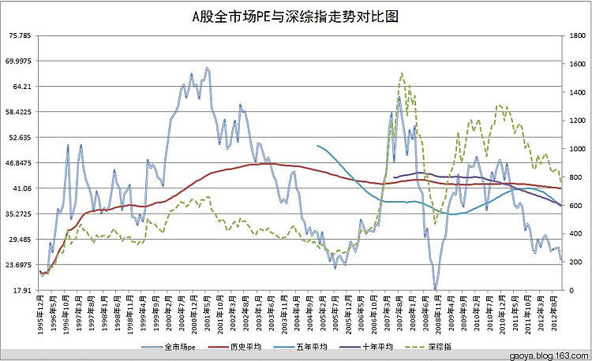
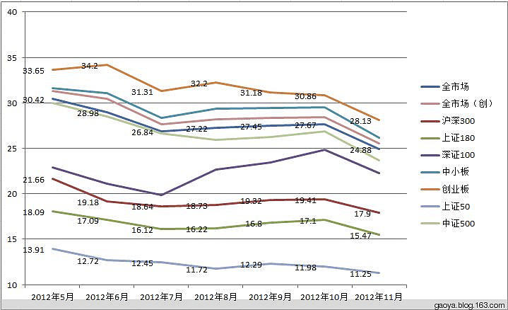

# 回顾 2015 年的哈迪斯之顶

## 一、20 年，估值图上从未见过如此一幕（2015-07-07）

简单说：*中国股市自 1995 年以来，有过三次PE超过 60 的尖峰时刻，分别是 2001 年、2007 年和 2015 年。*

其中，尤以 2015 年风云变幻、诡异莫测。

6 月 15 日，两市全市场 PE 超过 72 倍，远远将历史最高抛在身后。随后，暴雨倾盆，泥沙俱下。短短的三周时间内，PE 居然已经跌到了历史均值附近！

要知道，2001 年，阴跌整整 2 年，才在 2003 年跌破 PE 均值，进入投资区域；2007 年 10 月创出最高后，在 2008 年 5 月才跌破 PE 均值，进入投资区域。

谁能想到，2015 年估值创出历史纪录后，回归价值的速度也如此迅速！

朋友们，某成分指数已经仅比历史平均高 20%；某行业指数只比历史平均高 16%；某风格指数只比历史高不到 10%（要知道，它们三周前全部高于历史 100% 以上）这样的话，我会乱说吗？

ETF 计划下个月能否扣动扳机？会把一年多来第一颗买入子弹射向哪里？

我，真的不知道。看看剩下的十几个交易日，市场能不能给我们一个悄悄铺设陷阱的机会吧。价值有了，翻番还会远吗？🍻

价值，才是唯一。

> 原文发表于雪球：《[20 年，估值图上从未见过如此一幕](https://xueqiu.com/4776750571/50509529)》

## 二、A股的哈迪斯之顶（2015-08-12）

> 如今我走到了人生的十字路口，我知道哪条路是对的，毫无疑问，我知道 ，但我从不走，为什么？因为太他妈的艰难了——史法兰中校《闻香识女人》

如今我走到了人生的十字路口，我知道哪条路是对的，毫无疑问，我知道 ，但我从不走，为什么？因为太他妈的艰难了——史法兰中校《闻香识女人》

一直以来，以为高位追买股票的人，是真的不知道估值很高。但其实后来发现，很多人即使知道很高，也会去买。因为短期利益那么大，不追对不起自己。

*A股整体PE60 倍，整体PB5.5 倍以上，被我定义为「哈迪斯之顶」。冥王一出，必携亡灵而归。注意，冥王可不是小小的死神，死神是每次带走一个人，而冥王每次收割就是一大片。*

昨天收盘，整体 PE 是 56.96 倍，整体 PB 刚刚超过 5 倍。欢乐还在继续。

之前写过一篇东西，说A股的大顶从来没有出现过单顶，每次都是估值双顶或头肩顶。这次果然出现反弹。不过，大概率不会超过 6 月末的 6 倍 PB。历史概率会否会被打破？拭目以待。

熙熙攘攘，利来利往。证券市场就是一个小社会，然也。

谁都知道减肥只要少吃多动，可没几个人减肥成功；谁都知道好好学习有出息的几率大一点，但认真学习的人也并不多。

道理都懂，就是做不到，这其实并不怪你。有些东西是天生的。在证券市场中，拿着现金等便宜是不容易的一件事。

看下面这条鸡汤：20 世纪 60 年代，心理学家在斯坦福附属幼儿园进行了有趣的「糖果实验」。老师请幼儿到实验室，发给每个孩子一颗糖果，然后告诉他们说：「一会儿，我出去办一件事，如果哪一个小朋友没有吃掉自己手里的糖果，我将奖励他一个同样的糖果。」

结果许多孩子等不及把话说完，就已经把糖果吃掉了，有的孩子经不住诱惑，也把糖果吃了，有的孩子能够自我控制，不看吃糖果的孩子，转移自己的注意力，最终吃到了两个糖果。

这样，所有孩子就被分为两类：「吃一个」和「吃两个」。科学家跟踪研究，直至这些孩子上了小学、初中和高中。结果发现，凡是吃两个糖果的孩子，大部分品学兼优。

对于这个试验，雪球@never-full 朋友是这样评论的：

这个实验是由沃尔特·米歇尔做的，研究人的自制力，理智与冲动冲突时管理情绪脑的能力。沃尔特的实验证明 4 岁孩子间这种能力差别很大。

继而的，跟踪实验证明有自制力的孩子 SAT 的成绩更好。

人脑中前额叶皮层被认为是进行理性思考的脑区，这部分脑区的差别，影响人的自制力。所以，别人能忍，你忍不住，或许就个生理问题。有些人在这方面天生存在优势，人与人之间的差别之大，远超我们的想象。

所以，一些人对价值投资理论极其崇拜，而另外一些人对此无感，就不奇怪。

> 原文发表于公众号：《[A股的哈迪斯之顶](https://mp.weixin.qq.com/s/ll6JUVw-wPDj1OaQsMfsoA)》

三、哈迪斯之顶即将破灭（2012-11-28）

今天，看着不断暴跌的中小板，没有等到 15:40 Wind 上的数据计算结束，我就知道，这是伟大的一天。

我们等了 3 年，终于在 2012 年 11 月 27，等到了全市场 PE 降到了 25 以内，这就意味着，未来A股收益率 20 年内第三次超过了 4%。

我们等了 3 年，终于在 2012 年 11 月 27 日，等到了全市场 PB 降到了 2.05。只差一步之遥，就会进入 1996 年以来第四次大底区域。

三年，我们买转债、买金利、买A类、买债券、卖掉持有 6 年的黄金、定投 ETF、波段做杠杆。我们用尽了办法在这个高估的变态市场保住了自己的本金，在这个历史大底即将到来的区域，我们，即将重拳出击。

对，这个市场就是个变态的市场。因为这个市场只要你盘子小，无论你多贵都有人买。同样，你的盘子大，你再漂亮，也像麻风病人一样让人避之不及。面对这样的变态市场，我们是屈服，还是用智慧干掉它？对于三十出头的我来说，过去十年在A股经历过 2 次财富爆炸性增长。第三次，已经不远。这也是在 40 岁之前，最后一次了。

这一天，近在眼前！

我们谦卑地向市场先生学习，通过了「战胜贪婪」这门主修课。接下来，我们要考的就是「打败恐惧」这另一门主修课。也许你周围有人告诉你，「不要炒股，中国股票崩盘了，中国股票一辈子也不会好。」

我不反驳任何看法，这里的朋友都是理智的，我相信大家会做出自己正确的判断。那一天，真的不远了。开心！

> 原文发表于雪球：《[哈迪斯之顶即将破灭](https://xueqiu.com/4776750571/22523458)》

## 四、哈迪斯之顶为何会出现？（2016-01-29）

昨天收盘全市场估值大致回到了历史平均附近。观察估值图良久，愈发觉得 2015 年这波上涨不可思议。从 2007 年起，中国股市历史平均估值一路下降。如果能够平稳继续下去，那么中国股市就再也不是一个恒时高估，大部分股票只有投机价值的赌场，而会演变成为一个有价值的投资乐园。

奇迹时刻发生在 2014 年底，股市开始突破历史均值一路暴涨。思考良久，到底原因在哪里？

结论只有一个：*杠杆。*

2 万亿的融资，几万亿的配资，各种来路不明的资金……造就了这场旷世大牛市。这波牛市，彻底改变了几年估值下降的好局面。当然，也必然导致了从未有过的二十多次千股跌停。

到底这场牛市为何被引导出来？为何 4500 点以上出现最高级别的救市，2600 点却悄无声息？

如果未来还会走牛，这样大级别的杠杆会否还会出现？如果不出现，A股会不会继续开启降估值之旅？如果继续降估值，未来几年会发生什么？

这些问题，每个人心中都有答案。有了答案自己清楚即可，不要在评论里回复。切记不可妄议朝政。

长期看，股票是称重机。现在的A股大部分公司几斤几两，你知道，我知道，大股东更知道；短期看，股票是投票机。资金要靠杠杆，情绪要靠群众。

看来看去，继续走牛的唯一希望，还得是群众。

> 原文发表于雪球：《[哈迪斯之顶为何会出现](https://xueqiu.com/4776750571/64315829)》

> 本文章所载信息仅供参考，不构成任何投资建议。如转载使用，请参考 [《文章转载声明》](https://youzhiyouxing.cn/agreements/ARTICLE_REPRINTED)。
