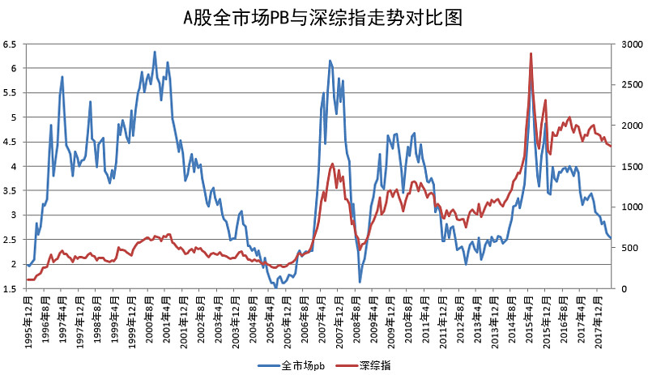

# 2018 年钻石底发车解说

## 一、A股进入真正意义上的「低估」区域（2018-06-11）

今天数据没出来，但如果尾盘半个小时没有猫腻，那么今天A股全市场 PB 应该会降至 2.5 以下了。

这是一个标志性的事件，意味着进入真正意义上的低估区域。

绝不仅仅是对比历史，还包括横向对比各国市场。

感谢资本市场，感谢这时代。

show time.

> 原文发表于雪球：《[A股进入真正意义上的「低估」区域](https://xueqiu.com/4776750571/108677638)》

## 二、即将进入钻石区域（2018-09-03）

中午发车，简单说几句。

*第一，我们开始买入中国海外互联指数。*也就是各位每天生活都离不开的腾讯、阿里、百度、京东等公司组成的指数。要说明的是这个指数下跌空间很大，如果未来美股崩它们也跑不了。

所以看各位自己的心理素质吧。觉得想再等等的也没问题，觉得只买一份无所谓的可以买。

最近这些公司麻烦不断。阿里高居美股被做空最多公司排行榜第三；腾讯遭遇国内网游总量控制；京东目前更是碰到黑天鹅；百度倒是没什么新负面，不过它一直就没消停过。所以各位还是要做好大幅下跌的心理准备，即使今年已经跌了将近 20%。

至于品种，场内的互联50和场外的中国互联并不是一个指数基金，但无所谓。不会差太多。

今天美股休市，所以目前场外QDII会暂停申购。各位可以 15:00 后申购 164906。且慢会在 15:00 前发车A股的两份，15:00 后发车中国海外互联。跟车即可。

*第二，根据我的评价体系，A股整体即将由「黄金区域」进入「钻石区域」。*除非我的评价体系失效了，否则各位投资的A股即将进入一个极其难得的大底区域。

这个区域从 2005 年至今，出现过四次。大致是2005、2008、2012 和现在，2018。十三年四次，十年三次，其实真的并不容易，各位且买且珍惜。

但是请注意，「区域」并不意味着不会再跌。区域也是有空间的。 PB 从 2 跌到 1.5，不考虑业绩增长，也还有 25% 的空间，所以做好思想准备。

有同学问，为什么不等 PB 到 1.5 再买？

这么想的同学，2012 年将错过 2008 年以后，近十年来唯一的超级大底。当时 PB 也只是到 2 而已。三年后，创业板涨了 590%。

第三轮计划开始以来，中证500下跌已经接近 50%，估值已经接近指数发布以来最低。这个例子已经能说明目前A股的情况。

到了这个时候，我也不会说太多。非常幸运的是，我们手里依然有大量现金，依然有大量可变现的盈利品种。

在这个熊市，我们完成了「保住本金」的任务。通常来讲，如果你在某段时间做得很好，那么就要考虑改变了。沾沾自喜、自鸣得意，只会让你在接下来大幅落后，被无情地均值回归。

所以，我们会加快建仓节奏，走出舒适区，迎接暴风雨，以及暴风雨后的彩虹。

一切尽在掌握。该吃吃该喝喝，踏踏实实的。

> 原文发表于公众号：《[2018年9月ETF计划（一）：买入三份](https://mp.weixin.qq.com/s/txb6GAAyhIYeP5IkGhV-LA)》

## 三、底部是个区域（2018-10-15）

时间非常紧，昨天的文章，我简单补充两句。

*「钻石底」是一个底部区域，不存在预测某个点是大底的情况。预测某个点是大底这件事，不是傻子就是骗子才会干。*

用巴菲特的话说，就是，「对面走过来一个男人，你不需要体重计就知道他是不是一个胖子」。胖子和底部都是一个范围。我们可以判断底部区域，但不能判断底部点位。

第二个问题随之而来。在底部区域还会跌吗？

当然，跌的概率依然存在。只是越跌，下跌的空间和下跌的概率就会越来越小。

大熊市的极限底部，我个人的认知，从目前到最低点的极值，还有 20%～25% 左右。极值一般很难出现，过去二十年也只出现过一次。即使出现也是持续时间很短。但依然有概率出现，所以要有心理以及策略上的准备。

*人类的恐惧来源于未知。你做好准备，绝大多数恐惧也就没了。*

在这个时候，我最希望各位保持一种平静祥和的心态来面对目前的资本市场。不用狂喜，也不用悲伤。自己的日子该怎么过就怎么过，该买就买，买完就关上账户继续等待下次买入。

> 原文发表于公众号：《[2018年10月ETF计划（三）：买入三份](https://mp.weixin.qq.com/s/4anBh_dyZvM6zm6WfsH6LA)》

## 四、身处钻石底的收益率（2018-10-30）

如你所知，现在是A股市场的钻石底时间。

在这个坑里，在这个 moment（时刻），账面的浮亏并不是特别重要。只要浮亏程度不要太大。

上次发车，咱们买了一份券商指数。不出意外的，又一次买在了最低点（这么说作者真的不会感到羞耻吗）。买完之后，我们持仓的券商指数收益率依然是浮亏 20% 以上。虽然当时券商指数从最高点跌下来跌幅已经超过 75%，浮亏 20% 好像已经很好，但很多朋友看着这个数字我相信都很不舒服。

风云突变。

五个交易日后，浮亏超过 20% 的券商指数浮亏幅度已经收窄到 5% 以内。各位，五个交易日。五个。

一二三四五，五。Five。cinq。пять。

而此时，券商指数最高点跌下来的幅度依然是 70%。我们已经即将盈利。

你回头看我以前写的很多东西，绝大多数都已经成真。那你就可以再相信我一次：

不要在意你手里持仓品种的那点浮亏。几个点，十几个点，甚至二十几个点。不要在意。牛市来了，两周，三周，就会抹平亏损。然后就是几个月，几年的财富飞跃之旅。

就像这五个交易日的券商一样。何况，你还有很多钱可以摊低成本呢。要知道，现在市场上手里有钱&敢于买入的人，可没几个了。你和我，简直可以说是A股这个弱肉强食生态链中的一级珍惜保护动物了——数量很少，实力却不弱。机会来了闪电出击，没有机会躲起来看别人厮杀保存实力。

不要说买了几年收益率太低。金融市场是三年不鸣，不鸣则已，一鸣惊人。

*你用三年、四年的时间慢慢收集廉价筹码，理性，睿智。*

*然后，资本市场会连本带利把这三年，甚至三十年的利息一次还给你，用来奖励你的理性。*

现在，又到了一个关键区域。

每一天，都有可能是最低点和反转日。到底哪一天是？我不知道，我也不关心。

重要吗？

一点都不重要。

捡钻石吧。你可能不知道，现在有多少人羡慕你还有钱买这些便宜货。

> 原文发表于公众号：《[2018年11月ETF计划（一）：买入六份；卖出两份](https://mp.weixin.qq.com/s/ZMOxEhPIP1G9e0NHFdB7IQ)》

> 本文章所载信息仅供参考，不构成任何投资建议。如转载使用，请参考 [《文章转载声明》](https://youzhiyouxing.cn/agreements/ARTICLE_REPRINTED)。
