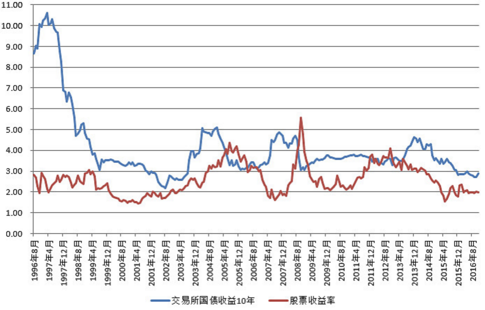

# 股债估值分析

## 一、债券收益率、国债市盈率和A股全市场市盈率（2016-10-20）

债券收益率的情况可以看下图：

蓝线是十年期国债收益率。可以看到，1996 年至今 20 年的债券收益率最低点出现在 2002 年，现在就是次低点。现在的收益率已经跌破 2012、2008、2005、1999 四次 3% 左右的低点，正在挑战二十年最低。

未来怎么走不清楚，有人说会长期低利率甚至 0 利率。我不判断，但我认为，只要有机会，也就是经济形势稍微好转，各国央行就会加息。因为从过去几年的情况看，0 利率甚至负利率对经济的拉动作用已经越来越小。如果经济好转的情况下不加息，央行就会彻底失去这个手中最大的武器。

另外各位可以看到，2013 年至今，中国实际上是一次历史罕见的股债双牛格局。这种情况在 99～02 年出现过。这确实与现在的利率过低，资产泡沫有极大的关系。很简单的说，市场上没有便宜货了。（以前可以股债切换。比如 07 年底从股票切换到债券，08 年会赚很多。然后 08 年再切换回股票继续赚）

再看一张图，注意图中的国债市盈率和A股全市场市盈率的情况。有没有发现现在和 2002 年越来越像？同样的之前一个大牛市下跌，然后反弹。同时债券市盈率也在快速增加。

然后，债券市盈率和股票市盈率同时见顶（债券尖顶，市盈率M顶（更有意思的，是观察一下A股历史，没有尖顶，全是 M 顶。也就是暴跌后引诱已经跑掉的你回去接盘）），开启三年大熊市。到 05 年凤凰涅槃，上涨 7 倍。

> 原文发表于雪球：《[债券收益率、国债市盈率和A股全市场市盈率](https://xueqiu.com/4776750571/76361646)》

## 二、股票收益率历史波动区间（2016-11-18）

仔细看这张图，有几点需要注意。

在资金极度泛滥的时候，会出现股债双牛。比如 2002 年之前，比如这两年；

在资金比较匮乏的时候，会出现股债双杀。比如 2005，比如 2011。

一般情况下，则会股债跷跷板。历史上三次股票收益率大于债券收益率的时候是2005、2008 年底和 2012 年底。这就是三次A股大底，是财富爆发的起点。

现在无疑是资金泛滥，任何品种的未来收益率都很低。做投资最好不要近因，觉得最近发生的事情未来会一直发生。

股票收益率历史在 2～4 之间波动，债券是 3～5。现在基本都在下沿。只是说一般情况，有几次比较特殊可以从图上看出来。分别是 2008 年底的股票，和 2002 的债券。

> 原文发表于雪球：《[股票收益率历史波动区间](https://xueqiu.com/4776750571/77732842)》

> 本文章所载信息仅供参考，不构成任何投资建议。如转载使用，请参考 [《文章转载声明》](https://youzhiyouxing.cn/agreements/ARTICLE_REPRINTED)。
