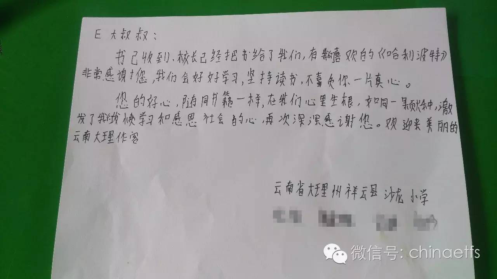

# 《战胜华尔街》

> 原文发表时间：2016 年 05 月 24 日

原文发表时间：2016 年 05 月 24 日

1990 年，退休的彼得·林奇专门为业余投资者写了一本书，书名是《[彼得·林奇的成功投资](https://youzhiyouxing.cn/n/materials/780)》。（我们在 4 月 26 日的读书文章中推荐了该书。我给它的评分是五星。）这本书 10 年重印 30 次，销量超过 100 万。进入中国后也得到了广大投资者的极度喜爱。据说王亚伟当年拿着这本书看了很多遍……

3 年之后，1993 年，林奇又写了一本书。这本书就是我们今天推荐的《战胜华尔街》——又是一本畅销书。

本书延续了上一本的轻松、幽默，却又极富感染力的文风。内容方面，林奇首先强调了一个事实：*业余投资者绝对拥有比专业机构投资者更得天独厚的优势。*然后，林奇讨论了如何选择基金。接下来林奇回忆了自己管理麦哲伦基金 13 年的经历。接下来，作者详细记录了 1992 年自己为巴伦周刊推荐的 21 支股票的选股过程。

这本书对于选股的精彩之处我不想多说，你必须买一本来看。从头看到尾，相信你对投资的认识会提高不止一个等级。

在这里，我想讨论的是两个问题：*林奇对买基金的建议；为什么我们这样的指数投资者要看林奇的书？*

## 林奇的基金选择之道

在这本书的一开始，林奇用了不少笔墨陈述了自己的观点：*买债券不如买股票。同时，如果你没有精力和能力去选择真正的好股票，请买基金。*

林奇在第三章《基金选择之道》中，首先陈述了一个我们都很清楚的事实：长期来看，主动基金无法战胜指数基金。接下来，重点来了，林奇给了我们一个投资基金的建议：

将资金分成六份，投入不同风格的基金。他在后面详细描述了如何在规模指数、行业指数中择时分配资金——这分明就是我们现在流行的轮动策略嘛。不同的是，现在市场上流行的是趋势轮动，也就是说谁涨得好买谁。而林奇的建议是价值轮动，这正与我的理念不谋而合。

> 我们的 ETF 计划现在买入最多的是恒生和 50。难道我真的特别喜欢这样的大盘指数吗？当然不是。我们现在买的多，是因为它们比小盘和很多行业便宜。有一天中盘、小盘、行业指数跌回价值区间，我们会买得更多。

我们的 ETF 计划现在买入最多的是恒生和 50。难道我真的特别喜欢这样的大盘指数吗？当然不是。我们现在买的多，是因为它们比小盘和很多行业便宜。有一天中盘、小盘、行业指数跌回价值区间，我们会买得更多。

## 为什么我们要看林奇关于如何选股的书

看到这篇文章的大多数朋友，都是指数投资爱好者。那么，我为什么推荐这本主要讲如何选股的书？

首先，当然是我们很难得会有机会看到这样最伟大的投资大师亲自写的投资秘籍。即使不买股票，听听大师的教诲，也会平添一个甲子的功力。

其次，更重要的，其实我有个给朋友们的小建议。什么建议？我建议朋友们坚持指数投资的时候，同时进行股票投资。

但是，我建议的股票投资，不是什么跟踪主力追热点、看 K 线追涨杀跌。我建议大家好好看看林奇的两本书，好好选几家自己非常喜欢，非常了解的好公司。有价值的时候，慢慢一点一点积攒他们的股票。由于有指数投资打底，你知道自己未来一定会在资本市场取得不错的收益。这时候你的股票投资就完全不是负担，而是一种乐趣。

当然，这只是我自己的建议。如果你真的对股票投资毫无兴趣，那么不买也毫无问题——指数投资也足够你研究几年的了。

本书推荐指数：★★★★☆

继续跟大家报告一下之前为贫困地区孩子送书的事。昨天，送到云南的书孩子们已经拿到了。据老师说，孩子们都很高兴。孩子们说，这是六一最好的礼物！

这次寄出的书比上次少了些，孩子们希望看的书有一些没有找到。下次有机会会买了再寄过去。

明天会更好。感谢每个人。

> 原文发表于公众号：[周二读书（9）战胜华尔街（Beating the street）](https://mp.weixin.qq.com/s/oC1OAF9Bp60KftGpdZdE3A)

> 本文章所载信息仅供参考，不构成任何投资建议。如转载使用，请参考 [《文章转载声明》](https://youzhiyouxing.cn/agreements/ARTICLE_REPRINTED)。
