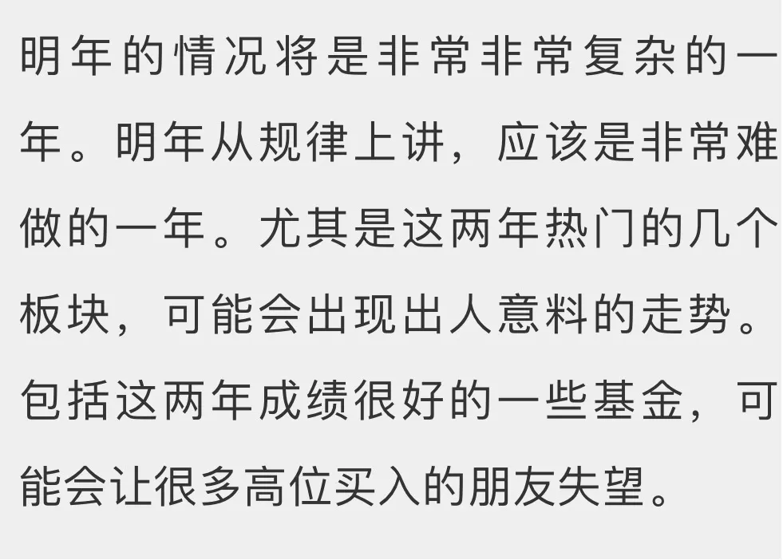
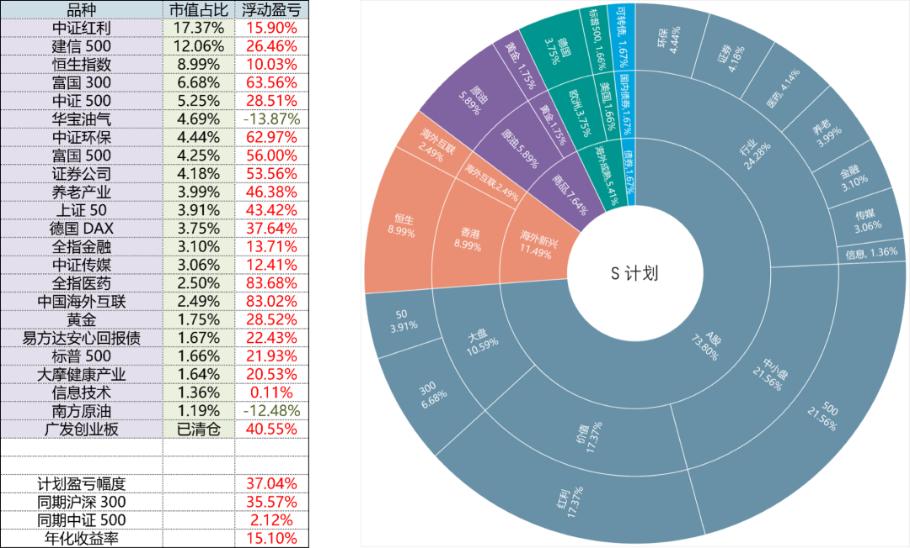

# 2020 年年度总结

> 原文发表于 2021 年 2 月 12 日。

原文发表于 2021 年 2 月 12 日。

## 一、走过的路

在 2019 年初，对那个经过一年暴跌，还在钻石坑中的A股，我是这么判断的。

到了 2019 年底，在对 2020 年的且慢展望文章中，我说了这样一段话：

2019 年大涨后的年底，我预计 2020 年会大幅波动。结果是大多数股票，三月暴跌，七月暴涨，年终收平，所有A股年涨幅中位数只有 2%。

运气比较好，都算是蒙对了。

## 二、对 2021 的展望

那么，2021 呢。

在去年底我写的「2021 不烦恼指南」中，提到过几句关于 2021 的预期。当时是这么写的：

最近几天所谓的机构「抱团股」有了松动的迹象，很多人说报团是不是结束了。如果真的结束了，或者说，未来某一天结束了，很奇怪吗？真的一点点都不奇怪。

所以，我对 2021 的第一个判断是：

*某些热门、高估、涨幅很高的板块和个股，会出现出乎很多人意料的调整。如果自最高点调整 30%～50% 请不要感到意外。*

当然，可能不是这一波就调整下去，也可能还会有新高后再调整，但自最高点大幅调整应该是一个大概率事件。

第二个判断是：*大多数股票未必会很差。*

目前A股市场整体并不贵，尤其是大量中小股票，经过这几年的打压与不受重视，整体估值水平不高。更何况有一些股票和指数已经非常便宜。

我不敢说它们会涨多少，但未必会跌很多。因为现在全市场已经摸到我定义的「黄金坑」边缘了。再大跌，叠加企业利润增长，难道要再回钻石坑？画面美到不敢想象。

## 三、关于 150 和 S 投资计划

基于以上判断，150 份计划和 S 计划目前不会大幅减仓或者加仓。但是会根据行情的变化，置换部分仓位。就像之前将环保换为金融和信息产业的动作。未来这样的换仓还会发生。

其次，经过几年的陪伴，我认为绝大多数朋友已经有了承受风险的基本能力。同时，参考 S 计划的朋友也已经积累了一定的未投入资金。所以，从 S 计划开始，会更加激进。之前 S 买的大摩健康以及信息产业，就是基于更高的风险承受能力才会出手购买。未来会逐步更加激进一些。

所以如果是刚刚跟车的朋友，万一未来遇到买入即跌的情况，先不要骂，也不要失望。我们目前几乎所有很大利润的品种都遇到过这样的情况。相信我，最后都会赚钱，而且赚的不会少。

当然，我其实更希望新朋友不要再跟车。因为*牛市中开始买入短期赚钱概率很高，长期看不容易取得好的收益。*我也没有信心能让你取得与老朋友一样的高收益。所以你也可以去看看且慢其它的投资组合，也许有更适合你的。

但无论如何，我们始终会把保证本金安全作为最重要的考虑因素。每个人都想要取得高收益，但只有当你损失本金之后才会体会到保住本金才是金融投资最重要的一环。

最后，放几张 150 份计划和 S 计划的收益率以及资产配置图，祝各位 2021 取得好收益。

> 原文发表于公众号：《[长赢指数投资计划 2021 年的操作大思路](https://mp.weixin.qq.com/s/1AXJ1Bw_SKlKjobJZmA9cA)》

> 本文章所载信息仅供参考，不构成任何投资建议。如转载使用，请参考 [《文章转载声明》](https://youzhiyouxing.cn/agreements/ARTICLE_REPRINTED)。
