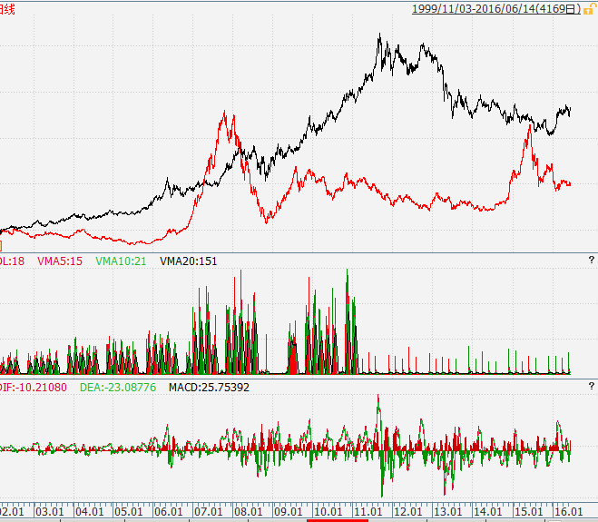

<h2>一、详解家庭资产配置（一）（2021-03-28）</h2>
资产配置是一个博大精深的话题。市面上也有很多相关的书籍，但我想 90% 的朋友看完之后的感觉是：看的时候明明白白，看完以后迷茫依旧，依然不知道该如何操作如何配置。

我尝试将资产配置的原理深入浅出地糅合在具体操作中与各位朋友分享。对于每一个人，每一个家庭来说，其实最重要的并不是——你能不能买到一只牛股或者牛基，或者有没有不小心踩到了「地雷」，<em>而是你将家庭资产的多少百分比买了它。</em>或者说，在每一次牛市或者熊市到来的时候，<em>你的家庭资产是如何分布，以保证自己能够在上涨的时候分享大部分收益，而下跌的时候规避大部分风险。</em>

动辄「满仓」、「空仓」当然可以创造暴富的神话，但你要知道，一将功成万骨枯。那一个幸运儿的出现，背后隐藏了多少财富归零，妻离子散。<em>所以我建议绝大多数家庭认真对待资产配置，这应该是你投资的第一课。</em>
<h3>相关性分析与资产配置（1）</h3><blockquote>
本部分发表于 2016 年 6 月 13 日。
</blockquote>
上次给各位看了资源类品种的相关性，并简单介绍了相关性的知识。从现在起，我会将A股大中小指数、行业指数、恒生、标普、DAX、油气、石油、金、银所有我们能在沪深交易所买到的品种放在一起做个交叉相关性分析。今天先把图贴出来，明天开始详细分析如何利用这张图做资产配置。

说明：为了体现这几年的走势，本图于 2021 年 3 月更新。

这张图是 2005 年至今，周线级别的相关性分析。大家一定要把这张图存下来好好研究，这个至少可以用 2～3 年。

大家应该理解，如果我们把资金买入相关性极强的很多品种，那一点意义都没有。比如我们把资金分成 2 份，一份买中小板，一份买中证500，基本是没有意义的。

大家看昨天的表格，中证500和中小板的相关性达到了 0.985。也就是在将近 99% 的时间里他们是共涨共跌。这样的分散投资没有意义。

我们要做的，是把资金分散到相关性很低的品种中。这样，能够起到的作用是，当某个品种表现不佳时，另一个品种可以将我们的收益率保持在不差的水平。

这就是<em>根据相关性来进行资产配置的第一个原则：将资产分配到相关性低的品种。</em>

举个例子大家就理解了。

这张图是 2002 年至今，沪深300和 comex 黄金走势图对比。大家拿出昨天的表格，会发现他们两个的走势相关性只有 0.174。在统计学上，这个基本上就是极弱相关，甚至可以认为是不相关走势。

大家注意，黑线的黄金从 2002 年开始到 2005 年，是一路上升的走势。而红线沪深300则连跌 3 年多。如果这个时候你满仓沪深300，会痛苦万分。而如果你半仓 300 半仓黄金，至少 3 年收益是正的。

接下来，两个品种都走了 2 年左右的大牛市，又共同经历了2007～2008 的下跌。也就是有 3 年走势基本一致，当然幅度不同。所以这三年你会赚很多，因为黄金那半仓 2008 年并没有跌多少。

2009 年开始到 2012 年，黄金再次暴涨。从 800 左右涨到了 1900。而这段时间，沪深300则跌了又跌。12 年黄金开始下跌，沪深300则走稳。到了 2014 年沪深300开始暴涨，黄金继续跌……而今年，黄金大涨，沪深300暴跌。

所以大家看到，过去 14 年中，300和黄金走势相关的大趋势重合度非常低。大部分时间是你涨我跌，你跌我涨。我这里没有时间做具体测算。有兴趣的朋友可以把黄金和300的走势调出来，好好看看将资产5:5 分配到黄金和300，每半年做一次再平衡，那么这 12 年的收益率会是多少。

我想，应该是一个非常厉害的数字，恐怕会好过单一持有黄金或者300。当然，你要问为什么 2002 年不满仓黄金，2006 年不满仓300，2014 年为什么不满仓300，今年为什么不满仓黄金——那就当我没说！

所以，我们分配资产的第一原则，就是：将资产分配到相关性很低的资产中。哪些资产相关性低？看我给你的表格。横排和纵列的交叉点，就是他们两个品种的相关性。数字越接近于0，则相关性越低。0就代表完全不相关。如果数字为负，即相关性为负，更是说明二者走势相反。
<h3>今日点评（2021-03-28）</h3>
相关性分析更多的应该是作用于大类资产配置，如股（国内外）、债、金、油等。具体到每一个小类品种配置，相关性分析的意义则小了很多。因为A股市场很多时候是齐涨共跌，只是每个品种涨跌幅度不同，这样就无法由相关性分析来体现差异性。

至于大类品种下的细分品种间该如何应用，后面会说到。

另外，相关性理念对于我们的各种投资策略也有非常大的意义。比如网格策略，对于相关性高的品种，就没有重复开网格的必要。

原文发表于公众号：《<a href="https://mp.weixin.qq.com/s/ZmJq7XGlOy6PaKYk4jwT9g">以前的投资笔记（002）：详解家庭资产配置（一）</a>》
<h2>二、详解家庭资产配置（三）（2021-04-04）</h2>
我始终认为，不要因为近期大盘股表现好或者小盘股表现好就放弃大小搭配的策略。

营养均衡才能活得长久。
<h3>相关性与资产配置（3）</h3><blockquote>
本部分发表于 2016 年 6 月 17 日。
</blockquote>
继续说相关性和资产配置的问题。

昨天，我们解决了 50 和 300 这样大指数的问题。接下来，我们的问题是，在A股还要选什么？

我们一定要选择一个小盘股指数。为什么？大家看与 50 相关性只有 0.62 的中证500和 50 的走势对比：

注意，横坐标是时间，纵坐标是涨幅。

首先，我们看相关性走势差异。

大家注意红色的中证500，在 2011~2012 年底，它与上证50基本上是同步下跌，但是很明显，它的跌幅比 50 大很多。大家还记得我昨天说的吗？熊市中，50 通常是跌幅最小的那个。这也是为什么我们的计划在这样的熊市中建仓 50。

然而，大家注意，从 2012 年底开始，事情开始起了变化。2012 年 11 月底，中证500的红线创出新低后，一路向上，从此再也没有下跌。

到了 2014 年 7 月，一年多过去，50 还在创新低，而中证500已经涨了 40% 以上。大家考虑一下，如果你这一年多重仓的是大盘股指数，会多么郁闷？而如果你买的是 50 + 500 呢？

这是从相关性分析，接下来从波动性来分析，进一步体会为什么一定要配置大盘股 + 小盘股。

2014 年 7 月之前就不说了，刚才讲过，大盘股狂跌，小盘股暴涨。从 14 年 7 月后，大盘股 + 小盘股都开始上涨。然而，是不是上涨了就可以单独持有一个指数了？答案还是：NO。

2014 年 10 月开始到 2015 年 1 月，上证50涨幅明显大于中证500。它只用了 3 个月的时间，就将过去几年的晦气一扫而光，涨幅超过了 500。然而，1 月份 50 遭受大幅回撤之后，500 的涨幅再次开始领先。

到了疯狂的 6 月，500 的涨幅甚至超过了 50 一倍之多。再看 6 月开始股灾之后，50 虽然也是下跌，但跌幅明显小于 500。从整张图几年的走势，我们可以一目了然：中证500的波动性远大于 50。

好了，结论呼之欲出：

<em>在某些时段，大、小盘股票会表现出不同力度的上涨，这种上涨是很难预期的。所以，最佳策略是同时持有大、小盘，动态平衡。谁涨得多就卖一些，买入涨得少的。</em>在熊市初期与中期，尽量多持有大盘股指数。跌幅会比小盘股指数小很多。在估值回归到正常情况下，开始加大力度加仓小盘股。未来这部分投资的弹性会远大于大盘股。

朋友们，未来是未知的。大盘股涨的好还是小盘股涨的好，我们不知道。最佳策略是，我们都来持有。也许在某个时间段，我们的收益会没有全仓持有强势指数好。但是，通过动态平衡，最终组合收益会大于持有一种强势指数。

当然，你也可以尝试结合比如二八轮动、蛋卷那样的策略，择强持有。但是，我建议大家，不要完全按照那些策略来进行操作。原因很简单，你的资金受不了高买低卖的折腾。请好好考虑，如何结合估值和趋势策略，根据上面说的原则，在组合中适当调配资产，让我们的收益取得最大化？
<h3>相关性与资产配置（4）</h3><blockquote>
本部分发表于 2016 年 6 月 21 日。
</blockquote>
好，继续说相关性与资产配置的问题。拿出表格。

上次说到，A股资产中，大盘、小盘要同时配置。那么，小盘指数配哪只？我们可以看到，中证500与中小板指相关性有 0.985，那么这两支配一只即可。观察历史走势可以知道，中证500波动率大于中小板。同时，其覆盖的范围也更大，所以，这两个中我们选择 500。再看创业板。500 和创业的相关性是 0.925，也是强相关。看历史走势，创业板走势又远远大于 500。这里怎么选择？

大家想想 50 和 300 的例子。以现在的情况看，创业板估值高到离谱，我们没法建仓——由于它的波动性更大，未来跌幅会更加恐怖。我们不去做这个接盘侠。那么，还是那个思路，先在 500 估值合适的时候在 500 建仓。等创业板估值下来后，建仓创业，或者从 500 转移部分仓位到创业。

好了，A股的宽基资产配置基本已经清楚。原则是大、小风格搭配。大的选 50 和 300。小的选 500 和创业。

再说行业。刚才看表格发现漏了一个全指医药的数据。事实上全指医药和 500 的相关性是 0.939。全指消费和 500 的相关性是 0.946。如此高的相关性，是否有必要重复配置？

我个人认为，做为宽基指数的补充，行业指数非常有必要配置。尤其是一些长期必然走牛的行业。这些行业的持有，应该比宽基指数更加坚定。不到出奇高估的时候，绝不卖出。宁愿做过山车也要持有。当然，可以用我们的策略平滑收益。比如目标市值。

当然，行业指数配置的比例要低于宽基。可以考虑的是医药、消费大类下的细分指数，或者干脆就是医药和消费指数。信息指数与创业板指数走势相关性 0.99，确实没有必要重复配置。

这样，未来路线图已经清晰：50、300、500、创业、医药、消费。当然，你如果就选其中的几个也没有任何问题。比如你觉得就买 50、500，或者 300、创业，都没有问题。关键在于，一定要大小搭配。

另外像养老、环保这样非基础性行业，偏向概念性的指数，也可以在特定时间段配置。

明天继续说配置。开始将视线转移到境外和其它品种。

附图：本文写作当日全市场估值图。

<h3>今日点评（2021-04-04）</h3>
5 年过去，本文依然完全不需要修改任何一个字。50、300、500、创业、医药、消费。各位也可以看到这几个品种这五年的表现。不仅过去五年完全适用，我可以说一句大概率不会错的话：

对于A股来说，未来 50 年，这个搭配也是非常非常出色的一个组合。当然，也许有些细分品种会根据情况有调整。比如创业是不是可以在适当的时候换成科创？这些都完全在未来的投资框架内。

很多人投资容易陷入一个误区，即，最近某个品种表现好，它未来一定会继续好。这个思路问题非常非常大。但对于普通人来说，追逐近期热门简直可以说是天性了。比如各大第三方基金销售平台首页大广告一定是「近期热门 xx 基金涨幅 xx%」，「xx 基金经理旗下基金收益率 xx%」。当你真的追进去，祸福就相当难料了。

我的理念是A股内部大小配置，然后加上长期看极有前途的几个行业。长期看，这样做的收益率不会差。

当然，随着情况的变化，很多指数的状态也发生了变化。比如创业板指实际上已经变成一个相对来说不那么小的指数，各位在调整仓位组合的时候，也要随时关注指数本身的变化。

知道买什么是第一步。怎么交易，什么时候交易，什么时候买什么时候卖，是下一步需要思考的问题。不要急，我们慢慢说。

原文发表于公众号：《<a href="https://mp.weixin.qq.com/s/wkWr0yvchEqE1uYuDJH2Hg">以前的投资笔记（004）：详解家庭资产配置（3）</a>》

本文章所载信息仅供参考，不构成任何投资建议。如转载使用，请参考 <a href="https://youzhiyouxing.cn/agreements/ARTICLE_REPRINTED">《文章转载声明》</a>。

