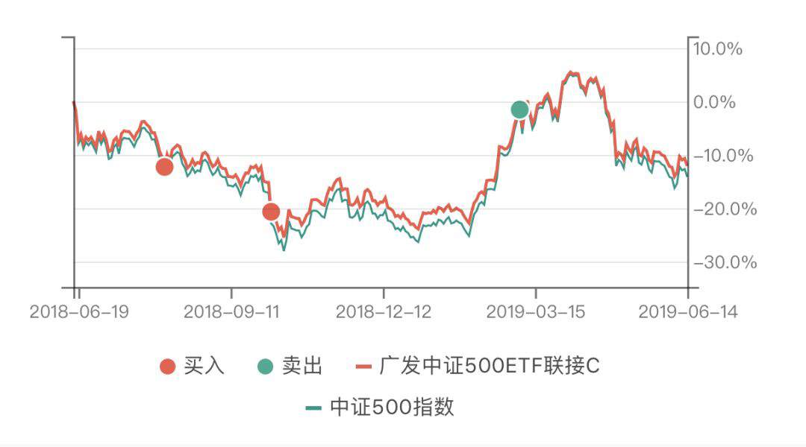

<h2>一、平衡与分寸（2018-12-27）</h2>
总体来说，资本市场是很给我们面子的。

它知道我们这三年一直轻仓，于是一路下跌给我们重仓的机会；它知道我们 10 月十几车砸下去，于是大幅反弹；它又知道我们反弹高位暂停买入，然后连跌 8 个交易日。一方面，当然是运气使然，一方面不能否认的，是我们节奏在线。

我一直在强调投资要讲节奏。但你如果让我说的很清楚，我又觉得有点困难。所谓道可道，非常道，大概就是这种感觉。但如果一定要总结几条原则出来，我想大概还是有些可以说的。当然不会说的很全面，想起什么说什么，以后想起来随时补充。

第一个，我想，是<em>平衡。</em>对于平衡两个字的理解，我自己从不仅仅只限于证券投资。所谓股债平衡，所谓动态平衡，这些东西，都只是我们这个世界运行大规则之下的细枝末节而已。平衡二字应该是万事万物的基础规则之一。所以投资也一定要讲平衡。

这是我们的最重要的基础节奏之一。只要一个品种不会死，我相信跌多了就一定会涨，涨多了就一定会跌。只要咱们能找到其中的大致规律，就能实现高抛低吸的投资终极目标。而在极致之中进行平衡操作，就是节奏的基础之一。

第二个，叫做<em>分寸。</em>跟平衡一样，分寸的掌控也当然不仅仅限于投资。任何事情都讲分寸。说话也好，做事也好，都是如此。懂得分寸的人会让人觉得很舒服，不知分寸的人相处起来会让别人感到非常难受。投资当然也是。一个品种在你的组合中，在目前这个时间点，应该占多少比重？这就是一种分寸的拿捏。

一个品种占比太少，固然在下跌中很安全，但是涨起来也赚不到什么钱。一个品种占比太多，赚的时候当然开心，然而下跌的时候就会让你非常沮丧。这种分寸的拿捏是控制节奏的重要因素。

一般来讲，一个品种如果在你的组合中占比低于 5%～10%，基本你就不用担心它的下跌。无论怎么跌，都不会让你的组合受到致命伤。然而如果高于 5%～10%，你就要小心它的杀伤力。也就是说，<em>如果你给一个品种 5%～10% 以上的仓位，就说明你已经非常看好它的未来，</em>相信它上涨的概率大于下跌，相信它将带给你的收益将远大于风险。如果你不确信，就要控制好节奏，掌握好分寸，把它的仓位控制在你可以掌控的范围内。

关于节奏，先说这两个，以后有空继续说。

原文发表于公众号：《<a href="https://mp.weixin.qq.com/s/J37XMWDxhHhzLgKvy7-ilg">2019年1月ETF计划（一）：买入三份</a>》
<h2>二、再聊聊节奏（2019-06-18）</h2>
在金融交易中，我始终很看重「节奏」。

节奏是什么？在我看来，就是<em>张弛有度，进退有据。</em>时而疾风劲雨，时而润物细无声。去年底我们可以一个月买入接近 20 份，今年我们也可以整整半年没有加仓一分钱A股。

这就是我的交易节奏。

我们每个人都有自己擅长的事情，也就有不擅长的。做擅长的事情时，你会发现怎么做怎么顺，得心应手。但是做不擅长的事，就会节奏很差，一片慌乱。<em>在金融交易中，最重要的是找到自己的波长，然后让自己的交易策略与波长契合起来，做到不慌不乱，愉快赚钱。</em>

这是我们这次 150 里面买入的 500C 交易记录。

去年开始，我将波段操作加入了 150 计划里。500C 就是操作对象。加入波段操作的原因，是为了应对未来可能出现的只有波幅没有涨幅的情况。波段操作本身我已经做了十几年，经验可谓丰富。但加入我们的 ETF 计划，尤其是那么多投资经验不是很丰富的朋友会参考，当然就会谨慎的多。所用的仓位也比较低。从目前看，效果还可以，以后也会加大一些波段仓位。

从 500C 本身的交易看，虽然不是英明神武地买在最低，卖在最高，但我个人也算是相当满意。每一份买入之间都给足了空间，卖出后虽然继续小幅上涨，但最终还是大幅下跌，给了我们再次接回的机会。如此一番操作，该品种的价格没变，我们依然是盈利不少。这次买回后，手中筹码数量也没变，可以说是一次成功的波段操作。类似的还有 150 的油气的操作：

各位应该还有印象，在今年这一波大涨中，很多人情绪有了微妙的变化。生怕自己赶不上末班车，错失致富机会。很多人慌忙买入，最终拉高了持仓成本。而我们不仅整整 5 个月没有加仓A股，甚至高位卖出了波段仓位。我们的情绪没有受到环境的丝毫影响，就像去年底不受悲观情绪影响的大笔买入一样。

这也是交易中非常重要的一点——你的节奏，不要因为他人的舞步而慌乱。你就是你，可以冷静欣赏别人的疯狂和恐惧，但自己的拍子永远不能乱。大多数人都只是羊群和旅鼠，他们说什么，做什么，基本没有太多参考意义。跳自己的舞，让别人去慌乱。

下面这张是S计划的油气历史交易图。

各位可以看出，从 S 计划开始以来，油气的第一次买点几乎就是两年最低。买入后就开始赚钱，大涨。在上涨过程中，一分钱都不再追入，最终再次大跌，又给了我们买入的机会。

这就牵扯到节奏的另一个问题：<em>忍耐。</em>

你想在一个组合里买入一个品种，但是可以做到 2 年不动手，这就说明你已经基本成熟了。我所知的最长忍耐时间，大概是巴菲特忍了三十多年不卖可口可乐的例子。有了自己的节奏，忍耐并不是什么痛苦的事情，这一点应该认真体会。

综上，谈到节奏，第一要义就是<em>知进退。</em>知道什么时候买入，知道什么时候卖出。回头看，咱们当然很容易看出哪里是最低，哪里是最高。但是你向未来看，高低点就完全模糊了。这里要把握买卖的节奏，就需要观察很多东西。比如价值与价格的关系，比如情绪。然后，按照自己的交易策略，进行买卖操作。

但是要注意一点，没人能完全把握好高低点。你回头看计划的交易，也会有一些卖出后依然上涨的情况。这很正常，这就需要第二个要点：

<em>交易节奏的速度。</em>在上涨趋势良好的时候，你的卖出节奏要放慢。不着急，慢慢卖。留出空间——也就是说，第二份卖出和第一份之间要有空间。

买入当然也是同理。在趋势向下的时候，第二份买入也要和第一份拉开空间。

那么，<em>什么时候该加速买入？就是当你发现目标已经便宜到与你手上的仓位完全不匹配，要尽快建立仓位的时候，</em>比如去年底我们做的。同理，当价格贵到手中仓位已经明显太大的时候，就不要再慢慢卖出。

最后，还有一点重要的是，就是<em>你的节奏要与你的资金特征（为什么150和S的油气节奏不同？）、你的仓位、你的配置、你的性格等等结合起来。</em>这也是为什么我说，你一定要找到属于自己的专属节奏。

我想，关于节奏，恐怕不是一两篇文章能说清的。很多东西可能也要与各位一起经历过，才会有更深的领悟。

节奏非常重要，也希望各位能尽快找到适合自己的交易节奏。

原文发表于公众号：《<a href="https://mp.weixin.qq.com/s/yPb-oTpCfoUF5WT3I4uXdQ">2019年6月ETF计划（二）：买入两份</a>》
<h2>三、贪字的二重定义（2015-09-09 ）</h2>
如果说全市场估值在 72 倍的时候还在满仓做多是一种贪，那么在 41 倍的时候空仓等跌无疑也是一种贪，何况，上证50和港股这样的估值。

前者的贪，是一种生怕少赚一分钱的贪。后者的贪，则是妄图把所有资金在大底买入享受最多利润的贪。

没错，全市场历史最低估值水平到过 20 以下。如果不考虑企业利润增长的因素，那么全市场PE还要跌一半，对应上证指数也许还要跌 30% 以上，对应上证50指数也许还要跌 20% 以上。但一味地等到最低买，无疑风险巨大。

格雷厄姆在《聪明的投资者》（让老巴脑洞大开的神书）中将资产配置分为债券和普通股，范围在 25%～75% 之间变动。对于一般投资者，他建议 50：50。然后定期再平衡。

我们再回头看历史上所有成名的成功投资者，都没有看出任何人是用「高位清仓，大底重新进场」这一模式赚钱的。这样的模式有什么问题？在我看来，主要是技术和心理上两方面的问题。
<h3>1. 技术</h3>
用我们跟踪超过 10 年的A股全市场 PE 来看，2008 年这个数字到过 17 倍。如果在 2012 年你还希望 17 倍入场，那么到现在你都一分钱也赚不到——2012 年大底，全市场 PE 值是 25 倍。

同时，随着无风险利率的变化，我们不能用刻舟求剑的方法，去推导「大底」的估值应该是多少。

所以，幻想用 PE 大底极值去满仓抄入然后赚大钱的想法有些问题。至于说用上证指数去抄底更是无法理喻，不解释。
<h3>2. 心理</h3>
我一向认为，投资最重要的是金融史和投资心理学。对投资者来讲，如何在市场风云变幻的时候，时刻拥有一个健康正能量的强大心脏异常重要。

但是请朋友们注意，强大的心理素质，并不是完全天生，或者多看几本心理学的书就能具备。很多时候，它需要你有真正的实力去支撑。

放到投资上来说，<em>你的仓位决定了你能否夜夜安眠。</em>

没错，空仓能让你熊市中睡得不错。但你是否曾想过，如果市场并未如你所愿继续下跌，一股都没有的你是否能笑得出来？市场不理智的时间，有时候远远超过我们的想象。

而最悲哀的悲剧，就是空仓等跌到最后，终于忍不住在大顶抄了进去。

好的仓位，能让我们每天拥有好的心态。好的心态，能让我们在股市得到好的收益。

那么，该怎么做？

简单说说我的一点想法。

还是两点：技术和心理。
<h3>3. 技术</h3>
估值过高的时候大量卖出，但至少留 15% 仓位永不离场。朋友们，放心，长期看，指数会一路上扬。不信你看看深综指的走势。这 15% 不会让你赔钱。估值回到历史均值附近，开始少量买入。回到大底区域，重仓买入。其他时间，用各种方法保本，赚钱，等待大牛市。通常我的经验是，这样做一轮熊市到最低点总资产减少幅度不会超过 15%。而牛市资产则会增加 N 倍。
<h3>4. 心理</h3>
想象一下大盘涨跌 1000 点，自己手里股票涨跌 50% 的心理状态。如果发现手里股票跌 50% 会非常难受，那么你的仓位就重了。如果发现涨 50% 会因为少赚而难受，就说明现在手里股票太少。

说了那么多，其实就是一句话：空仓等大底，也是一种贪。只要是贪，就会有风险。「踏空」在 72 倍 PE 不可怕，如果有些板块十几倍 PE 还不敢买哪怕 1%，那么真的就有点风险了。

至于说现在的仓位，我想给个 20%，放到或价值低估，或成长良好也不过分高估的股票上，并不算过分吧？

原文发表于雪球：《<a href="https://xueqiu.com/4776750571/56104221">贪字的二重定义</a>》
<h2>四、现金像缺氧时的空气那样珍贵（2016-08-10 ）</h2>
春江水暖鸭先知。就你怕手里的现金贬值，富豪不怕么~

不用争，一切评判交给时间。

<em>现金是空气，只有你缺氧的时候才会知道它的珍贵。</em>

当你被「低利率会催生长期高价资产」的说法忽悠买入昂贵资产的时候，有人已经撤退了。
<ol><li>
全球超级富豪变现资产囤积现金，因经济不确定性和资产价格创历史新高。财富咨询公司 Wealth-X 最新调查显示，富豪现金持有水平目前已达 22.2%，创 2010 年来最高水平。该报告涵盖了全球 2473 位超级富豪，总资产超 7.7 万亿美元。
</li><li>
上周五（8 月 5 日）发布的监管文件显示，沃伦·巴菲特旗下伯克希尔公司的现金储备截至 6 月 30 日增至创纪录的 727 亿美元，受卡夫亨氏公司赎回优先股刺激。三个月前其现金储备为 583 亿美元。
</li><li>
德国与日本居民存款持续上涨，丹麦、瑞士和瑞典居民存款已飙升至有数据以来新高。摩根士丹利：人们只会在对未来有信心时才增加借贷和支出，负利率政策实际上打击了市场信心。
</li></ol>
原文发表于雪球：《<a href="https://xueqiu.com/4776750571/73143737">现金像缺氧时的空气那样珍贵</a>》
<h2>五、保证无论发生什么情况都活着（2020-04-21）</h2>
这几个月仓位没有增加，但是如果你还有自由现金流，还是要继续积累现金。

一方面是把自己家庭的安全垫积累得厚一点，一方面是为了有可能拿到的更低资产价格做准备。

你得保证无论发生什么情况自己都活着，才能赚更多。也许未来你会看到有些现在激进的人赚很多，但你看不到的是他的身后有多少白骨。

原文发表于微博：《<a href="https://weibo.com/5687069307/IEjzL1Iau?refer_flag=1001030103_&amp;type=comment">仓位没有增加，继续积累现金</a>》

<h1>六、左侧分批买入，空间和时间，至少要占其一（2021-10-28）</h1>

再回顾一下。

其中左侧买入就是我今天想谈的。啰嗦的文字表达能力就是这么让人抓狂，几百字过去了，刚刚准备进入正题。

总而言之，我的左侧买入理念就是<strong><em>不让筹码大量聚集在一个区域</em></strong>，或者说，不在短暂的时间内聚集在一个区域。

左侧买入并没有什么不对，但很多朋友左侧买入之所以受伤，是因为在品种下跌的过程中，在自以为的低位上，大量买入，结果下跌趋势继续，因而承受了巨大的损失。

趋势一旦形成，真的很难改变。大一点的趋势，通常会持续几年。在几年的时间里，你的猜底或者猜顶行为只有一次机会是对的。在这场猜谜游戏中，这个赢的概率就太小了。所以我的做法是不猜。

我理想中的左侧买入，会让筹码聚集在底部区域附近。而底部又很难判断，所以我的做法是规定一个买入原则，即我经常在微博上表达的：

左侧分批买入，空间、时间至少要占其一。

我想这非常容易理解。空间，即下跌空间。举个例子，我们的网格策略就是一个「空间」策略。在一个品种下跌 5% 或者 7% 或者 10% 的情况下加仓，避免筹码聚集在下跌的高位。

时间呢？其实通常意义上的「定投」就是一个时间范畴的买入原则。当然我们十几年前就已经抛弃了所谓的定投，但它隐含的时间概念我们却从未抛弃。这个时间没有限制，但最好不要过短，我想，在同样的价格水平上，同一个品种一个月应该是最低的买入时间限制。

换个说法，<em>要么是跌幅够大，要么是时间够长</em>。否则，我不会在同一个区间密集买入太多同一个品种。

当然了，这是大的原则。具体情况还要具体分析。比如说，你的仓位。如果你的仓位极低极低，那么，在某个价位上左侧密集买入一部分也不是不可以。

又或者说，目前已经肉眼可见的极度便宜，就像 2008、2012 和 2018 的钻石坑，那么密集的买入也是可以的。

以上，就是我的左侧买入节奏原则。我相信会有 37.8% 的朋友们看不太懂。没关系，再看一遍。如果还看不懂就别看了，一年后再来看。

你看，这也是给出「时间」的一种应用策略呢。

原文发布于微博：《<a href="https://weibo.com/5687069307/KEOQApboC?from=page_1005055687069307_profile&amp;wvr=6&amp;mod=weibotime&amp;type=comment" target="_blank">空间和时间，至少要占其一</a>》

<h1>七、抄底要注意节奏（2021-12-17 ）</h1>

一个品种大幅下跌，然后你看到很多很多很多抄底的人。

这时候你就会产生一个疑问：怎么可能这么多人抄到底呢。哪次底部也不会让这么多人买到一起发财啊。

那么你跟着一起抄的时候就会谨慎一点。

不死的品种抄底是没错的，但肯定不会大家一起抄到底。那么谁才会是最后的赢家呢？

考虑一下，应该是<em>那些在真正大底来临的时候，还有子弹不断战斗的战士们</em>。他们没有一口气打光所有子弹寻求速胜，而是一边打一边躲，保存实力，寻求在敌人最虚弱的时候送上致命一枪。

而那些早早把子弹打光的人，只能倒在战场上装死了。

原文发表于微博：《<a href="https://weibo.com/5687069307/L6qUe2bI7?from=page_1005055687069307_profile&amp;wvr=6&amp;mod=weibotime&amp;type=comment">抄底要注意节奏</a>》

本文章所载信息仅供参考，不构成任何投资建议。如转载使用，请参考 <a href="https://youzhiyouxing.cn/agreements/ARTICLE_REPRINTED">《文章转载声明》</a>。

