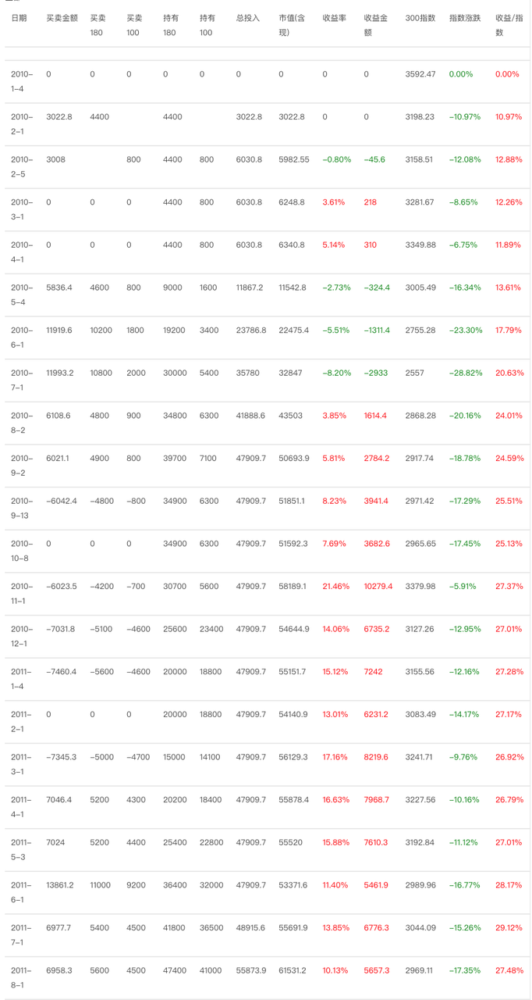
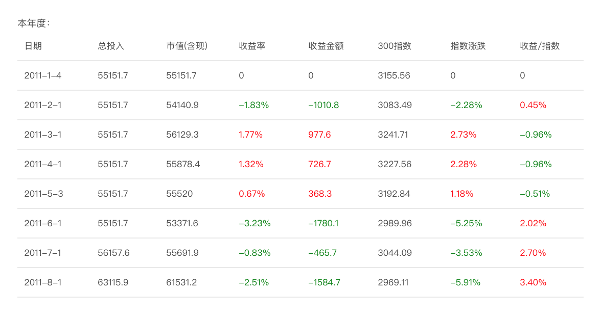

<h2>一、别人害怕的时候你要贪婪（2011-07-31）</h2>
时间过得真快，从我决定公布这个计划以来，19 个月过去了。

如果你一开始就跟着买，回头看，也许没有达到你预期的每年翻番或者每年 30% 的希望。以现在的收益率来看，2010、2011 这两年年化收益率到现在为止在 8% 左右。

每年 8% 的收益率我想很多人一定不满意——包括我——虽然我们每个月都在大幅战胜指数，将指数越落越远（不用说，95% 胸前写着「勇」字去炒股的股民，更是连我们的马尾巴都看不到）。

而且，随着世界以及国内经济形势的变化、银行的几千亿融资、各种地方政府坏账的出现、铁道部上万亿债务几乎无法偿还、各种大小盘股不断的上市……各种利空，也许中国股市还会持续走低，我们的收益率还会下降，甚至——不排除投资两年后出现浮亏的现象。

但是，我们应该因为害怕而离场吗？

19 个月了，我每次公布计划的时候，都会进行「投资者教育」。告诉大家，<em>我们需要的是下跌，我们热切盼望的是下跌。</em>下跌才会让我们买到便宜货、打折货。当我们手中攥着满满的现金的时候，难道你希望 4000 点买股票吗？

到这个月为止，我们终于买到了 9 份。而根据我的建议，每个月 2 份准备的话，应该买到 40 份。

为什么会有那么大的差距？因为我坚守一条准则——<em>绝不为疯狂的、变态的、不理智的价格买单！</em>即使我们买不到，我们也不买贵。我们不是冤大头。

现在，A股越来越便宜了，我们难道反而应该害怕吗？在股市获利，要记得那句古老的谚语——别人贪婪的时候你要害怕，别人害怕的时候你要贪婪，缺一不可。

请坚定信心，继续每个月准备 2 份的资金。这些资金一定会买进去，什么时候？当其他投资者哀鸿遍野、整个资本市场满目疮痍、所有人心惊胆战的时候，我们进场收拾残局，然后——笑傲江湖。

世界上没有只跌不涨的股市。经验少的投资者由于长时间的下跌或者盘整很容易失去信心。但是，经历过 2001 年到 2005 年超级大熊市的我，负责任地告诉大家——熊市越长，牛市越高。只有理智、沉稳、果断的人，才会真正把钱装进口袋。

不知道大家是否实时监控自己的 ETF 收益。在 7 月份A股反弹到 2800 多点的时候，我们的 ETF 收益跳到了 18%。几乎创造了历史最高绝对收益金额——只比去年 10 月 3200 多点时候的收益少一点点。为什么 2800 点我们就可以拿到与 3200 点时候一样的收益？回头看看下面的表格，你会明白。

继续走下去，只要跌得够深，我坚信也许某一天，哪怕只有 2300 点，我们也会拿到 3200 点的收益——而如果真的回到 3200 点，那么收益将是？还是我说的，我不需要大牛市，我只需要震荡。哪怕 10 年后还是 3200 点，我也有信心让每个人目瞪口呆。

其实说那么多挺多余，因为越来越多的朋友跟我说：为什么还不跌啊。

你看，你们都明白价值投资的真正奥义了。

原文发表于网易博客
<h2>二、熊市大幅跑赢大盘的复利意义（2012-05-30）</h2>
现在再回头想老巴说的<em>「熊市大幅跑赢大盘，牛市跟上大盘」</em>这句话，就有了新的认识。

<em>当你在熊市大幅跑赢大盘，那么在接下来的牛市中，你与大盘的基准就不同了。</em>举例来说，熊市过后你领先大盘 50%。那么相对于起始点来说，你就有了 50% 的优势。

那么，牛市中的某一天，当天你与大盘的涨幅都是 1%，仅仅跟上了大盘涨幅。但别忘了，这一天开始的时候，你可是领先大盘 50%。这样以起始点来说，你的相对涨幅是 1.5%。

看，一天又赢了 0.5%。这也是今年我的绿线能够不断上扬的原因之一。当然，主要原因还是绝对涨幅赢了大盘 6%。

这样不断循环，你领先大盘的幅度越来越高。那么在每一个仅仅是「跟上」的牛市中，你的资金积累会几何式地爆发。

可惜，这样的事情不是每个人都明白，也不是每个人都能接受牛市仅仅是「跟上」大盘。

于是，80% 的人的复利，都是以负数形式存在的。

有意思。

原文发表于网易博客
<h2>三、世界也许会很差，但终究会好（2018-04-20）</h2>
再说几句，未来几个月会出现的情况，届时大家可以验证。

没有危机是不会出现让你暴富的大底的。这也是为什么会出现大底，以及为什么大底没几个人敢买的原因——因为出大事了。

行情最差的时候，很多人预期会更差，因为形势看起来真的很差，而且看起来会更差。

这个时候，很多之前看多的人会卖出，很多看空的人会继续看空。之前看多坚持不卖的人已经算好，然而他们已经没钱买了，除了股息。

这也是为什么很少有人会买在底部的原因。

最重要的，记住，<em>心中的标准不要变。</em>世界也许会很差，但终究会好。

你买的指数，不会死！不要患得患失，该出手时一定要出手。人生能有几回搏？

原文发表于雪球：《<a href="https://xueqiu.com/4776750571/105600862">世界也许会很差，但终究会好</a>》
<h2>四、在A股赚钱其实挺简单的，真的（2018-04-26）</h2>
各位，我表达一下自己的一些想法，不对的请指教。

前几天说过，趋势其实很重要。我们不一定按照趋势投资，但是会参考。目前的趋势当然是不好，我观察的所有A股指数，除了医药养老几乎都是下降趋势。

意志坚定的朋友当然无所谓，眼前一片迷茫的朋友终会在某个时间坚持不住——希望似乎不会再有了。

我想说的是，目前的情况特别正常。这本来就是应该发生的。在 2015、2016 就应该一步到位的事情，被很多外部因素弄到 2018 年还在还债。我说这话，当然不是信口雌黄。我的数据就是这样显示。当然，我的数据也未必对，但至少到目前，没有错。

目前的情况，过去也发生过。<em>价值回归而已。三五年总要来一次。</em>夏天、冬天——狂喜、恐惧。我眼睁睁地看着A股周而复始好多次。我试图找到其中的规律，好在已经有些眉目。

就像如果你知道了天文历法，知道了春夏秋冬的更替，就不会对冬天感到害怕。下跌总会过去，从极贵到极便宜后，下一轮牛市就会开始。很多股票不会再涨，但指数、市场，会开始又一轮的疯狂。冬天的我们，应该能预测到夏天的温度。

所以，该发生的就让它发生。人工干扰只会扰乱自然更替，没什么大不了。

一切都很正常，发生不正常的事情也很正常；一切都很正常，过去发生过，未来也会继续发生。

在A股赚钱其实挺简单的，真的。

原文发表于雪球：《<a href="https://xueqiu.com/4776750571/106061476">在A股赚钱其实挺简单的，真的</a>》

本文章所载信息仅供参考，不构成任何投资建议。如转载使用，请参考 <a href="https://youzhiyouxing.cn/agreements/ARTICLE_REPRINTED">《文章转载声明》</a>。

