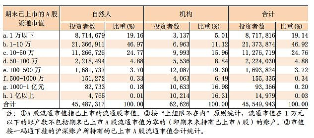
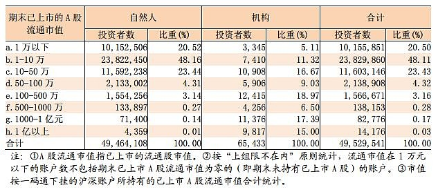
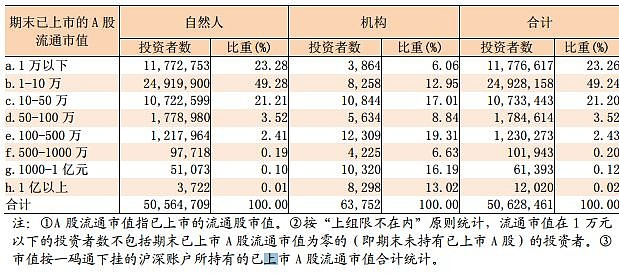

<h2>一、主动长期持续超越市场的想法都是妄想（2011-11-29）</h2>
前几天看了一篇关于公募的文章，最近五年内，每年排在前 1/2 的，只有兴业全球的一家基金。前 1/2 啊！各位看官。只要比一半人做得好就够了，但是 sorry，300 多只股票基金，只有一只做到了。

为什么会出现这种情况？去看看金融史就会一目了然。

如果我说，某只基金今年取得了第一名，很大程度是运气好，你一定不相信。但很遗憾，事实正是如此。同样，如果我在 2007 年底跟你说，你赚了那么多是运气好，你一定也不信，你会认为自己能力超强。

每次看到有媒体吹嘘当年的冠军基金我就觉得好笑，明年你们还会采访他吗？更好笑的是，这些当年的冠军居然真的以为自己有能力了，夸夸其谈不一而足……投资这件事，<em>最可怕的是把运气当成能力。</em>非常可怕。

基金如此，散户呢？

我特别坚信，5000 多万股票投资者中，一定有一小撮另类。这些人，你们在媒体上见不到。他们能够长期地、持续地打败大盘，赚取真金白银。他们有不同的方法，也许是持有某一只股票十几年，也许是每天短线不断的买卖……不管用什么方法，一定一定有这样一批人的存在。

但有多少？

我还坚信地是，在中国股市长期、持续赚钱的人，不会超过 10%。能够赚大钱，改变自己人生的，绝不到 1%。

千万别看着某些「名博」、「大师」吹得天花乱坠，什么 3 年 10 倍，什么 5 年 30 倍……树不会长到天上，多看点金融史，你会一眼看穿谁在扯淡。

我想说什么？

我的中心思想是，<em>想要步步精准通过炒股持续领先大盘，真的难上加难。</em>有多难?

如果你是站得特别高，看得特别远的人，你可以买入一只 10 年后的大牛股。你知道现在默默无闻的它有朝一日会乌鸦变凤凰。你可以买入，持有。当然，中间它不要发生任何问题：行业风险、管理层风险、政策风险、公司风险、产品风险。这些风险都没有发生，好，你赢了。

如果你想跟着无数投资人不停地跟着热点炒，一个热点炒完了炒下一个，你需要更牛的技巧。你要判断下一个热点行业，需要判断买入价、卖出价。卖出后要继续判断下一个热点，并且知道如果买错了、卖错了该怎么掉头。

听起来很简单，对吗？

我有个想法，特别希望一起买 ETF 的朋友一块来帮我实践，那就是：

请大家买 ETF 的同时，根据自己认为最好的投资方法去买股票。一年、三年、五年后，我们来看看，是投资股票赚得多，还是简简单单根据估值买卖 ETF 赚得多？

下月底我会公布今年 ETF 计划的收益情况，当然，今年 ETF 亏损了，毫无疑问。

但更加毫无疑问的，是继去年我们打败了 85% 的基金后，今年我们打败了更多的基金。

拭目以待。

这个计划将是个投资奇迹。

原文发表于网易博客
<h2>二、天天找主力，其实你就是主力好吗？（2015-08-18）</h2>
这几天鸡汤和段子多了点，上个准干货给大家盘前开开胃。

数据来源：中证登公司

数据名称：月末投资者账户市值统计表

5 月：

6 月： 

7 月： 

数据解读：

1、<em>最明显的，当然是投资者比重的变化。</em>从 5 月开始，持仓市值 10 万以下的投资者数量逐渐增加，从 5 月份的占比 66.06% 增加到 7 月末的 72.25%。也就是说，市值 10 万以下的散户，已经占到了市场的超过 70%。从绝对数看，也是小市值账户大幅增加，大市值账户骤然减少。

2、为什么会造成这种变化？有两种可能。一种是<em>股灾导致大市值账户变中市值账户，中市值账户变小市值账户。还有一种可能，是在股市不断上涨，骤然暴跌，来回震荡的三个月中，大户和中户投资者在悄悄撤离，散户投资者在英勇入场为国接盘。</em>至于哪种可能性大，大家自己判断。

3、我道歉。前面发过一个帖子，说市值几万的朋友别把主要精力放在炒股上，去好好努力多赚点钱再回来投资比较好。现在我知道，我错了，我道歉。整个股市中，有 70% 以上的账户其实不足十万市值。是中国人太穷了，还是大家玩股票真的只是「玩玩」？这么看，即使股灾再大，也真的无所谓。大户中户都走了，散户赔 50% 也赔不了几个钱。同时，我也懂了，为什么那么多人梦想一夜暴富，短炒热点了。

4、我相信雪球朋友的资产，会比外面的普通投资者资产普遍大一些。看看你们所处得财富位置吧：只要持仓市值在 100 万以上，你就已经是中国股市最有钱的 3%；只要你有 500 万市值，就已经是最有钱的 0.4%；只要你有 1000 万，就已经是最有钱的 0.15%；只要你有 1 个亿……你怎么还没移民？当然，这里是持仓市值。很多朋友是轻仓或者空仓。那么上面的百分比乘 2，基本也就是你的财富位置了。

5、以前发过一个帖子，疑惑到底在一个明显高估的市场上，是资产低的朋友更激进，还是资产高的朋友更激进？答案昭然若揭。

6、结论：大户中户在走，散户在跑步进场；中国股民大多数是拿几万块「玩玩」而已，股灾不会对他们造成致命伤害。他们的「玩玩」态度，决定了他们不会认真研究长远规划；资产大的朋友，也不用操心，他们非常敏锐，相信大多数 100 万市值以上的朋友，已经在股市摸到了门道，将继续把股市当作提款机，高抛低吸，实现财富增值。

原文发表于雪球：《<a href="https://xueqiu.com/4776750571/54718695">天天找主力，其实你就是主力好吗？</a>》
<h2>三、中国股市问题之一是散户太多（2012-02-19）</h2>
散户太多有什么问题？

<em>散户会在下跌过程中不断抄底。</em>有个貌似利好的东西出来就高喊牛市来了；如果继续跌，他们就坚定持仓。看着手里的股票跌 30%、50%、70%，然后大骂中国股市有这样那样的问题。

<em>散户也会在上涨过程中不断卖出，而且是稍微赚一点就拿不住了。</em>先「锁定利润」再说。然后呢？然后在更高的地方接回来。就这样，手里的股票成本价永远离现价很近。一旦趋势转变就会亏损。真亏损了，就持有。回到循环的第一阶段。

也就是说，<em>散户太多导致了熊市跌得慢、深，上涨的时候涨不动，也就是牛短熊长。</em>这一波上涨，境外股市表现好的底部上来已经超过 40%，我们只有可怜的 10%。

今天降存准，去看看新闻评论或者股票论坛。满篇都在说「高开低走」「逢高出货」「大好的跑路机会」。他们就是这么奇怪，熊市里天天盼着上涨天天猜底，上涨开始后他们又觉得还没跌够继续空仓或随时跑路。

无奈。下轮熊市，加仓境外市场是个好主意。当然，什么时候可以再回熊市就不知道了。

原文发表于网易博客
<h2>四、对于大多数散户来说，A股是个修罗场 （2021-01-11）</h2>
有人居然说什么「清高」。我真的服了阅读理解能力了。

这个东西其实不需要特别深入思考，只要稍微想想就能理解。

A股市场 90 年代初诞生，到现在 30 年了。我一直说，A股是个聚宝盆，赚钱很容易。但其实，对于散户来说，这是个修罗场。多少人在里面倾家荡产或者说赔很多钱，几千万人总是有的。

为什么呢，最大的原因是<em>节奏不对。</em>牛市涨得火热，呼啦啦进来接盘，赔了钱就关上账户，眼不见心不烦或者底部咬咬牙清仓走人。然后下一轮牛市看别人赚钱了又抢着进来。

这就是大多数人的状态。

我没说喜欢钱是错的，我就没见过不喜欢钱的人。我说的是这个人只喜欢钱，只是因为别人说现在炒股买基金赚钱就来了，不喜欢研究或者根本就没弄清楚我们在干嘛就来掺合一腿。我讨厌这种人。

<em>一个稍微理智一点的人，他对财富感兴趣，就会开始研究怎么赚钱。</em>然后他会从各个路径知道还有股票市场，还有基金，然后再开始研究股票和基金。注意，这样的人不是因为市场好而来，他是对通过金融市场赚钱感兴趣，愿意哪怕是稍微研究研究，这样，跟车也会理智很多，因为他会看看我们在干嘛，是怎么干的。

这是完全不同的。前一种人因为不知道你在干嘛，所以稍微浮亏一点会上蹿下跳，想看例子吗，我把评论打开，或者你直接去支付宝或者天天基金评论区看看就知道。这种人不仅自己会赔钱，还会把所有人的心态搞坏——包括我的，包括其他理智的、不理智的、有知识的、没有知识的所有人。

当然不是说所有牛市进来的都这样。牛市进来的人有一部分也会理智，但比例比熊市进来的少太多太多了。

一个队伍想要有战斗力，这种人就不能太多。他们会像病毒一样传染最终导致队伍崩溃，无法达到胜利的彼岸。

我希望我这里所有人都是<em>理智、客观、具备独立思考能力，理解证券市场的特点，理解所有策略的优势和劣势，能够处变不惊，能够笑傲市场。</em>

再说一次，这轮牛市我对新人已经不会有帮助了，请去各个基金销售平台或者其他地方找人帮你吧，据我所知现在所有交流平台已经大量冒出各种股神基神，可能他们有些还是可以的。我是说真的。

原文发表于微博：《<a href="https://weibo.com/5687069307/JCHRZz0sq?from=page_1005055687069307_profile&amp;wvr=6&amp;mod=weibotime&amp;type=comment">对于大多数散户来说，A股是个修罗场</a>》

本文章所载信息仅供参考，不构成任何投资建议。如转载使用，请参考 <a href="https://youzhiyouxing.cn/agreements/ARTICLE_REPRINTED">《文章转载声明》</a>。

