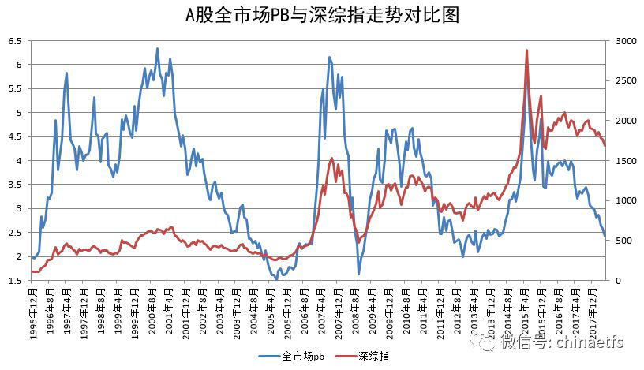

<blockquote>
原文发表时间：2018 年 06 月 17 日
</blockquote>
各位朋友，晚上好。

这篇文章写不写，其实我是有点犹豫的。因为在这样风声鹤唳的时候，似乎应该谈谈我的想法，谈谈现在，谈谈未来。然而，其实很多东西，这三年来已经说的很多，好像又没有什么可以补充的。

还是说说吧，毕竟，95% 的朋友，是第一次经历这样的现状。随着市场一步步下跌，心里难免开始犹豫。

今天咱们随便聊聊，想到哪里，说哪里。

年初至今，沪深300指数下跌 6.88%，中证500更惨，下跌 12.27%，中证1000下跌 15.52%。两市 3454 只股票，中位数下跌 15.3%；上涨股票占比 19%，有 81% 的股票在下跌。

在这样的暴风骤雨中，仓位逐渐增加的计划今年年度收益也已经开始浮亏了。截至周五，计划年度下跌 1.15%。虽然以将近 40% A股仓位，跌幅只有 300 的 17%，500 的 9%，但依然是开始年度浮亏了。有些朋友由于没有买一些强势品种，在他们的计划中，浮亏的幅度会更大。

我不知道参考计划的朋友，现在心里是什么样的感受？兴奋，平静，还是有点惴惴不安？

很多事情看起来差极了：跟美国的 MY 战；5 月宏观经济数据；全球加息预期；企业 ZF 债务问题；房地产问题；毒角兽……更别说各指数的趋势依然向下，毫无好转的迹象，甚至不少指数连创新低……

这种时候，需要我熬一碗热腾腾的鸡汤给你定定神吗？不好意思，我不是厨子，办不到的事情，我办不到。

今天，我会再把之前说过的一些东西，结合目前的情况，再跟你说一遍。你回头想想，当初这些话，算不算得上金玉良言？如果算，请你记住，今天我说的，几年后看会是更珍贵的宝藏。
<h2>一、舒服最重要</h2>
这句话是我经常挂在嘴边的。什么是舒服？我给过一个标准，就是你来闭上眼睛，想象手中的持仓下跌50%，或者上涨50%，你会不会舒服。如果你发现下跌50%自己会不舒服，就减仓。如果上涨50%不舒服，就加仓。一直调整到无论涨跌都舒服的情况。

有朋友说了，我涨了觉得仓位小，跌了觉得仓位重，怎么办？那我会请你立即在我眼前消失，永远别出现……

很多朋友以为自己舒服了，结果市场跌一跌才发现并不了解自己。我早就跟你说过了，你很可能没有你自己想象的这么坚强。即使现在不难受，随着市场进一步下跌，你才有机会认识真正的自己。

了解自己很难。在投资这方面，可能我都比你了解你自己。所以，没有关系。你不了解自己，没关系，我了解你就够了。

我曾经说过，我很早很早就学到了，不要给别人推荐股票。后来发现，推荐基金也不行。然后，推荐具体基金，没有买卖点也不行。有了买卖点，没有交易时间点也不行。你以为这下就行了？错了，没有仓位控制？对方依然赚不到钱。

好，我就从头开始，从品种、价格、时间、仓位，全都一清二楚说的明明白白。所以我告诉你，你不了解自己，不知道怎么样才舒服，没有关系，我来，我了解你。因为，绝大多数朋友，都只是普通人而已，没有铁打的神经系统，没有坚定的意志，我会把一切控制到让普通人都很舒服。

现在，看着你的持仓，问问自己，舒服不舒服？即使是从第一天就开始参考计划的朋友，手里也至少还有 40% 现金。加上各种债之类乱七八糟的东西，至少还有一半子弹，跌了，你有钱抄底。涨了，你会比任何指数都更早的创出资产新高。我相信，绝大多数朋友的心理与情绪，目前都是极度轻松的。

当然，第一次，再加上资产不断缩水，开始有疑虑，很正常。但我想告诉你的是——
<h2>二、太阳下没有新鲜事</h2>
三年，漫长，遥远，又转瞬即逝。我们用了三年时间，几十次发车投入，也依然只买了 40% 出头的A股仓位。为什么？

因为我知道，我确定的坚信，太阳下没有新鲜事。一切都是轮回。我是如此的坚信，没有任何人任何语言任何文章可以改变我的信念。我坚信，第四次大底一定会到来，我的第四次资产飞跃一定会到来。

为了这份坚信，以及我对绝大多数普通人的了解，在这样的漫漫熊市中，我再一次与大家一起，完全控制住了风险。有些股票已经下跌 90%，有些指数已经跌了 80%，而我们的计划一路走高，即使跌到现在，距离最高点也不过四个多点的距离。

说这些，不是为了嘚瑟。虽然熊市不赔，值得嘚瑟。<em>但我们来投资，不是为了不赔钱的。</em>我要说的，是既然这轮熊市完全按照我的预计在发生，那么，我更有信心的，是下一轮牛市也一定会如我所愿的到来。目前我们要做的，只是在尽量少亏不亏的基础上，多拿筹码，未来赚的更多。

<em>太阳下没有新鲜事。该跌就一定要跌，该涨也一定会涨。</em>未来，你会看到，听到，越来越多的人说A股完了，要推倒重来了，永远没希望了。这些话，一点都不新鲜，过去出现过，未来也一定会出现。当所有人都在说的时候，你就该知道，你要变得富有了。
<h2>三、你凭什么赚钱</h2>
当你第一次买入或者申购某个股票或者基金时，你有没有认真想过，你凭什么在这个弱肉强食的丛林中赚到钱？

高人一等的智商？灵敏无比的财经嗅觉？缜密严实的逻辑思维能力？不可告人的信息来源？专业又忠诚的顾问团队？价值万金的分析软件数据模型？对行业对企业深入骨髓的认识？

如果你什么都没有，那么又凭什么你身边的人都赔的稀里哗啦你能赚到钱？

很严肃的问题。你应该好好想想。

感谢指数基金，感谢价值投资。在我看来，即使上面说的你一样都没有，你依然有机会在这个hard模式的市场中赚到钱。只要你能做到两点：

<em>反人性 + 坚持。</em>

不展开说了，好好体会这两点。坚持做正确的事情，与你体内的恐惧和贪婪作战，无视你身边一群群旅鼠和羊群的嘈杂。
<h2>四、迷雾</h2>
当然，每个人都能做到反人性和坚持，那是不可能的。不过，不管怎样，无论你能否坚持到最后胜利，这都将是你人生中很宝贵的一段经验。几年后，你都会发现自己成长很多。

最后，我要说的是，虽然我无比确信大底区域会如约而至，无比确信下一轮超级大牛市不会缺席，但中短期的未来，当然一定是迷雾重重。谁告诉你他能预测最低点，能预测反弹或者反转的时间，相信我，他不是骗子就是傻子。

中短期的未来很难预测。有可能我们没吃饱就反弹一大波，有可能我们吃饱了又继续暴跌 10%。还有可能就在某个区间上上下下震荡好几年。

都无所谓，毫无所谓。无论哪种未来，我们都已经做好准备。有人赌大底，有人赌继续暴跌。我们什么都不赌。我们是理性的投资人，我们按照赔率下注。机会大下重注，机会小就随便玩玩，如果改变命运的机会来临，我们一把梭哈。

无论如何未来发生什么，记住，你买的是指数，除非交易所关门，它永远不死。记住，三年来你已经跑赢中证500超过 50%。一切主动权都在你的手里，你终将胜利。

<em>做一件让未来的自己感到骄傲的事，做一个十年后会被自己感谢的人。</em>

原文发表于公众号：《<a href="https://mp.weixin.qq.com/s/RXn6i2H9IVzzguMuRJb0Dg">那些关于金钱的俗事（三）：你凭什么在股市赚钱</a>》

本文章所载信息仅供参考，不构成任何投资建议。如转载使用，请参考 <a href="https://youzhiyouxing.cn/agreements/ARTICLE_REPRINTED">《文章转载声明》</a>。

