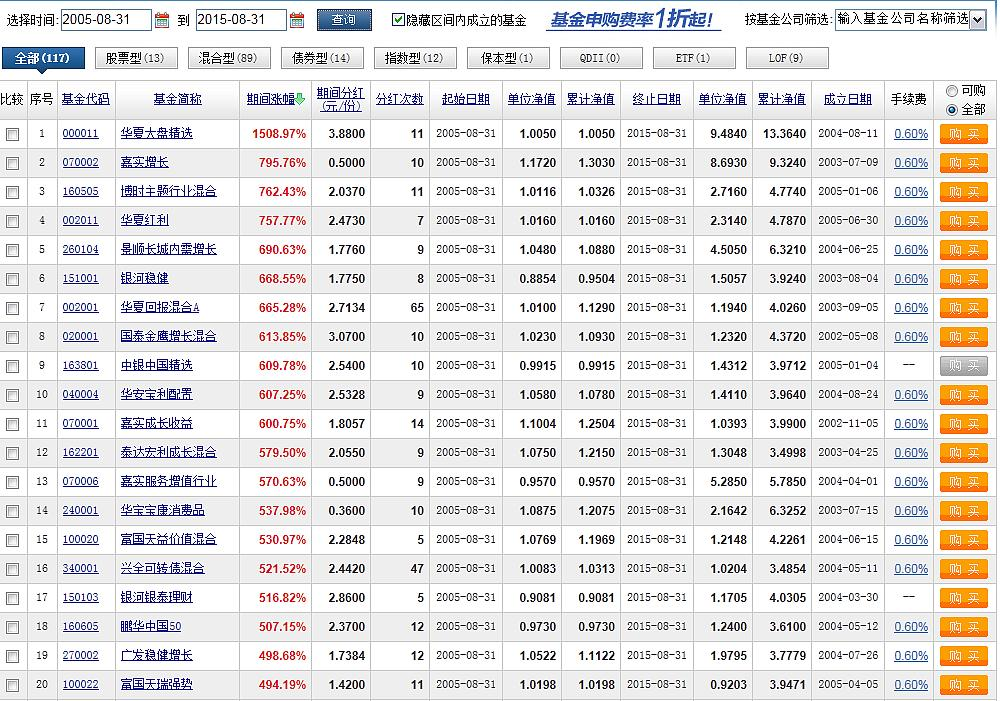
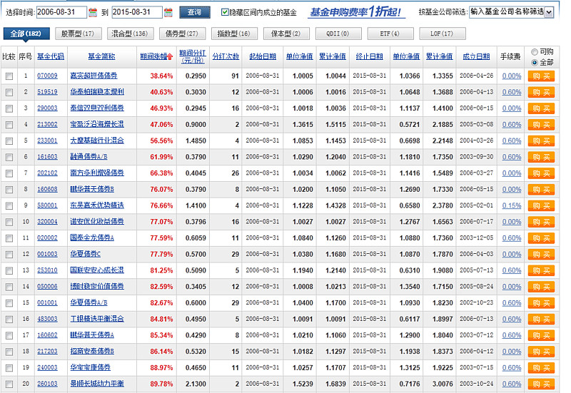
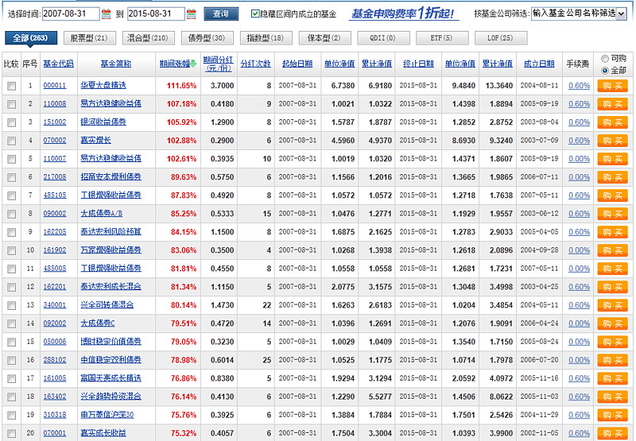

<h2>一、估值是决定长期收益率的基础（2015-10-23）</h2>
昨天，在雪球发了一篇文章，简单算了一下过去十年中证500的年化收益率到了 23%。

这个真是震撼。

然而，要知道 2005 年可是 1000 点，那是一个极度低估的时代。以那个时代为开始，并不全面。

好了，热爱思考的我再次发扬了勇于钻研的精神。今天，我们来看看，估值对于投资同一个指数，到底有多大的作用？估值，到底是不是决定我们长期收益的基础？

这里，波段高手不要喷，我知道你们可以不顾估值低买高卖，这篇只是说，对于长期投资一个指数来说，起点非常重要，阅读群体不是你们，谢谢……

下面，正式开始数据分析。

我们选择中证500从 2005 年 10 月开始的 PE 数据，从中分别选出最高、最低的各三个月末，以及一个十年平均的月末，看看从这估值不同的七个月到现在，收益率会有什么样的不同。

PS：如果最高或者最低为相近月份，则只选一个。比如 2008 年 10 月与 2008 年 11 月，选 2008 年 10 月。

中证500过去十年 PE 最低的三个月是：

2008 年 10 月（18）、2012 年 11 月（23）、2005 年 11 月（23）

中证500过去十年 PE 最高的三个月是：

2007 年 05 月（71 倍）、2015 年 05 月（66 倍）（该数据不选取）、2008 年 02 月（63 倍）、2009 年 12 月（54 倍）

中证500过去十年平均 PE 为 38 倍，则我们选择过去 120 个月第一个 PE 为 38 倍的月份：2006 年 06 月。朋友们，最终结果是：

有没有感到极度震撼？？？？

同一个指数，只是因为你买的时候估值不同，就会让你的收益产生天壤之别！

只要你买得够低，不论你是持有 10 年还是 3 年，你的年化收益率至少在 20% 以上，甚至会达到 35%，而这波牛市的最高点甚至会有 60%！每年年化！

但是，悲哀的是，朋友们，如果你买得太高，那么，长期来看，你的收益率甚至比不上债券。看看上面绿色的部分，我，不忍心详细说了，自己看吧……

投资看估值有没有用？

你说有没有用？这张表不想过多分析，正常智商都能看得明明白白。

为什么我们那么有耐心地等待低估的出现？为什么我们在高估的时候闲庭信步谈笑风生不抢反弹？

因为，我们不想去澳门或者买六合彩发财。

那么，有朋友问了，现在中证500的 PE 是多少？

现在的中证500PE 在 45 左右。这个估值，比十年平均高了 17%。我们认为，这个点位买入，恐怕要等若干年才能赚钱。

所以我们的选择是，继续等待。

我们现在不买，不是不想赚钱～～其实我们更贪，我们<em>在等待那个真正合理的价格买入，然后，等待再次飞跃。</em>

随手转发，造福亲友。让他们知道，在中国股市赚钱，只要有耐心，真的很简单！

原文发表于公众号：《<a href="https://mp.weixin.qq.com/s/JZyWUqowLhxhWSje7ictKA">道理懂了，你也能从容面对股市涨跌：谈笑风生，然后把钱赚了</a>》
<h2>二、十年收益：低估值、中等估值、高估值投资的结果（2015-09-13）</h2>
2005～2015：

高→低

低→高

数据来源：天天基金网  统计范围：所有公募基金

只有华夏大盘一只基金 10 年收益超过 10 倍。而它最近三年总收益率只有 27%。

别说公募基金能力差，它们一定比绝大多数散户强很多。可想而知，<em>想取得十年十倍收益多么难。</em>

同时，大熊市底部买股票，持有十年很难亏损。

2006～2015：

但是朋友，别忘了，2005 年 8 月是中国历史大底。如果时间往后推一年，也就是 2006 年 8 月到现在最近 9 年收益率，结果就变成了这样：

高→低

低→高

说明什么？在估值中等的情况下你入场买股票，能取得 9 年 5 倍的收益已经是人中龙凤了。

2007～2015：

那么，如果你在大牛市估值很高的地方入场，投资 8 年会怎样？继续看图：

高→低

低→高

在股市涨了两年的牛市入场，如果你能取得 8 年 1 倍的收益，那你可以向所有人吹牛。

8 年，1 倍。最好的投资者。

还是以前《<a href="https://xueqiu.com/4776750571/39611266">那篇帖子</a>》说的，<em>A股是个聚宝盆，但影响你长期收益的关键，是你什么时候进场。</em>大熊市入场买股票，十年十倍不是梦；大牛市进场，8 年 1 倍你就是王者。最糟的是，大牛市入场，你的收益率很可能 5 年还是负。

但无论如何，在A股，十年十倍都是一个特别牛的收益率。

原文发表于雪球：《<a href="https://xueqiu.com/4776750571/56310631">十年收益：低估值、中等估值、高估值投资的结果</a>》
<h2>三、极端的高估值就会带来长时间的下跌（2016-04-07）</h2>
<em>单说极端的高估值本身，就会带来时间较长的下跌。主要是欠的债要还，要用时间来恢复信心和口袋里的资金。</em>比如A股 2007 一年的高估值，就带来了 2007～2012 四年的下跌。然而由于 2008 年跌速较快，才会有 2009 年和 2010 年这样的吃饭行情，不会让这四年过得太狼狈。

<em>如果是长期极端的高估值，则非常可怕，会出现没有明显机会的慢熊。</em>可见 2001～2005 年。

昨天深交所公布的数据，中小 50 倍，创业 80 倍。相对来说是比较客观的数据。实际上，A股一多半的公司估值超过 60 倍。

总是要还账的。要不快点还完大家轻装上阵再来一发，要不拖拖拉拉任时光飞逝……

那就慢慢来吧。既然不让跌。

毕竟，怎么说呢，这届韭菜不行。

大多数人寄予厚望的股市，恐怕几年后会让你觉得：春梦了无痕呐。

原文发表于雪球：《<a href="https://xueqiu.com/4776750571/67113231">极端的高估值就会带来长时间的下跌</a>》

本文章所载信息仅供参考，不构成任何投资建议。如转载使用，请参考 <a href="https://youzhiyouxing.cn/agreements/ARTICLE_REPRINTED">《文章转载声明》</a>。

