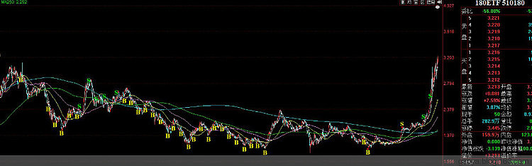

<h2>一、关注全市场与各指数 PE（2015-08-30）</h2>
闲话不多说，进入正题：
<h3>1. 现在的市场估值</h3>
古语有云：没有数据的论点都是耍流氓。先上数据：

图 1，A股全市场 PE 与历史平均、五年平均、十年平均、十年期国债收益、深证综指对比图：

A股全市场 PE 已经大幅超越 5 年、10 年平均值。与历史平均 PE 大致持平。也就是说，从过去 5 年和 10 年的角度来看，现在A股整体已经偏贵。从A股历史来看，估值水平大致与历史平均一致。

当然，又会有同学跳出来说，上交所公布的 PE 只有十几倍！你在胡说什么？ PE 哪里会有 40！

不急，继续看图 2

图2，各指数 PE 值。

好了，说重点：

A股市场最便宜的板块依然是上证50。但它的估值已经从 2013 年 6 月的 11.47 倍涨到了现在的 20.74。超过统计区间平均值 14.36 高达 44.45%。没别的原因，这两年它实在太便宜了，平均 PE 居然被拉到了14 倍。

我们 ETF 计划的主力持仓 180 ETF 的 PE，也从 2013 年 6 月的 14.99 涨到了现在的 27.14！超越平均 PE 18.72 多达 44.95%。

各位只看交易所公布 PE 的同学，考虑到金融的权重，交易所公布十几倍 PE 是否合理，自行判断。

接下来说重点中的重点：

标颜色的部分，是各指数现在估值超过 2 年平均的幅度。<em>可以看出，所有市场上可以买到的指数中，只有恒生一家低于平均。</em>这将是我们 ETF 计划接下来大力布局的品种。可以关注的是美指、中证500。
<h3>2. 我们的ETF计划</h3>
简单说几句 ETF 计划的大体情况

图3，180 ETF的买入和卖出点

上面这张图中的 B34 是我们买入180的位置。越低，买得越多，唯一一次 4 份重手买入是 2012 年 12 月 3 日。至今 180 的浮动收益是 54.69%。由于前 2 次只卖出了很少，现在手里还有大把，可以适当加大卖出手笔。

我们持有的 100 ETF 表现稍差，原因很多。有趣的是，网格计划却又一定程度上弥补了 ETF计划中100 ETF的弱势表现。我们的网格截止到 2013 年 8 月，2 年收益率是 23%。

另外就是已实现收益最多的中小板：

总体来说，ETF 计划基本做到了低买，高卖。越接近底部买入越疯狂，几次清仓卖出也基本在最高点附近，实现了我们的网格赚波动，ETF 计划赚牛市的基本目标。

当然，这几年 ETF 计划收益率并不让人满意。最主要的原因就在于大盘指数的弱。而我们大力布局的 180 和 100 又是相关系数达到 0.99 的高相关大盘股指数。这是特定历史条件下的失误，不能回避。虽然指数没变，我们赚了 50% 多，但这依然是个失误。客观来说，主要原因是，计划开始的时候，没有标普 ETF，没有恒生 ETF，没有黄金 ETF，甚至没有500 ETF，没有创业 ETF，没有消费 ETF，没有医药 ETF。
<h3>3. ETF计划的未来</h3>
短期：下周开盘继续卖出 180 和 100，大力买入恒生 ETF。关注 500、标普、消费、医药。以上四种超过平均不多，中期买入机会很大。

长期：科学配置各类 ETF。低于平均开始买入，跌得越多买得越多。基本构成：上证50 ETF（大盘，这货长期表现极佳，统计表以后有空贴出）；中证500 ETF（中盘，长期表现极棒。几乎没有相对很弱的年份出现）；创业 ETF（小盘）；黄金ETF、恒生ETF、标普或德国ETF、消费ETF、医药ETF。

还是那句话，辛辛苦苦选股选时杀进杀出，结果真不一定比每年轻轻松松买卖 12 次 ETF 收益高。

原文发表于雪球：《<a href="https://xueqiu.com/4776750571/34758228">2015：ETF投资计划的过去、现在和未来</a>》
<h2>二、另一个角度看A股估值（2015-10-11）</h2>
刚才看到尊敬的@宁静的冬日M 圈我的一篇文章

里面的大意是对本人上一篇文章的结论——A股大多数股票很贵，有些不同观点。

很高兴能与观点不同的朋友们交流。从来不会对不同观点有排斥的想法，以前说过，如果两个人观点不同，肯定有一个是错的，为什么错的那个不是我？

@宁静的冬日M 兄引用了一些数据，具体情况大家可以去帖子里看看。基本就是说从市场整体 PE 来看，A股并不贵，甚至可以说很便宜。比如说上海A股PE 只有 14 倍，远远低于美国标普500的 17 倍。

本人一向对交易所和中证公司公布的 PE 颇有些不认同。道理其实很简单，也说过很多次：当某一个行业用极高的利润拉低了整体 PE 后，我们就很难看清事实的真相：A股到底有多贵？如果一个市场上一半的利润被十几家公司拿走，这样的整体估值，如何能客观？

既然统计市场整体 PE 的方法争议很大，那么我们就换一个思路：

我们来看看，在各个市场中，估值从大到小的每个区间内的公司数量占公司总数的百分比。这个方法，能够客观、准确、没有争议的告诉我们A股的股票到底贵不贵。毕竟，绝大多数人买的是这 2780 只股票，而不是50ETF或者300ETF。

刚才大概算了一下，结果如下。没有做图，有兴趣的朋友可以自己做个图，更加直观。（第 2～4 列数据为最新收盘数据）

说明：A股数据包含沪深所有股票；美股数据包括纽约、纳斯达克、美国三大证券交易所数据；港股包括主板和创业板。

1、港股与美股市场结构高度一致。与A股相比，特点是亏损股很多。都占到 30% 左右。原因大致是，A股三年亏损就要退市（大多数将要退市的公司会借壳或者重组得以继续苟延残喘或凤凰涅槃），而美股、港股并无这个规定，导致A股亏损股少于这两个市场。但是……

2、A股PE 大于40倍的公司，有 57%！ 远远大于美、港的 10% 左右。这两个市场估值小于 40 的公司，有 55%～60% 左右。而A股只有 27%。 PE 小于 30 倍的公司差距更为明显，A股只有 17% 的股票 PE 小于 30 倍，而这两个市场都有一半的股票在这个区间。

3、上面这些数据也许还不那么触目惊心。毕竟我们跌了 4 个月，那么，我们再看看A股 4000 点和 5000 点的情况吧。

4、在 4000 点，A股只有 10% 的公司小于 30 倍 PE ，在 5000 点，A股只有 6% 的公司小于 30 倍，而大于 40 倍和亏损的股票，占了 88%！这个时候，A股便宜公司的数量只有美国香港的 10%。

5、很多人在盼望牛市重来。我也很希望牛市来，大家一起赚钱。但数据是残酷的。别说到很多人说的10000 点、30000 点，就是到了4000、5000 点，绝大多数股票估值之高已让人目瞪口呆。

我相信A股一定有大牛股和伟大的公司，不管多贵买入都能赚钱，但不可能 2000 多家公司都是伟大公司。除了买入伟大公司的那些幸运儿，大部分人的未来恐怕无法乐观。一项投资，买入的价格基本上已经决定了你的收益率。我在这里做个很不靠谱的预测：在 4500～5000 点以上，买入估值高于 50 倍 PE 股票的投资者，绝大部分在 5 年内无法解套。

6、请不要说去找便宜公司买这种话，本文讨论的是A股整体有多贵，而不是去买便宜公司就没事这个论题……谢谢。

7、没有投资渠道并不应该是不管多贵都要买股票的原因：难道你很饿的时候，会把眼前的毒药吃下去充饥吗。

8、经网友提醒，加入了 2012 年 11 月 28 日的数据。大家一起看看，当我们A股比美国、香港还要便宜的时候，后面发生了什么？你真的还能否认全市场估值的重要性吗？

原文发表于雪球：《<a href="https://xueqiu.com/4776750571/57458354">从另一个角度看A股估值</a>》
<h2>三、对股票来说，整体估值非常重要（2016-04-25）</h2>
投资股票，高 PE 也好，高 PB 也好，甚至亏损也好，根本不是一个问题。企业有不同的成长周期，行业有不同的特征。我们不能要求一个婴儿与一个老人的估值相同，更不能用一种估值方式衡量周期行业与非周期行业。纯粹追求低 PE 投资个股，有可能会错失很多好股票。

但是，对于所有股票这个大群体来说，整体估值就非常重要。因为不可能所有的股票都高成长，也不是所有的股票都具备周期特征。

<em>如果一个市场上绝大多数股票都很贵，那么这个市场大多数人就很难赚钱。</em>

至于市场整体估值到底重要不重要，各位可以看看 这个报告。咱们用数据说话，别空对空。

我们是投资指数的，必须时刻跟踪这个市场整体贵不贵，所以你告诉我去买低估股票完全没有意义。我已经承认了有低估，也承认了有的股票高估合理，只是说绝大多数股票高估不合理。你还想怎样啊？

鸡同鸭讲嘛。

原文发表于雪球：《<a href="https://xueqiu.com/4776750571/67929242">对股票来说，整体估值非常重要</a>》
<h2>四、对股市整体来说，市盈率非常非常重要（2010-08-17）</h2>
市盈率（PE），是一个简单估算估值的指标。你可以说它有这样那样的缺点，但你不可否认，从格雷厄姆到聂夫，都非常重视 PE 。我个人非常同意的一点是，某只个股的 PE 并不能代表高估或者低估，因为有个发展的问题。

但是！ 请注意下面我要说的话：

<em>对于一个股市整体来说，它所包含的股票不可能都一起高速成长而慢慢拉低市盈率。所以，对于一个股市整体来说，市盈率是非常非常非常重要的。</em>

那么，现在中国A股的整体市盈率，以及整体估值如何呢？

对于市盈率的选择，有所谓的静态、动态、TTM 等。静态就以上一个财年盈利为基础，动态就是机构预测本财年末为基础，TTM 就是过去四个季度为基础。我觉得最可笑的就是动态市盈率，机构预测，笑死我算了。我这里用 TTM 市盈率。好，我们一起来看看，A股到底是贵还是便宜。（所有数据都是从 Wind 计算而出）

以今天收盘价为基础，在全部的 1903 只股票中，有 414 只 PE 为负或者大于 150 倍。也就是说，PE 150 倍以下的股票只有 78.3%。

PE 在 100～150 倍的，有 118 只，占总体的 6.2%。

PE 在 40～100 倍的，有 751 只，占总体的 39.46%。

也就是说，中国股市 1903 只股票中，市盈率 40 倍以上的，有 1283 只。占所有股票的 67.42%。这些股票，如果未来无法完成每年 40% 的业绩增长，等待他们的至少是腰斩！

我们把 PE 的倒数可以看做是预期收益率。那么1 比 20 等于 5% 是比较合理的收益率。那么，1903 只股票中，PE 在 20 以下的有多少？

亲爱的朋友们：答案出来了。

只有 185 只股票的 PE 在 20 以下！占所有股票的 9.7%！

可爱的交易所，可爱的机构，可爱的媒体。他们用「权重」这个幌子，将只占所有股票 9.7% 的个股变成了代表。在他们嘴里，中国的 PE 是 20 以下！

我不是看空。只是我想客观的说明一下问题的实质，现在中国股市并不便宜。如果有人再说中国A股只有十几倍 PE，那么他跟预测点位的人一样。

不是骗子，就是傻子。

原文发表于网易博客
<h2>五、有人可以帮你估值（2011-02-21）</h2>
每年老巴年报都会说，自己今年「套利」赚了多少。

什么是他说的「套利」？不能理解的人，请去看看「滚雪球」。

有时候这个市场有些人可以帮你判断一家企业的估值～～我绝对不是说电视上的股评和「著名博客」，而是<em>上市公司本身或者他们的高管。</em>

有一家企业，最近说自己价值被低估了。要在 12 块钱以下回购。这算不算是帮你估值了？我 10.8 买了一些，它自己都觉得估值低了，我再打个 9 折买好哇？

还有一家企业，高管花了好几亿买了 N 股，股价 6.6。 这次我更狠，5.4 买入。 高管都舍得花那么多买，我再打个 8 折买好哇？

这样的企业，每跌 10% 我还会再买。有人帮你估值，怕什么？

当然，<em>前提是要仔细分析企业的情况，确实是好企业才行。</em>

最重要的还是要买好企业。

原文发表于网易博客

本文章所载信息仅供参考，不构成任何投资建议。如转载使用，请参考 <a href="https://youzhiyouxing.cn/agreements/ARTICLE_REPRINTED">《文章转载声明》</a>。

