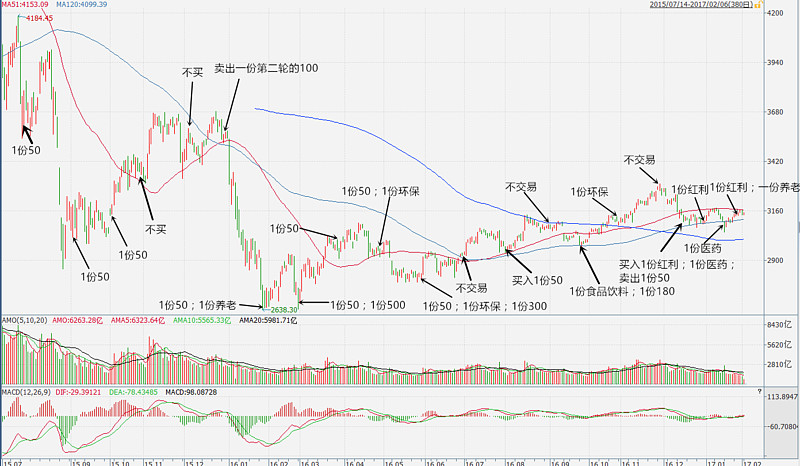

<h2>一、估值与低买高卖相结合（2017-02-06）</h2>
计划所有买入的 11 个品种到底是如何在同期指数下跌 30% 的时候全部盈利的？

进一步，是如何做到所有 30 多次买入，只有 1 次浮亏的？

答案都在这张图上。几个注释：

不交易、不买：到了交易日的日期，选择不交易。

图中不含恒生、债券、石油、DAX。因为这是A股沪深300 K 线图。

我相信这个图会对很多朋友有帮助的。记住，所有的决策都是在后面的 K 线没有走出来之前进行的决策。认真看看，会发现很多有意思的事情。

比如，哪些时候是不买不交易甚至卖出？哪些时候是买多份？当时当然是不理解，事后看呢？

PS：因为上证50走势远远强于沪深300，所以第一次的买入也早已盈利了。

原文发表于雪球：《<a href="https://xueqiu.com/4776750571/80805764">估值与低买高卖相结合</a>》
<h2>二、下跌过程中缓慢布局才是最佳选择（2016-01-18）</h2>
从估值的角度看，特大股票现在是在历史低位区域，中盘股票在十年平均，比五年平均稍高。小股票不用说了。

综合来看，等权 800 跌到历史最低估值区域大致还有 30% 多的跌幅。现在 500、800 都是 30 多倍。 不懂技术，乱画线。从支撑线来看，基本上也是相同区域。

当然，这里说的是大底。能到当然是最好，不过，得之我幸，不得我命。到不了就开始涨也没什么好说。所以下跌过程中缓慢布局才是最佳选择。

「任何位置买入」或者「持有所有现金等大底」都是值得商榷的。

无它，概率尔。

原文发表于雪球：《<a href="https://xueqiu.com/4776750571/63755569">下跌过程中缓慢布局才是最佳选择</a>》
<h2>三、结合指数的相对历史低估、绝对低估和其他特性（2018-05-31）</h2>
总是有人把指数投资的相对历史低估与绝对低估割裂开来。要么只看历史相对，要么只看绝对低。

我说句煞风景的话：远未够班。

你看相对，军工相对不高，你敢买吗？60 多倍？

你看绝对，绝对多少是低？10 还是 20？是香港、上证50的 13，德国英国的 17、18，是标普和 300 的 21 还是纳斯达克的 25 印度的 27？又或者是中概互联的 30？你连历史都不看，凭什么审视未来？

相对+绝对就够了吗？券商相对绝对都很低，你买了还不是咔咔咔赔钱？

不看成长吗？不看行业特性吗？不看强弱特征吗？

非黑即白的思维非常可怕，更可怕的是言行不一，知行不合。

你好好感受一下。

原文发表于雪球：《<a href="https://xueqiu.com/4776750571/108084617">结合指数的相对历史低估、绝对低估和其他特性</a>》
<h2>四、我们任何的买入，都要以估值为基础（2020-08-15）</h2>
很多朋友都记得我之前微博上说，要把之前的一份内部投资笔记在公众号公布的事情。原来想每天公布一篇，后来因为各种原因耽搁了。但这件事还是要做，择日不如撞日，今天就先贴一段吧。以后有机会就贴一段，也不是特意挑选的，就是找资料的时候随手翻到觉得还可以就会放上来，希望对你有用。

这篇文章是 2017 年 1 月 12 日写的。下面选取的是其中比较重要的一段。里面大致的概括了我对仓位控制的一部分依据。注意，只能说是一部分。因为仓位控制虽然与全市场整体估值有一定关系，但不能完全机械应用。比如上升趋势、下降趋势，以及具体到你个人的因素等，都会对仓位有不同的影响。

另外，文中对于配置品种的描述，我现在也有了新的思考与结论。但为了保持原汁原味，暂不作修改。以后有机会再阐述。

但无论如何，我相信下面这段文字会对你有很大启发。
<blockquote>
原文发表时间：2017 年 01 月 12 日
</blockquote>
很久以前，我们简单地将A股历史估值分为 8 个估值带，每个估值带对应不同的买入卖出额度。然而这还是不够精确。我们继续开发出了五年、十年百分比这个概念。这个数据的引入，可以说将我们的定期投资提升了一个档次，与资产配置融会贯通起来。

这里，再次简要的介绍一下定期买入的原则。

首先是确定仓位。仓位的确定是看全市场估值。要综合全市场 PE、PB 和加权 PE 五年、十年数据。对于计划来说，大的原则是：100% - 现处百分位，得出应该配置多少仓位。这是适合一般投资者的。

比如说，现在全市场估值是 75%，那么 100 - 75 = 25，则一般投资者应配置 25% 仓位。对于计划来说，用得是更加保守的一种算法：在现处百分位还在 50% 以上的时候，配置仓位减半。

那么，上面的公式就变成：(100 - 75) / 2 = 13%。也就是在历史 75% 的时候，配置 13% 仓位。当现处百分位回到 50% 附近，则迅速将仓位补足到接近 50% 的地方。比如可以补到 40%～45%。随着估值继续下降，则完全按照 100% - 现处百分位的仓位配置。到了 35% 以下，则将这个数字艺术性地放大。比如在历史 30% 的时候，应该配置 70% 仓位，但可以在这个时候加大投入，配置 75% 乃至 80%。

也就是说，<em>在 100% - 现处百分位这个公式的基础上，估值高的时候保守配置，估值低的时候激进配置。</em>

这是仓位配置，那么，配置什么品种呢？这个无所谓。如果你对股票有兴趣，有研究，可以去买股票。什么股票都可以。不想买股票就去买指数。买什么指数应该一目了然：跌破双均的指数。

跌破双均是个基础，你还要考虑的是相关性问题。比如配置过多 180、50、红利就不行。OK，举例来说。这个月我们一定是要买的。为什么，全市场到了 75%，我们的计划A股仓位明显不够。那么，买什么？红利当然最低，但有两个问题。

第一，与 50、180、300 相关性较高； 第二，没有与之前的买入拉开幅度。

这十几年投资指数，我有一个特别深刻的总结。那就是，<em>如果你想要自己的成本低，千万不要在某个高位大量重复买入一个指数。这样，会让你未来的降低成本之路非常非常困难。</em>

一年多前，有大 V 说要定投「波动性大」的创业板。我当时就表示不认可。如果创业板这样的极度高估指数，在某个高位震荡一两年，那么投入的大量资金可以说将套牢很多年。这个套牢，是很难用未来低位的投入将成本拉低的。一年多过去，如果真的定投了创业板，那么未来可想而知会比较凄惨。

所以，<em>我们任何的买入，都要以估值为基础。</em>

好了，相信今天的更新会让你感到过瘾。你终于相信，「免费 + 高质量 + 每天更新」不可能三角是真的不可能！

办不到的事情，我、办、不、到！

原文发表于公众号：《<a href="https://mp.weixin.qq.com/s/9B0ezUYByWeTm0UVKkFE5w">填坑：仓位控制及主动基金</a>》
<h2>五、普通价值、极有价值、钻石价值区域（2017-12-21）</h2>
考虑到明年 4、5 月份就要公布今年年报以及明年一季报，叠加目前下行趋势明显（不是 19 也不是 28，而是整体），根据我的计算，A股整体已经即将要进入一个我自己定义的「价值」区域。

从目前位置继续向下，分别是「普通价值」以及「极有价值」区域。其实下面还有个「钻石价值」区域，但那个区域过去 23 年只在 2008 年 10 月出现过，我们就不去考虑了。

在普通价值区域，大部分指数投资的筹码已经可以布置下去了。动能惯性问题，也许还会继续下杀，但涨/跌风险比已经逆转，不能太过保守。但是会留一部分在极度价值区域买入，还会有一部分机动部队。

无论普通价值还是极度价值，买了之后也许会跌，但都是输了时间不输钱。其实投资不就是这样吗，低位买入，死死拿住，如果有疯狂的人来接盘就给他们，没有就一直拿着。

说到底，也就这么点事儿而已。

原文发表于雪球：《<a href="https://xueqiu.com/4776750571/97859989">普通价值、极有价值、钻石价值区域</a>》
<h2>六、指数估值和估值百分位策略（2018-02-08）</h2>
2015 年我在雪球公布自己的指数估值以及估值百分位策略以来，从未见过有人这样分析。

时至今日，大概数一数，已经有 38 个公众号、17 个网站和 8 家基金公司提供这样的数据了。

你如果说这个没用，那就是睁眼说瞎话，我账户里这些年靠这个赚到的钱也不答应。但你如果只靠这个投资，未免就有些图样了。

不学习历史当然无法判断未来，然而只学习历史恐怕也没什么好结果。

横向、纵向、相对、绝对……哪个考虑不到都要吃苦头。

为什么我这么说，因为过去十年，我吃过无数苦头，总结了无数经验，才能建立一个相对完善指数估值以及相应的投资策略体系。

很多事情，不是回测能够得到答案的。

更何况，有些数据根本就不可信任。比如在中证1000估值在 50 倍以上的时候，就有人说是历史最低估值。没错，那是因为他的历史太少。

类似的谬误会导致指数投资越来越偏离正确的方向。

更多的的东西不能再说了，好东西复制成本太低。不过还是希望大家都能认真思考，开拓、创新，真正发展出更有新意的东西。

原文发表于雪球：《<a href="https://xueqiu.com/4776750571/101271505">指数估值和估值百分位策略</a>》
<h2>七、历史估值和无风险收益率的关系（2016-08-25）</h2>
现在的情况真的和 2002 年太像了。

注意 2002 年十年期国债市盈率（橘黄色）与估值的对应关系，再看现在。有一个共同点都是前一年股市疯涨估值疯狂后，利率水平大幅下降，全市场估值再度疯涨。A股有史以来仅此两次。这次之所以没有像 2007 年一样一路下去，固然有某些资金维稳的原因，无风险利率不断下降也有很大的关系。（2007 年底债券收益率高到做梦都会笑醒）

然而，未来呢？除非你和 2002 年一样把十年期市盈率打到 45 以上，也就是十年期收益率接近 2.1，估值恐怕会再次疯狂到 60。否则，呵呵。央行重启十四天逆回购就能吓得市场喝一壶。一个字，脆弱。

PS：这不算发图，只是讨论一下历史估值和无风险收益率的关系而已。

原文发表于雪球：《<a href="https://xueqiu.com/4776750571/74003272">历史估值和无风险收益率的关系</a>》

本文章所载信息仅供参考，不构成任何投资建议。如转载使用，请参考 <a href="https://youzhiyouxing.cn/agreements/ARTICLE_REPRINTED">《文章转载声明》</a>。

