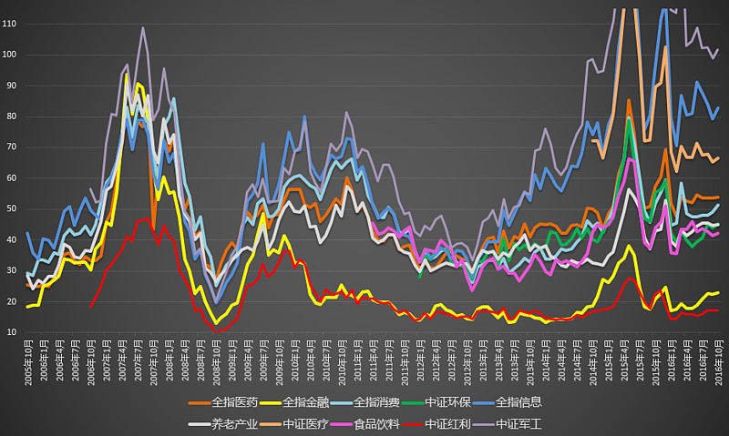

<h2>一、A股到底贵不贵？（2016-10-21）</h2>
A股到底贵不贵，每天被争论。甚至很多价投都意见不统一。

其实真相就是下图。

这个市场的估值分化，过去二十年前所未有。这也是为什么 2015 年股灾前大部分价投没有卖出，因为他们手里的东西并不太贵。这也是为什么今年很多好公司好股票能走出新高，而指数依然萎靡不振。

分化得太严重了。这个市场上有 100 倍的军工，80 倍的信息、创业，也有十几倍的 50、红利。

贵还是不贵，见人见智。多福。

原文发表于雪球：《<a href="https://xueqiu.com/4776750571/76413894">A股到底贵不贵</a>》
<h2>二、收盘进入过去十年估值最高 10% 区域的指数（2015-12-22）</h2>
12月22日收盘进入过去十年估值最高 10% 区域的指数是全市场 PE 、中小板 PE 、创业板 PE 、全指医药PE 、全指信息PE 。

一个指数的估值是否进入过去十年最高 10% 区域，具有非常非常重要的意义。<em>通常情况下，某个指数进入过去十年最高 10% 区域，就是本人清仓区域。</em>

以今年为例，医药、消费、沪深300、深证100、创业都是在五月进入该区域；环保、中小、全市场是四月进入该区域。<em>一旦持有的指数进入这个死亡区域，速速离开是上策。</em>

全市场 PE 过去十年最高的月份分别是（时间顺序）：
<ul><li>
2007.4
</li><li>
2007.5
</li><li>
2007.7
</li><li>
2007.8
</li><li>
2007.9
</li><li>
2007.12
</li><li>
2008.2
</li><li>
2015.4
</li><li>
2015.5
</li><li>
2015.6
</li><li>
2015.11
</li><li>
2015.12
</li></ul>
需要关注的是全市场 PB 数据。距离十年最高 10% 区域还有一步之遥。

现在大指数估值不算极度高估。尤其上证50，低于五年、十年平均。恒生则更低。

原文发表于雪球：《<a href="https://xueqiu.com/4776750571/62255265?_t_t_t=0.08185836137272418">收盘进入过去十年估值最高 10% 区域的指数</a>》
<h2>三、历史上值得注意的全市场加权估值点（2016-07-08）</h2>
最新研究成果，贡献给各位朋友。做个参考，不一定准。

从全市场加权估值（非市值加权，外部综合经济数据加权）来看，A股历史出现过 4 次大顶，分别是 1996、1997、2000、2007、2015。这三次大顶的高度几乎完全一致，超过 45 的区域，神奇。

大底则不完全相同。2005 年之前大底只是 30。2005 年之后的大底全部在 20 左右或以下。分别是2005、2008、2012。2008 比较特殊，杀的太厉害，居然杀到了 15 左右。

熊市反弹点基本在 30。98、03、09、10、1509、1603……（先锋队抢粮食的位置）

熊市反弹压制点基本在 40。97、02、0802、1512，以及，这次？

所以未来只可能有两种走法，第一种是到了 40 附近开始歇菜，继续熊市。第二种是强悍地超过 40 继续再来一次 45，历史上只有 2000 年那波实现了。其它到过 45 之后无一例外是杀到 20 附近才算结束。

到底会怎么走，各位恐怕有自己的判断。但无论如何，如果真有一天疯狂地到了45，别怪我没提醒你，那是最后的机会，不跑，未来五年 80% 以上的人投资收益率都会非常令人失望。

现在是多少？37。

原文发表于雪球：《<a href="https://xueqiu.com/4776750571/71537828">新成果可以参考一下</a>》
<h2>四、综合外部宏观数据加权的A股全市场估值图（2016-10-12）</h2>
昨天收盘后，综合外部宏观数据加权的A股全市场估值图。

月末计算首次突破 37。有心的朋友应该记得，40（去年12月底）就是危险区域，45（去年 5、6月；2007 年 10 月；1997、2001）不跑会被打的亲妈都不认识。

这个位置，比五年平均高 26%，比十年平均高 21%，处在过去五年最贵的 86.6%，过去十年最贵的 84.1%。

有人因为上涨欢欣雀跃，而我感到奇怪的是，难道不应该是下跌才应该高兴，能买到便宜货，买到便宜货，长期来看收益才会高吗？

如果是因为满仓，因为上涨感到高兴，看看全市场估值图，能涨个 15%，20%？这点收益相比下跌可能带来的损失，值得满仓？

如果真的敢涨 20%（全市场类指数），我坚信股灾又会以一种新的形式出现在大家面前。

原文发表于雪球：《<a href="https://xueqiu.com/4776750571/75873929">综合外部宏观数据加权的A股全市场估值图</a>》
<h2>五、A股历史上四次全市场 PE 跌破历史平均（2015-09-04）</h2>
截至上个交易日，全市场 PE 已经仅比历史平均高不到 5% 。当然，比 5 年、10 年平均还要高十几个点。

本人水平一般，不懂什么国家大势，也没有什么大局观。就简单说说从历史看，全市场 PE 跌至平均后会怎样发展。

全市场 PE 的历史平均值，从 2004 年开始，就稳定在 40～45 倍之间。那么我们就把 40～45 倍 PE 作为过去 20 年中国股市平均 PE 值。

从 2000 年开始，全市场 PE 有两次跌破历史均值后迅速反弹，但最终大幅下跌。有一次跌破均值后连反弹都没有，一路暴跌。

这三次的共同点是，<em>全市场 PE 跌破均值后，中长期看没有一次停下估值下降的脚步，都会一路跌到历史大底。</em>

不同点是，两次反弹后的下跌，都是至少十几个月的漫漫熊市。而那次一路暴跌的，只用了几个月就开始了又一次小牛市。

下面，详细列举这四次全市场 PE 跌破历史平均的情况：

<em>第一次：2003 年 7 月，全市场 PE 跌破 45 倍。</em> 2003 年 10 月开始反弹，至 2004 年 2 月估值见顶，之后至2005 年 7 月估值见底。反弹顶部距大底耗时 17 个月；

<em>第二次：2008 年 3 月，全市场 PE 跌破 45 倍。</em> 唯一的一次全市场 PE 跌破平均后一路暴跌。2008 年 10 月，PE见到中国股市历史最低点。跌破 PE 后耗时 7 个月见底。

<em>第三次：这次是围绕历史均值最复杂的一次。</em> 2009 年 7 月，PE 跌破历史平均，至 2009 年 9 月见底反弹突破历史平均。2010 年 5 月再次跌破历史平均，一个月后见底再次反弹。2011 年 3 月第三次跌破历史平均，一路不回头跌至 2012 年 11 月大底。耗时 19 个月。

对未来的启示：

现在，全市场 PE 再次跌入了 40～45 倍的历史平均区域。从历史经验来看，有大概率在这个区域进行一次甚至几次的大震荡。短线高手将在这个区域如鱼得水，资产大幅增长。这个时间，会长达半年到一年。之后，会进入至少十几个月的寻底之旅。

小概率，会像 2008 年一样直接寻底。这样我们痛苦的时间会短很多，便宜货也真的够便宜。

总而言之，<em>不主观预测，仅从历史来看，历史 PE 均值是一个很重要的节点。</em> 在这个节点上，多空力量可能会有一次短时间的平衡。

一家之言，不喜勿喷。

原文发表于雪球：《<a href="https://xueqiu.com/4776750571/55890635">以史为鉴，可以知兴替</a>》

本文章所载信息仅供参考，不构成任何投资建议。如转载使用，请参考 <a href="https://youzhiyouxing.cn/agreements/ARTICLE_REPRINTED">《文章转载声明》</a>。

