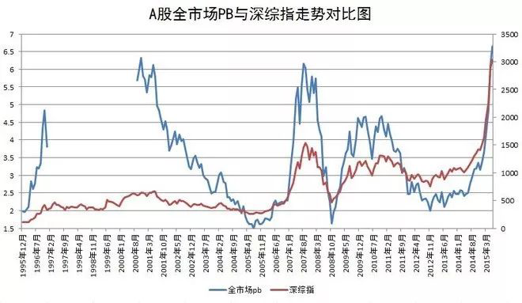
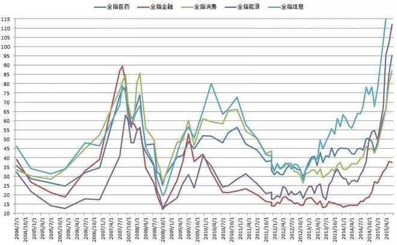
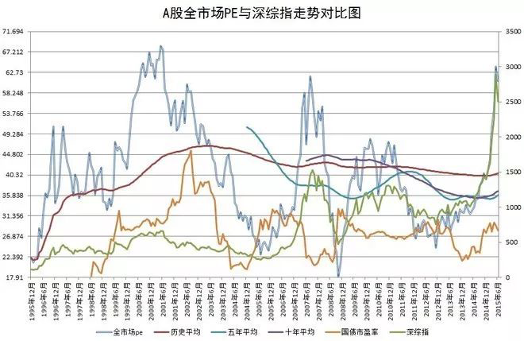
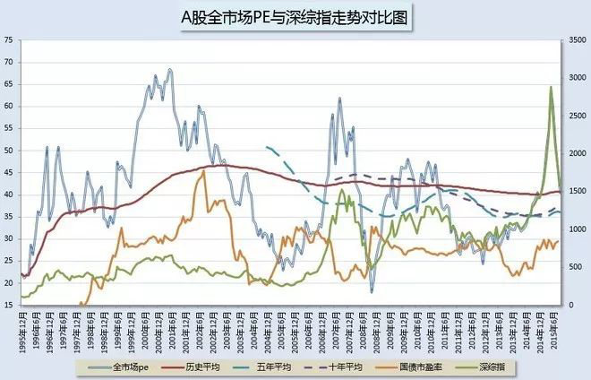
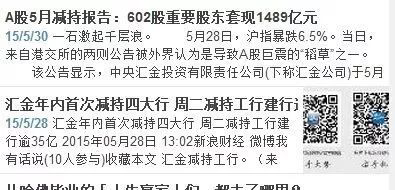
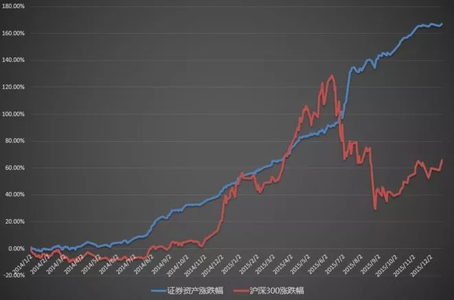

<blockquote>
2019 年 2 月 6 日首发于公众号。
</blockquote>
今天这篇回顾系列中所选的，基本是 2015 年的文章。2015 年对于A股来说，是个极其不平凡的年份。一直到今天，也依然有很多人低估了它的重要性。

那是一个疯狂的牛市。正如昨天所说，这一波牛市的起点并非 2014年，而是 2012 年底。从 2012 年底到 2015 年最高峰，创业板综指整整涨了 674%，涨幅甚至已经远超 2006～2007 年的特大牛市。

那是一个疯狂的牛市。两融余额超过 2 万亿，场外配资数万亿。在 4 月，全市场估值突破 50 倍，在6月，全市场估值已经到了骇人听闻的 70 倍，达到A股历史最高峰。创业板估值120倍，传媒估值 170 倍，军工估值 200 倍！两市成交量屡次突破全球股市历史纪录。无数股神风起云涌，无数散户和机构拿着钞票加着杠杆冲了进来。

疯狂、梦想，混合着夏天炙热的味道，在空气中弥漫。

然后，是崩塌。

潮水退去，谁在裸泳？十几次千股跌停，无数股票腰斩腰斩再腰斩一直到四年后依然在新低。无数账户爆仓。很多人锒铛入狱。

那是一个疯狂的牛市。有人进场买单，有人悄悄离席。

那场疯狂的牛市中，我完整地记录了全过程。同时，不断发布数据阐述这疯狂有多么反常与可怕。可惜，在这些文章下面，充满了批评、谩骂和讽刺。人性的从众、贪婪、丑恶，暴露的淋漓尽致。每次回去看，你都会有很多新的感悟。

幸好，在那场疯狂中，我们赚到了足够的利润，拿着宝贵的现金，毫发无损的安然离场，等待下一次机会的来临。

2015 年牛市顶部文章时点与 K 线图
<h2>一、进入死亡之顶的前夜，有序撤退</h2><h3>1. 且行且珍惜（2015-03-17）</h3><ul><li>
融资额超过1.3万亿；
</li><li>
整体市盈率超过46倍；
</li><li>
创业板市盈率超过75倍；
</li><li>
成交量不停的创造世界历史记录。
</li></ul>
股票，在他们眼里，只是赌博的筹码，没有任何价值可言。

有人说，股市上赔钱的人很值得同情。

但其实，贪婪、无知、恨不得把宇宙所有的钱都赚进自己口袋的人不需要任何人的怜悯。

当然，有些人并不贪婪。但可惜，他们缺少一种非常珍贵的能力。

那就是，无论外界环境如何变化，都应该坚持心中的那个标尺。用它来衡量人世间的人、物、事。而不是随波逐流，人云亦云。不是跌到谷底匆忙流着眼泪斩仓，也不是涨到顶峰咧着嘴继续买入，继续幻想 5000 点、6000 点，甚至 10000 点。 且行且珍惜。
<h3>2. 不玩了。关注A股的同学近期不必来这了（2015-04-02）</h3>
明天清仓。不玩了。为啥？PB 破 5 了。

当然，ETF 计划部分依然留着，有点打新门票留着。

有多少钱，不赚了。这里也会有一段时间不再谈论A股。

祝福你们。巴菲特与你同在。 PS：绝非投资建议，再次重申，这里是记录本人投资心得的地方，有对有错。对的时候多，错的时候少。但也有错的时候，所以，别跟。切切。
<h3>3. 即将进入死亡之顶（2015-04-13）</h3>
全市场 PB 5.5 倍，死亡区域。

我无法想象未来会有多么惨烈。

真的，不能想象。
<h3>4. 迎接「伟大」牛市（2015-05-19）</h3>
1995 年至今，全市场股票的市净率超过 6 倍的情况，只在 2000 年与 2007 年出现过。

由于本人只统计月末市净率，所以 6 倍以上的时间，在 233 个统计月中，一共是 4 个月。分别是 2000 年 10 月和 11 月；2007 年 8 月和 9 月。

今天收盘，这个数字已经到了 5.99 倍。

本人非常激动，A股迎来了真正的大牛市。大师们说，6000 点、10000 点不在话下，这样看来，历史的 6 倍 PB 魔咒就让它见 中国人，中国梦！

市净率看不到 10 倍，绝不卖出。（会有人看不懂这篇文章的真正意思吗……）

<h3>5. 写在这个伟大的日子（2015-05-26）</h3>
投资整整 12 年。经历过多次凋敝的萧瑟，经历过多次亢奋的喧嚣。

但今天，是我从未见过的景象。今天的疯狂，已经远远超过 2007 年！

接下来要发生的，人类证券史上也许没有发生过。

我非常期待。

伟大中国，伟大的梦。我已经完全看不懂。

我在印象笔记中，收藏了最近半个月很多有意思的新闻。来帮助自己在未来的某一天，好好回忆这一场狂欢。

今日点评

在 4 月，我已经把除了计划外的仓位卖得七七八八。也许你看着K线图很不懂为什么那个时候会卖掉那么多筹码。我只告诉你，当时全市场估值 50 倍。现在呢？是 23 倍。我只是做了一个理性的人应该做的事：低买，高卖。看起来，4～6 月最后疯狂的利润我没全拿到。谁能想到，世事轮回。2007～2008 年的一幕再度重演。天道酬勤，属于我的真正大餐在 2 个多月后开席了。
<h2>二、我们正在创造历史——图解 201506 估值</h2><blockquote>
2015 年 6 月 3 日 首发于雪球。
</blockquote>
写在前面：先说几句废话吧，毕竟有些东西一定有人问，评论里一一回复不现实。不回复又显得不尊重朋友们。

<em>第一，用 PE 和 PB 判断估值准确吗？</em>

虽然在我们对A股 20 年，以及对美股将近 40 年的回溯中，单用 PE 或者 PB 两个因子做为量化投资个股能够取得一年 70% 多，三年 80% 多几率战胜市场的好成绩，但我个人认为，用市盈率或者市净率来投资个股，并非好的策略。

<em>净资产高的钢铁股，与亏损的京东如何放在一个范畴里估值？这是不合理的。所以，我反对只用 PE 和 PB 对个股估值。</em>（BTW，最好的投资策略，是三因子选股。估值、价格动量、盈利性三类各取一个因子组成模型，这里也用不到 PE 和 PB，现金 ROIC、自由现金流价格比等因子更好用。不展开说）

但是，放到全市场就完全不同了。对于整个市场来说，京东也好，钢铁也好，都只是一小撮。用全市场的 PE 和 PB，对整个市场估值，有助于理解我们现在是处在危险的悬崖边，还是安全的广场上。毕竟，对于处在投资迷雾中的我们来说，24 小时都是黑夜。整体贵还是便宜，是我们头上那盏救命灯。

<em>第二，知道全市场的估值有什么用？</em>我是投资股票又不是投资整个市场。

原因有二：首先，我们的主要投资方向是 ETF。投资 ETF 最关键的就是知道市场或者行业估值如何，才能决定是大买、小买还是持有或者卖出。其次，覆巢之下岂有完卵？您真以为牛市里面您赚的是头脑的钱啊。牛市里赚的是胆子和耐心的钱。到了崩溃那天，胆子和耐心是好事还是坏事还真不好说。

<em>第三，为什么你的数据和交易所公布的不一样？</em>

简单来说，等权。就是这个结果了。交易所把银行的利润摊到所有股票头上，您觉得合理可以继续参考。我们认为，不合理。

好了，该说的说完了。开始上干货。欢迎理性讨论，欢迎不同观点，无脑喷子一律拉黑。

1995 年至今，全市场 PE 与深综指对比

不多说了，孱弱的 2007 年已经被远远地抛在了身后。中国股市历史估值极限 2000 年在向我们招手。牛市真棒。

1995 年至今，全市场 PB 与深综指对比：

关于 PB，上次贴出后，有朋友说，是不是因为最近上了很多创业板的股票，PB 高，再跟以前对比不合理了？我想了想，有道理。（你看，我就是这么从善如流）毕竟 2012 年 PB 并未降至前两次最低的 1.5 倍，而是刚刚破 2 就反身向上。于是，我们重新计算了创业板开板以来的 PB 数据，去掉创业板数据后，结果依然是……历史新高。以底部 PB 高于以往 0.5 来计算，历史最高的 2000 年 11 月 PB 是 6.33，那么这次 6.8 左右应该是历史高点。昨天收盘是 6.64。与 PE 一样，还差一点，牛市好棒！

分指数 PE

（创业板其实是 105，我实在不想调坐标。亮点是港股，一万年 15 以下）

分行业 PE

昨天看有朋友说，哎呀现在太贵了，买点医药安全点。我只想说，亲，医药历史最高是 2007 年 77 倍，现在 95，能有多安全啊？15000 点的医药指数，也是醉了。对了，信息指数的 PE 这里看不到，我还是不想调坐标了，数值其实是 186。金融依然不到最高。难道是等着牛市尾巴再补一刀？

好了，行文至此，感觉有些兴奋。我们在见证A股的历史。写帖子的我，看帖子的你，还有几千万股民。我们一起，在见证这场史无前例的，冲破地球局限的，黄金钻石大牛市。早上看见有人预测 30000 点，心中更加激动。

有人说，赔钱不是最大的风险，牛市不赚大钱才是最大的风险。我陷入了深深的思考。。

让牛市来得更猛烈一些吧。毕竟提示风险在牛市没有什么卵用还会被当成 SB，只有振臂一挥大喊赚钱才会喜闻乐见，我懂的。

PS，利益相关：已买入有看空期权性质的A类。大盘下跌我会盈利。所以，本文极度不客观，请各位自行甄别，切切。
<h3>今日点评（2019-02-06）</h3>
全市场估值是我判断市场的一个重要数据。在我的投资体系中，有很多判断市场状态的数据，它就是其中的一个。这篇文章是 6 月 3 日发布。同日，创业板综指达到它的疯狂顶峰，轰然崩塌，至今三年多过去，下跌 68%，依然毫无反转迹象。八个交易日后，沪深300见到史诗级大顶，雨打风吹去。第一轮股灾正式开场。

然而，最有意思的并不是数据，而是人性。得益于关注我的人越来越多，我能够更加直观的感受到群众的情绪。群众在那样的气氛中，会找到无数理由说服自己继续玩下去。对于不同的声音，要么嗤之以鼻，要么破口大骂。

那时候，我的脑海中，经常会出现一个电影般的画面：一个理性的人极力阻拦人群走向深渊，却被人群砍成了肉泥。
<h2>三、投资分级 A：宁拿 25% 收益哭，也不在万点牛市笑</h2><blockquote>
2015 年 6 月 15 日 首发于雪球。
</blockquote>
伟大的中国股市正在将牛市继续向前疯狂推进。

以上周五收盘价计算，我们计算的沪深两市全部股票（不含创业板）等权 PE 为 72.64，已经远远超过 2007 年最高的 61.3 和 2000 年的 67.11。

我们不去讨论估值是否合理，也不去讨论牛市是否还能继续。本文的中心思想是，如果你觉得现在股市风险很大，那么现阶段投资什么是可以有的选项？

我们的建议是：分级 A 类至少应该在你的资产配置中占有一席之地。

<em>第一，首先，做个简单的科普：什么是分级 A 类？</em>

非常非常简单的陈述，什么是分级 A： 基金公司发行了一只基金，然后将它拆成 A 类和 B 类。B 向 A 借钱，年息 5% 左右（每年有变化）。然后，B 类投向某个指数。这样，显而易见的是，A 约等于一只债券，而 B 则变成了一个初始杠杆为 2 倍的杠杆基金。

<em>第二，为什么说在现在这个时点可以配置它？</em>

基金公司在发行分级基金的时候，设置了「上折」和「下折」条款。即，当某只分级基金涨至某个高度，或跌至某个低点的时候，母、A、B三个基金都按照净值进行「归 1」操作。

正是由于这个归一的条款，现在 A 类基金有了不错的配置价值。

举个例子，今天两市最好的可以预期下折的 A 类是 150259 重组A。它的现价是 0.766。如果未来牛市不再，重组指数跌幅超过 38%，那么这只 A 类可以预期的价格至少是 0.94。那么它的的收益率将是：（0.94 - 0.766）/0.766 = 22.72%。

这样的收益率，在熊市中，是非常值得考虑的。那么，如果它对应的指数跌不到 38% 呢？

这么说吧，重组指数一共有 165 只股票，亏损的股票有 58 只；市盈率 50 倍以上的股票有 96 只；30 倍以下的股票只有 4 只。如果这样的指数跌幅还不到 38%，那么您真的不需要考虑重新在魔幻主义的A股建仓了。

另一个角度，即使股市不跌，您也不会像卖空了股指期货一样损失重大。每年您都可以拿将近 7% 的利息。

<em>第三，风险有多大？</em>

银华稳进 150018 是现存时间最长的 +3% A 类。它最低的价格，出现在著名的九三零股债双杀日。那天，它的价格到过 0.731。之后就一路向上。如果以这个价格为底限的话，上面说的重组 A 的极限跌幅应该在 4.59% 左右。以 4% 的风险，换 23% 的收益。这件事能干吗？

一定有同学问，如果跌破 0.731，不是损失就更大了？

长期来看，A 类由于年年在 B 类身上吸血，它一定会有下折的那天。同时，它是债券，长期看一定一路向上。具体走势，可以去看看 150018 的 K 线。短期如果跌破历史最低，那就是真正的钻石坑，如果有幸见到那天，在未来的熊市中您真就可以笑傲江湖了。

另外，从历史上看，150018 最低价格为 0.731，最高价格为 1.051，平均价格为 0.9289。这三个数字仅作参考。

<em>第四，现阶段哪些 A 类值得购买？</em>

我们认为，现阶段值得购买的分级 A 类基金，一定是有以下特征：

对应指数极度高估，下折可能性很大； 折价率很高，下折的时候能吃到不错的收益。

在这里，我们推荐几只我们认为还不错的 A 类基金。注意，由于近期基金公司疯狂设立 A 类基金，导致几乎每天都会有更好的 A 类出现。

所以，以下推荐仅是值得配置的一部分 A 类。未来也许有更好的。所以，不要一下满仓，分步建仓。

*推荐的 A 类名单（以 2015-06-15 收盘价格）

非常推荐：
<ul><li>
150259 重组A
</li><li>
150233 传媒业A
</li><li>
150173 TMT 中证A
</li><li>
150194 互联网A
</li></ul>
谨慎推荐：
<ul><li>
150235 券商A
</li><li>
150275 一带一路A
</li><li>
150279 新能A
</li><li>
150277 高铁A
</li></ul><h3>今日点评</h3>
分级 A 神话终于要上演了。当无数人憧憬一万点，甚至有大 V 喊出三万点的时候，我已经坐上了分级 A 的这趟财富快车。这趟快车如此之快，甚至远超我当时的想象。我原以为一年才能实现赚到 50% 的目标，两个月后市场就交到了我的手中。

看过昨天文章的朋友都会懂，2015 年分级 A 这样在股灾中一天赚 10%，一周 20%，两个月 50% 的经历，绝非偶然。分级 A 在 2015 年也绝不是一帆风顺。在上半年，它曾经大幅下跌，甚至到了 6 月也曾大跌。正因为有了 2011 年的经验，我并没有在很多人「觉得」它已经有投资价值的时候杀进去，而是在 0.7 的疯狂价格全仓买入。

我永远都会记得 7 月初那个分级 A 全部跌停的中午，我是如何动用了所有账户上所有的资金，甚至动用了一切能用的杠杆，借了所有能借到的钱，买入那些被已经毫无理性的人卖出的分级 A。

在分级 A 为我们赚到巨额利润的时候，分级B已经让很多人倾家荡产。2012 年底，我们买分级B赚大钱。2015 年，买分级 A 又可以赚大钱。<em>我坚信，这个世界上没有坏的品种，只有坏的交易。</em>
<h2>四、不要急于抄底；成功投资者应该具备的素质</h2><blockquote>
2015 年 6 月 19 日、26 日首发于雪球。
</blockquote><h3>1. 真正正确的姿势（2015-06-19）</h3>
今天雪球的今日话题有个标题是：新手入门买入的正确姿势。里面很多精彩文章，我一篇都没看。

因为我觉得在上证、深证连续暴涨两年；中证500、中小板、创业板连涨 3 年；医药指数连涨 4 年的时候，新手的买入姿势只有一种：不买。

为啥呢，前面写过一个帖子《A股是个聚宝盆》，很明白，这种时候买，五年亏损的几率是 100%。当然历史不一定会完全重演，但这个历史数据已经很明显的表达了一个信号，连续大涨后你再来，就是买单而不是吃肉。

那么什么时候买？连跌两年的时候。那时候买，5 年年化（每年收益率）最高能到 45%，平均能有 30% 多！

当然了，我说这句话，99% 可能并没什么卵用。哪个新手能等几年到熊市？

所以，继续以不正确的姿势嗨起来吧！
<h3>2. 本周全市场 PE 数据解读 + 成功投资必备的四个素质（2015-06-26）</h3>
先说两句前几天买的 A 类。

如事先预想，高铁 A 和 TMT 中证 A 即将下折。但我想道路依然曲折，也许还有下跌，但不到目标价位绝不放手。好在大家账面都有了十几个点的盈利，波动一下也无妨。虽然收益率不多，但在股市崩盘的时候有这样的成绩，足以欣慰。还是那句话，A 类赚不到 25% 以上，不会回来买股票。好在现在 A 类多，吃了一个可以去买下一个。来来回回的吃。

写在前面的几句废话，朋友们不想看，可以直接拉到下面看干货： 我不知道在雪球的几千位关注我的朋友们，有几个人在我像祥林嫂一样每周絮叨两次估值的帖子中有哪怕一点点触动。

<em>进雪球的时候，起了现在这个 ID，是因为中国股市从出生那天起，就是大多数人的绞肉机。70% 的人必然会在这个地方赔钱。每个人都不相信自己在那 70% 里面，可惜，很可能，你就在里面。</em>

<em>「拯救世界」，这雄心太大，并不能实现。并且，别人赔不赔于我又何干？</em>

<em>原因是，我相信因果与轮回。这是很玄的事情，但我信。我相信也许你帮一个人，对你这辈子不会有任何影响。但你帮了 10 个人，100 个人，你的人生会更好。这不是玄学，我相信这是科学。</em>

中国股市，总体来说，没有价值。没有价值的原因，是估值恒时高估。就是说，大多数时间它总是很贵。很贵的东西，你买了再想赚钱，就变得不容易。在 2000 多家公司中，我相信，多说了，有 200 家很有价值。其它的终将灰飞烟灭。即使你没打算拥有它十年，但你只要买了，你就应该知道，它随时会价值回归，也就是，跌回它应有的，很低的价格。

我希望你手里没有这样的股票。

问题是，在这样的市场上，为什么还有人赚钱？<em>相信我，在投资这项长跑运动中，真正能顺利通过终点的，一定有这样的特点：思想独立、坚韧、好学、有慧根。</em>

他们占据了赚钱的人里面大多数。另外一小部分，是通过各种机缘，赚一票就走，再也不回来的人。

说了那么多，意思其实是：

<em>如果你没有独立思维，就会跟着别人买卖，对一件事没有自己的看法，全都是听别人的意见；</em>

如果你性格冲动，涨的时候生怕少赚钱，在一年涨了 200% 的时候义无反顾往里冲。跌的时候痛不欲生在跌了 70% 以后割肉；

基本不看投资书籍，看的话，也从没看过金融史，概率论或者国外金融研究家、投资家自己写的书；

面对嘈杂的噪音，不能判断哪些声音才真的对自己有用，看到真正有用的东西完全意识不到。

那么，请赚了钱就走。不要在赌场长期呆着，否则，买单的一定是你。

废话说完，干货上场。

首先，全市场 PE 依然高企，只比上个月低。中小股票依然下跌空间巨大。

各指数近三年 PE 走势：与上图结论一样，中小股票只比上个月低，继续无视。非常有意思的是上证 50 和 180。虽然价格比当时高，但估值已经跌到了去年 12 月的水平。距离三年平均也只有 30% 多的溢价。考虑到近三年上证 50 低估，是不是可以说，上证 50 可以开始建仓了呢？呵呵，下个月 ETF 计划会有分晓。

分行业看：最爱的医疗和消费行业终于从 90 倍以上的 PE 低下了高昂的头。但可惜，离历史平均还是有 60% 的溢价，坚决不出手。金融指数包括金融和地产，也比历史平均高 30%。

重点来了：信息指数依然是 135 倍 PE，比 55 的历史平均还是高 147%！大家知道这意味着这么吗？意味着我们手里重仓的 TMT 行业 A、互联网 A、传媒业 A 的下折几乎是板上钉钉。准备好开启盛宴吧。

总结：没什么特别要说的。大股票渐渐进入可以开 x 的区域，中小股票依然遥遥无期。

请把自己想象成一个拿着武器的猎人，不要随便扣动扳机，只要你开了，必须一击必中。否则，别说打不到最最肥美的猎物，还有可能成为野兽的晚餐。

耐心是一种美德。
<h3>今日点评</h3>
第一轮股灾后，很多侥幸逃出的人都在商量该如何抄底。没错，在熊市中，其实真正买在顶部的人很少。更有很多人及时逃出。但是，他们的牛市思维让他们再次杀了回去。就此，一去不返。

到了这个时候，很多对估值体系嗤之以鼻的人已经开始将信将疑。其实人类对于自己不熟悉的，或者与之前脑海中深深烙印不同的东西，通常都会有所抵触。但我建议，各位请保持开放的心态。看到新的理念，新的思维，先不要急于否定。好好研究研究，是否有道理，再下结论，真的比较好。
<h2>五、看图算命</h2>
我不懂什么波浪理论，也不懂什么技术指标，但是从 PE、PB估值图看，说一个很多朋友会不愿意接受的现实：

过去 20 年，估值高点出现在 2000、2007、2015 年。也就是说，<em>大家想再次见到这两年这样级别的牛市，要至少七年，至多 8 年才有可能出现。</em>也就是，至少是 2021～2022 年才会有这样的大牛市；

过去 20 年，估值低点出现在 1995、2005、2008、2012 年。分别隔了 10 年、3 年、4 年。如果把 2008 年界定为一个不正常的走势（包括 2009 年的反弹），那么两个熊底之间至少要相距 7 年。也就是说，2019 年可能才会出现历史大底。距今 4 年。

特别情况出现在 2008 年。2007 年的大顶和 2008 年的大底只隔了一年。这是因为跌得太猛了。这也就是说，如果现在这波下跌非常快，非常急，能跌到整体 PE 25 以下，那么以上推论全都不算数。<em>PE 25 就是中国股市大底。</em>但如果跌两天涨一天，慢慢阴跌没有止境，那么下次大底要等三、四年是大概率。

这是有行为学基础的。因为，毕竟，新的韭菜需要时间成长。80 后这波收割地差不多了，一部分 90 后已经入套。再过 3、4 年，90 后大部分甚至 00 后一部分就长得差不多可以收割。

总而言之，<em>急跌，大底很快。阴跌，大底要 3、4 年。</em>

还幻想牛市继续的，先想想谁会来给上面套的几万亿筹码解套再说吧。

PS：以上推论不考虑注册制等改革。有些改革会摧毁之前所有的经验。

原文发表于雪球：《<a href="https://xueqiu.com/4776750571/51490786">看图算命</a>》
<h3>今日点评</h3>
根据历史数据，我在 2015 年提出，下一次大底也许在遥远的 2019 年，下次疯狂牛市也许在 2021～2022 年。现在，2019 年已经到了，今年会见底吗？咱们拭目以待。
<h2>六、赚够了</h2><blockquote>
2015 年 08 月 25 日 首发于雪球。
</blockquote>
今天，出掉了一部分分级 A 类。，基本可以算是清仓。这一个组合，从 6 月中旬建立到现在，收益 42%，最后还是没有达到 50% 的目标，让大家见笑。

卖出的原因，与 4 月份清仓 A 股一样：赚够了。留点钱给别人赚好吗？全世界的钱不可能让你一个人赚。即使「踏空」，那又如何？

实盘中，A 类大概是 80% 多仓位，所以总收益应该是在 35% 左右，加上上半年的 30% 多股票收益，今年总收益大致是 70% 左右吧。

这个收益率，与很多高手比真的差很多。好在本人从不与人相比，小心翼翼从市场上赚属于自己的那份钱。今年不出意外，也将是连续第十个赚钱的年份。每年绝对资产增加，个人感觉是最重要的。

毕竟，复利才是王道。

现在，帐户里将近 80% 都是现金。兵马齐备，粮草充足。

凛冬已至，准备迎接未来数月内的那场终极大战。

从今天全市场 PE 和 PB 看，照今天和昨天这样跌，用不了一周就可以到超级大底。会选股的可以找到很多 3 年内 10 倍股。不会的买杠杆 B 和 ETF 也会有牛逼的收益。现在的问题就是，能这样跌一周吗。WTF！开眼了。
<h3>今日点评</h3>
两个月，50%。感谢分级 A。让我把 4～6 月的利润全部拿了回来——在两轮股灾中。

我的投资思路，以及做人的理念，有一个共同点，即，不求尽，我从来不想把所有钱都赚尽。留一个铜板给别人赚，留点利润给别人。就像我喜欢有机会就给大家发红包，喜欢做点小慈善，别人送我什么奖品之类的我也喜欢转送给大家，其实都是同一个道理：只有懂得放手，才能活得更久。活得越久，我的复利反而会越多。

万事不要做尽，自会有天助。
<h2>七、暗黑之夜下半场已然开启，但光明就在那里，不远不近（2015-09-15）</h2>
首先，我们回顾一下A股市场的大底和大顶是长什么样子：

2012 年 11 月大底，见《<a href="https://youzhiyouxing.cn/n/materials/732">05 2015 年哈迪斯之顶</a>》的第三节。

2015 年 6 月大顶，见《<a href="https://youzhiyouxing.cn/n/materials/733">06 别做盛宴之后买单的那个人</a>》的第二节。

今天收盘，全市场PE长这样：

2015 年 9 月 15 日，A股全市场 PE 在十个月前突破历史平均后，再度跌入历史平均以下！这意味着，中国股市近 20 年，第四次熊市下半场已经开启，而真正的大机会已经能遥遥相望。

不胜唏嘘。

只用了短短的三个月，A股市场用 16 次千股跌停，把哈迪斯之顶的估值打到了历史均值以下。

冥王一出，收割一片。

我们，安然无恙。

是时候整装待发了。

今日，在我们长年追踪的17只指数中，已经有8只跌入区间平均以下。其它的除了中小、创业、信息，都已经几乎跌破均值。

但是，朋友们，再好好看看估值图。在跌破历史平均之后，真正的漫漫长夜下半段才刚刚开始。距离真正的大底，还有至少 30% 的空间。时间、空间，必然有一样让大多数人备受煎熬——要不然就是暴跌，要不然就是阴跌。也许中间会有很大级别的反弹，但想要到底，注定还要有一段曲折道路要走。

然而，我们不会盲目的死等大底，贪心的想一举灭敌。我们会在有优势的时候，派出我们一批批的少量生力军，将敌人有生力量一股股的消灭。

最终，在天时、地利、人和完全具备的时候，百万雄师鼓角齐鸣、摧枯拉朽，完成资产配置，等待再一次飞跃！

未来美好，道路注定曲折。坚定信心，胜利就在前方。
<h3>今日点评</h3>
9 月，派出一支先锋队，抄底抢粮食，为了后面的漫漫寒冬准备给养。这个位置后面发生了什么，可以对照上面的K线图。

原文发表于雪球：《<a href="https://xueqiu.com/4776750571/56436606">暗黑之夜下半场已然开启，但光明就在那里，不远不近</a>》

八、2015 年 5、6 月，聪明钱在干什么？
<blockquote>
2015 年 09 月 29 日 首发于雪球。
</blockquote>
大概从 10 年前起，就开始有意识的收集市场极端情况下的新闻报道。

真的特别有意思。

最近几年，用的是印象笔记，也挺好用。

下面，把我收集的几条 5、6 月份的新闻报道给大家分享一下。

我们一起看看，当绝大多数人疯狂的时候，聪明的钱在干什么？

有意思吗？

以后有机会把历次市场底部的新闻也贴出来。更有意思！

现在的情况，我是没兴趣收集那些每天抄底的新闻的，意义不大。
<h3>今日点评</h3>
无数人举着现金，加着杠杆冲向那些一百多倍估值的垃圾时，有些人已经悄悄撤退。从 GJD，到大股东，再到我这样「胆小」的投资者。这些人带着巨额的利润，在盛宴上悄悄离席，将买单的任务交了出去。

这一切，在公开信息上你都可以看到。对于信息的敏感性，我建议各位一定要努力培养。很多公开的信息里面有宝藏。关键在于，你是不是能客观、理智的去看。

很多人不是看不到这些信息，是他们已经被贪欲冲昏了头脑，不愿意相信理性。就像现在，太多人已经被恐惧吓破了胆，做出未来一定会让自己后悔的动作。

一切都是轮回。
<h2>九、熔断前，提示风险被群嘲</h2><blockquote>
2015 年 11 月 30 日～12 月 28日首发于雪球。
</blockquote><h3>2015-11-30</h3>
提示风险，并不会受到欢迎。

甚至会让很人觉得厌烦。

这大概就是宿命。

<h3>2015-12-02</h3>
沪深300指数涨幅 2.12%。上证50涨幅 2.5%。

两市只有不超过 200 只股票涨幅超过 2.5%。

你的股票涨了多少。：）

最后的疯狂来了。
<h3>2015-12-08</h3>
每天看着A股的起起伏伏，总能感觉到一丝秋意。

说真的，现在这个时点，几千万人的痛苦并未真正开始，然而，他们还活在梦中。
<h3>2015-12-23</h3>
场内现在还在疯狂炒 80 倍中小、100 多倍创业的朋友，请记住现在这个时刻。未来某天——也许几天，也许几周，也许几个月后——如果你赔了大钱，不要埋怨任何人。

朝廷已经仁至义尽，用了几万亿帮你抬着，让你从容走路。你不走，未来再骂，就毫无道义可言。

也不要在明年 1.8 埋怨大小非、大股东把筹码都给你。经营企业 100 年才能赚到的钱，现在按下鼠标就赚到了，能怪他们吗？他们不是傻子。

谁也别埋怨。
<h3>2015-12-28</h3>
有些朋友现在对我的评价是：「为空而空」。

我送你们一张上周五的图。拿好，不谢。

PS：这个不算大招，主要是因为 PB 由于今年增发了一万亿，始终没有站上历史最高的前 10%。等到了那天，我好好写篇东西系统分析一下。这张图只是看看是「为空而空」，还是「因价值而空」。

<h3>今日点评</h3>
2016 年第一个熔断前，所有数据都预示着危险。我极力发出警告，告诫大家减持新政会带来意想不到的结果。然而我所收获的，依然是嘲笑、谩骂。几天后，全市场目瞪口呆——连续几天开盘半个小时，大盘熔断闭市。一个月，再腰斩。

我从不会被噪音干扰。因为我非常清楚，发出这些噪音的人，大概率终将是炮灰而已。

任何拿不出数据的论点，都是辣鸡。
<h2>十、感恩，2015</h2><blockquote>
2015 年 12 月 24 日 首发于雪球。
</blockquote>
2015 年终于要过去了。

想在雪球写个投资总结，算是对自己一年的投资经历做个记录。更重要的，是送给四万多关注我的朋友。

说起来 2015 年，在本人过去十二年的投资经历中，也并没有什么特别了不起的地方。虽然赚钱的绝对数额是创了个人记录，但幅度并不是最高。赚钱的那份喜悦也远远比不上 2006、2007 年。今年资本市场大幅波动，但见的和经历的多了，就会觉得，也就那么回事。
<h3>数据</h3>
今年的投资，总体上来说，本人还是比较满意的。老规矩，先上图。

本人几年前开始就有个习惯，会将每天的资产情况记录在 Excel 里。所以，在这里可以精确的以天为单位画出这张图。

很多朋友看到这个可能会笑出声来，这什么东西啊，这么大的牛市才赚了不到 80%。

是的，朋友，我知道人外有人，天外有天。我从不敢说自己是投资高手，这里只是记录一下自己今年的投资而已。

了解我的朋友可以从图上看出，本人是个言行一致的人。

从 4 月中旬起，也就是我在雪球发帖表明已经卖的差不多的时候起，资产增加的幅度就比之前平缓了很多。到了 6 月大牛市的顶端，大盘暴涨到 60% 的时候，我还在 30% 不到的地方徘徊……仓位太低了。

是的，太低了。你要问我，后悔吗？2015 大牛市 1～6 月，只赚了那么点？

我可以非常肯定的说：不后悔。因为，之后会发生什么，当时的我已经完全看到了。我真的害怕气球爆炸，是真的怕。我不想站在旁边，真的不想！

接下来，没什么好说。布局分级 A，股灾，资产飞速增长……

到 8 月底，沪深300年度涨幅变成 -10% 的时候，我的资产增加幅度到了接近 60%。

再之后，资产只是缓慢增加了十几个点。再度远远落后于沪深300，更远远落后于小指数。

这时候，你再问我，后悔没有重仓吃这一波吗？

我依然非常肯定的说，不后悔。

为什么？……

再放一张 2014～2015 的资产与大盘对比图

<h3>龟与兔</h3>
数据回顾完毕，谈谈今年的心得。

3 年前，在雪球发的第一篇帖子里，非常肯定的说过，第三次资产飞跃近在眼前。时至今日，本人可以对那篇帖子做个总结：我，做到了。

最近经常会看着上面的图，感觉自己好像龟兔赛跑里的乌龟。在兔子狂奔的时候，自己看起来又笨又蠢，爬得那么慢。但是，好在，就像那只乌龟一样，一步不停的向前爬。最终，看起来那么快的兔子终因后继乏力，在这场长跑中的这一段被我抛在身后。

投资是什么？投资是不是今天创业板涨了 5%，我的资产只涨了 1%，就郁闷的吃不下饭？投资是不是隔壁老王炒xx科技，赚了大钱而我没赚到难受得不得了？

我认为，并不是。

投资的意义，是通过自己的智慧、判断、经验、意志，最终使自己财富越来越多的一种手段而已。

我不会与任何人比谁赚得更多，我只知道，我的资产比去年更多，这，也就够了。
<h3>实力还是运气？诚惶诚恐，如履薄冰</h3>
在巴菲特几十年的投资经验中，收益率没有一年超过 50%。他的成功，完全靠的是几十年中只有 3 年亏损。虽然本人也做到了过去 10 年没有任何一个年度亏损，但面对 2014 和 2015 年这样的收益率，说实话，一个字，害怕。

害怕什么？

害怕的是，我真的有这个能力，两年赚 167% 吗？

这是能力还是运气？

冥思苦想，得出的结论是：至少，有一半是运气。

这份运气，是 2014 年重仓大指数，结果年末大幅被拉升的运气；

这份运气，是 2015 年7月满仓分级 A，没有发生拒赎的运气……

德不配位，必有灾殃。

在 2016 年，本人将更加小心，更加谨慎，绝不让任何人从我兜里把已经赚到的钱再掏走！
<h3>感恩，2015</h3>
感谢中国的资本市场。刚开始投资的朋友们，这个地方是能够让人实现财务自由的，这点，要坚信。

感谢雪球上关注我的朋友们。你们每天忍受本人的絮絮叨叨，也挺不容易。与你们交流，很多东西我会深受启发。

明年，希望都做得更好。祝赚钱，圣诞快乐。
<h3>今日点评</h3>
感恩那个大牛市。那是我财富再一次腾飞的基础。其实一切都不神秘，只要你足够冷静，理性，就能识别风险，做出正确选择。

从上面的资产走势图上你也可以看出，不发生大的回撤多么重要。当你的资产熊市不发生大回撤，牛市大致跟上，产生的复利会非常可怕。记住，今年赚 40%，明年赔 20%，长期看，收益率比不上每年 6%。这就是数学的力量。牛市中，某个时间段跑输别人，天不会塌。证券市场始终会奖励理性的人。记住这一点，非常重要。

没有人是神，谁也不会吃到每一个波段，买在每一个最低，卖在每一个最高。追求这些完美的人，都会以惨败告终。而相信存在这些神话的人，也将为幼稚买单。

我们谁也做不到完美，但我们可以做到极大概率成功。资本市场是个有趣的地方：它不会因你是什么学历，什么相貌，懂不懂人情世故而决定你能不能成功。你只要战胜自己，就大概率已经赢了。

然而，这终将只能是少数人胜利的战场。不信，你可以试试给十位朋友普及正确的投资理念，看看有没有三位能接受？不会有的。

了解自己已经很难，战胜自己更是难上加难。

人这一生的命运，其实早已定了。

一切都是缘。

原文发表于公众号：《<a href="https://mp.weixin.qq.com/s/1qlQPTi6-VkBX4bNOSL1wA">春节特辑 DAY3：别做盛宴之后买单的那个人</a>》

本文章所载信息仅供参考，不构成任何投资建议。如转载使用，请参考 <a href="https://youzhiyouxing.cn/agreements/ARTICLE_REPRINTED">《文章转载声明》</a>。

