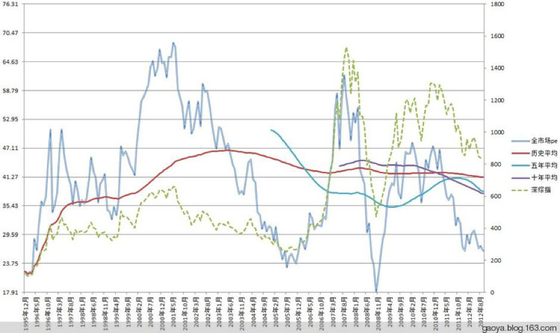

<blockquote>
原文发表时间： 2019 年 02 月 05 日
</blockquote>
在 2010 年以前，我留下的文字主要在 space ，然后 space 关门前，整体转移到了博客。其实那时候写的东西，都是生活中的一些小事，投资只占了很小的比例。由于并未有意识的正经写关于投资的东西，也并没有留下太多有价值的文章。

2010 年开始，正式的写一些投资方面的文字。会把一部分研究的成果拿出来与大家分享。由于本人性格的原因，并不喜欢喧闹嘈杂，所以也是没有去热闹的新浪博客，而是找了很冷门的网易博客记录。导致一直以来，也只是几百位亲朋好友以及偶尔路过的朋友会留下看我的东西。

现在你在几乎任何与基金投资有关的网站上，都会看到所谓指数「估值百分位」这个指标。但你在 2014 年以前，一定没有在我博客之外的其他地方见过这个东西。甚至你不会见到根据指数估值投资指数的理念。为什么会这样，你阅读过今天以及明天的这两篇推送就会懂了。

很多人认为上一轮大牛市起始于 2014 年，终于 2015 年。

其实不是。

在 2012 年底，A股第三个历史大底正式确立。那之后，除了一两百只大蓝筹外，其它的中小股票走出了一波荡气回肠的超级大牛市。一直到 2014 年 7 月，大蓝筹才开始启动。最终，中小股票的代表性指数创业板综指，从 2012 年底到 2015 年中，整整涨了 670%。

2012 年底到底发生了什么？为什么A股第三次大底确立在那里？今天我们选了一些当时的文章，可以部分解释这个问题。

没有经历过 2012 年的朋友，可能对当时的历史并不熟悉。2006 到 2007 年，A股走出了一波超级大牛市，两年多涨了 600%。2008 一年跌了60% 多。2009年又是一个翻番的小牛年。行情持续到 2010 年中开始崩塌。到了 2011 年，股债双杀，令人窒息。2012 年延续跌势，跌到 2012 年底最终见底。

在上面这几年中，我本人的经历大致是这样：

2007 年的大牛市中，2005 年 1000 多点入场的我在 4000 多点已经因为估值过高逐渐退场，失去了后来涨到 6000 点的利润。然而塞翁失马焉知非福，由于 2007 年底满仓当时收益率已经到了 9%+ 的债券，在大熊市 2008 年不仅毫发无损还赚到了 30%。

当年年底再买入赚到大钱的一些品种（过几天会详细说）。在 2010 年，我已经卖的差不多，手上全是现金。（上面说的所有东西都有公开记录。没有公开记录的东西再辉煌再成功我一个字也不会说）

等了三年后，终于在 2012 年底，做了下面这些事情。在目前这个节点，回顾当时，其实真的非常有意义。

因为我可以告诉你，现在，比 2012 年底还要便宜一些。

今天，我们一起回到那个改变未来的时候，那个如今天一般进入钻石底的过去。

<h2>一、封闭式基金已经进入极度可投资区域</h2><blockquote>
原文发表时间： 2008 年 8 月 16 日，网易博客。
</blockquote>
封闭基金，这个姥姥不疼，舅舅不爱的品种，折价率再次整体到了 30%。

这是什么意思？就是 1 块钱净值，只卖 7 毛。

那么是说你买了封基等于打 7 折买他们持有的股票吗？

不是。而是折扣更低。

现在封基仓位普遍在 6 成左右。就是说他们的净值里面，有 40% 都是现金。那么，很有意思的事情出现了：

封闭式基金 1块钱的净值里面，有 4 毛钱现金和债券，6 毛钱股票，而它的交易价格是 7 毛。

那么你用 7 毛买一份，等于说其中的 4 毛买了现金和债券，用剩下的 3 毛买了价值 6 毛钱的股票，（折价）50%。

现在点位是 2800 点，如果你认为还不够低，那么 1400 点呢？

你买封闭基金，就是买了 1400 点的股票。

不懂就算了……
<h3>今日点评：</h3>
这篇文章说的是老封基。现在市场上已经没有老封闭式基金，有一些新型的，三年定期开放那种。也会有折价，当然折价率远没有当时夸张。

我个人认为，如果封基跟踪指数能力强，在非常便宜的时候，还有折价，那就相当值得关注了。在上文中提到的位置买入封基，最终都有数倍的利润。关于封基的问题，之后会详细讨论。
<h2>二、赔死你们这些抢反弹的！</h2><blockquote>
原文发表时间： 2011 年 08 月 09 日，网易博客。
</blockquote>
我非常生气。非常，非常。

好不容易，等了那么久，好不容易开始跌了。

可是，每天都有抢反弹的 SB 前赴后继地冲进去。

有些人赔钱，真的一点都不可怜。可怜之人，必有可恨之处！

贪婪、愚蠢、短视！

就因为你们，我们到现在连一次 4 份的买入机会都没有！

就因为你们，不管多么烂的股票都能上市，因为你们去打新！

就因为你们，不管多差的股票都不会退市，因为你们去炒重组！

就因为你们，不管多 SB 的公司都能有 80 倍 PE，因为你说它们是成长股！

我们攥着满把的现金，到现在也只能买到 48% 的仓位。我们想满仓，可被你们这帮 SB 抢反弹抢的总是跌不下去！

放眼望去，满地 7、80 倍 PE 的股票，都是被你们这帮 SB 炒起来的！
<h3>今日点评：</h3>
可以看出当时比现在还年轻的我可以说是暴躁本暴了。之所以这么狂暴，是因为确实很急。市场被不理智的人买到非常贵，让A股仓位很低的我毫无买入机会。没有买入机会就赚不到钱，所以真的很着急。

有人经常会问我，为什么总是那么淡定。你瞧，我也不总是那么淡定。只是后来我知道了，一切都不用急。是我的，就是我的，跑不了。
<h2>三、资本市场真相记录：股民号召股民清仓销户，永远退出股市</h2><blockquote>
原文发表时间： 2011 年 09 月 24 日，网易博客。
</blockquote>
1、「不申购中国水电，不再打新股，让A股圈钱功能破灭，保护我们小散的利益。」统计发现有近 6 成股民满仓被套，有 58% 的人认为管理层滥发新股是导致股市下跌的主因。阴跌让许多股民身心备受折磨，福州一些股民号召股民清仓销户，永远退出股市。

<a href="http://finance.sina.com.cn/stock/stocktalk/20110924/144210534846.shtml">近六成股民被套伤不起 股民号召销户退出股市</a>

2、受美元上涨、基金清仓以及近期全球金融市场动荡加剧的影响，纽约商品交易所黄金、白银、白金期货价格 23 日连续第二个交易日暴跌，金价当天创下 5 年来最大单日跌幅。23 日，交投最活跃的黄金期货 12 月合约每盎司下跌 101.9 美元，收于 1639.8 美元，为 8 月 1 日以来的收盘价新低，跌幅为 5.9%。

3、基金业今年已缩水 1320 亿 三季度亏损成定局。业绩惨淡，发行却又不知收敛，让投资者对于基金信心丧失殆尽。Wind 统计数据显示，自今年三季度以来，基金发行明显陷入困境，7、8 月的平均发行份额仅分别为 10.5 亿份和 11 亿份。以今年 8 月 12 日认购截止的金元比联保本为例，该基金募集目标为 20 亿份，但实际认购份额却只有 2.78 亿份，成为了今年最为「袖珍」的基金。而从基金市场的整体规模来看，Wind 统计显示，在发行了 150 余只新基金以后，基金市场的总份额从去年年末的 24228.41 亿份增加到了目前的 24706.22 亿份，仅增长了 477.81 亿份，也就是说，每发行一只新基金，基金市场的规模增长仅为 3 亿份左右。而总资产规模来看，却从去年年末的 24972.49 亿元缩水到了目前的 23652.93 亿元，缩水达 1320 亿元。

<a href="http://finance.sina.com.cn/money/fund/20110923/064810528304.shtml">基金业今年已缩水1320亿 三季度亏损成定局</a>
<h3>我的点评：</h3>
我热爱投资的原因，在很多年前是因为我发现我可以从资本市场赚钱。后来，慢慢的转变为，在资本市场，我可以看到如此多有意思的事情、有趣的人。

<em>在 2400 点叫嚷着销户的人，一定是在 3000 点梦想 4000 点然后满仓的人——不然他们不会如此受伤。</em>什么样的人可以在高位信心满满，在低位充满恐惧？我推荐大家看一本书，这本书的书名很好的诠释了这批人的特征——《乌合之众》。

我不知道看我博客的朋友，你们恐惧了没有。或者，心里是不是会有点慌乱？是啊，这个世界突然变得动荡起来——欧洲债务危机了，美国债务危机了，中国地方债也许有危机、高利贷必然有危机、各种各样让人害怕的事情发生——或者将要发生。美股大跌、欧股大跌、A股、港股、日股、韩股、债券、欧元、石油、黄金……它们都在大跌。我们的世界看起来将要发生一些大事，我们的财产将要灰飞烟灭。。

朋友们。这些都是真的。很多不好的事情已经发生了，并且，我跟你说，很多更加不好的事情未来还会发生。这些现在所有人都知道的事，不客气的说，几个月前，一年多前我已经很清楚地看到。我也写过太多博客表达了我的观点——我等的就是这一刻，我等的就是天下大乱所有人恐惧的这一刻！

如果没有那么多坏事，你会有机会在 2400 买股票吗？未来，你也许有机会在 2000 点买！这样的事情，如果没有危机，你会那么好运的碰到吗？我们常说，要在别人贪婪的时候恐惧，要在别人恐惧的时候贪婪。但是你有没有想过，为什么经历过那么多恐惧和贪婪的时刻，自己并没有像自己设想的，做得那么好？

没错。因为大众恐惧的时候，那一定是真的发生了特别不好的事。以至自以为理性的你也跟着恐慌起来了。我不想说更多，我只想告诉大家：如果你不能做到与众不同，请离开投资市场，把钱放进银行，这样比较安全。如果你总是涨起来就兴奋不停地追，跌下去就沮丧不停的卖，那么，神仙都救不了你。

我们的 ETF 计划，开始已经 1 年零 10 个月了。请大家再去看看置顶的 Q&amp;A ，现在看，是不是有些不一样的感觉？大家好好体会一下，为什么我让大家把每个月可投资的钱算做两份，为什么可以投入 44 份的情况下我们只买了 11 份，为什么总资产 50 份到现在只买了五分之一 ，为什么我说把钱存下来等你最落魄的时候让它来救你，为什么说应该越跌越高兴……好好体会一下，对你的投资生涯有莫大好处。

黄金价格跌到了 1640。前几天我写卖掉黄花鱼那篇博文的时候，金价是1875。离最高点只差 30 块。什么是别人贪婪时候你要恐惧？说真的，我恐惧了。我对自己的收益非常满足，我也对 2 年多金价涨了 3 倍感到恐惧。所以，我卖了。我也许卖不到最高，也许金价未来还要涨，但那已经不是我的了。有缘人得之。

我不信世界上有任何东西可以只涨不跌。长期来看，到现在为止，我对投资品的预测还没有出过差错——除了房地产。

现在发行一只基金只有 2 亿多份了。想想 2007 年的上投 QDII 几千亿申购，恍如隔世。但你该知道，看起来，机会真的越来越近了。
<h3>今日点评：</h3>
这篇不用多说。记录了临近底部的时候，散户朋友们在做什么。就像现在一样，你的朋友，你的亲戚，你的家人，都会告诉你，中国股市没戏了，有这样那样的问题。你看，并不止是今天，很多年前，以及很多很多年前，就是这样了。你不能要求每个人在黎明前都能看见光明就在不远处。毕竟，不是每个人手上都有一块走时精准的劳力士。

当时指数点位是2400，大多数人已经跌懵，而价投们早已经满仓。我在当时已经指出，2000点也会破，但不要在意。那才是真正的改变命运的机会。最终，真的跌倒了1900多点。而当时看博客的一些朋友，命运真的改变了。
<h2>四、再见，2011</h2><blockquote>
原文发表时间： 2012 年 01 月 03 日，网易博客。
</blockquote>
又到辞旧迎新的时候，照例要做总结。我自己有两个博客，一个是记录生活的点滴，一个是记录自己投资的思路。在这个投资方向的博客，就来大致总结一下 2011 年的投资历程。

2011 全年来看，印证了去年底，今年初的大致判断：由于估值过高，A股必定会有惨烈的一年。虽然我没想到惨烈到历史第三大熊，但方向的正确保证了资产没有受到熊市的摧残。

本人的投资理念，很多朋友已经非常清楚：股票投资、债券投资、指数投资与其它品种投资理念并不一致。总体来说是：

<em>1、股票投资：选择成长股、逆境转折股进行研究。</em>研究 ≠ 买入，买入和卖出一定严格遵循自己的一套判定趋势的方法，拒绝黑天鹅。当所选股票趋势向上转折时介入，向下转折时卖出。这时，需要的是成功的大概率，并不是不断抄底妄想买到最低，卖到最高。很多「价值投资者」的失败，就在于每次股票下跌都会忍不住加仓妄想买到最低点。结果公司、行业、市场发生变化，严重深套。当然，他们不会承认失败。错的都是市场，他们没有错。

<em>2、指数投资：有一种东西确实可以越跌越买，那就是指数。</em>公司、行业会出这样那样的问题，指数只要你买在低位，未来一定会赚钱。当公司风险、行业风险、管理层风险、产品风险全部没有的时候，你只剩下警惕的就是系统风险。而我们的方法，就是在低位开始买入，越低买得越多。然后在估值高位卖出，越高卖得越多。可以说，这样的思路没有任何风险（除非股市关门）。长期来看，我不信有任何投资人可以战胜这个理念。

<em>3、债券投资：我本人并不十分喜欢债券。</em>但债券却真真正正的在每个大熊市都给我带来了丰厚的利润，让我在熊市中能不受损失。我的理念是，当债券收益率高于8.5%的时候，买入一定不会错。

<em>4、其他品种投资：这一方面，只进行过黄金投资。成绩非常不错。</em>房地产？Sorry，我真的不懂。
<h3>本年度各项投资收益</h3>
1、股票投资：由于坚定自己的价值选股，趋势投资的思维。在股票下跌趋势中坚决不持有股票，今年基本上没有在股票上有损失。甚至在几个反弹中有不错的收益。现在也只少量持有招行等趋势不错的股票。本年度股票盈利 3% 左右。

2、指数投资：本年度严格按照 ETF 计划买卖（本人每份并不是 7000，而是远高于这个数字）。ETF 计划也再一次做到了在熊市中跑赢大盘，这一部分本年度大致亏损 15% 左右。但正如我所说，这部分亏损越大越好。我们有机会买入更加便宜的 ETF，在未来的上涨中也将赚得更多。

3、债券投资：本年度纯债、转债收益并不好。本年度投资的亮点是 A 类杠杆基。虽然还没分红，但现在大致收益在 10% 左右。最终的收益率也许还会增加。

4、黄金投资：本年中期卖出了持有 6 年的黄金，卖出价格离国际金价最高点只有 30 美元。总体收益 300% 多。年均复利 30% 以上，非常满意的结果。

综上所述，今年投资收益率大概在 4%～5% 左右。在一个熊市中，能够取得这样的成绩我自己非常满意。2011，再次是胜利的一年。

以上所有操作在本博都有实时公开记录，留待日后自己反复研究，也欢迎大家指教。

虽然胜利，但无疑还有些教训值得吸取。比如开始投资 A 类的价格有些高，以致后面虽然一路买入也只能把均价降的有限。再比如在 9 月底忽视了杠杆债基的巨额收益机会。以后还要对新产品做更加深入的研究。

回顾将近 9 年的投资历程，从 2004 年以后，就再无一年发生过亏损。诚然，自己对于风险的极度厌恶、对低风险产品的深入研究都有不小的作用，但不能否认的是，虽然不亏损，但在大牛市中，自己不能取得最好的收益。虽然 2008 年在指数下跌 70% 的情况下借助债券盈利 30%，但接下来的 2009 年指数上涨 100%，自己只能取得 60% 多的收益。所以，从 2009 年开始，本人加大了 ETF 的投资。宗旨是在熊市中允许适当亏损，牛市中一定跟随指数。如果在熊市中通过投资其他产品——比如今年——能够弥补指数投资的小量亏损，那就是更好的了。

开始在这里写博客两年多了，每年年初我都是极度悲观的。但今年，我不再悲观。

2012，也许会有大机会出现

这个机会，会改变很多人的人生。当然大多数投资股市的人依然在追涨杀跌中迷失自己。在也许的牛市中，会有无数新的股神出现。守住自己的那份财富，让它合理保值、增值，是我对博友们的祝福。

最后，祝所有人身体健康、新年快乐、2012 发大财！
<h3>今日点评：</h3>
这篇是 2011 年的总结。你会惊奇的发现，目前我们计划中持有的很多东西，那时候我已经有所涉足。我可以告诉你的，是与很多人只在书本上学习过资产配置不同，在我的投资生涯中，很早很早就开始将股票、基金、债券、黄金、QDII 等品种纳入投资范围。并且不断的在每个品种上进行或长或短的操作。经过几轮的实战，每个品种的特性我已经再熟悉不过。所以我们计划中这些品种全部赚钱，一点都不用感到惊讶。

在 2012 年初做的 2011 年总结的末尾，我预感到 2012 年将会有改变命运的机会。那将是一个让资产再次飞跃的年度。果然，2012 年成为A股第三次历史估值大底。

好戏即将上演。
<h2>五、 一字头后的市场数据——决战的号角即将吹响</h2><blockquote>
原文发表时间： 2012 年 09 月 26 日，网易博客。
</blockquote>
今天，A股正式跌破 2000 点。盘后计算 PE、PB，甚感欣慰。与君共享：

第一张图：

全市场 PE 在今天跌破年初低点，再创 2008 年 12 月以来新低！ 已经不到 27 倍。再跌 10%，就是 2005 年 PE 低点，考虑到环境变化，距离了历史大底 PE 下跌空间绝不会超过 20%。光明就在眼前。大家从图上可以看出，现在的 PE 不仅离历史平均，甚至是 5 年，10 年平均都越来越远，好戏要开场了。

第二张图：

今天收盘，没有任何指数 PE 在 30 倍之上。创业板 PE 跌幅尤其大。中证500逼近 25 倍，沪深300即将跌破 18！上证50不用说了，有史以来最低。

第三张图：

未来股票收益率在 2005～2008 年之后，再度逼近 4%。历史上第三次超过国债收益率。

不用说太多，对于我们来说，下跌就是最好的礼物。我们已经再度进入四份区域，八份终极区域指日可待。

厉兵秣马，枕戈待旦这么多年，

冲锋的号角快要吹响，再耐心的忍一忍吧！

PS：补充一句：PB 是 2.28。这是什么意思？意思是，再跌一跌，市场上大多数股票就要以不到 2 倍净资产交易了。2 倍净资产！这个数字在 2007 年是 6 以上。
<h3>今日点评：</h3>
2012 年 9 月 26 日，距离历史性大底还有 2 个月。正如标题所说，号角即将吹响。事后看你觉得并没什么。但当时面对的并不是历史，而是未来。你感受一下。

当时的 ETF 计划，依然比较粗糙。是将全市场估值区间划分为 8 个区域，买入，卖出各有位置。所以你看，早在十年前我就已经有了初步的指数买卖区间的概念，怎么可以说我是定投呢，我真的会生气的。

目前的计划，相对于当时，已经是 4.0 版。我自己的投资体系，投资策略，以及对投资的认识，依然在不停的前进和发展中。

很多朋友劝我今年不要把未公开的东西贴出来，为抄袭者做嫁衣。我有底气的原因，是我的自我更新，别人永远抄不到。
<h2>六、等了三年，终于进入A股第四次大底区域</h2><blockquote>
原文发表时间： 2012 年 11 月 23 日～12 月 3 日，网易博客。
</blockquote><h3>1. BDI 再回前期高点、PMI 重上50（2012-11-23）</h3>
这两个数据，一向与A股关联性很强。

现在的问题是，这两个数据已经反弹很多，A股却一直在寻底。A股在等什么？

催化剂？
<h3>2. PE/PB 跟踪更新帖（2012-11-26～2012-12-03）</h3>
一直在想，以什么来迎接再次到来的大底呢？就每次新低更新 PE/PB 吧。以后这个贴专门贴图。

<em>2012.11.26</em>

两市 PE/PB 再创 2009 年 2 月以来新低。

<em>2012.11.27</em>

今天，看着不断暴跌的中小板，没有等到 15:40 Wind上的数据计算结束，我就知道，这是伟大的一天。

我们等了 3 年，终于在 2012 年 11 月 27 日，等到了全市场 PE 降到了 25 倍以内，这就意味着，未来A股收益率 20 年内第三次超过了 4%。

我们等了 3 年，终于在 2012 年 11 月 27 日，等到了全市场 PB 降到了 2.05。只差一步之遥，就会进入 1996 年以来第四次大底区域。

三年，我们买转债、买金利、买A类、买债券、卖掉持有 6 年的黄金、定投 ETF、波段做杠杆……我们用尽了办法在这个高估的变态市场保住了自己的本金，在这个历史大底即将到来的区域，我们，即将重拳出击。

对，这个市场就是个变态的市场。因为这个市场只要你盘子小，无论你多贵都有人买。同样，你的盘子大，你再漂亮，也像麻风病人一样让人避之不及。面对这样的变态市场，我们是屈服，还是用智慧干掉它？

对于三十出头的我来说，过去十年在A股经历过 2 次财富爆炸性增长。第三次，已经不远。这也是在 40 岁之前，最后一次了。这一天，近在眼前！

我们谦卑的向市场先生学习，通过了「战胜贪婪」这门主修课。接下来，我们要考的就是「打败恐惧」这另一门主修课。

也许你周围有人告诉你，不要炒股，中国股票崩盘了，中国股票一辈子也不会好。我不反驳任何看法，这里的朋友都是理智的，我相信大家会做出自己正确的判断。

那一天，真的不远了。开心！

<em>2012.11.28</em>

没什么多说的，再次新低。PE 方面，上证50、180相比昨天几乎没动，中小创业飞流直下。

今天 PB 是 2.0014，大家一起见证历史吧。

<em>2012.11.29</em>

今天，对于 20 多年的A股来说，再一次进入了划时代的时期：两市真实 PB 再次进入 1（字开头）时代：1.97

在这个日子，废话不多说，一起回顾几个数据：

今天的 1.97，是 2006 年 4 月以来，第三低。（最低的两个月是 2008 年 10 月 1.64、11 月 1.96）

今天的 PE 24.17，是 2005 年 12 月以来，第四低。（最低三个月是 2008 年 9、10、11）更需要强调的是，2005 年 998 点 PE 还在 22.96，2008 年 1664 是17.91。

2005 年 998 和 2008 年 1664，PB 分别是 1.61 和 1.64。这两个数据出奇的一致。都将中国A股的估值底部定在了 1.6。这次还会是 1.6 吗？拭目以待。

1.97 距离 1.6 有多远？我们不能用指数跌幅来判断 PB 跌幅。但根据这两天的经验，从 2.15 跌到1.97 只用了 3 天。如果中小股票还是这样价值回归的话（不排除最后大盘股也加入杀跌行列），应该就很快。如果有反弹，那时间就很难测算了。

是快刀斩乱麻还是纠缠不清？个人观点，如果真的是熊市末端，一定是快刀斩乱麻。因为每次熊市末端一定是暴跌结尾。（2008 一个月 24%，2005 一个月 9%）。如果不暴跌，那很可能说明底部未到。悲催的A股投资者。。

现在我们要做的，是准备资金，研究品种，深跌买入，然后，把命运从自己手中交给上帝。

<em>2012.12.03</em>

全市场 PB 继续新低。2006 年至今只有 2008 年 10 月一个月比现在还低了。

全市场 PE 继续下跌，已经与 2005 年 998 估值相同。不过距离 2008 年 17.91 还有距离。

总结：大底还没到，可以开始慢慢买入。
<h3>今日点评：</h3>
等了三年。终于到了。没有什么人能体会我当时的激动心情。资产飞跃的机会再次来临。事后看，有如神助。

但其实，也许你并不知道当时的市场环境。我只能告诉你，全都是轮回。无论从估值、资金、投资者的信心来看，全都是如此。这就是为什么我要给这篇回顾起名「历史上的今天」这个标题的原因。
<h2>七、底部，开始用分级 B 加杠杆</h2><blockquote>
原文发表时间： 2012 年 12 月 05 日 、12 月 18 日，网易博客。
</blockquote><h3>1. 再说杠杆（2012-12-05）</h3>
前一篇分析了，在底部区域，什么品种可以取得大幅的超额收益，我给的答案是杠杆。

果然，今天杠杆爆发了。

鑫利、同辉、双力表现都不错，锐进、同瑞 500B 停。

给我印象最深的，还是 500B。由于昨天实际已经碰到 0.25 的折算价格，以当时 0.258 的价格买入，几乎是没有溢价风险，而收益无限的价位。当时我就在想，世界上真的会有奇迹这回事吗？

果然，世界上是有奇迹的。尤其是在证券市场。

这也再次说明，只要我们认真研究，耐心等待，证券市场总是会出现风险极低，收益极高的品种。有些品种，有些时候，其风险之小，收益之大简直让人无法置信。

比如今天我们看到的 500B，又比如也许几年后回头看的南山转债。
<h3>2. 现阶段持仓比例（2012-12-18）</h3>
前一段有朋友留言说想看看我最近的持仓，由于我的帐户分散，统计一次很麻烦，所以一直没有进行。

刚刚抽空具体统计了一下，如下图所示。

统计的时候有些惊讶，原来持有的杠杆已经超过 20% 了。需要反思是否过于激进。

<h3>今日点评</h3>
在底部我做了什么？80% 时间保守的我开始加杠杆。主要是通过分级 B。具体的操作过几天的文章里会有。人生能有几回搏？在做足安全措施的情况下，十年难得几次激进的我开始下重注。分级 B，这个 2015 年让很多人赔的倾家荡产的品种，在这里，开始了它的两年20倍之旅。

但是，请各位投资经验不足的朋友，一定要慎重上杠杆。这是双刃剑，实力、运气，缺一不可。我不希望给你一种错觉，即，只有加杠杆才能改变人生。

不对，只有理性才能改变人生。

原文发表于公众号：《<a href="https://mp.weixin.qq.com/s/c71hoFM9o_IvgMxCIIV5kw">春节特辑 DAY2：回到那个改变未来的今天</a>》
<h2>八、2 张图让你看懂中国投资者，争取每周更新</h2><blockquote>
原文发表时间： 2012 年 12 月 20 日，网易博客。
</blockquote>
中国的投资者非常有趣。

他们在每个大顶疯狂交易，在每个底部悄悄消失。

他们在大顶满仓，在底部卖出——没错，最近的 1949，20 万股民清仓离场了。

顺便说一句，类似的统计图我有 18 张。PE、PB、交易户、持仓户只是其中 4 类。每次看着这18张图，我都感觉很有意思。历史总是在没完没了的重复，重复的毫无新意。

PS：可以总结的模糊规律是：大级别的顶部需要 2500 万以上账户交易，小级别顶部要 1400 万～2000 万户交易。也就是等平常不看股票的上千万帐户开始炒了，大概顶部也就差不多了。还有，每次交易户数降到 600 万左右，就可能发生让人期待的事情。有意思。

<em>2012-12-26</em>：上周持仓账户再少 5 万。他们什么时候会回来呢……
<h3>今日点评</h3>
不多说，记录情绪。再看看今天的周围，是否非常熟悉？
<h2>九、再见 2012，我会怀念你</h2><blockquote>
原文发表时间： 2012 年 12 月 31 日，网易博客。
</blockquote>
我这 30 多年人生，最不喜欢的就是和别人一样。今天，很多人都在写总结，我虽很不愿意流俗，但为了如实记录自己的投资生涯，也只好打开编辑器开始动笔——好在，2012 是个不坏的年份。

忘了从哪年开始，我突然意识到证券市场的机会永远都有。今天、今月、今年的机会没抓住，毫无关系，明天、下月、明年机会会源源不断涌到你面前，只要你的青山还在，永远都会有柴烧。而且，我这里定义的「机会」，是我们可以发现的、不是事后才看出来的机会。

2012，有什么机会？

<em>年初：</em>4.5 份的、前所未有的买入 ETF 力度，正好先于上半年那波 20% 的涨幅，让我们结结实实买到了相对底部。

同时，更加关键的是，我们敏锐的察觉到了在那样的局势下，旧 A + 新 B 是多么完美的组合。我们锁定了新 B 中的同瑞 B 和鑫瑞，果断出手……之后发生的事情让人目瞪口呆，套利大军一周就将它们拉了 50% 以上。在高溢价的美好时光下，我们没有眷恋利润，毅然退出，吃到了大大的一块肉。

<em>年中：</em>新 B 结束了，旧 A 开始发力。我一直说，金利是我去年和上半年利润最大的来源。这一年多来，我已经忘了发了多少篇文章来表达对金利的喜爱。我真的无法理解，为什么这样一个债券+看跌期权的好东西，到期收益率会到 9%，市场怎么能如此疯狂？

价值，谁说价值无用？谁说中国股市做价值投资没有希望？在这个常年高估的市场上，确实总是会有一些非常棒的东西躲在角落等着我们去发现。慧眼识珠还是有眼无珠，全看我们自己。

<em>年末：</em>11 月开始，我发了 N 篇文章，跟踪估值接近底部的市场。每次市场向底部区域前进一步，我就会欣喜若狂的写一篇、再写一篇……正如我在 BTV5 说的，没有大跌怎么会有大赚？12 月 3 日，再次重金砸入 3 年来第二次 4.5 份，再次猛烈加仓 B 类。

2012，我们能发现的机会基本上都抓住了。这很让人欣喜——当一只大牛股的 K 线像喜马拉雅山一样出现在你面前时，你根本无需感觉可惜。因为那根本不是你的，它不属于你。但是，如果某样东西没涨之前你已经发现，却因各种原因犹犹豫豫没有买入，那你会不会有一种「自己是不可原谅的蠢货」这样的感觉？所以，当机会出现，好好再想几遍，如果确认自己没有错，那就出手。

机会抓住了，同样，有一些「失误」需要总结——总结这样的错误是可以避免的，还是再来一次我们也无法做得更好？

<em>「过山车」：</em> 各类股票类资产，尤其是 ETF 在 5 月没有卖出，导致了后来资产缩水。这是可以避免的还是不可避免？我现在思考，以我的能力，无法避免。因为当时估值依然在历史平均之下，没有理由卖出。再来一次，我们的 ETF 依然不会卖出。

但是，我们是否没有办法避免坐过山车？当然不是，我们的网格计划今后会帮我们平滑过山车的收益。长短结合，价值波动通吃的投资模型渐渐成型了。

<em>「金利归一后的利润」：</em> 相比过山车，对于金利没有吃到归一后的收益个人感觉非常可惜，也曾经深深反思到底是什么原因造成了自己错误的判断。但说实话，下次能否避免这样的情况发生，自己并没有信心。对于 A 类与 B 类的定价，也需要重新再思考。

另一件现时的我不愿意做的事，就是写自己的收益。无论是对于年度收益还是某只产品的利润。现在想想，2009 年每隔几个礼拜就公布自己持仓的上海汽车涨了多少，见证捷达变宝马的事情就觉得相当可笑……

但同样，这是年度总结，如实的记录会对自己的成长有好处，所以自己也如实的记录自己的收益：

2012 年度，本人在金融市场盈利 19.88%。其中 22% 是 12 月赢得的——没错，12 月初本人年度还亏损 2 个点……差一点就破了 2005 年至今没有亏损的真身……还好，记录得以延续。

贴张图，一目了然。10 月底开始看好A股，不断加仓 B 类是 11 月收益大幅跑输指数的根源。当然，也是 12 月大逆转的原因。

2 年，盈利 24%，跑赢大盘整整 40.05%，这样的成绩，能对自己有个交代吗？我只能说，我尽力了。

2012，我的投资世界基本就是如此。有成绩，有不足。尽力了，很满足。

2013，希望能继续抓住自己发现的好机会，也尽量不要犯些可以避免的错误。资产能够平稳、合理增长。

2012，即将过去，我，很怀念它。
<h3>今日点评</h3>
其实我的年度不亏损记录，在 2012 年就应该被打破了。只是那年 12 月暴涨，让我的年度收益记录由亏转盈。所以，其实亏不亏的，有时候也是运气，不用太看重这个。只要你知道，你做的事情大概率是对的就够了，赚钱不过是个时间问题。

这里大致记录了 2010～2012 年的投资历程。以及 2011 和 2012 年的成绩：2 年盈利 24%，跑赢大盘 40%。在明天的文章里，我们站在 2015 年的角度，回顾一下之后的几年。

那才是风起云涌，快意江湖的三年。

感谢资本市场。没有它，人生将缺少多少乐趣？

原文发表于公众号：《<a href="https://mp.weixin.qq.com/s/c71hoFM9o_IvgMxCIIV5kw">春节特辑 DAY2：回到那个改变未来的今天</a>》

本文章所载信息仅供参考，不构成任何投资建议。如转载使用，请参考 <a href="https://youzhiyouxing.cn/agreements/ARTICLE_REPRINTED">《文章转载声明》</a>。

