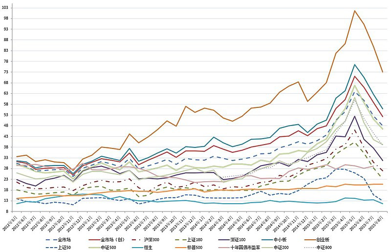
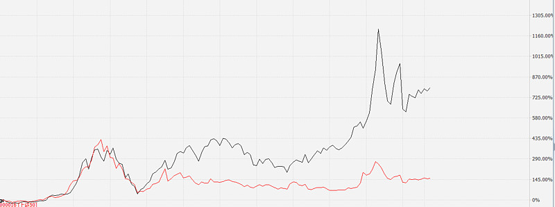
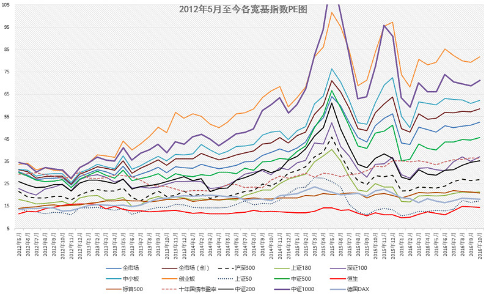

<h2>一、能买了吗？请看本周 PE 数据解读（2015-06-26）</h2>
首先，全市场 PE 。依然高企，只比上个月低。中小股票依然下跌空间巨大：

各指数近三年 PE 走势。与上图结论一样，中小股票只比上个月低，继续无视。非常有意思的是上证50和180。虽然价格比当时高，但估值已经跌到了去年 12 月的水平。

距离三年平均也只有 30% 多的溢价。考虑到近三年上证50低估，是不是可以说，上证50可以开始建仓了呢？呵呵，下个月ETF计划会有分晓。

分行业看：

最爱的医疗和消费行业终于从 90 倍以上的 PE 低下了高昂的头。但可惜，离历史平均还是有 60% 的溢价，坚决不出手。金融指数包括金融和地产，也比历史平均高 30%。重点来了：信息指数依然是 135 倍 PE ，比 55 的历史平均还是高 147%！！大家知道这意味着这么吗？意味着我们手里重仓的 TMT 行业A、互联网A、传媒业A的下折几乎是板上钉钉。准备好开启盛宴吧。

总结：

没什么特别要说的。大股票渐渐进入可以扣动扳机的区域，中小股票依然遥遥无期。

<em>请把自己想象成一个拿着猎枪的猎人，不要随便扣动扳机，只要你扣动扳机，必须一击必中。</em>否则，别说打不到最最肥美的猎物，还有可能成为野兽的晚餐。

耐心是一种美德。

祝周末愉快。

原文发表于公众号：《<a href="https://mp.weixin.qq.com/s/itliQ4Fcams8dGZV_lA6FA">能买了吗？请看本周PE数据解读</a>》
<h2>二、看图说话，明天能买了吗？（经网友提醒增加行业）（2015-07-02）</h2>

<h3>1. 这几张图，老朋友们都很熟悉了。</h3>
贴了快一年了。大家都说中国股市没有规律，但大家看看，没有规律吗？简直是比最规律的心电图都要规律啊。高点一样，低点也一样！怎么赚钱？找到规律，遵守纪律。简单吗？不简单！
<h3>2. 现在还贵不贵？</h3>
分大股票小股票。以 50 为首的大股票，涨的话根本也没怎么涨，所以离三年平均并不是很贵，大概多了 30%。而创业板从贵过平均 100% 以上，也跌到了 60%。中小、500 之流，只有 40% 了。（写到这里小激动）
<h3>3. 可以开始买了吗？</h3>
我实在是不想写，仓位太空的朋友可以买点 50 这句话。因为我手里还有 TMT 和重组两只分级 A 还没有下折，我希望可以一鼓作气跌下去。但客观地说，除非有低估洁癖的人，现在的 50 或者金融，估值不是特别贵了。空仓的朋友，买几个点真的不算过分。当然，真有能遵守纪律的，等到均值以下买，我更尊重您。铁血纪律才能铸就辉煌啊。另外，注意行业。金融只高 9%了！呵呵……
<h3>4. 手里有中小股票怎么办？</h3>
呵呵。不知道，真的。

PS：虽然图贴了一年，然而并没什么卵用。在雪球，创建半个月的A类组合收益仅仅只有 7.8%，居然战胜了 63% 的组合？这是什么意思？

有 50% 以上的朋友已经赔钱了，在 2000 点上来的大牛市中！50% 赔钱的朋友，您赚钱的时候会觉得，20%、30% 的年化收益率太低了，看不上。但赔钱的时候，想的肯定是：我能回本就好了。这才是最痛的领悟吧。

其实没关系，闻道有先后，一切会好的。

原文发表于雪球：《<a href="https://xueqiu.com/4776750571/50010394">看图说话，明天能买了吗？（经网友提醒增加行业）</a>》
<h2>三、不得不写的文章：批发干货与鸡汤（2015-08-25）</h2>
昨天市场继续暴跌，很多朋友在评论和私信中要求贴估值图。对于这个要求，一开始我是拒绝的……为什么？因为之前说过，不到历史均值不会再贴。但想看的朋友太多了，暴跌到现在很多朋友已经完全六神无主。

好，我就食言一次。

2015 年 8 月 24 日收盘全市场 PE估值图：

解读：

中国A股全市场 PE 自六月中创出 72 倍，月末 65 倍左右的创纪录高位后，哈迪斯如约而至～～弹指一挥间，血流成河。

昨日全市场 PE 47 倍左右，依然高于历史平均 40、五年和十年平均36不少。如果以历史唯物主义的观点来看，全市场 PE 想要与历史平均持平，还要跌 15%；而想要到达 25 以下的大底区域，还要跌将近 50%。

<em>在这里，我请有阅读障碍的朋友注意：我说的是 PE 跌幅，而非指数！尤其不是上证、沪深300这种被大股票把持的指数！估值不是指数，估值不是指数，估值不是指数！！！重要的事情说三遍！三遍！！！</em>

但是我请朋友们注意，非常诡异的事情是这个：

上证50指数的估值，已经几乎降到了3年最低附近。而中等以上规模股票的指数，却依然高高在上。

这，说明了什么？

说明了小股票贵？说明大股票便宜？

也许是这样，也许，这只是个表象。

便宜的，也许会变差，最终贵得离奇～～说明一点，我没有影射任何股票。因为，我谦虚地承认，我不懂股票，别喷我。我只是说，也许。你不会连一点点可能性都否认了吧？

原文发表于雪球：《<a href="https://xueqiu.com/4776750571/55241308">不得不写的文章：批发干货与鸡汤</a>》
<h2>四、全指信息再入历史最高区域（2016-03-27）</h2>
本微信公众号周二推出的读书文章得到了不少朋友的喜爱。这样，我想除了每周二会固定推送推荐投资理财类书籍的文章外，以后会两周一次为大家推送一张我挑选出来的估值图。

本人每天根据计算出的估值数据所制作的估值图大概有 6～7 张，隔一段时间送给大家一张，我想对于很多朋友来说是非常需要的。

今天为大家送上的是 2016 年 3 月 25 日收盘后的行业估值图：

大家可以看到，全指信息指数的估值已经再次超越 2007 以及 2010 年的疯狂时刻。再往上，只有 2015 年 5、6 月与 2015 年 11、12 月这样癫狂区域了。未来会发生什么，不用多说。短期我没法预测，中期、长期只有四个字：惨不忍睹。

这一波反弹中，消费指数的 PE 增加最快。看看茅台已经回到股灾的价格就可以理解。医药、养老、环保相对来说反弹力度稍小。医药与消费的估值都已经大幅超过五年、十年平均。养老和环保的情况稍好，离十年平均不是很远，都大大超过五年平均水平。

金融行业从 2009 年开始，就与中国股市大多数股票完全没关系了。这些年大多数股票走出了超级大牛市的形态，而金融股则步履蹒跚。而恰恰是因为金融股占了上证、沪深300等指数的巨大权重，才会让这些指数表现极差，让人误以为A股连熊了很多年。

实际上，熊的，只有金融股和一些超级大盘股罢了。现在全指金融估值依然只有十几倍。然而没什么用，已经超越五年平均。

<em>估值，不会告诉你接下来会怎么走。但是，它会告诉你：哪里安全，哪里危险。</em>

祝大家赚大钱。

原文发表于公众号：《<a href="https://mp.weixin.qq.com/s/3zqE7c5f1rXVum4sklaLoA">读图（一）：全指信息再入历史最高区域</a>》
<h2>五、中小、创业进入历史最高估值区域（2016-04-17）</h2>
本周为大家送上的，是一张规模指数估值图。

规模指数与三周前为大家提供的行业估值是不同的。一般来说，规模指数可以理解为通常我们说的「宽基指数」。这些指数是按照成分股的市值、成交量等等划分。

比如说，沪深300你可以简单理解为沪深两市规模最大、流动性最好的 300 只股票组成的指数。中证500你可以理解为，沪深两市除了沪深300以外，规模最大的 500 只股票组成的指数。

这样，我们统计各个规模指数的估值，就能非常清楚地知道，这个市场发生了什么。

看图。

一目了然：<em>A股是一个规模越大指数估值越低的市场。</em>最大和最小的指数估值可以相差 7 倍。

在这里，我不想讨论诸如创业板和中小板高成长是否足以支持高估值，也不想去探讨 50、300 等成分股是否因为没有成长性所以被压低估值。这并不是我们这篇文章要讨论的问题。我们的读图栏目，只是为了客观陈述。

所有规模指数中，创业板与中小板指数的估值，已经进入了过去十年 120 个月中，最贵的 10%。（创业板是 2009 年 10 月至今）

最有意思的是创业板估值。除了开板的第二个月 2009 年 11 月外，其它最贵的月份都出现在过去十二个月。它们分别是：2009 年 11 月、2015 年 4 月、5 月、6 月、11 月、12 月、2016 年 4 月（现在）。

大家可以对照创业板的走势图，看看这些月份后，该指数发生了什么。

中小板方面，历史估值最高的十二个月是：

2007 年 8、9、12 月；2015 年 4、5、6、7、10、11、12 月；2016 年 3、4 月。

最后和大家强调一点，各位一定要理解的问题：

估值，并不能告诉你未来会涨还是会跌，尤其是短期走势。高估或者低估，有时候会持续几个月甚至超过一年。

但是，估值会告诉你哪里安全，哪里危险。个人认为，古语所云，君子不立危墙之下，倒是颇为适合这里的讨论。

那么，我们计算的估值到底有没有用呢？推荐大家看两篇我们微信公众号的文章。

第一篇是 2015 年 6 月 15 日发布的「投资分级A：宁拿 25% 收益哭，也不在万点牛市笑」。（第一轮股灾前的最高点当天）

第二篇是 2015 年 8 月 12 日发布的「<a href="https://youzhiyouxing.cn/n/materials/732">A股的哈迪斯之顶</a>」（第二轮股灾前几天）

这些文章如实记录了当时的估值以及我们的思路。事后看，感慨万分。它们都可以在首页底部的菜单中找到。

原文发表于公众号：《<a href="https://mp.weixin.qq.com/s/74CFCml9ix0Lz5DilwuQnw">周末读图（2）：中小、创业进入历史最高估值区域</a>》
<h2>六、中小板估值再入历史最高区域（2016-06-19）</h2>
距离上次读图文章，算一算已经过去两个月有余。今天继续为大家送上的是规模指数，也就是<em>宽基指数的估值图。</em>

记得 4 月 17 日那天，也是一个周日。发出估值图之后，第二天周一开盘就开始暴跌。当然，熟悉我们的朋友对这个不应该感到奇怪。神图一出，暴跌不远（开个小玩笑……重仓的朋友不要紧张）。

截至周五收盘，中小板估值再次回到过去 120 个月中最贵的 12 个月之列。很多朋友都知道现在中小创股票贵，那么贵到什么程度呢。这么说吧，上周五中小板的估值，与 2007 年最高点时中小板估值几乎一样。

更有意思的是，过去十年中小板估值最高点出现在两个时间段，即 2007 年与 2015～2016年。十二个最高月份中，2007 年占了 3 个，其它 9 个，都出现在 2015 到 2016 年。在中小板 2004 年开板至今的 12 年中，从未出现过像去年到现在这样的长期极度高估。

长期极度高估的后果，必然是长期低迷。这一点，没有任何疑问。在 2007 年，也只是短期冲高后快速回落修复估值。然而，即使如此中小指数也经历了 2009 到 2012 年底整整 3 年的漫长下跌。

某只股票估值高企，没有任何问题。但如果一个市场整体估值高，那么麻烦就大了。

2000年纳斯达克泡沫破裂，十五年后才在几家大科技公司优异表现的带领下突破高点。至于日本、台湾的例子就不用举了。

当然，整体来看，企业业绩增长，总有一天指数会突破前期高点。但在这里我请大家注意一个问题。

2007 年，A股全市场估值到了疯狂的 70 倍。2015 年，也就是 8 年后，这个数字再次突破70倍。而代表全市场股票总体走势的指数，比如等权800或者深证综指，早就已经突破 2007 年的高点，另一些更好的指数至少有了翻番的走势。

为什么同是 70 倍，指数已经比07年高了一倍？很简单，企业业绩在增长，通货膨胀在继续，2015 年的 100 块，已经不是 2007 年的 100 块……各种原因，导致代表全市场的指数在一路高歌。

有同学说，既然如此，70 倍买也没问题啊，8 年后又是一条好汉。

这么想的朋友，可能没有看到上证50和沪深300，又或者是上证综指的走势。

8 年过去，6000 多点下来的上证指数还在 2000 多点晃悠，50 和 300 也不及当时点位的一半。这是为什么？

大家注意上图上证50的估值。它现在的估值，只有 12 倍。知道 2007 年它是多少倍吗？58 倍。

也就是说，8 年过去，指数掉了一半，成分股利润增加很多，让它的估值从 58 到了 12。

没错，如果未来中小板还有机会回到 60 倍估值，那么很大概率 8 年后你也会赚不少。但是，如果它不会再回到 60 倍估值，而是如同美国一样，稳定在 20 倍左右，你猜你需要多少年才会回本？

在这个市场上炒股的每个人，都相信自己拿的是最好的股票，拥有的是最好的公司。贵一点无所谓，或者成长快估值会很快降低，或者短炒一把赚了就走玩个击鼓传花。这么想好像没错，当然也会有人成功，但在这个估值水平买小股票，可以说，最少 80% 的人不过是接盘侠。

当然，另一方面，很多东西已经跌出价值，甚至有些指数已经极为有投资价值。比如恒生指数已经再次回到十年最低估值区域。如果天上掉馅饼，该指数能再跌一跌，比如跌个 20%，那么未来回头看，恐怕是五年不遇的一次投资机会。

原文发表于公众号：《<a href="https://mp.weixin.qq.com/s/P6omarzyqAovhcgvCX35kA">周末读图（3）：中小板估值再入历史最高区域</a>》
<h2>七、A股大小盘股估值（2016-10-17）</h2>
早上简单说了两句「点位」的问题，再简单说两句关于「点位」以及A股「大小盘」股更深一步的思考。

首先，我们来看看A股大小盘股 2008 年一起跌入深渊后截然不同的走势：

黑线是中证1000指数（去掉沪深300和中证500之后流动性最好的 1000 只股票，是小盘股指数），红线是上证50指数。从 2005 年开始，中证1000涨幅 790%，上证50涨幅 140%。（你们经常看的上证指数其实也是被大盘股绑架的指数，中石油一只股票占比曾经到过 10%）。

然而有趣的是，一直到 2008 年底，这两个指数的涨跌幅都是差不多的。从 2009 年开始，两个指数开始分道扬镳。为什么会这样？

很简单，2006 年、2007 年上了多只超级大盘股， 这些大盘股在业绩最好，市场最牛的时候上市。我记得很清楚，2007 年的时候，世界上市值最大的十只股票，A股占了 6 只。中石油市值遥遥领先，是 2～4 名之和。这个情形，和去年中车市值大于川崎+庞巴迪+西门子+阿尔斯通……是一样一样的。

可惜，这些股票大多数是周期股。早上诗安那个帖子里也有数据，这些年，它们跌得惨不忍睹。

然而，周期性，业绩变差，并不是大股票指数不涨的全部原因。另一个重要原因是，它们的估值从疯狂回归理性。

2007 年 10 月，上证50等权估值 52 倍，中证1000等权估值 61 倍，两者相差无几；

2008 年 10 月，上证50等权估值 13 倍，中证1000等权估值 19 倍，依然相差不多。

岁月如梭，时间走到了 2016 年 10 月，上证50等权依然只有 17 倍，而中证1000等权估值却到了 73 倍！

也就是说，两者 2009 年后走势差距那么大，并不全因为大股票的周期性，很大原因，是因为小股票的估值提升，而大股票估值除了 2015 年，一直处在理性的区间内。换句话说，这么多年大股票一直在杀估值！

大股票为什么涨不动？小股票为什么可以维持高估值？

我考虑有两点原因，第一，<em>小股票从整体来看，周期性比大股票弱很多。</em>A股的大股票很大一部分都不是真正从市场上拼杀胜出的王者，而是资源型，垄断型，本身由于各种问题，大而不强。这些股票周期性很强。而小股票根据我这几年跟踪的情况看，业绩增速比较稳定，也远远高于大股票。

第二，<em>投资者更加偏好小盘股。</em>因为A股基本没有退市，所以买了小市值股票，很难血本无归，弄不好有个重组还能一飞冲天。

不过，我个人认为，<em>投资这个东西，本质还是一门低买高卖的生意。</em>所谓三十年河东三十年河西。小盘股既然已经到了 70 多倍，实在很难看出还有太光明的未来。如果非要说去年中证1000等权估值到了 120，未来为什么不会再出现，那我又无话可说。

相反，大股票指数不说未来会涨得怎样，至少会安全不少。

当然，如果大、小股票估值差距缩小，我依然优先买中小股票指数。前提是，你不要这么贵好不好？即使跟你自己恒时高估的历史比，都贵得离谱了。

原文发表于雪球：《<a href="https://xueqiu.com/4776750571/76192991">A股大小盘股估值</a>》

本文章所载信息仅供参考，不构成任何投资建议。如转载使用，请参考 <a href="https://youzhiyouxing.cn/agreements/ARTICLE_REPRINTED">《文章转载声明》</a>。

