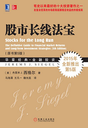
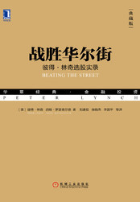
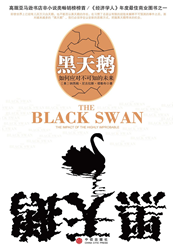
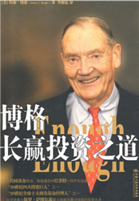

严格意义上的证券投资在世界上已经有超过一百年的历史。这一百年中，有过无数璨若星辰的巨星，也有无数次能让我们深受启发的大事件。只要多看点书，动动脑子总结一下成功者和失败者各有什么共通点，然后取其精华去其糟粕，我们这一生的投资之路就大概率会走得不差。

在投资领域当然也是如此——那么多真正的大师，一字一句把自己的投资心得写给大家；那么多勤于钻研的教授学者，用各种方法总结出真正实用的规律；那么多具有创造性的华尔街奇才发明出各种 NB 的投资工具……

我们要做的，只是拿起书本，好好学习。然后找到适合自己的路就够了。
<footer>ETF拯救世界</footer>
<h2>01《巴菲特与索罗斯的投资习惯》</h2>

<strong>E大推荐语：</strong>

<a href="https://youzhiyouxing.cn/n/materials/775">十年前偶尔读到的这本书，对于本人投资习惯的形成有很大帮助，推荐给刚刚开始投资的朋友。一本书，有几句话会对你产生影响就没白看。这本书对你的帮助，我相信会不止几句话。</a>
<h2>02《邻家的百万富翁》</h2>

<strong>E大推荐语：</strong>

<a href="https://youzhiyouxing.cn/n/materials/776">如果说让我选出一本，对本人财富积累起到最重要作用的书，我一定毫不犹豫的拿出这一本。这本书的重要意义，不是教会我如何投资赚钱，而是它为我指出了一条如何积累财富的路。</a>
<h2>03《漫步华尔街》</h2>

<strong>E大推荐语：</strong>

<a href="https://youzhiyouxing.cn/n/materials/777">本书作者洋洋洒洒写了几百页之后，得出一个结论：持续战胜市场的机会太过渺茫，最好的方式还是买指数基金( ⊙ o ⊙ )！</a>
<h2>04《股市长线法宝》</h2>

<strong>E大推荐语：</strong>

<a href="https://youzhiyouxing.cn/n/materials/778">西格尔写的书，最大的特点就是数据。他会从海量的数据里面找到规律，总结出来，告诉我们事情的真相。</a>
<h2>05《投资者的未来》</h2>

<strong>E大推荐语：</strong>

<a href="https://youzhiyouxing.cn/n/materials/779">这本书第三大 NB 的地方，是统计了历史资产收益率。而且，是全球的！据西格尔教授的统计，股票的实际扣除通胀历史真实收益率，大概是 6.5%~7%。也就是说，大概十年投资者的收益会翻一番。</a>
<h2>06《彼得·林奇的成功投资》</h2>

<strong>E大推荐语：</strong>

<a href="https://youzhiyouxing.cn/n/materials/780">在这个星球上，真正愿意谈论自己投资方法的伟大投资者并不多。尤其是他的写作对象正是绝大多数业余投资者。看看林奇的书，一定会让你对股票投资有进一步的认识。</a>
<h2>07《笑傲股市》</h2>

<strong>E大推荐语：</strong>

<a href="https://youzhiyouxing.cn/n/materials/781">这本书缺点不少，作者的有些理念也与我的操作习惯不尽相同。但是瑕不掩瑜，对于各位业余投资者来说，尤其是对投资个股有兴趣的朋友，这本书一定会带给你非常多的思考和收获。</a>
<h2>08《投资心理学》</h2>

<strong>E大推荐语：</strong>

<a href="https://youzhiyouxing.cn/n/materials/782">朋友们，看完这本书，合上最后一页，我相信你会含着眼泪长出一口气：亏损的原因终于找到了……今天这么有价值的一本书，我是建议你转发本文到朋友圈或者转给也在进行金融投资的朋友……</a>
<h2>09《战胜华尔街》</h2>

<strong>E大推荐语：</strong>

<a href="https://youzhiyouxing.cn/n/materials/783">我为什么推荐这本主要讲如何选股的书？我们很难得会有机会看到这样最伟大的投资大师亲自写的投资秘籍。即使不买股票，听听大师的教诲，也会平添一个甲子的功力。</a>
<h2>10《聪明的投资者》</h2>

<strong>E大推荐语：</strong>

<a href="https://youzhiyouxing.cn/n/materials/784">整本书格雷厄姆只想做一件事：指导投资者避免陷入严重的错误，并建立一套令其感到安全放心的投资策略。格雷厄姆用很大的篇幅讨论了投资者的心理问题。实际上，投资者最大的问题甚至是最可怕的敌人，很可能就是他们自己。</a>
<h2>11《投资学》</h2>

<strong>E大推荐语：</strong>

<a href="https://youzhiyouxing.cn/n/materials/785">作为一本工具书，这本书能够让很多朋友对投资有更加专业的认识。掌握了这本书的知识，基本你已经比中国 80% 的证券从业人员专业了……</a>
<h2>12《滚雪球》</h2>

<strong>E大推荐语：</strong>

<a href="https://youzhiyouxing.cn/n/materials/786">如果你想从这本书中学到具体的投资知识、技巧和能力，恐怕会大失所望。但如果你想知道「股神」巴菲特到底是怎样一个人，他的财富到底如何积累，这本书一定不会让你失望。</a>
<h2>13《非理性繁荣》</h2>

<strong>E大推荐语：</strong>

<a href="https://youzhiyouxing.cn/n/materials/787">作者在书中回顾了美国股市和房地产的历史，然后从结构、文化、心理等因素分析了为什么在这两个市场会出现大泡沫。其中对于房地产市场的描述，可以比照现时中国的实际，很有意思。</a>
<h2>14《金融的逻辑》</h2>

<strong>E大推荐语：</strong>

<a href="https://youzhiyouxing.cn/n/materials/787">相信我，如果你对金融并没有一个整体理念，对一些现实中的金融现象没有深入考虑，看看这本书，很多观点会让你脑洞大开。</a>
<h2>15《约翰·聂夫的成功投资》</h2>

<strong>E大推荐语：</strong>

<a href="https://youzhiyouxing.cn/n/materials/787">这本书不错，希望理顺投资股票逻辑理念的朋友可以看看。不过，这本书也是促使本人将绝大部分资金从股票转向指数投资的原因之一——那么牛的华尔街传奇，每年也只是跑赢指数 3%。</a>
<h2>16《黑天鹅》</h2>

<strong>E大推荐语：</strong>

<a href="https://youzhiyouxing.cn/n/materials/787">黑天鹅事件存在于各个领域，这本书告诉我们怎么避免小概率事件带来巨大损失；怎样在不确定的事件中占得先机。</a>
<h2>17《反脆弱》</h2>

<strong>E大推荐语：</strong>

<a href="https://youzhiyouxing.cn/n/materials/787">这本书讲的是如何从不确定中受益。如何做一个愈挫愈勇的人？如何从一次次受伤中更加强大？怎么样才能像不死鸟一样凤凰涅槃？</a>
<h2>18《安全边际》</h2>

<strong>E大推荐语：</strong>

<a href="https://youzhiyouxing.cn/n/materials/788">他的《安全边际》一书出版于 1991 年，此后就没有再版，据说有人在 eBay 上偶尔看到它，标价超过了 1000 美元，可见其十分珍贵。</a>
<h2>19《魔鬼经济学》</h2>

<strong>E大推荐语：</strong>

<a href="https://youzhiyouxing.cn/n/materials/788">一个网络调查显示，资金量比较小的投资者对投资回报的预期动辄到 50% 一年。我琢磨，这种心情也许就是很多人炒股亏钱的原因。</a>
<h2>20《巴菲特致股东的信》</h2>

<strong>E大推荐语：</strong>

<a href="https://youzhiyouxing.cn/n/materials/788">不好好看这些信，你根本无法真正知道什么是巴菲特。</a>
<h2>21《财报就像一本故事书》</h2>

<strong>E大推荐语：</strong>

<a href="https://youzhiyouxing.cn/n/materials/788">这本书将重大的财务概念娓娓道来，以实例的形式让你有个大致的了解。最近半年报开始披露了，看完了这本书，去找个感兴趣的公司好好研究一番，岂不快哉？</a>
<h2>22《长赢投资》</h2>

<strong>E大推荐语：</strong>

<a href="https://youzhiyouxing.cn/n/materials/788">大家跟我一起在进行的 ETF 计划，完全是我看过约翰·博格的：《长赢投资》《博格长赢投资之道》，杰里米 J·西格尔的：《股市长线法宝》《投资者的未来》这四本书之后再经过反复思考、研究、演算得出的一种我坚信能长期战胜绝大多数人的方法。</a>
<h2>23《博格长赢投资之道》</h2>

<strong>E大推荐语：</strong>

<a href="https://youzhiyouxing.cn/n/materials/788">大家跟我一起在进行的 ETF 计划，完全是我看过约翰·博格的：《长赢投资》《博格长赢投资之道》，杰里米 J·西格尔的：《股市长线法宝》《投资者的未来》这四本书之后再经过反复思考、研究、演算得出的一种我坚信能长期战胜绝大多数人的方法。</a>
<h2>24《时间的玫瑰》</h2>

<strong>E大推荐语：</strong>

<a href="https://youzhiyouxing.cn/n/materials/788">读一本好书，学一些正确的知识，让我感觉到浑身充满了力量。这是真的，我切切实实感觉到了力量。也对自己越来越充满信心！我一定会取得更大的成功。我一定会实现自己的梦想。</a>
<h2>25《大而不倒》</h2>

<strong>E大推荐语：</strong>

<a href="https://youzhiyouxing.cn/n/materials/788">无论是什么投资风格，我想对于价值投资来说，有几个点应该是有共识的：买的便宜（至少不贵），放弃预测中短期走势，对于优秀的品种长期持有直到非常贵。</a>
<h2>26 电影《大空头》</h2>

<a href="https://movie.douban.com/subject/26303622/ ">点击了解豆瓣电影介绍</a>

<strong>E大推荐语：</strong>

<a href="https://youzhiyouxing.cn/n/materials/788">看《The Big Short》印象很深的一段，是贝尔演的迈克尔·巴里在孤注一掷结果大幅浮亏的时候，投资人来要求撤资。这时候贝尔非常痛苦——他知道自己是对的，但大多数人根本不能理解他。</a>
<h2>小彩蛋</h2>
我们将E大的所有推荐做了一个微信书单，在微信读书 App 中搜索「有知有行E大书单」即可查看。祝开卷有知。

本文章所载信息仅供参考，不构成任何投资建议。如转载使用，请参考 <a href="https://youzhiyouxing.cn/agreements/ARTICLE_REPRINTED">《文章转载声明》</a>。

