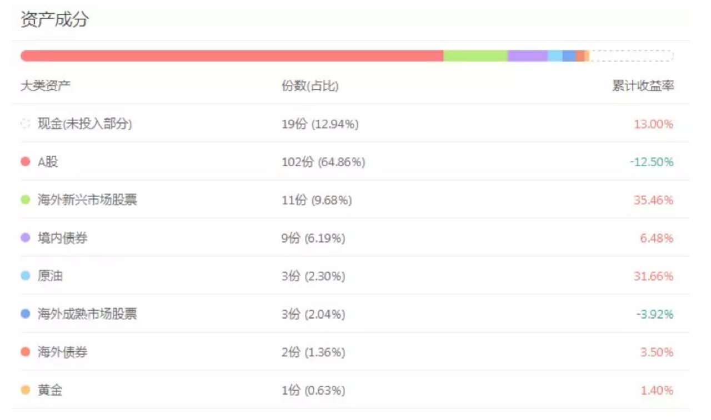
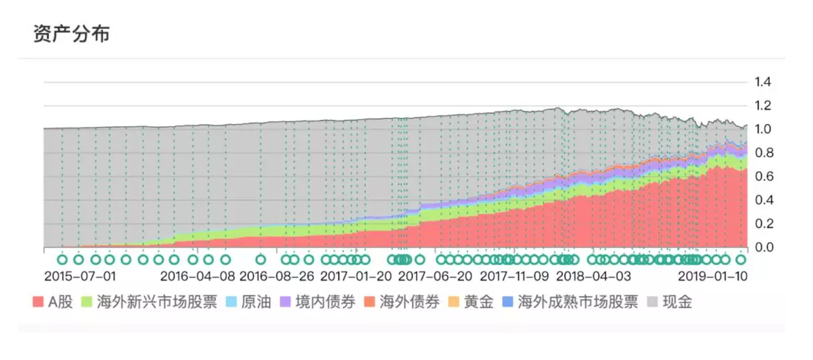

<blockquote>
原文发表于 2019 年 01 月 11 日。
</blockquote>
说句心里话，对于 2018 年 ETF 计划的收益率，我并不满意。投了一年的计划，年底一看，亏损了，谁能满意呢。
<h2>一、不满意，但再来一次，也不会更好</h2>
咱们这一生，对很多事都不满意。比如你没考上清北、哈佛、麻省理工，比如没有娶到周慧敏、高圆圆，没有嫁给吴彦祖、古天乐，比如没有成为全球、全国、或者你们全省、全市、哪怕全县的首富。

但是这些事再给你机会再来一次，你还是几乎做不到。同样的，在公元 2018 年，ETF 计划再来一次机会，也依然很难赚钱。

上面这张图是 2018 年全球所有市场的走势。在 2018 年，除非你全部持有现金，或者全部买了债券，否则真的很难赚钱。

2018 年我们的计划下跌 12%。是第三轮计划 2015 年 7 月开始以来，首次年度亏损。在 2018 年之前，我们的计划连月度亏损都很少出现，无论市场如何波动。

从大类组合看，今年的浮亏主要来自于A股：

我们可以在上蹿下跳的原油上吃饱，可以在年初无人看好的债券上赚钱，唯独在全球主要市场跌幅榜第一的A股浮亏 12%。

今年A股真的太惨了。

从A股上市公司走势来看：2018 年，A股全部上市交易的 3446 家公司中，上涨的公司只有 214 家，下跌的公司占比 93.67%。涨跌幅中位数是 -33.98%。也就是一半的公司下跌超过 34%。跌幅大于 12% 的公司有 2998 只，占比 87%。

再看公募基金：2018 年偏股型基金平均下跌 23.96%，其中指数型基金平均下跌 25.52%，主动股票型基金平均下跌 24.97%，偏股混合型基金平均下跌 23.09%。在所有偏股型基金中，有正收益的只有 4 只，其他的均是亏损状态。亏损最大的股票基金下跌 48%。

以我目前的投资水平、投资模式以及投资体系，这样全球各大市场全部下跌，几乎是躲不过去的。所以再来一次，依然还会如此。最多是可以在下跌 12% 的基础上少亏一两个点。

所以，遗憾，当然是有点遗憾。但我很坦然的接受，甚至有点喜悦。因为据我十几年的观察，波动率极高的A股在全球涨跌排行榜上不是名列前茅，就是排在队尾。2019 会不会力压群雄？咱们拭目以待。
<h2>二、三次股灾不亏，2018 年亏损的原因</h2>

一图胜千言。

在遥远的三年前，我已经多次说过，这一轮熊市如果不能像 2008 年一样一跌到底，而陷入慢慢阴跌，则时间长度有可能会长达 3～4 年。

一语成谶，3 年半后的 2019 年初，A股还在创新低。我们的资产配置路径，也因为有了这样的大方向指导，从而在 2015～2016 的数次大股灾中安然无恙，因为那时候我们几乎不持有权益类资产。

到了 2018 年，情况则截然不同。对于A股来说，时间与空间都有理由让我们越来越乐观。所以各位看上图就知道，<em>我们一半的A股仓位，都是在 2018 年买的。</em>我们等了三年后，终于开足马力在 2018 年重手买入。

<em>这样的熊市逆势买入，大概率当然是买了就跌。</em>虽然我们尽力通过短期择时降低买入成本，但依然买了就跌。这几乎是必然的。毕竟，你想买了就涨，只能在牛市中。而牛市中买入是什么结果，很多朋友应该有切身体会。

有人经常说，盈亏同源。所以有人从不减仓，一路从牛市顶端死扛到熊市末期，亏损 70%。

盈亏也许同源，但我相信每个时刻的盈亏概率不同。所以我的做法是计算概率。上涨概率低的情况下轻仓，上涨概率高的时候，辅以资金、情绪、周期、估值的大致判断，仓位越来越重。

在 2018 年，我愿意为下一次资产飞跃大量配置权益类产品。即使短期会有让我们不开心的浮亏，我也甘之如饴。

2019 年已经开始了。这一年极有可能会是阳光灿烂。从概率上看，就是如此。

预祝大家今年取得满意的投资回报。同时，一定要特别感谢且慢对我们计划的支持，以及为各位朋友能够更加顺利便捷的跟车所做出的不懈努力，希望且慢越来越好！

最后，谢谢你们所有人，谢谢！真心的。

原文发表于公众号：《<a href="https://mp.weixin.qq.com/s/ql7kz4mb3RE5VsPNEZp59w">长赢计划 2018 年度回顾</a>》

本文章所载信息仅供参考，不构成任何投资建议。如转载使用，请参考 <a href="https://youzhiyouxing.cn/agreements/ARTICLE_REPRINTED">《文章转载声明》</a>。

