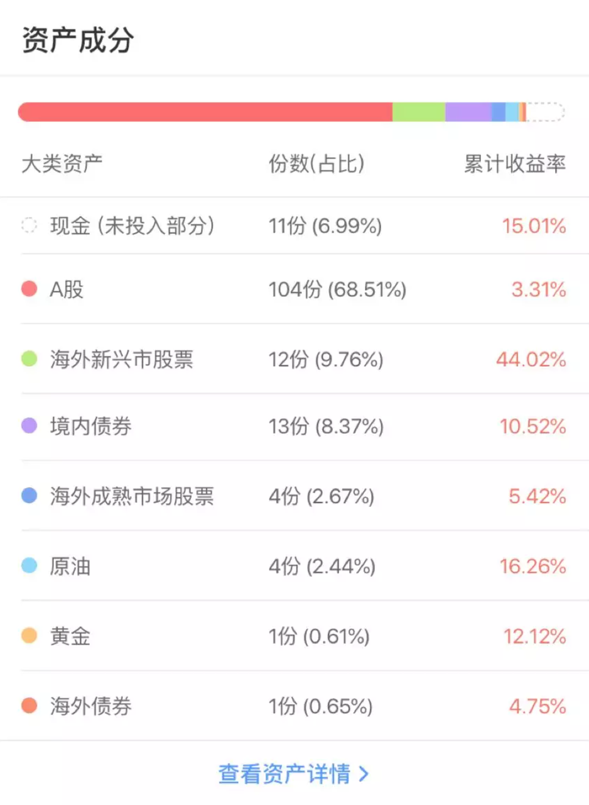

<blockquote>
原文发表于 2019 年 07 月 10 日。
</blockquote><h2>一、上半年回顾</h2>
去年的总结中，我写过这样一句话：「据我十几年的观察，波动率极高的A股在全球涨跌排行榜上不是名列前茅，就是排在队尾。2019 会不会力压群雄？咱们拭目以待。」果然，2019 年A股即使在大幅调整后，涨幅依然领先其它市场。

2019 年上半年，长赢指数投资 150 份计划净值增长 15.36%，S 计划净值增长 16.71%，与中证500涨幅相近，跑输沪深300指数。

上半年，无论是 150 份计划还是 S 计划，净值都先于沪深300与中证500创出了历史新高。之所以没有跑赢指数却率先创出历史新高的原因，在于下跌的时候跌幅小。去年沪深300下跌 25%，中证500下跌 33%，而150 份计划下跌 12%。通过简单的数学计算就可以知道，下跌 25% 需要上涨 33% 回本；下跌 33% 需要上涨 49% 回本，而下跌 12% 则只需要上涨 14% 即可回本。

想要下跌的时候跌幅小，上涨的时候又涨幅大，这个要求难度很大。<em>我本人做金融投资，更喜欢下跌的时候控制跌幅，上涨的时候尽量跟上。</em>这也非常简单，如果你某一年资产损失 20%，第二年增加 40%，第三年又损失 20%，第四年又增加 40%，这时候你的复合年收益率其实只有 5 个多点，而非你想象的 10% 以上。

但我们尽量做到跌幅小一些，涨幅大一些。所以去年底行情启动前我们大量买入，积累了不少低位筹码。同时，我们拒绝高位追涨——在上半年行情启动后，我们不仅没有再买入A股指数，甚至逢高减仓，卖掉了 500 的部分波段仓位。这样，我们在 3 月之后的大幅下跌中没有遭受更大的损失。

在上半年，我们的第三轮指数投资计划基本已经布局完毕。包括A股、港股、欧股、国内债券、海外债券、黄金、原油的一个完整组合已经构建完成。

未来除了美股以及房地产的 REITS，已经不会再有增加大类的余地。之后，我们就会在各个大类之间进行再平衡、再布局。这样一个全球性的平衡组合，注定无法在其中某个大类资产大幅上涨的时候完全跟上涨幅。但我们追求的是资产不断增加，净值不断稳步新高，这点还需要跟投的朋友理解。

布局完成的同时，我们做到了所有大类全部盈利。考虑到这是上证指数 4000 多点之上买下来的成绩，在目前的 3000 点不到，还是可以接受的。

而细分的 31 个品种中，只有 5 个处于浮亏状态。

虽然上半年没有增持A股，但计划增持了黄金、原油、德国 DAX。黄金与 DAX 表现较好，原油表现一般。未来也会增加原油的细分投资品种，争取有更好的表现。

总体来讲，上半年在操作方面没有太多遗憾。有人可能认为在高位减持的不够，但其实这又是回头看的事后诸葛。在那个位置，别说减持，绝大多数人还在不停的买入，不停的加仓。我们能够半年不买甚至卖出，已经是我们这种投资方式的极限。

上半年遗憾的地方在于持仓品种。我们有些持仓较少的品种涨幅不小，有些持仓较多的品种涨幅一般。这个问题我也在不断的反思，争取在策略以及体系层面进行有效改进，进一步优化投资架构。当然，证券市场从来都是风水轮流转，也就是所谓的「风格转换」在不断发生。过去不好的，未来也许就会大放光芒。这个现象在过去全球的资本市场已经发生过无数次，在未来相信也依然会继续发生。
<h2>二、未来展望</h2>
股市想要走出真正的大牛市，有三点必要条件：

第一，经过熊市洗礼，估值被压制到极低。

第二，货币政策宽松，流动性充裕。

第三，宏观经济向好，大部分行业开始复苏。

去年底之所以非常看好A股，并将之定义为钻石坑，是因为上述的前两个条件已经具备。所以，上半年出现报复性的大幅反弹也在意料之中。这样的大涨，一方面来源于估值修复，一方面是流动性增加。

然而行情想要进一步演进，就要观察宏观经济何时真的有起色。当然很多做个股的人讲不用看宏观，他们也未必是错，但我们是投资指数的。想要出现指数级别的牛市，就必须观察宏观。不过这里要注意，不能等经济底部出现再来投资股市，因为股市是先行指标，就如去年底经济并未出现起色，但真正的钻石坑已经出现。

底部出现不可以等宏观向好，但行情想要延续就必须见到经济走好。在这个逻辑指引下，各位应该放弃所谓「速胜」的观点，不要妄想每年翻番的超级大牛马上就会出现。在这个位置，保证安全的情况下，多积累一些便宜筹码，耐心等待经济周期回暖行情继续，是非常理智的做法。

原文发表于公众号：《<a href="https://mp.weixin.qq.com/s/dmo8Fn2v1Uq1zgXb6whKWQ">长赢指数投资计划 2019 年上半年回顾</a>》

本文章所载信息仅供参考，不构成任何投资建议。如转载使用，请参考 <a href="https://youzhiyouxing.cn/agreements/ARTICLE_REPRINTED">《文章转载声明》</a>。

