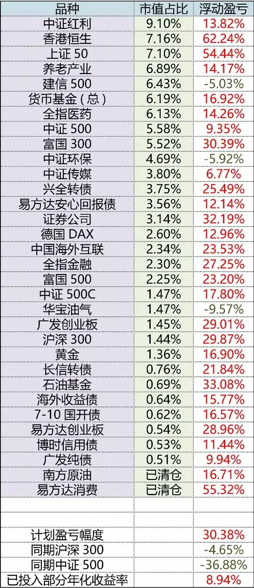

<blockquote>
原文发表于 2020 年 01 月 28 日。
</blockquote><h2>一、上涨的年份，尽量跟上</h2>
2019 年，长赢指数投资计划 150 部分净值增长 24%，S 计划增长 26%。两个计划涨幅与中证500相近，跑输沪深300。这也是第三轮计划开始以来 4 年中第 3 个盈利年份，是所有三轮计划开始 14 年以来第 12 个盈利年份。

想要在市场大幅下跌的时候独善其身，市场返身向上的时候又紧密跟上，这个对于一个没有短线波段的、没有灵活控制的、需要面对数万情况各有不同跟投者的长期投资计划来说并不现实。

在之前的 2018 年，沪深300下跌 25%、创业板下跌 29%、中证500下跌 33%、中证1000下跌 37%，中小板下跌 38%，我们的计划净值回撤幅度是 12%。从两年的成绩看，基本算是做到了我们追求的下跌的时候少跌，最好不跌，上涨的时候尽量跟上。

分品种看，2019 年表现较好的持仓品种是 300、消费（已清仓）、创业板、50、医药，表现不佳的是红利、传媒、环保、恒生，其它指数表现不过不失。这里又有非常有意思的现象出现。

中证红利和恒生在 2019 年表现一般，但它们在 2018 年是表现最好的指数，当年跌幅都只有全市场指数的一半。至于环保和传媒，则在 2020 年开年的这一个月里大放异彩，在沪深300涨幅只有 2% 的时候，它们两个的涨幅分别达到了 8% 和 11%。

随着投资经验的不断累积，我相信越来越多的朋友会认同我的观点——没有辣鸡品种，只有四季不同时节开放的花。我们要做的，是尽可能在持有长盛不衰的品种基础上，结合各种判断依据，在不同时节欣赏不同的繁花之美。
<h2>二、 最满意的两点</h2>
2019 年行情结束，我对于这个计划有两点比较满意。

<em>第一点：几乎所有品种盈利。</em>

截至 1 月 13 日，150 计划中除了合计占比 6% 的环保和华宝油气依然浮亏不到 10%，其它所有品种全部盈利（将 4 个 500 持仓视为一个品种）。这对一个从 4000 多点开始，目前只有 3100 点的长线投资计划来说并不容易。

我再说一次从十年前开始已经说过很多次的话：「<em>虽然我们做的是指数投资，但是无论十年后指数是在 3000 点还是 2500 点，我们都能挣钱，区别只是赚多少而已。</em>」这句话十年前我说过，十年后的今天实现了。再过十年，依然能实现。

<em>第二点：几乎所有人都盈利。</em>

非常有意思，关于投资，有两件事你可能不知道。

第一件，大牛市中依然有多到你不相信的投资者赔钱。

第二件，很多买入那些净值上涨很多的热门品种的投资者赔钱。

股票也好，基金也好，品种涨的好，不代表持有它的人挣钱。如果你能好好看一下且慢关于计划的一切设置，包括补仓提醒等，你就会明白一件事：

对于我本人和且慢来说，跟投的朋友挣钱才是最重要的一件事。我们想尽办法不让你追到高位，尽量在低位买入，这样，才能做到到目前为止，持有 70 份以上的朋友中，有 99.9% 的朋友盈利。99.9% 是什么意思，相信各位都明白。

我们做的，不仅是一个组合的展示，更是一次如何投资A股，如何保持正确投资心态，如何建立适合自己的、完善的投资体系的全方位演示。到 3100 点的目前为止，我们是成功的。这里面有我们的努力，也是因为各位自身的坚定与信任。你和我，咱们都配得上这份阶段性的成功。
<h2>三、关于2020年</h2>
去年的总结中，关于 2019 年，我这样说：「据我十几年的观察，波动率极高的A股在全球涨跌排行榜上不是名列前茅，就是排在队尾。2019 会不会力压群雄？咱们拭目以待。」

果然，2019 年A股大涨，涨幅领先全球重要股市。关于 2020 年，在去年底我就说了自己的判断。

我预计，无论 2020 年收盘的时候是涨还是跌，这一年必然是大幅波动的一年。

今年之所以无法判断涨跌，是人类根本就不具备预测短期涨跌的能力。每年年底预测第二年怎么走的人都是在做无用功。去年之所以明确的提出看好今年的观点，是因为A股这根弹簧压的太久了，压了 3～4 年。无论是从估值还是行情的角度看，都需要一次大涨。

今年则不同，除了大幅波动，无法判断全年涨跌。

是不是无法判断涨跌就不能赚钱了？我想说的是，大部分钱不应该通过预测来赚。观察、判断，用概率计算应该使用哪种投资策略，才是我们应该做的。

所以，今年各位可以考虑在长期持有长线仓位的基础上，用一部分资金做一些波段操作。既然大幅波动，那就应该有吃波动的方法。在计划里面，会有极少的波段仓位管理。各位也可以自己设计一些吃波段的策略。

是的，我只相信策略，不相信人的判断。我也建议你，用好的投资策略严格约束自己的交易行为。

祝各位 2020 年有好的投资收益，祝各位身体健康，祝国泰民安。

原文发表于公众号：《<a href="https://mp.weixin.qq.com/s/asay8cIP8QbKvGAM66q-1g">长赢计划 2019 年度回顾</a>》

本文章所载信息仅供参考，不构成任何投资建议。如转载使用，请参考 <a href="https://youzhiyouxing.cn/agreements/ARTICLE_REPRINTED">《文章转载声明》</a>。

