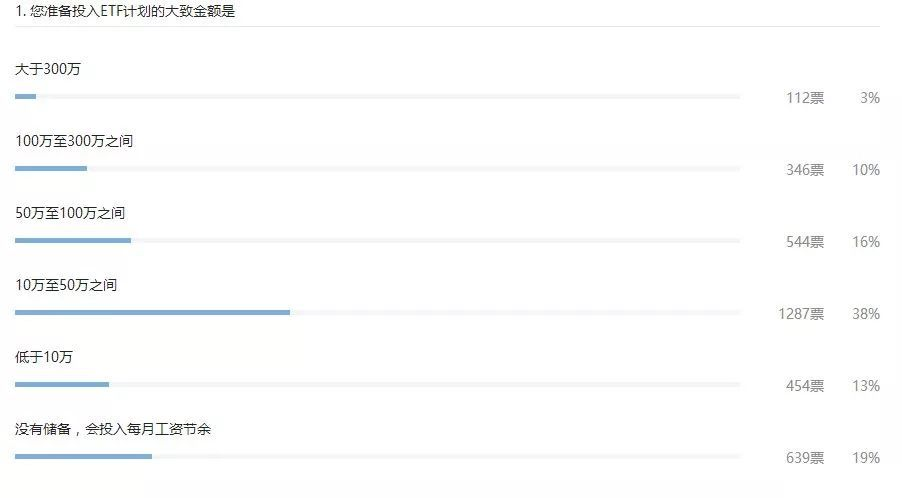

# 对于资金量不大的工薪族，E大有何投资建议？

> 原文发布于 2019 年 10 月 30 日

原文发布于 2019 年 10 月 30 日

微博网友 2017 年 02 月 28 日 提问：

E大，对于普通上班族来说，投资资金并不多（少于 50 万或者少于 100万），但是有固定工资的人投资有什么建议？ 这类人在什么情况下适合上杠杆？ 谢谢～

这个问题我认为非常典型。 所以拿出来说一说。 毕竟，绝大多数人都是没有特别多积蓄的普通工薪阶层。 怎么在资本市场上多赚点钱，相信是很多人会关注的。

我曾经在公众号做过一个调查，可以看出，87% 的朋友可投资资产在 100 万以下，70% 的朋友可投资资产在 50 万以下。

其实就这些朋友而言，投资金融市场的目的也很不相同。 有些朋友只是想保值增值，有些朋友就想快速致富资产一飞冲天。

可惜在A股有个传说，「7 赔 2 平 1 赚」。 也就是说，70% 的人赔钱，20% 的人小心翼翼很多年，虽然不赔钱，也基本上没赚什么钱。 （我定义的赚钱，是资产增加幅度大于通胀水平）。 只有 10% 的人真的赚钱了。 我估计，只有 1% 的人赚了大钱。

认清这个现实后，资本不够多的朋友首先要做的一件事，就是拒绝亏损。 记住，**不要赔钱**。

如果你家庭年收入 15 万（从整个中国的角度看这个收入应该是中上），去掉十万开销，恐怕只能剩下 5 万。 那么 50 万就是你 10 年的积蓄。 赔 10%，就是一年辛辛苦苦白干了。 赔 30%，你需要赚 50%。 赔 50%，需要赚 100% 回本，基本上来讲，你的投资生涯就差不多这样了。 所以，别亏损。

其实，在A股不亏损也很简单，就是耐心。 看下图（表格中收益率是年化收益率）。

而我要说的，是对于积蓄不多的工薪族来说，更重要的一点是，你投入资本市场的钱，一定是**至少五年不能动的**。 这点特别重要。

所以你投入资本市场多少钱，并不是最重要的。 最重要的，是你能投入多少 5 年之内不要动的钱。 买房子，看病，生老病死开销……这些事情一旦发生在熊市底部，需要你把钱拿出去救场，可以说至少 5～10 年的大机会就会被你浪费掉。

所以，最关键的，对工薪阶层来说，投入资本市场的钱就五年不要拿出来。 铁律。

没有时间的限制后，你就要开始筹划整个战争的布局。 就像刘备一开始就那么十几个人七八条枪，也要找到诸葛亮来一场隆中对，对未来几十年的情况了然于胸。 最后照样三分天下霸业有成。

上面的表格揭示了一件事，就是**长期持有一定能挣钱**。 表格中持有 15 年、20 年深成指根本不可能亏损。 本来持有十年也都是盈利的，可惜，如果你在 2007 年买入，2017 年还是亏的。 而且每年亏 5%，每年亏 5% 哦！ 为什么？ 因为 2007 年太贵了。

好了，真相已经出来一半了： **在不贵的地方，买入几个长期会好的指数基金，年化收益10% 以上根本不是梦，而是事实。A股是个聚宝盆。**

再来看真相的另一面。 有没有发现，有些年份的五年、十年年化收益率居然到了 30% 甚至 40% 以上？ 朋友们，这是什么概念？ 年化 40%，预示着一年多就可以翻一番。 五年可以翻几番？ 你的 50 万，100 万会变成多少？

2007 年，五年年化收益率 45%。 也就是 2002 年买入，赚了 6.4 倍。 2009、2010 年五年年化收益率都超过 30%，也就是 2004、2005 年买入，赚了 4 倍以上。

所以 2007 年是个很有意思的年份，你五年前买入，可以赚 6.4 倍。 而你如果在别人赚 6.4 倍的时候买入，十年后每年亏 5%。

好了，咱们一起梳理一下这个答案在说什么：

拿出五年不要用的钱，多少不重要，不可以随意拿走；

在便宜的地方买入。 怎么算便宜？ PE / PB 估值，成交量 / 资金流入 / 两融余额情绪……判断的指标很多。

在贵的地方卖出。

逆袭完成。

说起来是不是很简单？ Sorry，一点都不简单。

> 如今我走到了人生的十字路口，我知道哪条路是对的，毫无疑问，我知道，但我从不走，为什么？ 因为太他妈的艰难了。——使法兰中校《闻香识女人》

如今我走到了人生的十字路口，我知道哪条路是对的，毫无疑问，我知道，但我从不走，为什么？ 因为太他妈的艰难了。

——使法兰中校《闻香识女人》

是的。 懂道理不代表你做正确的事情。 当你明知道并不便宜，别人都在赚钱的时候，你会怎么做？ 当你明知道不贵了，但别人都说A股一点戏都没有了，你会怎么做？ 你以为你能做好？ Sorry，花 1 块钱看这个答案的人中，70% 都做不好。

至于杠杆，很简单，我不认同不能上杠杆的说法。 对于资产少的人，在某些时候上杠杆可以弯道超车。 （在资本市场赚大钱只有两个方法： 买得低，上杠杆。 如果你买得够低 + 上了杠杆，就是双击）你以为为什么买房赚大钱？ 买房就是上杠杆，20%、25% 首付，都是几倍杠杆。 没有杠杆，靠着一点点积攒储蓄，怎么买房？ 所以，金融投资的杠杆也无可厚非。

但是最关键的，你要注意，**不能短贷长投**。 也就是借短期杠杆，投入长期项目。 我自己是在估值极低的时候，用比较低的长期杠杆投入下行风险非常非常小的品种。 这个没有实例恐怕很难说，未来我自己上杠杆的时候，我会说。 但是一定要注意，不能经常上。 人这一辈子，有几次机会，就足以改变一生了。

正常状态保本慢慢投入、长期持有、估值极低的时候上杠杆。 资本市场终将帮你实现目标。

> 本文发表于且慢：《[对于资金量不大的工薪族，E大有何投资建议？](https://content.qieman.com/items/391?srcUid=842371)》

> 本文章所载内容仅供参考，不构成投资建议。市场有风险，投资需谨慎，投资者应保持独立思考。详见[《文章免责声明》](https://youzhiyouxing.cn/agreements/ARTICLE_DISCLAIMER)。如转载使用，请参考[《文章转载规范》](https://youzhiyouxing.cn/agreements/ARTICLE_REPRINTED)。
