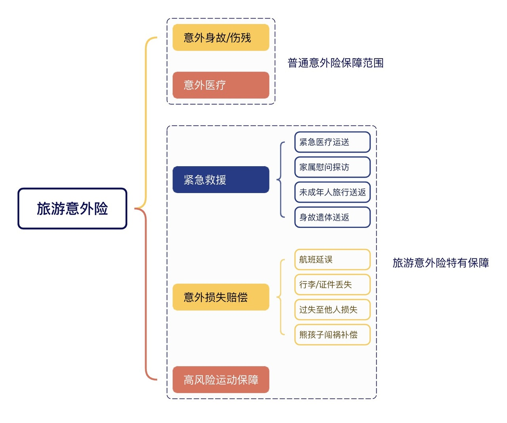
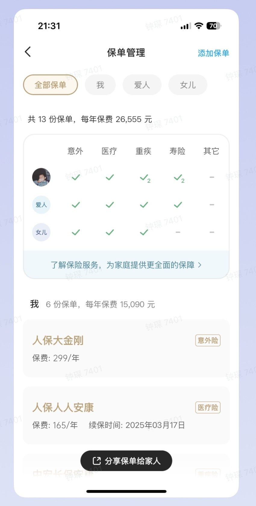
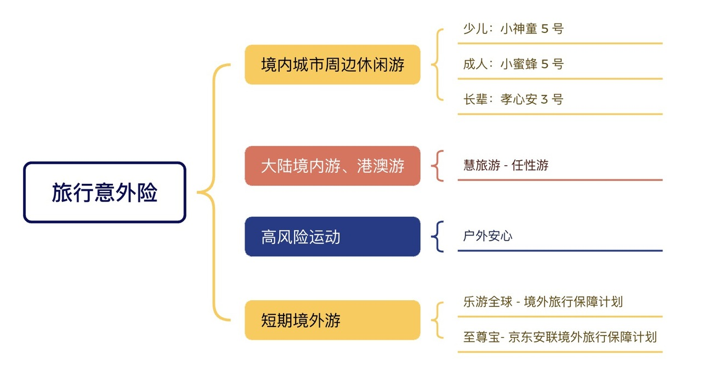

# 出行前，有必要买旅行意外险吗？

今天，我们介绍和旅行绝配的搭子 —— 旅行意外险。

当你点开这篇文章，说明假期将近，空气里都是自由的气息。

但一不小心，写了一篇长长长长文，稍微有点破坏气氛🤣。

思来想去，还是希望大家能明明白白地买好每一份保障，因此，没有对内容进行删减。如果你想搞清楚旅行意外险的方方面面，这篇文章很适合。

当然，你也可以点击感兴趣的问题，直接找到相应的答案～

* 旅意险是什么？和平时买的意外险有什么区别？
* 旅意险保什么？
* 如何确定我是否要旅意险？
* 如何选择旅意险？
* 产品推荐

[旅意险是什么？和平时买的意外险有什么区别？](https://youzhiyouxing.cn#1)

[旅意险保什么？](https://youzhiyouxing.cn#2)

[如何确定我是否要旅意险？](https://youzhiyouxing.cn#5)

[如何选择旅意险？](https://youzhiyouxing.cn#3)

[产品推荐](https://youzhiyouxing.cn#4)

## 旅意险是什么？和平时买的意外险有什么区别？

旅行意外险是一种专门针对旅行期间可能发生的意外事故提供保障的保险产品。

通常只保障旅游期间，保障时间短，价钱也很便宜。

很多朋友会好奇，我已经有意外险了，为什么还要再买一份旅行意外险呢？

我们常说的意外险，比如[小蜜蜂 5 号](https://cps.qixin18.com/apps/cps/zc1059261/product/detail?prodId=104716&planId=129798&tenantId=0&createTime=1726207991938)，[小神童 5 号](https://cps.qixin18.com/apps/cps/zc1059261/product/detail?prodId=104707&planId=129781&tenantId=0&createTime=1726208013174)，[孝心安 3 号](https://cps.qixin18.com/apps/cps/zc1059261/product/detail?prodId=104587&planId=129591&tenantId=0&createTime=1726208041349)，这些都属于综合意外险。主要保障意外身故、伤残和意外医疗。

日常生活中可能遇到的意外，大到交通意外、高空坠物，小到运动拉伤、猫抓狗咬都能管上。

但是踏上旅途，出门在外，可能遇到一些日常生活中不会遇到的特殊场景。

* 参与潜水、冲浪、漂流、蹦极等高风险运动
* 旅行途中突发急性病，当地不具备治疗条件，需要紧急医疗运送帮助
* 在治安相对较差的国家，遭遇盗抢、护照行李丢失
* ......

参与潜水、冲浪、漂流、蹦极等高风险运动

旅行途中突发急性病，当地不具备治疗条件，需要紧急医疗运送帮助

在治安相对较差的国家，遭遇盗抢、护照行李丢失

......

上面提到的情况在旅行中都可能碰到，但因涉及高风险运动、紧急救援、财务保障等，通常不在综合意外险的保障范围内，这就需要旅行意外险了。

## 

## 旅意险保什么？

除了综合意外险包含的身故、伤残和意外医疗责任外，旅行意外险还包括紧急救援、高风险运动、证件丢失、航班延误等旅行特定保障。

不同产品的保障责任各有不同，我们挑选几个典型的保障责任来详细了解一下。

这部分责任跟综合意外险是一样的。

需要注意的是，旅行意外险也是意外险的一种，也必须符合意外险的理赔四要素才能获得赔偿：**外来的、突发的、非本意的、非疾病的***。*

因此，疾病导致的身故、医疗费用，不在旅意险理赔范围内。

不过市场上有些旅意险会对保障责任进行拓展，突发急性身故、突发疾病、甚至既往症急性发作也在保障范围内。

国内旅游其实还好，但如果你在医疗费用较高的国家旅行，这项保障就很有意义了，挑选产品时，需要特别关注下。

如果同时有综合意外险和旅意险，怎么赔呢？

给付性质的责任是可以同时赔的。比如小知买了 100 万小蜜蜂 5 号，买了 100 万旅意险，旅行时遭遇车祸不幸身故，那一共可以赔付 200 万。

意外医疗费用的报销可以选择使用其中一个保险产品，或者同时使用两个保险产品。但需要注意的是，报销的总金额不能超过实际发生的医疗费用。

谈到紧急救援，许多人脑海中浮现的画面可能是这样的：在深山老林中迷路受伤，打电话给保险公司，随后直升飞机飞驰而来进行救援。

画面很酷，但旅意险中的「紧急救援责任」却并非如此。

救援服务实际上分为**第一救援**和**第二救援**两部分。

**第一救援**主要集中在事故发生后的初期处理，包括紧急医疗和现场救援。

这一阶段，最接近事故地点、服务网络最全、能够最快到达现场的是当地的公共职能部门或专业救援机构，例如国内的110、120、119以及搜救队。

这些救援服务有些是免费的，有些则需要付费，具体费用标准因国家而异。在大多数情况下，这部分费用需要由当事人自行承担，保险公司也是不保的。

**第二救援**则关注于事故后的长期处理，包括医疗转运、后续治疗、遗体运送等。这就属于保险的救援服务了。

救援机构的医生，会根据当事人的身体状况，从医疗角度，先评估是否有运送必要，一旦确定，会配备专业医护和必要运输工具，将伤者送往最近的、最合适的医院。待病情稳定后，紧急救援机构还会协助当事人，乘坐民航班机返回常驻地国家，接受后续治疗。

旅意险中，提供救援服务的，不是保险公司，而是全球性质的专业救援机构。保险公司和救援机构合作，费用由保险公司承担，比如像美亚、安联，这类有实力的集团性公司，旗下有自己救援机构，网络遍布全球，是买旅意险的首选。

除此之外，旅意险中的救援服务还包括遗体运送和安葬、直系亲属探访、未成年子女送返等。在必要情况下，这些服务能帮我们解决必要问题。

主要针对旅行途中的财产和时间损失，进行一定的赔偿。

比较常见的责任有航班延误、行李延误/丢失、旅行证件丢失、随身财产丢失、第三者责任。

其中，可以特别留意「第三者责任」，指的是保险为被保险人在旅行期间对他人（即第三方）造成的人身伤害或财产损失提供的法律责任保障。

比如旅行途中无意打坏景区、酒店的物品。或者拥挤路段不小心导致他人受伤，旅行意外险都可以帮你赔。

这部分保障的特点就是，损失不大，但是影响心情，如果能理赔，也算是提供了一些情绪价值吧。

## 

## 如何确定我是否要旅意险？

这里涉及两个问题：

了解了综合意外险和旅意险的差别，我们就可以把问题转换一下：

* 目的地是否在保障范围？
* 是否要进行高风险活动？
* 除了意外身故、伤残赔付和医疗报销外，是否需要其他的特殊需求？

目的地是否在保障范围？

是否要进行高风险活动？

除了意外身故、伤残赔付和医疗报销外，是否需要其他的特殊需求？

如果就是国内城市周边休闲游，以上答案都为「否」，那么综合意外险就足够了。

如果某个问题的答案为「是」，那么还是建议针对具体场景配置一份。

出门在外，安心很重要。

旅行社常见的保险包括旅责险和旅意险。虽然名字相似，这两种保险的保障对象却截然不同。

旅行社购买的旅责险主要是为了防范经营风险，保障旅行社和旅游者的合法权益，其受益人也是旅行社。如果旅行社因其过失需要为游客、导游或领队进行赔偿，保险公司将代为赔偿。

正是因为旅责险赔付责任的特点——如果事故的责任不在旅行社，旅责险将无法提供赔偿。购买旅意险扩大保障范围就显得很有必要。

否则，出现非旅行社责任事故后容易出现纠纷，特别是因意外发生重、特大事故，出现人身伤亡时更是如此。

如果旅行社同时投保了旅责险和旅意险，就不需要自己买啦，如果只投保了旅责险，为获得更全面的保障，可以自己再单独配置一份。

## 

## 如何选择旅意险？

旅行意外险通常根据旅行目的地的不同，分为中国大陆、港澳台、亚洲、申根国家（这也是办理申根签证的必备材料）、欧洲、全球等多个类别。

不同国家和地区的风险和需求各异，因此旅行意外险的具体保障侧重也有所不同。比如去欧洲，财务遗失和信用卡盗刷的风险相对较高。去美国，医疗费用极为昂贵，轻微骨折的住院费用可能高达几十万元。

大家一定要根据自己旅行的区域，选择合适的产品。

如果计划前往偏远地区或境外旅游，建议选择包含紧急救援服务的旅行意外险，在这些地区，紧急救援服务尤其重要。

如果行程安排涉及浮潜、热气球、登山、滑雪、攀岩、滑翔、跳伞等运动，并确认这些活动是否在保险的保障范围内。

还需要注意的是，旅行意外险一般是隔天生效的，出行前要记得提前投保，并确保保障生效时间要涵盖整个旅途。

买完之后也记得将保单同步给家人、朋友，万一发生什么事情，自己没法处理，可以让他们联系保险公司。

安利一下自家好用的小工具，使用有知有行的保单管理功能，就可以轻松录入保单信息，导出 Excel 给家人啦。

## 

## 产品推荐

如果是大陆城市周边休闲游，选择综合意外险就可以啦。如果需要专门的旅意险，可以看看下面几款产品。

如果在大陆境内游，或者港澳游，也不涉及高危活动，选择这款产品就可以啦。

产品链接：[慧旅游-任性游](https://cps.qixin19.com/apps/cps/bxz1101818/product/detail?prodId=105023&planId=130353&tenantId=0&createTime=1759109929352)

这款产品可以保障高风险运动，如滑雪运动(场地内)、潜水、徒步、登山、漂流、露营、山地穿越等。

如果涉及高风险运动，可以选择这款。

产品链接：[户外安心 户外运动保障](https://cps.qixin19.com/apps/cps/zc1059261/product/detail?prodId=103573&planId=127513&tenantId=0&createTime=1726202913942)

高性价比全面境外旅行保障，含紧急救援服务、最高100万保额，含意外和疾病住院和门急诊。可扩展承保商务出行，部分高风险运动。

出境游，且看重性价比，可以选择这款。

产品链接：[乐游全球-境外旅行保障计划](https://cps.qixin18.com/apps/cps/zc1059261/product/detail?prodId=104839&planId=130027&tenantId=0&createTime=1726203017168)

保额最高100万，保障全面，可保既往症，含航班延误赔付，安联的境外救援服务，市场认可度很高。

出境游，且看重紧急救援服务，可以选择这款。

产品链接：[至尊保 - 京东安联境外旅行保障计划](https://cps.qixin19.com/apps/cps/zc1059261/product/detail?prodId=104780&planId=129928&tenantId=0&createTime=1726202960202)

## 写在最后

前一阵去贵州玩，体验了一下网上很火的漂流。

在平缓的水域和划船大哥聊起某条因太过危险而被关闭的路线。说到最感慨的时候，大哥叹了一口气说，下水前其实都给你们买了保险，出事都能赔 100 万，但是人没了，100 万又有什么用呢。

真智慧。

有保障虽好，但什么都抵不过平平安安。

祝你有一个平安、愉快的假期，如果还是不清楚应该买什么的话，可以[预约顾问](https://cps.qixin18.com/v3/m/zc1059261/reservation?createTime=1726207864244)详细聊聊。

下次见啦～
