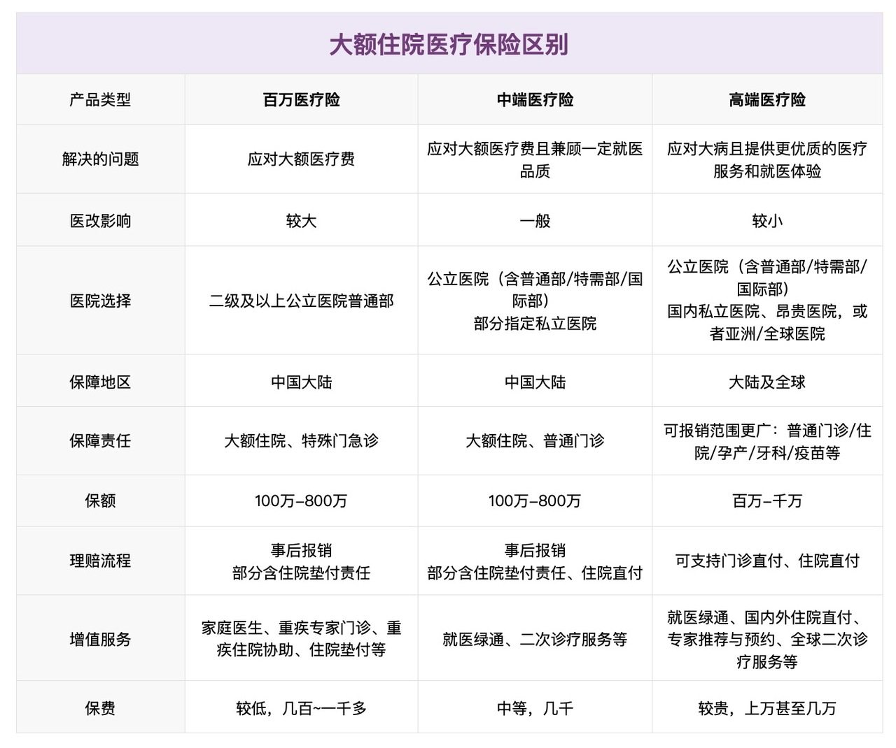
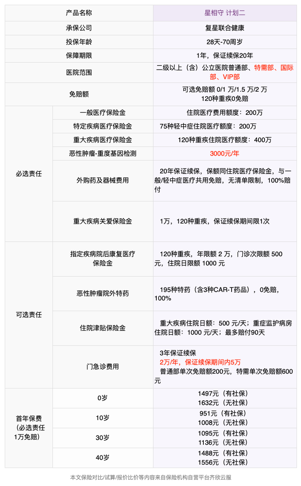
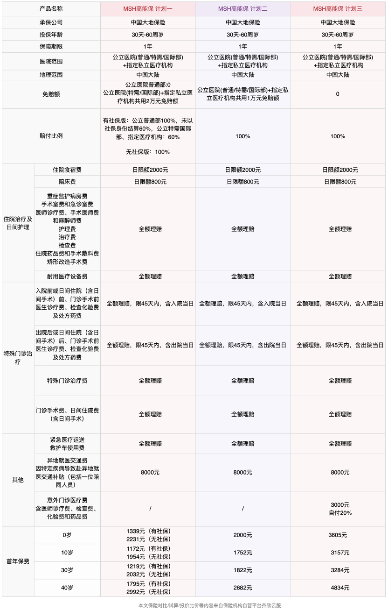
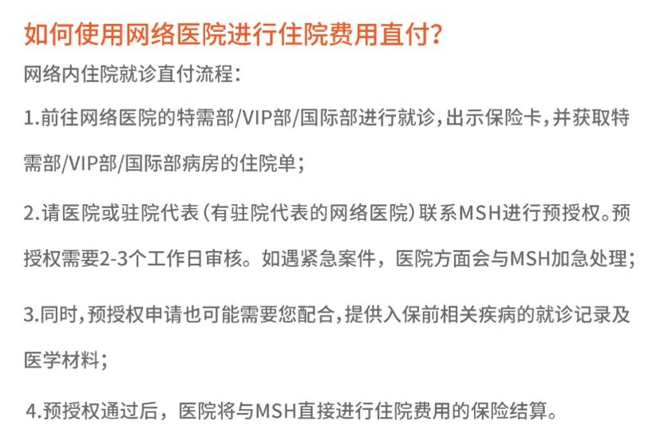
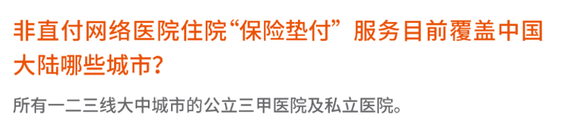
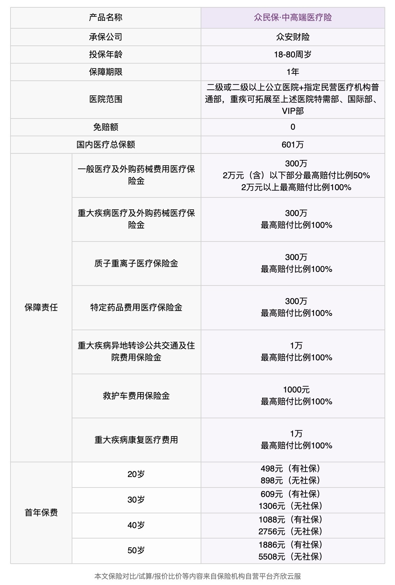
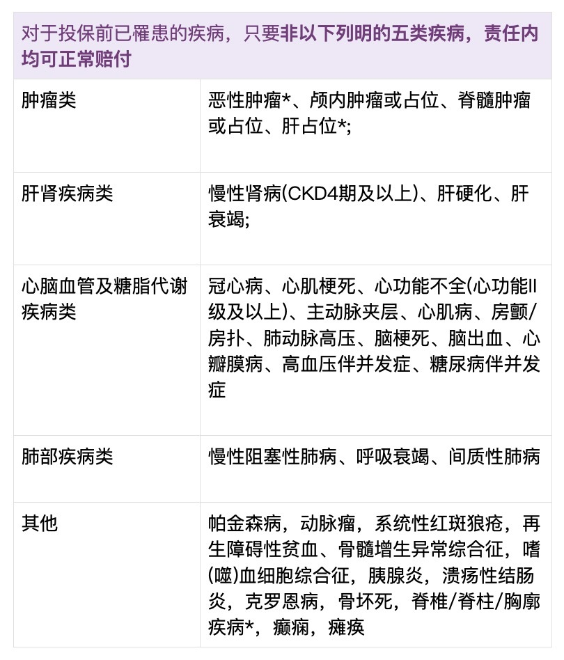

# 如何选择中高端医疗险？

DRG医改以来，越来越多人了解到百万医疗险的局限性：虽然可以帮助我们转移大额医疗开支，但如果想获得更多医疗资源、提升医疗品质，百万医疗险确实占不上太多优势。

那么有没有一种医疗险，能够减轻DRG的限制、报销外购药、享受国际部特需部优质医疗资源、甚至覆盖私立医院、境外就医呢？

答案就是中高端医疗险。

如果预算充裕，能给自己和家人配置中高端医疗险，那是再好不过的选择。医疗自由，不外如是。不过，中高端医疗险产品众多，价格也不便宜，如何选择适合自己的医疗险？怎么根据自己的需求，把握就医选择权，又把钱用到「刀刃」上呢？

这篇文章我们就来聊聊：

* 中高端医疗险，有哪些优势？
* 中高端医疗险，不能做什么？
* 如何选择中高端医疗险？
* 值得推荐的中端医疗险

[中高端医疗险，有哪些优势？](https://youzhiyouxing.cn#1)

[中高端医疗险，不能做什么？](https://youzhiyouxing.cn#2)

[如何选择中高端医疗险？](https://youzhiyouxing.cn#3)

[值得推荐的中端医疗险](https://youzhiyouxing.cn#4)

## 中高端医疗险，有哪些优势？

如果说百万医疗险解决的是看病用钱的问题，那么中高端医疗险解决的就是**医疗资源、医疗服务品质**的问题。

在公立医院普通部之外，中端医疗险通常还会覆盖**公立医院的国际部、特需部**，例如大家比较熟悉的北京协和医院国际部、中日友好医院国际部、上海华山医院国际部等，少数中端医疗险还可覆盖部分指定的私立医院。

高端医疗险一般会覆盖更多的**私立医院**，甚至不限制具体医院清单，例如和睦家、新世纪、莱佛士、嘉会医疗、美中宜和等都可涵盖。

在之前聊到DRG医改时，我们也有提到，在医改的趋势下，公立医院普通部更多地是用来满足基本的医疗需求。而如果想在药品、治疗上拥有更多选择权，公立医院国际特需部、私立医院可能是更好的选择。

在这一点上，国际特需部、私立医院除了拥有避开人群、就医体验更舒适的优势之外，就是能够帮助我们对接更多的医疗资源、拥有更好的医疗品质，减少 DRG 对用药和治疗手段的影响。

百万医疗险、中端医疗险的就医地域范围通常是保障中国大陆地区，而一些高端医疗险则能够突破地域范围的限制，提供更多的境外就医选择，可选保障范围拓展至：**中国大陆及港澳台、亚洲地区、甚至是全球就医***。*

如果遇到了疑难杂症，欧美、日本等国家的治疗技术手段、药品获批速度等方面仍然具有一定的优势，从而提高治愈可能与生活质量。

在理赔流程上，部分百万医疗险需要事后报销，比较好的百万医疗险可以提供保障范围内的住院垫付服务，比如星相守、长相安2号都支持住院押金/住院垫付。

中端医疗险在垫付服务之外，比较好的产品还可以支持**网络医院范围内的住院「直付」**，如MSH欣享人生2023、MSH高能保。所谓直付，即保险公司与医疗机构直接进行结算，大大简化了我们的理赔流程，不需要整理太多医疗材料，也不需要占用自己的现金流。

而高端医疗险能提供的理赔流程则更加方便，除了住院直付，包含门诊的高端医疗险通常还可以支持**门诊直付**，预约就诊、出示自己专属的保险卡、就医、签字离开，十分方便。

除此之外，中高端医疗险还能提供更多实用的增值服务，例如：**协助挂号、专家预约、就医陪诊、药品配送、药房直付、上门护理**等。

对于重症或复杂的疾病状况，高端医疗险通常还可提供**第二诊疗意见**，即：在获得第一诊疗意见的基础上，还可以向境内外专家、医疗机构获得更多治疗意见，提供转诊的可能。

在中高端医疗险中，**住院仍然是核心的保障**。住院虽然是概率较小的事件，但一旦发生有可能给我们带来比较大的损失，一般情况下住院都是医疗险的必选保障。

除住院以外，中高端医疗险通常还可以**附加普通门诊保障***。*当然如果要附加门诊保障，保费的价格自然会更高，如果预算充足、对门诊需求比较频繁可以考虑附加门诊。

高端医疗险通常还可以附加一些特殊项目，如**孕产、齿科、体检、疫苗**，附加项目越多，通常价格越高。这项保障一般也是为了提醒大家关注定期体检、定期健康管理的重要性，中端医疗险一般是不涵盖的。

## 中高端医疗险，不能做什么？

中高端医疗险虽然覆盖范围广、服务体验好，但仍有一些*明确的限制和不能覆盖的情况。*例如：

* 通常不包含生育、体检、疫苗、齿科、眼科费用（除非明确包含或附加该保障）
* 非医疗必需的项目：如整形、医美、植发、变性等
* 实验性治疗：未上市的药品、未通过临床验证的治疗手段等

通常不包含生育、体检、疫苗、齿科、眼科费用（除非明确包含或附加该保障）

非医疗必需的项目：如整形、医美、植发、变性等

实验性治疗：未上市的药品、未通过临床验证的治疗手段等

简单来说，中高端医疗险保障的是合理、必须的治疗，再高端的医疗险也会有自己的边界。一些特殊情况如精神类疾病、中医治疗等，通常也会有治疗额度限制。

针对DRG的治疗限制，中高端医疗险确实在用药、治疗手段上相比百万医疗险限制更少，但在实际情况中也要结合具体医院、具体病情来具体分析。例如目前一些公立医院特需部仍与普通部共用药房，并非所有医院都能实现用药自由。

在增值服务上，中高端医疗险虽然能提供更多的帮助与选择，但也不是百分百的。例如一些特殊情况或医疗挤兑下的住院安排、专家协调，受限于客观情况可提供的帮助或许有限，不一定能「指哪打哪」，但整体上给到的选择相对于普通百万医疗险来说还是要多一些，在这种特殊的时期，有选择比没有选择要好。

## 如何选择中高端医疗险？

中高端医疗险的保障范围、价格跨度比较大，一年的保费从几千元到几万元都有。就像购买其他商品一样，如果想要配置一份中高端医疗保障，建议可以先明确自己的需求、预算，再匹配具体的保险公司与保险产品。

如果预算很充裕，一年医疗险保费预算1万（或家庭保费预算3万）以上，可以考虑高端医疗险。如果预算中等，一年医疗险保费预算千元以上、万元以下，可以考虑中端医疗险。

**如果关注性价比，仅含住院保障的中端医疗险是更好的选择**，在保障大病风险的同时，又能够在一定程度上提升医疗品质。虽然是仅住院保障，但通常会覆盖住院前后的门急诊费用、特殊门诊（如放化疗、肾透析）、门诊手术等。

普通的门急诊费用一般属于小额医疗开支，可以选择自己承担。小钱自付，大钱转移给保险公司，这样也能比较好地控制保费开销。

如果是看门诊比较频繁的小朋友，**少数中高端医疗险是可以给未成年人单独投保「住院+门诊」的***，*相比投保规则要求大人与小孩一起购买的医疗险，这类可单独投保的医疗险价格也会相对便宜，性价比更高。

## 值得推荐的中端医疗险

接下来我们选择了3款中高端医疗险来详细介绍分析，适配不同的人群与就医需求，大家可以结合自己的情况来详细了解～

* 星相守（计划二）：高性价比的中端医疗险，适合健康人群
* MSH高能保：赔付流程简单，增值服务丰富，适合健康人群
* 众民保·中高端医疗险：投保要求宽松，适合身体一般、高龄人群

**星相守（计划二）：高性价比的中端医疗险，适合健康人群**

**MSH高能保：赔付流程简单，增值服务丰富，适合健康人群**

**众民保·中高端医疗险：投保要求宽松，适合身体一般、高龄人群**

之前在 [新款百万医疗险评测，看病就医还有哪些好选择?](https://youzhiyouxing.cn/n/materials/1881) 中也有提到过，星相守计划二将医院范围拓展到了国际特需部，最大的亮点就是：

**特需医疗也能保证续保20年，可选0免赔，外购药不限清单，未成年人可单独投保，可附加门诊。**

* 特需医疗也能保证续保20年

特需医疗也能保证续保20年

目前大多数中高端医疗险都是一年期，星相守计划二在条款的约束上是目前含特需的医疗险中稳定性更好的。如果想要避免投保后医疗险的调整、停售风险，可以重点关注星相守这样稳定性比较好的医疗险。

* 可选0免赔

可选0免赔

星相守有多种住院免赔额可选：0 免赔、1 万、1.5 万、2 万，重大疾病自带0免赔额。如果预算充裕可以选择0免赔，好处是降低了理赔的门槛，小额的住院费用也可以得到报销，小病大病都能去特需。

* 外购药不限清单

外购药不限清单

目前比较好的中高端医疗险都能做到外购药不限清单赔付，星相守计划二也不例外，并且也是保证 20 年续保。这里也提醒下恶性肿瘤特定药品是可选保障，建议把这一项也选上，包含 195 种恶性肿瘤特定药品（含 3 种价格在百万以上的 CAR-T 药品） 。

* 未成年人可单独投保，可附加门诊

未成年人可单独投保，可附加门诊

星相守支持给未成年人单独投保，对家长受限于健康情况不能和孩子一起投保的家庭比较友好，并且儿童单独投保也可以附加门诊。小朋友感冒发烧也可以直接去国际特需部，环境、流程都舒适不少，也节省了大人的时间。需要注意普通部次免赔额 200 元，特需医疗次免赔额 600 元，一些单项治疗也有额度或次数限制，看重这方面可以特别留意。

在保费价格上，星相守计划二相比同类医疗险价格优势也很明显，是不错的中端医疗性价比之选。

产品链接：

[星相守长期医疗险 — 个人版](https://cps.qixin18.com/apps/cps/bxz1101818/product/detail?prodId=105011&planId=130328&tenantId=0&createTime=1741667706849)

[星相守长期医疗险 — 家庭版](https://cps.qixin18.com/apps/cps/bxz1101818/product/detail?prodId=105012&planId=130329&tenantId=0&createTime=1741667760682)

MSH高能保是由老牌高端医疗服务提供商MSH万欣和进行服务，中国大地保险承保。借助MSH背后深耕多年的医疗网络，在服务上具备突出优势：

**约200家MSH网络医院内，支持住院直付**

**约7000家非MSH网络医院，支持住院垫付**

**可提供第二诊疗意见**

从就医资源上来说，MSH覆盖的直付医院网络基本覆盖了中国大陆境内一二线城市的知名三甲医院，以及上海质子重离子医院等私立医疗机构，约200家，如果在这些医院住院，可以由保险公司与医院直接结算住院费用，免去了很多繁琐的理赔流程：

如果在非直付医院住院，为了更好的就医体验，MSH高能保支持申请住院垫付服务，覆盖7000多家医疗机构。直付与垫付的配合，基本囊括了中国大陆顶尖的医疗资源。

除此之外，MSH还可提供第二诊疗意见服务，如果遇到重大疾病、疑难杂症，希望获得不同医疗机构或专家的诊疗意见、治疗方案选择建议，第二诊疗意见是非常有价值的一项服务，是有实实在在拥有医疗资源的服务商才能提供的，也是很多时候花钱都不一定买到的。

MSH高能保有三个不同的保障计划：

* 计划一：200万保额，普通部0免赔，国际特需部及指定私立医院2万免赔额。小病普通部，大病去特需。这一免赔额的限制也降低了保费成本，比如30岁有社保首年保费1219元，30岁无社保首年保费2032元，在同类医疗险中也是价格不错的。
* 计划二：200万保额，1万免赔额，是比较均衡的性价比之选。万元以下的住院费自己承担，万元以上让保险公司来支付。
* 计划三保障更丰富，200万保额，0免赔额，小病住院也能去特需。除了住院费用之外，意外门诊也可以覆盖，保额3000元。

计划一：**200万保额，普通部0免赔，国际特需部及指定私立医院2万免赔额***。*小病普通部，大病去特需。这一免赔额的限制也降低了保费成本，比如30岁有社保首年保费1219元，30岁无社保首年保费2032元，在同类医疗险中也是价格不错的。

计划二：**200万保额，1万免赔额**，是比较均衡的性价比之选。万元以下的住院费自己承担，万元以上让保险公司来支付。

计划三保障更丰富，**200万保额，0免赔额，小病住院也能去特需**。除了住院费用之外，意外门诊也可以覆盖，保额3000元。

产品链接：

[高能保个人住院医疗保险——个人版](https://cps.qixin18.com/apps/cps/bxz1101818/product/detail?prodId=104957&planId=130240&tenantId=0&createTime=1741667647792)

[高能保个人住院医疗保险——家庭版](https://cps.qixin18.com/apps/cps/bxz1101818/product/detail?prodId=104958&planId=130243&tenantId=0&createTime=1741667669331)

就保障本身而言，相比其他中高端医疗险，众民保·中高端医疗险没有那么多附加保障可选，也做不到 20 年保证续保，但是投保要求宽松就是它最大的优势。如果身体情况买不了其他，或者给年纪大的父母投保，可以考虑这一款。

它**没有健康告知、不限制职业类型**，要求十分宽松。除了覆盖公立医院普通部、指定民营医院以外，如果得了100种约定的重大疾病，医院范围可拓展至**公立医院国际部、特需部，重疾自带0免赔，100%赔付***。*

除此之外，众民保·中高端医疗险全面开放了外购药品清单，包括156种特定药品（含3种CAR-T药品、钇90治疗），对提升用药品质有很大帮助。

需要注意的是，众民保·中高端医疗险保障期限1年，目前还没办法保证续保。投保前如果患有约定的5类重大既往症，那么后续这5类重大既往症及其并发症是不赔付的。

即便如此，如果有新发的其他疾病、或其他的一般既往症仍是可保的，依然是个非常好的补充和兜底，让健康情况本就一般的人也能享受到更好的医疗品质与服务。

产品链接：

[众民保·中高端医疗险(个人版)](https://cps.qixin18.com/apps/cps/bxz1101818/product/detail?prodId=105030&planId=130375&tenantId=0&createTime=1741667570797)

[众民保·中高端医疗险(家庭版)](https://cps.qixin18.com/apps/cps/bxz1101818/product/detail?prodId=105031&planId=130376&tenantId=0&createTime=1741667606254)

## 结语

选择买中高端医疗险，买的不仅是高保额，更是背后的医疗资源和医疗品质，拥有更好的就医机会与药品、治疗手段的选择。

最后总结下3款医疗险的特点：如果身体健康，想要性价比较高的中端医疗险，可以看看星相守（计划二）；如果身体健康，想要获得更流畅的理赔服务、体验更多实用的增值服务，可以看看MSH高能保；如果健康异常比较多，或者给父母考虑，可以看看重疾可拓展国际特需部的众民保·中高端医疗险。

之后如果有更多优秀的中高端医疗险，我们也会补充更新～

还有其他问题？欢迎留言，咨询～

> 法律声明 本文所载内容皆以交流分享为目的，仅供参考。本文所涉保险对比/试算/报价比价等内容均来自保险机构自营平台齐欣云服，有知有行力求本文内容的准确可靠，但对相关信息的准确性、可靠性、时效性及完整性不作任何明示或暗示的保证。有知有行提示您，保险配置方案请您结合自身情况独立判断，或预约专属保险顾问进行咨询。如需转载或引用本文所述内容的任何文字、图片、音频或视频，请注明出处。转载前请与有知有行取得联系并经同意，转载时须注明来源及作者。
