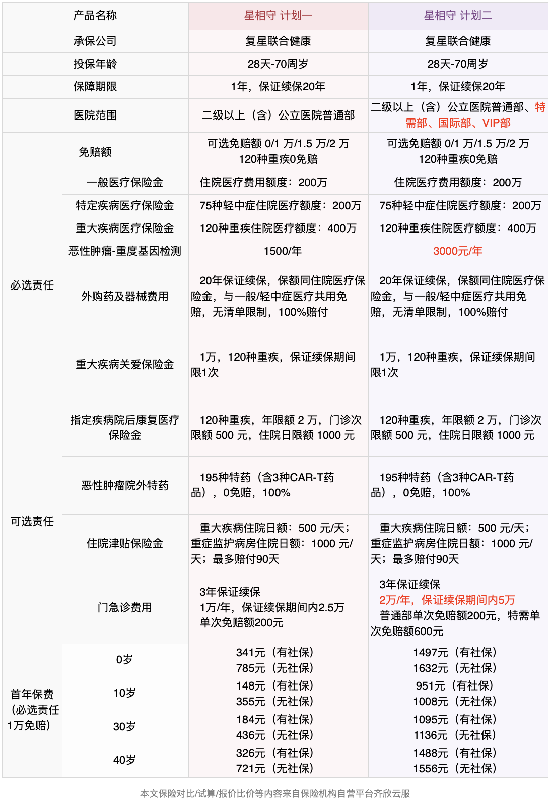
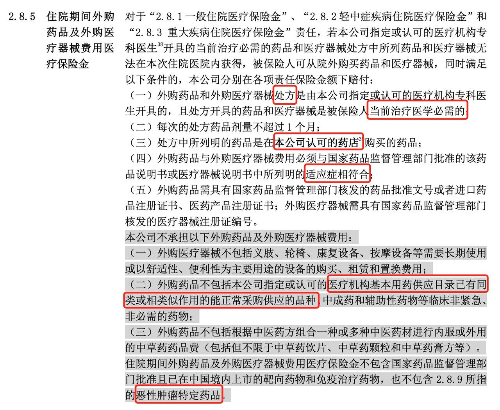
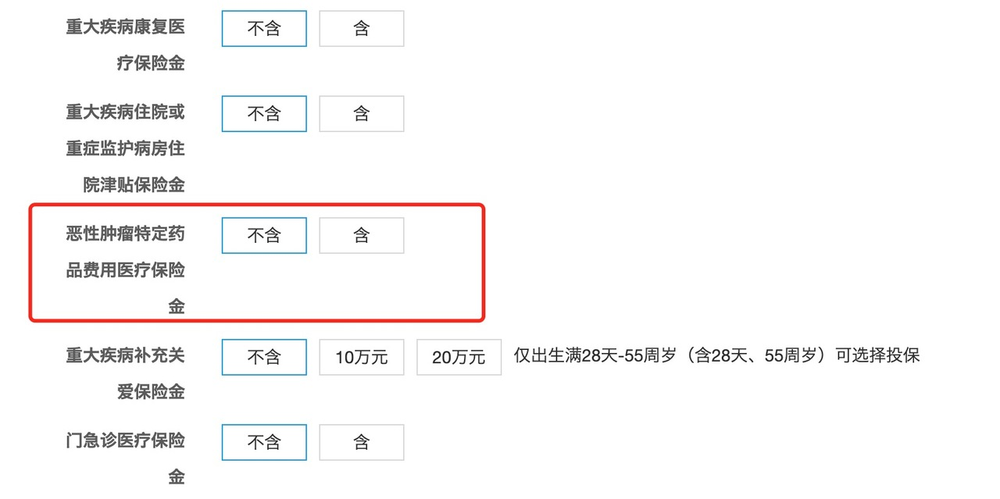

# 新款百万医疗险评测，看病就医还有哪些好选择？

最近，DRG 医保改革、集采、原研药等热词屡次登上热门，百万医疗险还有用吗？还有没有必要买？随着医疗环境的变化，医疗险也不是一成不变的。

在医疗政策发生变化的同时，保险公司也在研发新的医疗险，以适应新的就医和保障需求，医疗险也迎来了新产品、新趋势。

今天我们就来聊聊这个话题，并结合一款最新的医疗险评测，看看在目前的形势下医疗险还能给我们提供什么解决方案～

* 百万医疗险的作用是什么？还有必要买吗？
* 新款医疗险评测：复星联合健康 星相守

[百万医疗险的作用是什么？还有必要买吗？](https://youzhiyouxing.cn#1)

[新款医疗险评测：复星联合健康 星相守](https://youzhiyouxing.cn#2)

## 百万医疗险的作用是什么？还有必要买吗？

我们都听说过身边的人因为高昂的医药费用而陷入困境。为了避免在生病时遭遇财务压力，越来越多人开始关注医疗险，提前做好准备。

不同的医疗险每年的保费从几百块到上万元都有，大部分家庭最适合的就是百万医疗险。关于百万医疗险的作用、如何挑选百万医疗险，之前也写过 👉 [如何挑选百万医疗险?](https://youzhiyouxing.cn/n/materials/1813)

最近关于医疗政策变化的新闻不少：DRG医改、集采、进口药在公立医院越来越难开了……

一方面，DRG 医改一定程度上避免了过度医疗、降低医疗成本；另一方面，对于患者来说，小病小痛、治疗费用不高的情况下可能影响不大，**而如果遇到疑难杂症、想用先进的药品和治疗手段、对医疗品质有更高的追求，就会受到 DRG 的限制。**

在这样的趋势下，公立医院普通部更多地是用来满足基本的医疗需求。而如果想在药品、治疗上拥有更多选择权，公立医院国际特需部、私立医院可能是更好的选择。

百万医疗险的覆盖范围是公立医院普通部，有人问，**百万医疗险是不是就没用了？医改控费，看病的治疗费还会很高吗？想开原研药、进口药还能怎么办？**

受限于医院范围，百万医疗险对医疗品质的提升作用有限，无法借助百万医疗险这个工具实现医疗自由、用药自由。

但这并不意味着百万医疗险就「没有用了」。**如果遇到大病，依然可能会花很多钱，此时百万医疗险还是能够报销大额医疗费，对普通人来说还是很有必要的。**

现在，一些百万医疗险也针对 DRG 进行了升级。一些比较优秀的百万医疗险可以覆盖外购药费用、康复费用、CAR-T治疗、质子重离子治疗等，同时提供健康管理相关的增值服务，拓展了保障范围。

当然，如果预算十分充裕，也可以考虑含国际特需部、私立医院的中高端医疗险，就医环境更舒适、医疗资源的选择也更多。

## 

## 新款医疗险评测：复星联合健康 星相守

这篇文章我们评测的是一款刚刚上线的医疗险——复星联合健康星相守长期医疗。结合当下的就医需求，星相守在保障的设计上也有很多突破：

* 多种免赔额可选，支持 0 免赔
* 保障全面，包含院外购药（不限清单）、住院前后门急诊拓展至 45 天
* 计划一（普通版）、计划二（特需版）均可保证续保 20 年

**多种免赔额可选，支持 0 免赔**

**保障全面，包含院外购药（不限清单）、住院前后门急诊拓展至 45 天**

**计划一（普通版）、计划二（特需版）均可保证续保 20 年**

星相守长期医疗分为 2 个计划，计划一覆盖的医院范围是公立医院普通部，保障扎实、性价比高，适合大多数人；计划二除了公立医院普通部，还拓展了公立医院国际部、特需部，保障范围有所升级，适合预算更充足、想提升医疗品质的人。

从保障内容上看，现在比较优秀的百万医疗险都能达到上百万的保额、保证续保 20年、可选的附加保障丰富，星相守长期医疗也不例外。

在这里还是挑重点说说：

**▏多个免赔额选项，可选 0 免赔**

目前多数百万医疗险的免赔额多在 1 万元左右，很少可选 0 免赔，星相守可以选 0 免赔、1 万、1.5 万、2 万免赔额，120 种重大疾病自带 0 免赔。0 免赔的好处是降低了理赔的门槛，小额的住院费用也可以得到报销，保障更全面。

如果选了免赔额，星相守还有无理赔免赔额递减的规则，一年无理赔可减 1000 元，最多减 5000 元。如果是 2 人以上的家庭投保，还可以共享免赔额。同时，如果参加指定体检项目的话，体检费用也可以用来抵扣免赔额。

**▏住院前后门急诊天数拓展到 45 天**

星相守在住院前后门诊的保障天数上也是第一梯队，目前市面上的百万医疗一般覆盖住院前 30 天到后 30 天的门急诊费用，星相守延展到了前 45 天到后 45 天，住院前的检查、住院后复查等等都能涵盖。

**▏含外购药品及医疗器械，不限清单，保证续保 20 年**

所谓的「外购药」，意思就是到医院外面去购买药品。目前院外购药已经不是一个新鲜事，随着 DRG 医改，这个情况可能会越来越普遍。比如一些特效药、新药、原研药等，如果是不在医保目录内的药品，医保是报不了的，那么这类包含外购药品和医疗器械的医疗险就能提供一定的帮助。

在之前，百万医疗险的「外购药」保障通常是限制药品清单或疾病种类的，主要覆盖的是一些重大疾病用药，比如恶性肿瘤特效药。

星相守在这一点上的升级就是没有对药品的具体清单作出限制，并且也是保证20 年续保。

不过，无清单限制并不意味着完全的用药自由，外购药仍需满足一系列条件，例如，很多产品会在合同中约定，必须由指定医疗机构的专科医生开具处方，且外购药品不能包含医保基本用药目录中已有且可正常采购的品种。在实际操作中，符合这些条件仍有一定难度。

（截图自星相守保险合同）

此外，*基础责任中的外购药不包含恶性肿瘤特定药品*，这个保障在可选责任中，也是保证 20 年续保的，建议大家还是勾选上。

如果遇到需要院外购药的情况，具体的流程是拿着医生开的处方，去保险公司认可的药店购买，再找保险公司理赔。目前百万医疗险的院外购药都有处方限制，虽然做不到完美解决，但已经是目前很好的解决方案。

**▏预算充足可选：指定疾病康复医疗保险金**

这项保障是可选保障。如果得了 120 种重大疾病，需要康复疗养，最高可以报销 2 万元，门诊次限额 500 元，住院日限额 1000 元。

大病治疗中，康复治疗至关重要。这个过程做好了，不仅可以帮助患者恢复身体功能，还能降低复发的风险，对生活品质也有帮助。如果说由于 DRG 限制了住院天数，需要转入康复机构治疗等情况，这项保障也可以覆盖一部分。

**▏预算充足可选：普通门急诊医疗费用，3 年保证续保**

如果日常去普通门急诊就医的频次比较多， 比如低龄的小朋友、免疫力比较差的人，想要覆盖小病小痛的门诊费用，星相守计划一可以附加 1 万元的门急诊费用，次免赔为 200 元，100% 赔付。3 年保证续保在门诊保障中也是很少见的，不用担心 3 年内停售或健康情况变化不能续保的问题。

总结一下，作为一款百万医疗险，星相守的保障全面，亮点不少，有很多针对现在就医需求的新升级：涵盖外购药和癌症特药、住院前后门急诊天数拓展到 45 天、最低可选 0 免赔、可附加门诊。如果还没有配置百万医疗险，星相守计划一就是目前第一梯队的百万医疗险之一。

如果对医疗品质要求比较高、预算充足，星相守的计划二将保障范围拓展到了公立医院的国际部、特需部、VIP部，能保证续保 20 年。

**▏特需医疗也是保证续保 20 年**

保证续保 20 年的百万医疗险已经很常见了，而星相守计划二这个含特需的医疗险也是保证续保 20 年，在条款约束上是目前含特需的医疗险中稳定性最好的。

目前市面上含国际特需部、含私立医院的医疗险，不管是中端医疗险还是高端医疗险，大部分的还是一年期的产品。除了星相守这款医疗险，还没有看到第二款既能保障国际特需部、保证续保时间还长达 20 年的医疗险。

在消费者的角度，医疗险的稳定性是很重要的，毕竟谁也不想刚买几年医疗险就遇到停售，如果此时身体情况不太好、过不了健康告知，在医疗险的选择上就会十分被动。而在保险公司的角度来说，长期稳健地经营一款医疗险也很有难度，尤其是含特需的医疗险就更具考验，可见复星联合健康在这一点上对自己的实力还是十分有信心。

**▏可选特需门诊保障**

星相守的计划二可以附加普通门急诊医疗费用，保额 2 万元/年，保证续保 3 年。

平时公立医院普通部人很多，国际特需部在就医体验的舒适度上要好不少，如果看门诊比较多，含特需门诊的医疗险还是很实用的，多花点保费，节省的是带孩子看病的时间。

星相守支持给未成年人单独投保，对家长受限于健康情况不能和孩子一起投保的家庭比较友好。需要注意的是门诊有次免赔额限制，普通部次免赔额 200 元，特需医疗次免赔额 600 元，一些单项治疗也有最高额度或次数限制，看重这方面可以特别留意。

综合来看，作为一款能覆盖特需部、国际部的医疗险，星相守计划二最大的亮点就是保证续保 20 年，想要升级就医品质、对续保稳定性要求比较高的可以重点关注这一款。

## 结语

总而言之，星相守这款医疗险的出现还是十分令人欣喜的：不限清单的外购药品保障、可选 0 免赔、特需医疗也可保证续保 20 年，相信能够满足很多人在现阶段对医疗险的需求。

**如果想用医疗险转移大额就医费用，可以选择星相守计划一，妥妥的市场第一梯队的百万医疗险。如果预算充裕，可以选择包含国际特需部的星相守计划二，可以在一定范围内提升就医品质、拥有更多就医选择。**

随着 DRG 的推进，医疗险的升级可能会成为一个趋势，星相守做出的创新和突破相信也会有越来越多产品跟上，后面有好的医疗险产品我们也会陆续更新～

还有其他问题？欢迎留言、咨询～

产品链接：

[星相守 - 个人版](https://cps.qixin18.com/apps/cps/bxz1101818/product/detail?prodId=105011&planId=130328&tenantId=0&createTime=1739948419824)

[星相守 - 家庭版](https://cps.qixin18.com/apps/cps/bxz1101818/product/detail?prodId=105012&planId=130329&tenantId=0&createTime=1739948441329)

> 法律声明 本文所载内容皆以交流分享为目的，仅供参考。本文所涉保险对比/试算/报价比价等内容均来自保险机构自营平台齐欣云服，有知有行力求本文内容的准确可靠，但对相关信息的准确性、可靠性、时效性及完整性不作任何明示或暗示的保证。有知有行提示您，保险配置方案请您结合自身情况独立判断，或预约专属保险顾问进行咨询。如需转载或引用本文所述内容的任何文字、图片、音频或视频，请注明出处。转载前请与有知有行取得联系并经同意，转载时须注明来源及作者。
