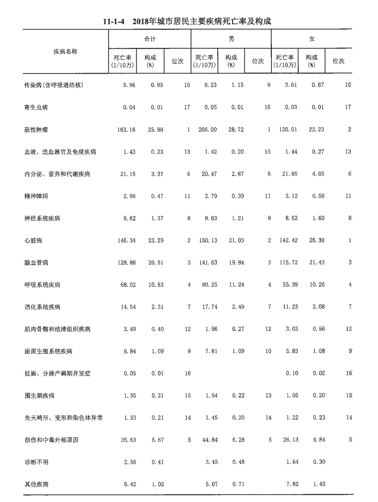
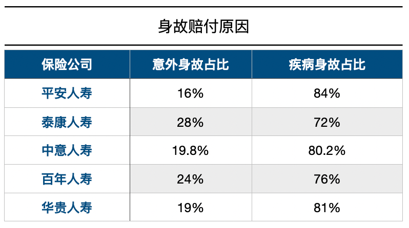
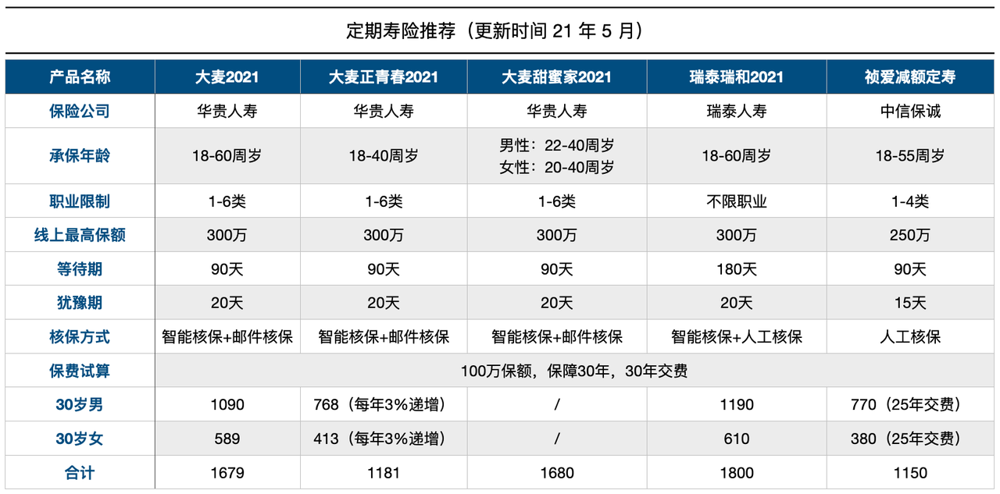

# 有了意外险，为什么还要买定期寿险？

上周，贝壳创始人左晖去世的消息传出之后，有知有行内部掀起了一阵买定期寿险的风。我很欣慰，大家确实是一群很有责任感的青年。

我一直认为定期寿险是被严重低估的险种。很多人会困惑，意外险里不是有意外身故，为什么还要买定期寿险呢？今天我就从以下两个方面，来聊聊这个问题。

1. 意外险和定期寿险保障责任有什么差异？
1. 疾病身故和意外身故哪个概率更高？

意外险和定期寿险保障责任有什么差异？

疾病身故和意外身故哪个概率更高？

我很能理解大家买保险怕浪费的心理，是不是有了这个就不用买那个了？但大多数情况是，不同险种的保障责任可能有交叉的部分，比如意外身故，但不可能是完全重合的。如果完全重合，另一个险种的存在就没有意义了。我们能做的，是学会理解和接受重合的这部分，当作对这部分的加强保障。

那意外险和定期寿险，在保障责任上有什么差异呢？

意外险的主要保障责任为*意外身故、意外伤残和意外医疗。*

定期寿险的保障责任为*身故和全残（有些产品也可能没有）。*它的身故既包括意外身故，也包括疾病身故。

很多人买意外险，是当作定期寿险来买的，担心如果不幸身故，对家庭产生影响。但实际上，意外险只保障意外身故，并不包括疾病身故。而且 意外险中的意外，是有严格的定义的。

我们可以再来看看，疾病身故和意外身故究竟哪个概率更高。

大家可以先凭直觉来投个票，疾病身故和意外身故哪个发生的概率更高？

1. 疾病身故
1. 意外身故

疾病身故

意外身故

答案是疾病身故。

这个结论来自两方面的数据。

首先是官方统计的居民死亡原因构成。根据卫健委编写的《中国卫生健康统计年鉴》里「2018年城市居民主要疾病死亡率及构成」来看，因损伤和中毒外部原因（包括机动车辆交通事故、意外中毒、意外跌落、火灾、溺水、触电等）死亡的，不到 6%。而恶性肿瘤、心脏病、脑血管病，都超过 20%。

你看，差距还是很大的。

另一方面是保险公司理赔年报，部分公司有就身故赔付原因进行统计。

统计显示，疾病身故的比例也是远高于意外身故的。

对了，*买了定寿，一定要把保单信息同步给家人朋友，*因为它的理赔，大概率是要家人来申请的。

所以，如果是想保障身故，只投保意外险的话会有覆盖不到的部分，还是要投保定期寿险。而对于意外险，我个人更在意的保障责任是意外伤残和意外医疗。

定寿保障的是身故和全残，都是比较极端的事故，所以它*比较适合承担着家庭责任的人来投保。*

比如上有老下有小的中年人，比如刚背上房贷车贷没多少积蓄的小夫妻，又比如需要考虑父母未来养老的的单身人群。

但我会发现，有一些没有负债且有一定存量资金的人，也会买。开始的时候会有些不解，后来渐渐理解，买保险，除了满足自己真实的保障需求，还是在满足自己的内心安全感。

而定期寿险就是这样的安慰剂，能够帮助我们在面对不确定的未来时，多一份确定感和安心感。

定期寿险应该怎么选我在 [之前的文章](https://youzhiyouxing.cn/n/materials/580) 里有详细介绍过，简单来说，在符合健康告知、免责条款少的产品里，选一个保费最低的就可以了。

目前比较推荐的产品有五款：大麦 2021、大麦正青春 2021、大麦甜蜜家 2021、瑞泰瑞和 2021、祯爱减额定寿。

这几个的产品的免责条款都是最少的，只有三条：

> 投保人对被保险人的故意杀害、故意伤害；被保险人故意犯罪或抗拒依法采取的刑事强制措施；被保险人自本合同成立或者合同效力恢复之日起两年内自杀，但自杀时为无民事行为能力人的除外。

1. 投保人对被保险人的故意杀害、故意伤害；
1. 被保险人故意犯罪或抗拒依法采取的刑事强制措施；
1. 被保险人自本合同成立或者合同效力恢复之日起两年内自杀，但自杀时为无民事行为能力人的除外。

投保人对被保险人的故意杀害、故意伤害；

被保险人故意犯罪或抗拒依法采取的刑事强制措施；

被保险人自本合同成立或者合同效力恢复之日起两年内自杀，但自杀时为无民事行为能力人的除外。

接下来分别说说产品的特点。

## 1. 大麦系列

大麦系列的承保公司都是华贵人寿。华贵在我眼中，是个特别的存在。大部分保险公司，线上主推的产品都是重疾或者年金险，而华贵这几年，变着花样的出定期寿险和终身寿险。

产品矩阵也十分强大，有适合大部分人投保的大麦，有适合年轻人投保的正青春，有适合夫妻投保的甜蜜家。

*大麦 2021*：保额和保费都是固定的，性价比在定寿中非常高。

*大麦正青春 2021*：保额固定，保费以每年 3% 递增，前几年的保费特别便宜，总保费会比大麦 2021 高一些。

*大麦甜蜜家 2021*：保额和保费都是固定的，一张保单保障两个人，需要夫妻两人选择同样的保额和保障责任一起投保。最大的特点是自带豁免，夫妻任一方发生身故或全残，保费就不需要继续交费了。如果因同一意外事故导致身故或全残，分别会按照保额的两倍来赔付，总共赔付四倍保额。夫妻离婚的话，也可以进行保单拆分。

## 2. 瑞和 2021

瑞和对投保人的职业没有限制。另外跟大麦相比，没有问询到肺结节疾病、肝炎、接受器官移植，这三类身体异常的朋友，可以重点考虑。

但对于过去投保时核保结果的问询，更严格一些。

瑞泰：被保险人是否曾被保险公司拒保、延期承保、附加条件承保、加费或解除过保险合同？

大麦：被保险人过去两年内投保人寿保险或复效申请时是否被保险公司拒保、延期？是否曾申请或获得癌症或重大疾病保险理赔？

所以投保顺序很重要。如果身体有异常，就先买上健康告知宽松的。

## 3. 减额定寿

上面几款产品的保额都是固定的，祯爱减额定寿的保额是逐年递减的，有效保险金额 = 剩余保单年度 ÷ 总保单年度 × 基本保险金额。

保费固定，会比定额的低出一截，适合房贷多，保费预算又有限的人来买。

总结一下：

* 大麦 2021 适合大多数人投保；
* 大麦正青春 2021 适合年轻人投保；
* 大麦甜蜜家 2021 适合夫妻都要买定寿，并且夫妻承担的家庭财务责任相当的家庭投保；
* 瑞和 2021 适合有肺结节疾病、肝炎、接受器官移植异常的人投保；
* 祯爱减额适合房贷高并且预算有限的人投保。

大麦 2021 适合大多数人投保；

大麦正青春 2021 适合年轻人投保；

大麦甜蜜家 2021 适合夫妻都要买定寿，并且夫妻承担的家庭财务责任相当的家庭投保；

瑞和 2021 适合有肺结节疾病、肝炎、接受器官移植异常的人投保；

祯爱减额适合房贷高并且预算有限的人投保。

以上产品均可以在 App 「我的 - 保险服务」上找到，也可以通过 [这个链接](https://cps.qixin18.com/m/zc1059261/media-39764.html?footerBool=1) 查看。

> 本文章所载信息仅供参考，不构成任何投资建议。如转载使用，请参考[《文章转载声明》](https://youzhiyouxing.cn/agreements/ARTICLE_REPRINTED)。
