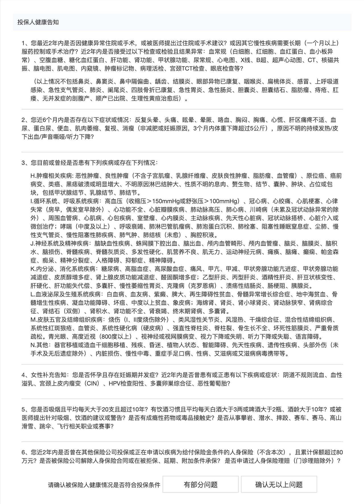

# 没搞懂健康告知，小心保险白买了

保险拒赔的 [原因有很多](https://youzhiyouxing.cn/n/materials/29)，今天九九想和你详细聊聊不符合健康告知这一条。

平时在社交媒体看到相关的拒赔案例，如果确实是因为没有如实告知造成的，我一般就默默划过了。但是最近遇到两件事，让我有点揪心。

一件事情是，前几天有人跟我咨询保险，我问有没有什么住院、门诊和体检异常的时候，他只提到了一项异常。

后来我要过来完整的体检报告一看，发现有好多项，而且其他的也有几项是对投保有影响的。如果我没继续问，或者没看体检报告，只是根据他提到的异常来推荐产品了，那是不是就为以后的理赔纠纷埋下隐患了？

另一件事情是，有一个朋友从我这儿咨询，这个朋友转手把产品链接发给了他的朋友，他的朋友从产品链接就直接投保了。

后来我加了微信问了身体情况，发现是不符合健康告知的，又协助退保，现在准备复查之后再投保。如果我没有加微信问身体情况，就让他自己买上了，是不是又是一个隐患？

互联网投保过于方便，如果健康告知的问题没被重视，理赔纠纷会越来越多。

当然，这类事情的发生，肯定不仅投保的人有责任，保险公司也有责任，健康告知过于专业，普通人也看不明白。

不少人都没弄懂健康告知是什么，看着别人推荐，就火速下单了。或者对健康告知加上了自己理解的部分，如果医生说的是没啥事，就默认为不影响投保。

我知道会有人问，保险公司理赔的时候查那么严，就不能在投保前查吗？

目前，保险公司对个人健康情况的调查主要依赖于工作人员的走访、排查以及面谈，要想在投保前获取到投保人的健康数据并且完成核保，并不是一件容易的事。不仅数据难以获取，成本也很高。

不过，业内有家保险公司风控系统很强大，经常拦截投保人，并告知不符合投保要求。最近在查询他们家的风控拦截原因的时候，发现他们可以通过第三方拿到医院的就医数据了。但，如果被拦截了也就没办法投保了，并不能给出灵活的核保结果。

所以，依赖保险公司方面来把控健康告知，短期来看挺难实现的，即便有些渠道开展了双录，也并不代表大家真的理解了健康告知的内容了。

最重要的，还是大家要提高健康告知的意识，对自己的身体健康状况有一个清晰的认知。在看《慧择 2020 保险消费指数报告》的时候，我发现了一个很惊人的数据。

报告显示，无法正常承保用户占比高达 27%，其中被拒绝承保者占 20%，被除外承保者占 7%。也就是说，十个人投保，可能会有三个人是不能正常投保的。

这个比例其实已经很高了。所以，如果保险买得太顺利，也是值得你留个心眼，打个问号的。

那健康告知应该怎么做呢？

健康告知通常是下图的样子，就是保险公司给出一堆问题，然后我们来选是或者否。

除了认真读题，我们还需要对疾病有一定的了解。不如我们来做三道题，看看自己是否掌握了健康告知的精髓。

1、小明半年前做了痔疮手术，住院 5 天，是否涉及下面这条健康告知呢？ 被保险人过去2年内，因病住院、手术或因病遵医嘱需连续服药超过 30 天。 A. 涉及 B. 不涉及

2、小红三年前体检发现子宫肌瘤，她涉及以下哪些健康告知呢？**（多选）**A. 肿瘤 B. 良性肿瘤 C. 以上均不涉及

3、小雨体检发现甲状腺结节，去看医生，医生说没事儿，定期复查就行。他涉及以下哪些健康告知呢？**（多选）**A. 性质不明的结节 B. 结节 C. 甲状腺结节 D. 甲状腺疾病 E. 以上均不涉及

正确答案应该是 A，AB，ABCD。你做对了吗？

是不是感觉字都认识，连在一起就有点晕了？是不是有的人还做成了单选题？

那在看健康告知的时候一定要更加认真地读题目。

健康告知就是这样经常具有迷惑性，而且没有标准问法，不同产品的健康告知会不一样。而且更关键的是，它跟我们理解的健康大大不同。我们一般觉得，没得大病就是健康，但是保险公司会问得更细一些。

对于健康告知，我们要先理清楚自己的身体情况。在投保之前，好好收集一下过往的医疗记录——整理出来什么时间、什么原因、有过哪些就医，医生诊断是什么，做了哪些检查。然后再去看产品，是否涉及健康告知，如何健康核保，或者直接把核保的问题丢给保险公司、保险顾问。

最重要的是，不要抱有侥幸心理。真的不涉及健康告知的人，投保肯定很顺利。有过体检异常的人，总是希望能正常投保，可能会选择性叙述自己的异常情况。

九九在这里提醒你，投保的时候，一定要坦诚相待。只有坦诚相待，才能避免后续的权益受到影响。

对于健康告知还有疑问的朋友，也欢迎在想法区提问。

> 本文章所载信息仅供参考，不构成任何投资建议。如转载使用，请参考[《文章转载声明》](https://youzhiyouxing.cn/agreements/ARTICLE_REPRINTED)。
