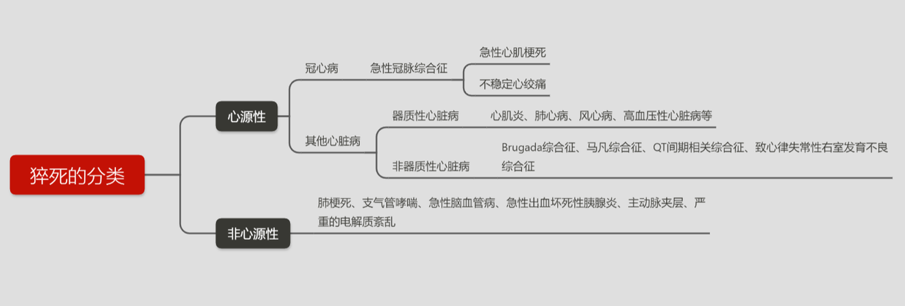
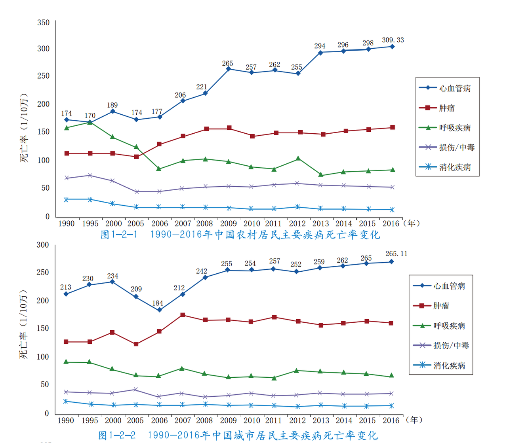
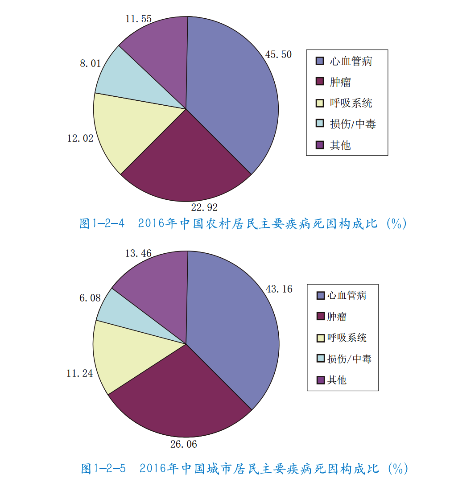
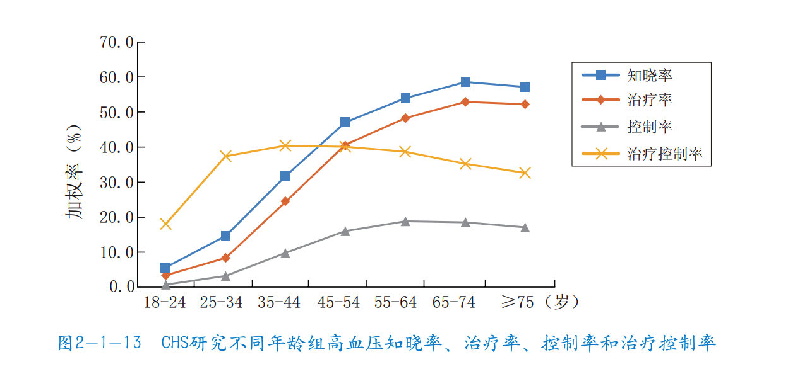

# 职场人担心的猝死，哪种保险可以赔？

前段时间，互联网白领下班路上猝死、43 岁外卖员猝死事件接连登上了微博热搜。

看到这些新闻，编辑部忧心忡忡地问我，像外卖员这样的群体该怎样保障自己的权益呢？

我很悲观地回答，这要靠外卖员本人提高自己的风险意识，同时，平台方应该根据外卖员发生的事故，相应去提高这方面的保障。

后来，平台方在回应的时候，也宣布将外卖员的保额提升到 60 万元。对外卖员来说，这是确保自己有所保障的最可靠方式。

这些年来，职场人猝死事件屡屡出现在社交媒体上。不是每次事故都可以依靠舆论来获取抚恤金，能成为新闻的，也不过是众多事件中的冰山一角。

今天，九九就来和大家好好聊聊，作为职场人，我们应该怎样正确认识猝死这件事，以及哪些保险可以作为保障。

资料显示，我国每年有 180 万人死于猝死，也就是说，平均每分钟都会有 3～4 人猝死。

那猝死是什么？为什么会发生猝死呢？

世界卫生组织对猝死的定义是：*平素身体健康或貌似健康的患者，在出乎意料的短时间内，因自然疾病而突然死亡。*从发病到死亡多长时间才能认定为猝死呢？目前存在多种说法，世界卫生组织认为的时间是 6 小时之内。

临床上猝死可分为两大类：*心源性猝死和非心源性猝死。*心源性猝死也称为心脏性猝死，是指由于心脏原因导致的患者突然死亡，在所有猝死患者中占绝大多数；非心源性猝死也称非心脏性猝死，是指因心脏以外原因的疾病导致的突然死亡。

我去咨询医生的时候，他说猝死一般都是有基础病因的，大部分都与心血管疾病有关，只是可能之前没发现而已。美国心脏协会研究指出，25%左右的冠心病患者以心脏性猝死为首发临床表现。

有些人或许会觉得心脑血管疾病离自己比较遥远，事实可不是这样。

《中国心血管报告》（2018）显示，我国心血管病患病率处于持续上升阶段，推算心血管病现患人数 2.9 亿。*2016 年心血管病死亡率仍居首位，高于肿瘤及其他疾病。*

来源：《中国心血管报告》（2018）

在城乡居民疾病死亡构成比中，心血管病占首位，差不多每 5 例死亡中就有 2 例死于心血管病。

来源：《中国心血管报告》（2018）

华贵人寿刚刚公布了 2020 年互联网寿险产品理赔报告（定期人寿保险、终身人寿保险产品责任均为身故或全残）。

报告显示，出险原因疾病占 81% ，意外占 19% 。在疾病出险原因里，他们对猝死还特地进行了单独统计，心脑血管疾病占 26% ，猝死占 19% 。

我再来举个大家都熟悉的例子——高血压。

高血压是非常常见的慢性病了吧？常见到很多人都没有加以重视。那每年我国有多少人死于高血压呢？

这个数字在 2013 年是 250 万，占全部死因的 27.5%。

而高血压的知晓率，治疗率，控制率以及治疗控制率又有多少呢？

来源：《中国心血管报告》（2018）

上图数据可以用「四低」来概括：知晓率低（40 岁以下高血压患者知道自己患有高血压的比例不到三分之一）、治疗率低（患者中接受合理治疗者最高也仅仅过了一半）、控制率低（大多数高血压患者的血压没有得到满意控制）、治疗控制率低（接受治疗的患者中只有不到一半的血压得到满意控制）。

是不是还挺惊人的？

或者你可以想一下，是不是听过谁谁谁平时都没去过医院，突然发现脑出血了这样的事情？

有的时候疾病早已来临，只是因为症状不明显，或者没有被重视而已。

所以我个人认为，预防猝死又或者心脑血管疾病，除了日常生活方式的改变，还有很重要的几点是增加专项检查、身体不适及时就医、不是为了体检而体检，以及注重慢性病的长期管理。

说回保险，那有没有什么保险可以保障猝死呢？

其实这个问题可以再进一步想一下，是只担心猝死吗？其他原因的死亡怕不怕？对家庭和家人有没有经济上的影响？

很多猝死事件之所以掀起舆论风波，几乎都是因为这个家庭非常需要钱，这是很现实的问题。

前面提到，猝死的原因是突发疾病身故。所以，*首先是能保障疾病身故的险种——寿险和带身故责任的重疾险。*不过需要注意一下，带身故责任的重疾险，理赔完重疾之后，通常就不再赔付身故了。

那意外险呢？严格来说，意外险只保障意外导致的身故。虽然猝死在我们看来也属于「意外」，但我们还是得区分常说的意外以及意外险中意外的定义。生活中计划之外的事情我们都可以称之为意外，比如意外失业，意外生病，意外得到一笔钱。

而意外险中的意外有严格的定义，需要具备以下四个要素：*外来因素造成的、非本意的、突发的、非疾病的，所以猝死是不在意外险的保障范畴的。*不然如果意外险是以我们常说的意外作为理赔范畴，那就没有其他险种什么事了。

但是*有些意外，会在保障责任里增加一条，猝死保障或者急性病身故。*对发病后的死亡时间，理赔资料都有一定的要求，通常需要医疗机构或者公安部门出具相关证明。

我之前问过医生，他说如果送到医院时已经确认死亡，一般是不会出具这个证明的。如果对死亡原因有争议，可以要求进行尸检。所以我个人认为，如果是在意外险中理赔猝死，是有一定难度的。如果在意这一点，不如投保寿险让人踏实。

定期寿险是我很喜欢的险种，我觉得这是上有老下有小的中年人，面对「意外事故」最体面的方式。

我在[《一个被低估的险种》](https://youzhiyouxing.cn/n/materials/44)中详细介绍对比过定期寿险和终身寿险的优点和缺点。对普通家庭来说，买一份定期寿险是更合适的选择，它能保证在主要责任期内，即从开始工作到退休这段时间，家庭财务情况不会因主要劳动力离世而受到影响。

虽然在涉及生死的问题上谈钱显得俗气，但我们不得不谈。毕竟，生死从来不是只关乎一人的事。斯人已逝，但留下来的人，生活还要继续。

当然，在保险之外，更重要的是注重健康，避免此类悲剧的发生。

今天这篇文章可能有一点沉重，但是在结尾，还是要告诉大家一个好消息，[知识体系保险保障](https://youzhiyouxing.cn/n/skeleton)已经基本竣工啦！大家可以随心查阅保险保障相关的各个知识点，阅读文章。

如果你有其他问题，也欢迎你在想法区留言提问～

> 本文章所载信息仅供参考，不构成任何投资建议。如转载使用，请参考[《文章转载声明》](https://youzhiyouxing.cn/agreements/ARTICLE_REPRINTED)。
