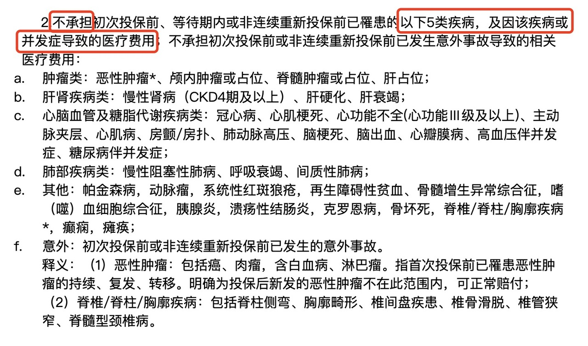
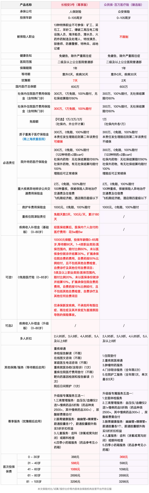
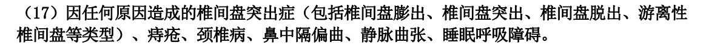
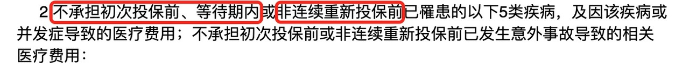

# 身体异常的朋友，医疗险有了新选择

在[「身体异常，如何选择医疗险？」](https://youzhiyouxing.cn/n/materials/1738)中，我们介绍了因为身体原因买不了普通百万医疗险的人有哪些医疗险的选择，分别是众民保、防癌医疗险和惠民保。

最近，长相安 3 号上线，又给我们增加了一个新的选项。

虽然都叫「长相安」，但跟同系列的其它产品不同，长相安 3 号不是一款针对标体的、保证续保 20 年的产品。

产品设计上，长相安 3 号是对标着众民保来做的。这两款产品最大的特点就是**没有健康告知，身体有异常，甚至癌症、心脑血管疾病患者也能投保。**

能投保还不够，大家更关心的是：已有的身体异常能不能保，能不能赔，能赔多少。

这两个产品在合同中明确列出了**「重大既往症」**，对于这些疾病，**可保不赔**。简单理解就是，明确列出的既往症及相关并发症导致的医疗费用不赔，但**其他疾病仍按约定赔付**。

（截图自众民保特别约定）

看文字有点难理解，做两个小练习：

Q1 ：小明过去得过甲状腺癌，投保后是所有的癌症都不赔付吗？

Q2：小丽投保的时候有肺结节，后续肺结节产生的住院医疗费用，能不能赔？（假设花销已高于免赔额）

答案揭晓👇，你答对了吗？

A1：甲状腺癌属于上图中的「肿瘤类」，因此，不赔甲状腺癌的复发、转移、持续或相关并发症，但是别的不相关的癌症都是可以理赔的。

A2：肺结节不属于重大既往症，故后续相关的住院医疗费用，是可以理赔的。

长相安 3 号和众民保在投保上很宽松，**很适合：**

**1、因健康问题无法投保其他医疗险的人；**

**2、想为高龄父母配置医疗保障的人。**

## 长相安 3 号，众民保，怎么选？

长相安3号有经典版、尊享版2个计划。众民保有经典版、臻选版2个计划。不同计划间的区别主要在价格、报销比例、恶性肿瘤院外特药种类上。建议优先考虑报销比例更高的尊享版或臻选版。

本文也以这两个版本来做对比。

⚠️ 长图预警，大家可以先看测评文字，再返回查看表格详情。

下面看看主要的差异点：

**职业限制**

可投保的职业上，众民保不做限制。长相安 3 号明确约定了部分高危职业不可保。

如果是高危职业，选择众民保比较合适。

**免赔额**

长相安3号和众民保都是分项扣除免赔额，即社保内、社保外分别有免赔额。

长相安3号的免赔额有 1 万、2 万、3 万三个选项，但也是社保内外分别扣除。众民保的免赔额不可选，社保内、社保外各1万。

免赔额跟保障成本有关，免赔额越高，保费越低。

这两个产品本身的使用门槛就不低了，个人觉得，没有必要选择更高免赔额的版本。

**社保外未经医保结算的报销比例不同**

社保外住院/特殊门诊费用，先经过医保结算的，长相安 3 号和众民保报销比例都是 100%。但如果未经医保结算，长相安 3 号报销比例还是 100%，众民保就会降低至 60%。

这里受影响情况比较小众，比如医保断缴，未使用医保直接就医。如果出险时未使用医保，社保内部分，两个产品的报销比例都是 60%，社保外部分，长相安 3 号的报销比例则更高。

**质子重离子**

百万医疗险常提到质子重离子责任，这项相对「小众」的治疗手段如今已经为大众所熟知。

这两款产品都覆盖质子重离子治疗，并都限制上海质子重离子医院。不过，众民保规定，一旦质子重离子医疗保险金理赔后，不再接受重新投保。而长相安 3 号则允许在理赔后，第二年继续续保该项责任。

**创新责任**

和众民保相比，长相安 3 号多了两个创新责任。这两个责任都在基础保障中，不需要额外加保费。

一个是重疾住院津贴，确诊合同约定的 120 种重疾并住院，第 4 天开始每天 100 元津贴，限额 180 天，最多能赔1.8万。虽然钱不算多，但获赔概率还是比较大的。

二是疾病收入补偿金，专为 0 - 80 岁人群设定，可以理解为医保结算后，要是医保内自付费用达到一定金额，能拿到一笔赔付金。

如果选的是尊享版，医保自内自付费用（医保结算单上的统筹基金支付范围内费用 - 统筹基金支付金额） ≥ 5万，则一笔赔付 5 万。这个责任的触发门槛其实比较高，但好在不加价，多一层保障总是更好。

**可选责任**

众民保只有必选责任，不提供任何可选责任。

长相安 3 号提供 2 项可选责任，包括 0 免赔小额住院医疗、疾病收入补偿金。

其中，0 免赔小额住院医疗可能是大家比较感兴趣的责任，但它的限制比较多。如果预算宽裕，且详细阅读条款后觉得合适，可以选择添加。如果预算有限，选择不勾选这些可选责任也是完全可以的。

**免责条款**

长相安3号和众民保都有免责条款，包括重大既往症、先天性疾病、遗传性疾病等，但相比而言，长相安的免责条款更严格一些。

（截图自长相安 3 号免责条款）

上面截图中的疾病，无论是投保前就有，还是投保后确诊，相关的医疗费用长相安 3 号都不报销。

## 怎么选

通过对比可以看出，这两个产品*差异真心不大*。

如果属于高危职业，选择没有职业限制的众民保更为合适。其他情况下，选哪个都不会出错。

作为后续产品，长相安 3 号在责任设计和保障细节上有一些创新和优化，如果你对这些细节比较看重，可以选择长相安 3 号。

如果你更关注免责条款的宽松度，众民保可能是更好的选择。

总的来说，不必过于纠结。如果有疑问，可以点击链接 👉 [预约顾问](https://cps.qixin18.com/v3/m/bxz1101818/reservation?createTime=1736913148986)咨询。听听专业老师的建议。

## 与普通百万医疗险相比，有什么不足？

心动了吗？

对于无法投保普通百万医疗险，又想获得医疗保障的人来说，这两款产品确实让人心动。但同时，我们也需要看看，相比普通百万医疗险，它们有什么不足。

还是那句老话，保障，要保得明明白白。

这两个产品*都是不保证续保的*。

针对不保证续保产品，比较常见的担忧有两个：

一是，身体情况变化后，第二年还能不能重新投保。

这两个产品没有健康告知，只要产品仍在售，无论身体状况如何，下一年都可以继续投保。

关于「重大既往症」，合同中也明确约定：

也就是说，如果是保障期间新出现的属于重大既往症的疾病，续保后仍按合同约定赔付。

二是，产品停售了怎么办？

对于没有重大既往症的人，可以选择市面上类似的其它产品，影响相对较小。但如果已经有了重大既往症（尤其是保障期间新确诊重大既往症），再去投保其他产品时，这部分疾病可能就无法覆盖了，会导致保障的缺失。

长相安 3 号和众民保都是分项扣除免赔额，**即社保内、社保外分别有免赔额**。

举个🌰：

小行阿姨住院共花费 13.5 万元，医保统筹账户支付 4.5万元。自己承担 9 万元 ，其中属于社保内费用 5 万元，社保外费用 4 万元（假设费用都在保障范围内），则赔付金额分别为：

百万医疗险（免赔额 1 万元）：9 - 1 = 8 万元

众民保（社保内/外各 1 万元）：（5 - 1）+（4 - 1）= 7 万元。

如果因小病住院，医疗花销比较低，这两款产品可能就报不了了。对于大的医疗花销，实际报销金额，相比普通百万医疗险，也会低一些。

长相安 3 号和众民保的保障责任涵盖了住院医疗、特殊门诊、质子重离子治疗、特定药品等大部分百万医疗险的核心内容。作为次标体百万医疗险，这样的保障内容已经相对全面。

与一般百万医疗险相比，这两个产品缺少**门诊手术**和**住院前后门急诊**的保障。

门诊手术指的是一些无需住院即可完成的常见手术，比如鼻息肉切除术、摘除脂肪瘤等。

住院前后门急诊则覆盖了住院治疗前后的门诊费用。实际就医中，即使需要住院，也绕不开门诊。一般都是先看门诊，医生再给出住院治疗的建议。在医疗资源比较紧张的地区，从决定住院到真正住上院，往往需要排队一段时间。如果能报销住院前后的门急诊还是能减轻一些负担的。

这两项上，还是有一点遗憾的。

## 写在最后

从对比来看，如果身体条件允许，还是尽量选择像长相安 2 号这样的主流百万医疗险，续保和保障责任上都更有优势。

虽然上面列举了这两款产品的不足，但作为个人，还是挺喜欢这类产品的。

保险是「重要但不紧急」的事，许多人都是在健康出问题后，才意识到需要保障。而为高龄父母投保更是难上加难。这类产品给那些因为健康异常买不了百万医疗险的朋友，开了个大口子，能够在高额医疗费用面前为家庭减轻负担，还是很不错的。

最后，别忘了这两个产品都支持多人投保。如果想为家人一起投保，可以选择家庭单，更加实惠。

产品链接：

**长相安 3 号**

[长相安3号 — 单人版](https://cps.qixin18.com/apps/cps/bxz1101818/product/detail?prodId=104987&planId=130294&tenantId=0&createTime=1736908933501)

[长相安3号 — 多人投保](https://cps.qixin18.com/apps/cps/bxz1101818/product/detail?prodId=104986&planId=130292&tenantId=0&createTime=1736908974445)

**众民保**

[众民保 — 单人版](https://cps.qixin18.com/apps/cps/bxz1101818/product/detail?prodId=104832&planId=130013&tenantId=0&createTime=1736909022609)

[众民保 — 多人投保](https://cps.qixin18.com/apps/cps/bxz1101818/product/detail?prodId=104833&planId=130015&tenantId=0&createTime=1736909052632)

> 法律声明 本文所载内容皆以交流分享为目的，仅供参考。本文所涉保险对比/试算/报价比价等内容均来自保险机构自营平台齐欣云服，有知有行力求本文内容的准确可靠，但对相关信息的准确性、可靠性、时效性及完整性不作任何明示或暗示的保证。有知有行提示您，保险配置方案请您结合自身情况独立判断，或预约专属保险顾问进行咨询。如需转载或引用本文所述内容的任何文字、图片、音频或视频，请注明出处。转载前请与有知有行取得联系并经同意，转载时须注明来源及作者。
