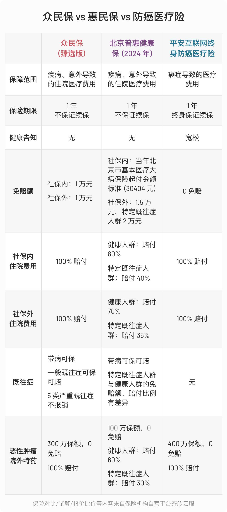
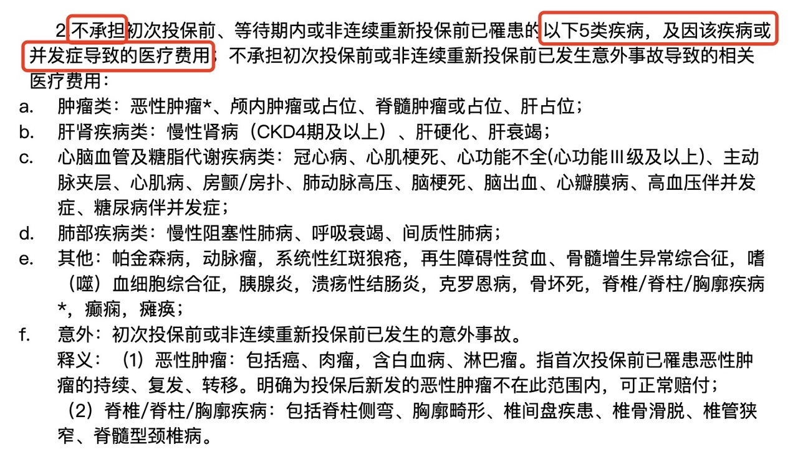
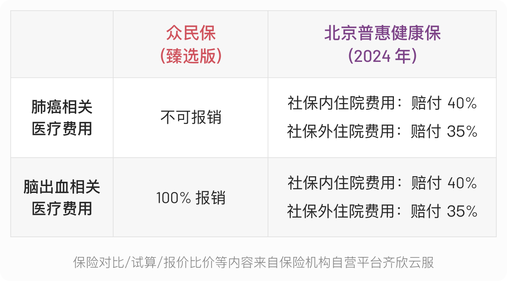
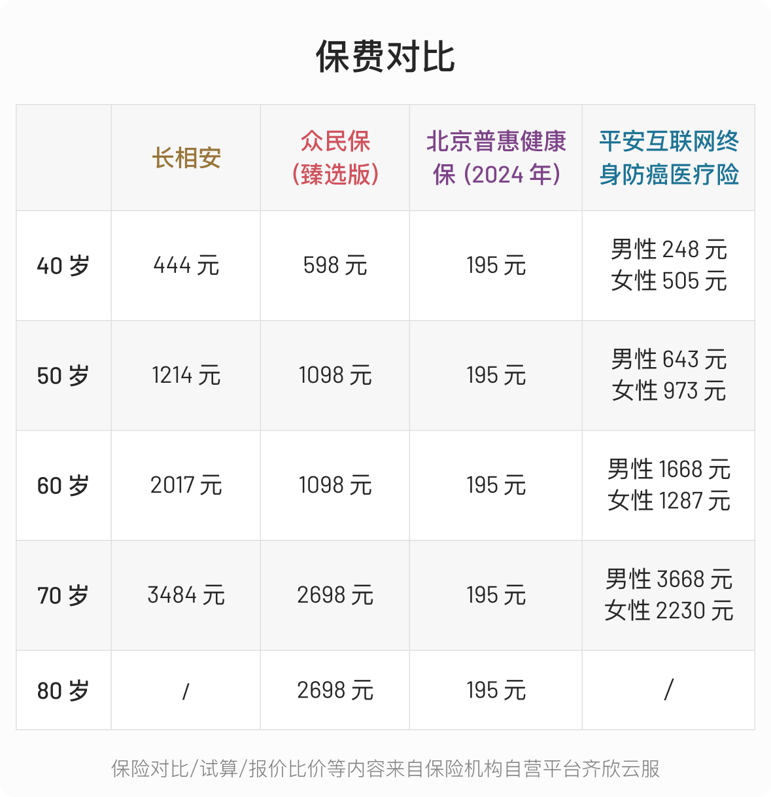

# 身体有异常，如何选择医疗险？

身体异常，买不了百万医疗险怎么办？

很多朋友会选择买惠民保，或者防癌医疗险。

今天，给大家推荐一个新选择，新升级的「众民保」。这款产品没有健康告知，可以带病投保，保障责任也很不错。

买哪个合适呢？这篇文章就跟大家一起对比一下：

* 众民保、惠民保 vs 防癌医疗险
* 众民保 vs 惠民保

众民保、惠民保 vs 防癌医疗险

众民保 vs 惠民保

其中，众民保选的是保障更为全面的臻选版，惠民保则以我所在城市——北京的普惠健康保（2024）为例，防癌险选的是主推产品平安互联网终身防癌。

三款产品的主要情况如下：

## 众民保、惠民保 vs 防癌医疗险

防癌医疗险与众民保、惠民保类产品最大的区别在于*保障范围*。

防癌医疗险，只针对癌症提供保障，不涵盖其他疾病。而众民保和惠民保，不管是疾病还是意外导致的住院医疗费用，只要满足理赔条件，都赔。

差异足够明显，所以也很好做选择。

如果家族中有癌症病史，希望给父母一份可保证续保的稳定保障，可以考虑防癌医疗险。如果希望获得更广泛的医疗保障，包括非癌症的其他疾病，那么另外两个产品会比较合适。

## 众民保 vs 惠民保

对比这两类产品前，需要先了解一个专有名词，叫「*既往症*」，指的就是投保之前，被保险人已知或应该知道的疾病或症状。

对于身体有异常的朋友，最在意的就是当前已有的身体异常，能不能保，能不能赔，能赔多少。

可以把既往症分为两类。

第一类，叫普通既往症，条款中没有明确列出的，都属于这类。

这类既往症，这两个产品不仅可以投保，还可赔。

举个例子，假设投保的时候有肺结节，后续肺结节产生的住院医疗费用只要满足理赔条件也可以赔。

第二类，叫重大既往症。产品条款中会列明，众民保中共列了 5 类，北京普惠健康保列了 6 类。

（截图自众民保特别约定）

对于重大既往症的赔付，两个产品的规则就不一样了。

众民保是可保不赔，该既往症及相关并发症导致的医疗费用不赔，但其他疾病的赔付比例还是 100%。

而北京普惠健康保不仅可保，重大既往症产生的相关医疗费用也可赔。但只要有重大既往症，不管是否是这个既往症产生的医疗费用，都按既往症人群的免赔额、赔付比例来赔。相比健康人群，保障会有比较大折扣。

以小知叔为例，假设小知叔投保时已确诊肺癌，等待期后，突发脑出血，则

接下来，看看**报销金额上的差异。**

影响报销金额的主要是免赔额和报销比例。

涉及的情况比较多，还是以案例来说明。

小行阿姨因上腹部间断性不适入院，检查后诊断胃恶性肿瘤。本次住院小行阿姨共花费 13.5 万元，医保统筹账户支付 4.5万元。自己承担 9 万元 ，其中属于社保内费用 5 万元，社保外费用 4 万元（（假设费用都在保障范围内）。

**情况一：**投保前小行阿姨有糖尿病，但无并发症

对于这两个产品来说，小行阿姨的糖尿病都属于普通既往症。众民保臻选版对此既往不咎，北京普惠健康保也是以健康人群的免赔额、报销比例赔付。

众民保臻选版：（社保内费用 5 万 - 社保内 1 万免赔额）*100% +（社保外费用 4 万 - 社保外1万免赔额）*100%= 4 万元 + 3 万元 = 7 万元

北京普惠健康保：（社保内费用 5 万 - 社保内 3 万免赔额）*80%+（社保外费用 4 万 - 社保外1.5万免赔额）*70% = 1.6 万元 + 1.75 万元 = 3.35 万元

（2024 年度北京普惠健康保社保内免赔额为 30404 元，为方便计算，对比时假设免赔额为 30000 元，下同）

**情况二**：投保前小行阿姨有过脑出血

对于这两个产品来说，脑出血都属于重大既往症。此次因为胃癌出险，跟脑出血无关，不属于重大既往症的并发症，因此众民保臻选版还是正常赔付。而北京普惠健康保则按既往症人群的免赔额、报销比例赔付。

众民保臻选版：（社保内费用 5 万 - 社保内 1 万免赔额）*100% +（社保外费用 4 万 - 社保外1万免赔额）*100%= 4 万元 + 3 万元 = 7 万元

北京普惠健康保：（社保内费用 5 万 - 社保内 3 万免赔额）*40%+（社保外费用 4 万 - 社保外 2 万免赔额）*35% = 0.8 万元 + 0.7 万元 = 1.5 万元

**情况三：**投保前小行阿姨就确诊过胃癌，做过手术，此次属于癌症复发。

对于这两个产品来说，胃癌都属于重大既往症，且此次出险与之前重大既往症相关，众民保臻选版不报销。而北京普惠健康保还是按既往症人群的免赔额、报销比例赔付。

众民保臻选版：0 元

北京普惠健康保：（社保内费用 5 万 - 社保内 3 万免赔额）*40%+（社保外费用 4 万 - 社保外 2 万免赔额）*35% = 0.8 万元 + 0.7 万元 = 1.5 万元

大部分情况下，众民保臻选版的保障要好很多。但若是有重大既往症，北京普惠健康保也覆盖了一部分众民保空缺的的保障。

所以，也未必要在两者中二选一，如果预算允许，可以投保一份众民保臻选版，再同时配置一份北京普惠健康保。

**看完赔付情况，最后看价格。**

北京普惠健康保，只要 198/年。

跟它一比，众民保臻选版就显得贵了。但如果加上传统百万医疗险和防癌险，众民保的价格一下子又亲切起来了。

它比传统百万医疗险便宜一点。跟防癌医疗险差不多，年纪较轻时，防癌险医疗险较便宜，年纪长了，众民保的价格则更低。

## 结论

如果很在意癌症带来的医疗花销，可以选择防癌医疗险，预算足够的话，可以再叠一个众民保或者惠民保。

如果希望保障更广泛的疾病种类，选择众民保或者惠民保。

要再次强调，不同地区惠民保保障不同，文章篇幅有限，只能举例说明，做决定前还是要看看自己所在地的惠民保的条款。

如果预算允许，可以配置众民保臻选版的同时，再买一份惠民保。

如果预算实在吃紧，至少也买一份惠民保，有一份兜底保障也是好的。

如果对众民保感兴趣，可以点击👉 [众民保·百万医疗险(单人版)](https://cps.qixin18.com/apps/cps/zc1059261/product/detail?prodId=104832&planId=130013&tenantId=0&createTime=1722499861744)。如果家人一起投保，可以点击 👉 [众民保·百万医疗险(多人投保可选)](https://cps.qixin18.com/apps/cps/zc1059261/product/detail?prodId=104833&planId=130015&tenantId=0&createTime=1722499913064)，多人投保，保费会更优惠一点。

> 法律声明 本文所载内容皆以交流分享为目的，仅供参考。本文所涉保险对比/试算/报价比价等内容均来自保险机构自营平台齐欣云服，有知有行力求本文内容的准确可靠，但对相关信息的准确性、可靠性、时效性及完整性不作任何明示或暗示的保证。有知有行提示您，保险配置方案请您结合自身情况独立判断，或预约专属保险顾问进行咨询。如需转载或引用本文所述内容的任何文字、图片、音频或视频，请注明出处。转载前请与有知有行取得联系并经同意，转载时须注明来源及作者。
