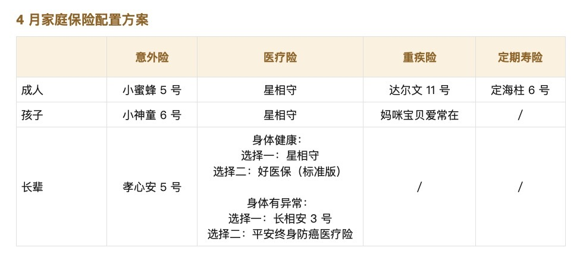
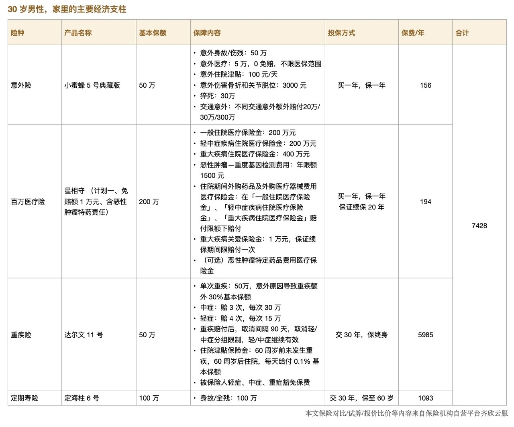
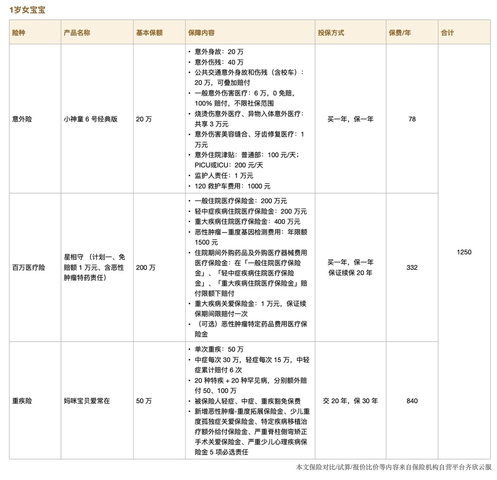
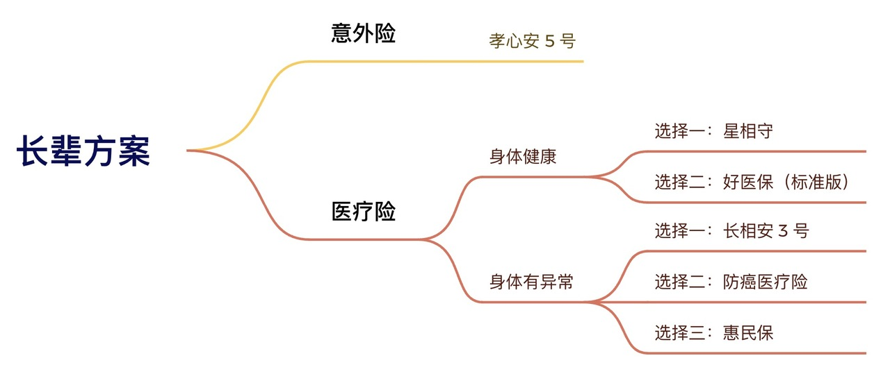
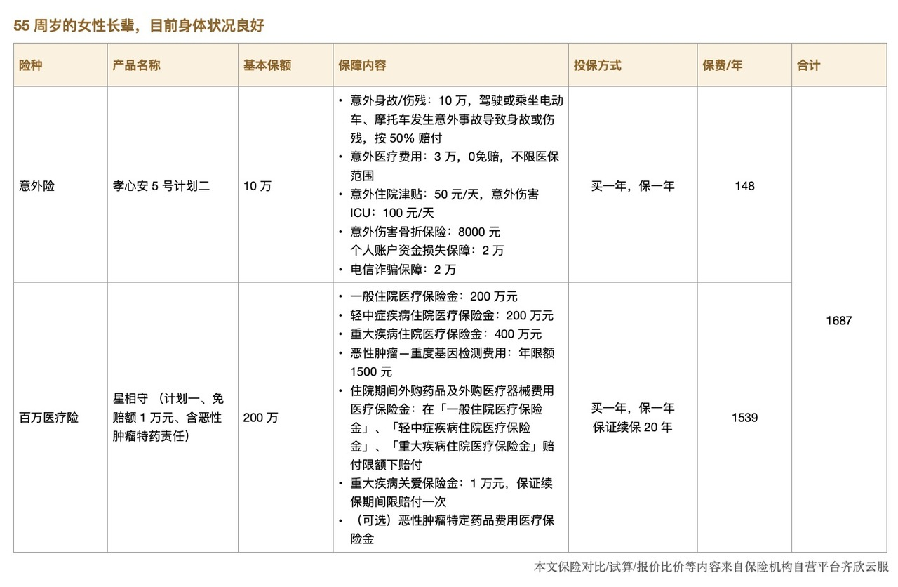

# 4 月家庭保险配置方案

朋友们，四月好呀～

最近有不少人问，为什么清单一直没更新？其实是因为近期产品变动不大，原有推荐依然适用，所以我们暂时没有调整。

不过，为了让大家确认这就是**最新版的清单**、可以安心参考，我们还是对文章做了整理和更新。

这次也补充了一些大家常问的问题，方便你根据自己的需求深入了解👇

我们的清单主要是**围绕产品推荐**展开的，针对同一年龄段通常只给出一个搭配方案。不过最近有朋友反馈，希望看到**不同预算下的保险配置**，所以我们新增了两篇文章：

* 《不同预算，如何为孩子买对保险？》
* 《不同预算，如何为成年人买对保险？》

[《不同预算，如何为孩子买对保险？》](https://youzhiyouxing.cn/n/materials/1887)

[《不同预算，如何为成年人买对保险？》](https://youzhiyouxing.cn/n/materials/1894)

主要讲的是在不同预算下，保险怎么搭配才更合理，感兴趣的朋友可以看看～

还有一个被问得很多的问题是：**中高端医疗险该怎么选？**我们也专门做了一次横向测评，写了这篇 👉 [《如何选择中高端医疗险？》](https://youzhiyouxing.cn/n/materials/1899)，帮你在众多产品中找到更适合自己的方案。

上半年假期不少，天气也适合出游。如果你有旅行计划，记得顺手安排上旅行意外险，这篇文章可以帮到你 👉[《出行前，有必要买旅行意外险吗？》](https://youzhiyouxing.cn/n/materials/1770)

如果你想系统了解保险配置的思路，也可以点击这里：[保险配置思路](https://youzhiyouxing.cn/n/subjects/26)，或者打开「有知有行 App」，点击下方「有知」，下滑至【专题】部分就能找到啦～

好了，话不多说，我们直接进入各类方案部分：

* 成人方案
* 少儿方案
* 长辈方案

[成人方案](https://youzhiyouxing.cn#1)

[少儿方案](https://youzhiyouxing.cn#2)

[长辈方案](https://youzhiyouxing.cn#3)

## 成人方案

一年 156 元就能买到 50 万的保额。

交通意外额外赔付，出行不用单独再买航意险了。一般意外不保的猝死，也有 30 万保障。

意外医疗不限社保、0 免赔，要是因意外住院了还有津贴。

一个词总结：便宜大碗。

产品链接：[小蜜蜂5号综合意外险](https://cps.qixin18.com/apps/cps/bxz1101818/product/detail?prodId=104716&planId=129798&tenantId=0&createTime=1732016105204)

百万医疗的推荐产品是复星联合健康的「星相守长期医疗险」。

这款产品的一大亮点是**院外外购药无清单限制***。*

随着医保改革的推进，外购药保障越来越受重视。星相守将这一责任纳入基础保障，提供 20 年保证续保，并取消清单限制，只要符合合同约定的理赔条件，就能 100% 赔付。

不过，无清单限制并不意味着完全的用药自由，外购药仍需满足一系列条件，例如，很多产品会在合同中约定，必须由指定医疗机构的专科医生开具处方，且外购药品不能包含医保基本用药目录中已有且可正常采购的品种。在实际操作中，符合这些条件仍有一定难度。

此外，基础责任中的外购药不包含恶性肿瘤特定药品，这个保障在可选责任中，也是保证 20 年续保的，建议大家还是勾选上。

虽然有这样那样的限制，但相比没有外购药责任的产品，有保障总比没有好，限制少总比限制多好。我们需要保持合理预期，并在可选范围内找到最合适的方案。从这一点来看，星相守的优化方向是值得肯定的。

第二个亮点是，**免赔额选择灵活**，可选 0/1万/1.5万/2万，满足不同投保需求。家庭投保还可共享免赔额，提高理赔使用率。若上一年度无理赔，免赔额每年可降低 1000 元，最高减少 5000 元。此外，前往指定机构参与体检项目，体检费用最高可抵扣下一保单年度1000元（计划一普通版）/2000元（计划二特需版）免赔额。

星相守提供两个计划。计划一（普通版） 是标准的百万医疗险。计划二（特需版）**额外涵盖公立医院国际部、特需部、VIP 部***。*市面上带有国际部、特需医疗的产品，大多是一年期中高端医疗险，缺乏长期稳定性。星相守提供 20 年保证续保，是难得的长期选择。

需要注意的是，计划二的床位费限额 2500 元/天，陪床费限额 600 元/天。目前来看，大多数情况下足够，但未来医疗费用上涨，可能存在不足。

如果预算充足，希望提升就医品质，也可以选择计划二。

详细测评见 👉 [新款百万医疗险评测，看病就医还有哪些好选择？](https://youzhiyouxing.cn/n/materials/1881)

**产品链接：**

[星相守 - 个人版](https://cps.qixin18.com/apps/cps/bxz1101818/product/detail?prodId=105011&planId=130328&tenantId=0&createTime=1739948419824)

[星相守 - 家庭版](https://cps.qixin18.com/apps/cps/bxz1101818/product/detail?prodId=105012&planId=130329&tenantId=0&createTime=1739948441329)

这是一个保终身的、单次赔付的重疾险。

重疾最多赔付 1 次，赔付 100% 基本保额，如果因意外导致重疾，赔付比例提升至 130%。中症最多赔付 3 次，每次赔付 60% 基本保额；轻症最多赔付 4 次，每次赔付 30% 基本保额。

重疾赔付之后，取消间隔 90 天，取消轻/中症分组限制，轻/中症保障继续有效。

这款产品还有个特别的地方在于基础责任中增加了「住院津贴」，在 60 岁前未发生重疾，且在 60 岁后住院，每天将给付 0.1% 的基本保额，每年以 90 天为限，在保险期内累计 100% 基本保额。

以投保 50 万保额为例，每日津贴为 500 元，每年最高可赔 4.5 万元，累计最多赔付 50 万元。这一设计解决了许多人「担心买了重疾险却未必用得上」的问题，提高了赔付的可得性。不过需要注意，如果因重疾、身故或全残理赔，已给付的住院津贴会从赔付金额中扣减。

达尔文 11 号是一个线上产品，投保过程更为丝滑。需要注意的是，健康险对身体状况有一定要求，投保前需要认真完成健康告知。然而，面对一堆的保险、医学术语，普通人难免感到头大，对某些问题的理解也可能出现偏差。为了确保投保顺利，还是建议大家预约专业的顾问老师，在他们的协助下完成健康告知。

产品链接：[达尔文11号重大疾病保险](https://cps.qixin18.com/apps/cps/bxz1101818/product/detail?prodId=104994&planId=130301&tenantId=0&createTime=1736998618334)

在清单中，我们反复提到过定期寿险的挑选逻辑：它保障责任简单，理赔不易扯皮，所以选择起来也很简单，健康告知宽松、免责条款少的产品里，选择保费最低那个就可以。

近期上线的 定海柱 6 号，保费更具优势，比此前推荐的 华贵大麦 2024 还要低。以 30 岁为例，100 万保额，交费 30 年，保障至 60 岁，男性年保费 1093 元，女性年保费 594 元。

相比健康险，定期寿险的健康告知本就宽松，而定海柱 6 号的健康告知更为友好，未询问乙肝和各种结节的情况，很适合压力大的打工人们。

产品链接：[定海柱6号定期寿险](https://cps.qixin19.com/apps/cps/bxz1101818/product/detail?prodId=104942&planId=130213&tenantId=0&createTime=1733307575808)

## 

## 少儿方案

监管规定，不满 10 周岁的儿童，理赔时身故保额最高为 20 万，对多数家长来说，给孩子选身故保额 20 万的意外险就足够了。

通常，意外险的身故保额与伤残保额是一致的，这使得不少少儿意外险的伤残保额相对较低，保障力度有限。

小神童 6 号有 4 个版本，除基础版外，其他版本的意外伤残保障都能翻倍赔付，满足了很多家长对更高伤残保障的需求。就拿经典版来说，身故保额 20 万，伤残保额则为 40 万。此外，各版本还涵盖公共交通意外保障，可与意外身故 / 伤残责任叠加赔付，进一步提升保障力度。

在基础责任方面，小神童 6 号提供监护人责任、120 救护车费用、意外住院津贴、意外美容缝合、意外伤害牙齿修复医疗等多项保障，覆盖范围更全面，综合性价比更高。

同时，意外医疗不限社保、0 免赔，也很实用。

价格方面，基础版 66 元 / 年，经典版也只需 78 元 / 年，花小钱就能给孩子一份意外保障，很不错。

产品链接：[小神童6号少儿意外险](https://cps.qixin18.com/apps/cps/bxz1101818/product/detail?prodId=105007&planId=130322&tenantId=0&createTime=1739962802774)

同大人一样，百万医疗险选择了保证 20 年续保的星相守。

疾病/意外导致的住院费用，最高可以报销400 万/年。20 年保证续保，几乎没有比它更长的了，20 年内只要想买都能续上。

如果家人需要同时配置医疗险的话，可以选择家庭版，保费更加优惠。

星相守的可选责任中可以选择「门急诊医疗费用」，如果是计划一，可以报销公立医院普通部的门急诊费用，单次免赔额 200 元，赔付限额 1 万元，可保证续保 3 年。如果是计划二，除了普通部之外，还可以扩展到特需部，普通部单次免赔额 200 元，特需部单次免赔额 600 元，赔付限额 2 万元，同样保证续保 3年。

很多家长会觉得孩子去门急诊频率比较高，是否应该加上？正是因为就医频率高，所以这部分保费并不便宜，加上并不一定划算。这种高频、小额的医疗费用，还是建议自付。

如果很在意门诊费用的话，可以看看父母公司是否有带补充医疗的团险，如果有，可以给孩子保上，性价比更高。

详细测评见 👉 [新款百万医疗险评测，看病就医还有哪些好选择？](https://youzhiyouxing.cn/n/materials/1881)

产品链接：

[星相守 - 个人版](https://cps.qixin18.com/apps/cps/bxz1101818/product/detail?prodId=105011&planId=130328&tenantId=0&createTime=1739948419824)

[星相守 - 家庭版](https://cps.qixin18.com/apps/cps/bxz1101818/product/detail?prodId=105012&planId=130329&tenantId=0&createTime=1739948441329)

这是一个单次赔付的少儿重疾险。

确诊合同里的重疾、中症、轻症，可以直接赔付相应的保额。重疾赔了后，非同组的轻 / 中症，不用等间隔时间，还能接着赔。对 20 种少儿特定疾病、20 种少儿罕见病分别额外赔付 100%、200% 基本保额。缴费期里，要是触发重疾、中症、轻症理赔，后面保费不用交了，保障还继续有效。

上面这些保障属于少儿重疾险的标配了。妈咪宝贝爱常在特别的地方在于，针对青少年健康问题，设了多种特色关爱金。例如 0 - 1 岁给孩子投保，3 - 7 岁确诊重度孤独症，能获赔 30% 保额；18 岁前，首次确诊严重脊柱侧弯，做了矫正手术，赔 10% 基本保额；18 岁前首次确诊严重抑郁症，730 天内在指定病房住院超 30 天，赔 10% 基本保额。

和成人重疾险一样，这个产品有很多可选的保障，投保时容易纠结。其实对大多数人来说，把钱花在刀刃上，只选基础保障就已经足够了。

保障期限能选保 30 年、保到 70 岁或保终身，不强制绑身故责任。缴费期最长 29 年，保额最高能买 80 万。

如果预算有限，可选 30 年的保障期，20 年缴费，等孩子长大了，再由自己接力保障。不过考虑到孩子长大后身体可能有变化，买健康险或许受限，在给大人做好保障的基础上，如果预算允许，也可以直接给孩子选保终身。

价格上，以 0 岁宝宝为例，选择保30年、20年缴费、50万保额，只选必选责任，男孩每年保费 725 元，女孩每年保费 765 元。要是选保终身、29年缴费、50万保额，同样只选必选责任，男孩每年保费2475元，女孩每年保费2250元。

如果倾向于高性价比的、单次赔付的少儿重疾产品，是一个不错的选择。

产品链接：[妈咪保贝爱常在少儿重大疾病保险](https://cps.qixin18.com/apps/cps/bxz1101818/product/detail?prodId=104995&planId=130302&tenantId=0&createTime=1737006724475)

## 

## 长辈方案

给长辈投保比较复杂，放一张思维导图，会比较清晰。

长辈意外险推荐孝心安 5 号。

意外医疗不限社保、0 免赔，很实用，磕着碰着去医院也不用担心爸妈心疼钱了。

老年人意外险的保额通常较低，这款产品意外伤残、意外医疗的保额都是市面上比较充足的，针对高龄人群常遇到的意外骨折、叫救护车等场景也有额外保障。

孝心安 5 号有 4 个保障计划，区别主要在保额和价格的不同。考虑到老年人发生意外后，后果可能比较严重（如骨折、长期卧床、引发并发症甚至危及生命），意外险的医疗保障是选择时最需要关注的因素。

如果长辈已经配置了百万医疗险，可以根据预算灵活选择四个方案中的任意一种。即使是保额最低的计划一，也提供 1 万元的意外医疗保障，能够与百万医疗险的 1 万元免赔额无缝衔接，覆盖意外导致的医疗费用。

如果长辈暂时未配置百万医疗险，或者仅配置了使用门槛较高的惠民保类产品，更推荐选择计划三，其 10 万元的意外医疗保障更为充足，让人更安心。

最近这个产品发生了一些调整，承保条件和保障内容都发生了一些变化。

如果投保时，发现投保信息暂不符合投保要求，可能就是投保条件不满足最新的承保规定。可以看看「孝福康」，投保比较宽松，限制比较少。

接下来，我们看看保障内容的变化。

一是意外身故、伤残的调整，4 个计划都会受到影响。变化在于，如果被保险人是因为「驾驶或乘坐电动车、摩托车发生意外事故导致身故或伤残」，保险金将按保单所载保险金额的 50%赔付。

二是意外医疗的调整，涉及计划一和计划二。对未经医保报销的费用赔付比例进行了下调。这里的医保，包括职工医保、公费医疗、也包括居民医保。

如果买了保险，是否先用医保报销对报销比例的影响还蛮大的，因此在就医时，一定要记得先使用医保。

这次调整在保障范围和赔付比例上做出了更严格的限制，「孝心安 5 号」依然是目前市场上非常值得为长辈配置的意外险。如果你想为父母配置一份意外保障，「孝心安 5 号」还是很值得推荐的。

产品链接：

[孝心安5号老年人意外险](https://cps.qixin18.com/apps/cps/bxz1101818/product/detail?prodId=104932&planId=130196&tenantId=0&createTime=1732016842042)

[孝福康老年人意外险](https://cps.qixin18.com/apps/cps/bxz1101818/product/detail?prodId=104677&planId=129731&tenantId=0&createTime=1739949728725)

医疗险的健康告知比较严格的，有时候不是人在挑产品，而是产品筛选人。如果长辈身体比较好，选择范围就会广很多。

父母投保医疗险，稳定性很重要，优先选择保证续保的产品，保证续保的时间越长越好。

但这样的产品，限制也比较多，像成人方案中推荐的**星相守**，就要求 50 周岁以上客户在投保时需跳转国家医保局页面授权查询个人医保信息，对于非 0 免赔版本，60 岁及以上人群还需要人工核保（0 免赔版本 55 周岁及以上需要人工核保）。

如果介意投保时授权查询个人医保信息，60岁以下，健康状况不错的长辈，可以看看支付宝上的*好医保（标准版）*，健康告知相对宽松，也不需要提交体检报告，符合健康告知，可以直接投保。

产品链接：

[星相守 - 个人版](https://cps.qixin18.com/apps/cps/bxz1101818/product/detail?prodId=105011&planId=130328&tenantId=0&createTime=1739948419824)

[星相守 - 家庭版](https://cps.qixin18.com/apps/cps/bxz1101818/product/detail?prodId=105012&planId=130329&tenantId=0&createTime=1739948441329)

如果长辈年龄比较大，身体条件不符合医疗险的健康告知，健康保险还有别的选择吗？

有。

虽然都叫「长相安」，但跟同系列的其它产品不同，长相安 3 号不是一款针对标体的、保证续保 20 年的产品。

产品设计上，长相安 3 号是对标着众民保来做的。这两款产品最大的特点就是没有健康告知，身体有异常，甚至癌症、心脑血管疾病患者也能投保。这两个产品在合同中明确列出了「重大既往症」，对于这些疾病，可保不赔。但其他疾病仍按约定赔付。

长相安 3 号和众民保在投保上很宽松，很适合：

1、因健康问题无法投保其他医疗险的人；

2、想为高龄父母配置医疗保障的人。

长相安3号有经典版、尊享版2个计划。众民保有经典版、臻选版2个计划。不同计划间的区别主要在价格、报销比例、恶性肿瘤院外特药种类上。建议优先考虑报销比例更高的尊享版或臻选版。

在选择时，如果属于高危职业，建议选择没有职业限制的众民保；如果更关注责任设计和保障细节上的优化，可以考虑长相安 3 号；而对免责条款宽松度更在意的话，众民保会是更好的选择。两款产品在本质上差异不大，具体的选择可以根据个人需求和偏好来决定。

关于这两款产品的详细测评，可以参考我们的对比分析：

* 身体异常的朋友，医疗险有了新选择，
* 身体有异常，如何选择医疗险?

[身体异常的朋友，医疗险有了新选择](https://youzhiyouxing.cn/n/materials/1856)，

[身体有异常，如何选择医疗险?](https://youzhiyouxing.cn/n/materials/1738)

产品链接：

[长相安3号 — 单人版](https://cps.qixin18.com/apps/cps/bxz1101818/product/detail?prodId=104987&planId=130294&tenantId=0&createTime=1736908933501)

[长相安3号 — 多人投保](https://cps.qixin18.com/apps/cps/bxz1101818/product/detail?prodId=104986&planId=130292&tenantId=0&createTime=1736908974445)

众民保

[众民保 — 单人版](https://cps.qixin18.com/apps/cps/bxz1101818/product/detail?prodId=104832&planId=130013&tenantId=0&createTime=1736909022609)

[众民保 — 多人投保](https://cps.qixin18.com/apps/cps/bxz1101818/product/detail?prodId=104833&planId=130015&tenantId=0&createTime=1736909052632)

**选择二：防癌医疗险，平安终身防癌医疗险**

防癌医疗险，可以理解为医疗险的子集，报销癌症带来的医疗费用。

考虑到癌症的发病率非常高，且医疗费用高昂，买一份防癌医疗险，确实能安心不少。

平安的这款防癌医疗险，健康告知宽松，0 免赔，保证终身续保。

去 90 家指定的医院医疗，报销比例 100%，去非指定的公立二级及以上医院治疗，报销比例 90%。每年最高报销 400 万，终身限额 800 万。

产品链接： [平安互联网终身防癌医疗保险](https://cps.qixin19.com/apps/cps/bxz1101818/product/detail?prodId=104399&planId=129229&tenantId=0&createTime=1732016919107)

各地惠民保条款不同，因此在清单中没有展开，感兴趣的朋友可以参考 👉 [身体有异常，如何选择医疗险?](https://youzhiyouxing.cn/n/materials/1738)，再对照当地惠民保的条款，进行对比。

## 写在最后

本月的方案就到这里，希望对你有所帮助～

如果你有更多个性化的需求，不妨预约顾问老师聊一聊。

最后需要提醒的是，投保时，一定要认真对待健康告知，避免后续出现理赔纠纷。如果对填写健康告知有疑问，也建议预约顾问，听听他们的专业建议。

下个月再见啦。

> 法律声明 本文所载内容皆以交流分享为目的，仅供参考。本文所涉保险对比/试算/报价比价等内容均来自保险机构自营平台齐欣云服，有知有行力求本文内容的准确可靠，但对相关信息的准确性、可靠性、时效性及完整性不作任何明示或暗示的保证。有知有行提示您，保险配置方案请您结合自身情况独立判断，或预约专属保险顾问进行咨询。如需转载或引用本文所述内容的任何文字、图片、音频或视频，请注明出处。转载前请与有知有行取得联系并经同意，转载时须注明来源及作者。
