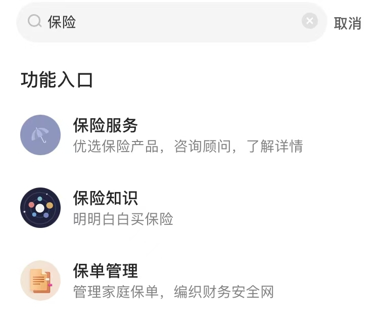

# E171 怎样帮爸妈克服「养老焦虑」？这几件事情你我都能做得到💪

🌄 欢迎来到知行小酒馆，这是一档有知有行出品的播客节目，我们关注投资，更关注怎样更好的生活。

马上就是新的一年，在岁末年初的时候，我们想讨论一个对每个人都很重要，但是没有一套标准解题模板的话题——*父母的保障与养老*。

在生活中，父母是我们最亲近的人。但随着他们年纪的增长，我们也会面临一些新的责任和挑战：*如何为父母配置合适的保险？如何帮助他们规划养老？作为子女，我们应该如何在情感和经济上给予他们支持？*

我们都希望能够为父母提供一套全面的保障方案。然而在实际行动中，往往会发现困难重重：父母这个年纪，还有哪些保险是可以配置的？不同的产品，又应该如何选择？到底什么产品，更适合我的家庭和财务情况？

为了更好地探讨这些话题，我们请来了两位嘉宾，一位是有知有行保险业务的负责人小主，这也是她的小酒馆首秀（我们压箱底的宝藏嘉宾！）；另一位是我们运营组的小张，今年她想给爸妈投保，结果中途卡住了，到现在还没完成，我们请她来分享一下实操过程中的困惑和疑虑（聊完她麻溜就去操作了😆）。

除了操心健康状况，父母的日常生活也值得我们多多关照：是否拥有愉悦的精神状态，能否培养了自己的兴趣爱好，能否建立良好的社交圈子。*这次聊天，我们想着重探讨一些脚踏实地的解决办法，缓解大家关于父母养老的担心与焦虑*。希望这期节目可以对有同样困惑的朋友有所启发。也非常欢迎你把自己的经验心得分享在评论区。

当然，保险并不是一件有标准解决方案的事。我们希望能够为大家提供一些思路，来梳理家庭的实际需求，进而根据自己的情况选择最合适的保险方案。如果你有更多关于保险配置的问题，欢迎[点击此处「预约顾问」](https://cps.qixin18.com/m/xx1101428/media.html)与专业顾问老师进行交流。

小主：有知有行保险业务负责人

小张：有知有行运营组伙伴

[03:17](https://youzhiyouxing.cn) 小技巧一则：怎么骗（劝）爸妈去做肠胃镜？

[07:36](https://youzhiyouxing.cn) 保险竟然不是想买就能买？还要关注**「健康告知」**

[09:09](https://youzhiyouxing.cn) 什么是保险中的**「标体」**与**「非标体」**？你认为的健康不一定满足「标体」，保险公司往往更严格！

[10:42](https://youzhiyouxing.cn) 有病史的中老年人买不到保险？还可以看看「非标体的百万医疗险」

[14:07](https://youzhiyouxing.cn) 是什么契机让小张想要立刻投保？

[15:50](https://youzhiyouxing.cn) 「惠民保」和「百万医疗险」，应该怎么选？更多信息可见👉[身体有异常，如何选择医疗险?](https://youzhiyouxing.cn/n/materials/1738)

[19:43](https://youzhiyouxing.cn)*从「抗拒」到***「主动配置」***，父母的转变是怎样发生的？*

[22:30](https://youzhiyouxing.cn) 为什么小主说，**买保险，不只是一件算钱的事？**

[24:55](https://youzhiyouxing.cn) 不仅仅是医疗保障，有保险的老年人更舍得花钱享受生活

[26:16](https://youzhiyouxing.cn) 小结：惠民保，（非标体）百万医疗险，意外险... 优先级如何确定？

[29:02](https://youzhiyouxing.cn) 别忘了提醒父母（和自己）**定期体检***！关于疾病，预防 > 筛查 > 治疗*

[32:32](https://youzhiyouxing.cn) 问问自己：对于父母而言，理想的养老状态是怎样的？

[36:41](https://youzhiyouxing.cn) 小主的选择：买年金 还是 每个月给妈妈打钱？**「我不想让妈妈体会到手心向上的感觉」**

[41:13](https://youzhiyouxing.cn) 温馨礼物故事两则（超级值得听！🎁）

[47:55](https://youzhiyouxing.cn) 要不要帮父母一次性补齐社保？如果要补，按什么档位补齐比较好？

[55:49](https://youzhiyouxing.cn) 过了 30 岁，我才终于体会到，为什么人们总说，**「父母健康就是你这辈子最大的财富」**

[57:56](https://youzhiyouxing.cn) 当我们忧虑父母养老问题时， TA 们也在以自己的方式，默默为子女减轻负担

健康告知：保险公司向被保人进行的健康状况调查。

医保共济账户：医保个人账户的资金可用于支付家庭成员的医疗费用。

「标准体」与「非标体」：通常健康人群称标准体；有既往症或患有慢性病的人群统称非标体。

免赔额：由投保人自行承担，保险人不负责赔偿的额度。

保费倒挂：所交保费大于保险金额。

## 常见险种

医疗险：用于报销因疾病或事故产生的医疗费用。

意外险：保障因意外事故导致的身故、伤残或医疗费用。更多信息可见👉[如何挑选意外险?](https://youzhiyouxing.cn/n/materials/1827)

重疾险：保障合同中列出的重大疾病。更多信息可见👉[如何挑选成人重疾险?](https://youzhiyouxing.cn/n/materials/1829)

防癌险：专门保障癌症治疗费用。

惠民保：一种低保费的补充医疗保险，一般由地方政府指导。

百万医疗险：保额较高的医疗保险，通常用于大病住院治疗。更多信息可见👉[如何挑选百万医疗险?](https://youzhiyouxing.cn/n/materials/1813)

养老年金：长期缴纳保费后，退休时可按月领取固定年金。更多信息可见👉[不吹不黑，养老钱应该买年金险，还是投资?|金栋说](https://youzhiyouxing.cn/n/materials/1732)

## 相关节目

[E62 当父母老了，我们还在异地漂着](https://youzhiyouxing.cn/n/materials/1357)

🧰**保险工具箱** 打开 [有知有行App](https://youzhiyouxing.cn/)，搜索「保险」二字，无论是保险入门知识、优选保险产品，还是保单管理工具，你需要的关于保险的一切，都能方便快捷地找到。 **保险服务：**如果你有任何与保险有关的需求和疑问，无论是定制家庭保险方案、详细了解产品条款，还是投保需要协助，都可以直接[点击此处「预约顾问」](https://cps.qixin18.com/m/xx1101428/media.html)，与专业的顾问老师交流。

打开 [有知有行App](https://youzhiyouxing.cn/)，搜索「保险」二字，即可打开相关入口👆

**📮 我们有个信箱！**给我们写信吧！如果你在投资生活中遇到了困惑，欢迎给「知行小酒馆」写信。不管是你苦恼于不知道怎样才能存下钱，还是纠结于怎样才帮身边人弄明白某个投资小问题，只要是关于钱的问题，都可以来信倾诉。虽然精力所限，不一定每一封信我们都会回复，但我们保证每一封信都会认真地阅读和保管。 来信请寄： [allinthebeer@gmail.com](mailto:allinthebeer@gmail.com)

**🍻 我们是谁？**「知行小酒馆」是[有知有行](https://youzhiyouxing.cn/)出品的一档分享投资与生活的播客节目，每周五晚八点更新。我们关注投资理财，更关注怎样更好地生活。在我们看来，投资成功，是我们变成一个更好的人之后，自然的结果。

[有知有行](https://youzhiyouxing.cn/)成立于 2020 年，目前在陪伴投资者用正确的方式学习投资，下场实操。凭借在投资领域的良好口碑，有知有行在初创阶段已与一大批忠实用户同行。未来我们希望成为一家财富管理公司，不仅帮助投资者学习投资，也能让大家在有知有行安心交易，踏实赚钱。[欢迎在「有知有行」社区 和我们互动交流](https://youzhiyouxing.cn/s/f4C2nY7P)。

🛰️ 不管是在有知有行，还是小宇宙、喜马拉雅、QQ 音乐、网易云音乐、苹果播客、豆瓣、三联中读、蜻蜓 FM、荔枝播客、微信听书、Spotify、Amazon Music、Google Podcasts，以及 Overcast、Pocket Casts、Castro、Snipd 等泛用型播客客户，我保证你都能找到我们的三档节目，《无人知晓》《知行小酒馆》和《投资ABC》。

**嘉宾** 小主 小张｜**主持** 雨白 星星｜**后期** 甜食 ｜**制作** 星星 ｜**单集封面** Recraft

**免责声明**

本播客所述投资相关内容皆以交流分享为目的，仅供参考，不构成任何市场预测、判断，或投资、咨询建议。市场有风险，投资需谨慎。主持人及嘉宾对投资相关内容的准确性、可靠性、时效性及完整性不作任何明示或暗示的保证，并提醒您对相关内容请结合自身情况进行独立评估，依据或使用相关内容所造成的后果由您独自承担。

感谢您对本播客原创内容的青睐。如转载或引用本播客所述内容，请注明出处。转载前请与有知有行联系并取得同意。

> 本文所载内容仅供参考，不构成任何投资建议。市场有风险，投资需谨慎，投资者应独立作出判断。详见[《免责声明》](https://youzhiyouxing.cn/agreements/ARTICLE_DISCLAIMER)。如转载引用，请遵守[《转载声明》](https://youzhiyouxing.cn/agreements/ARTICLE_REPRINTED)。
