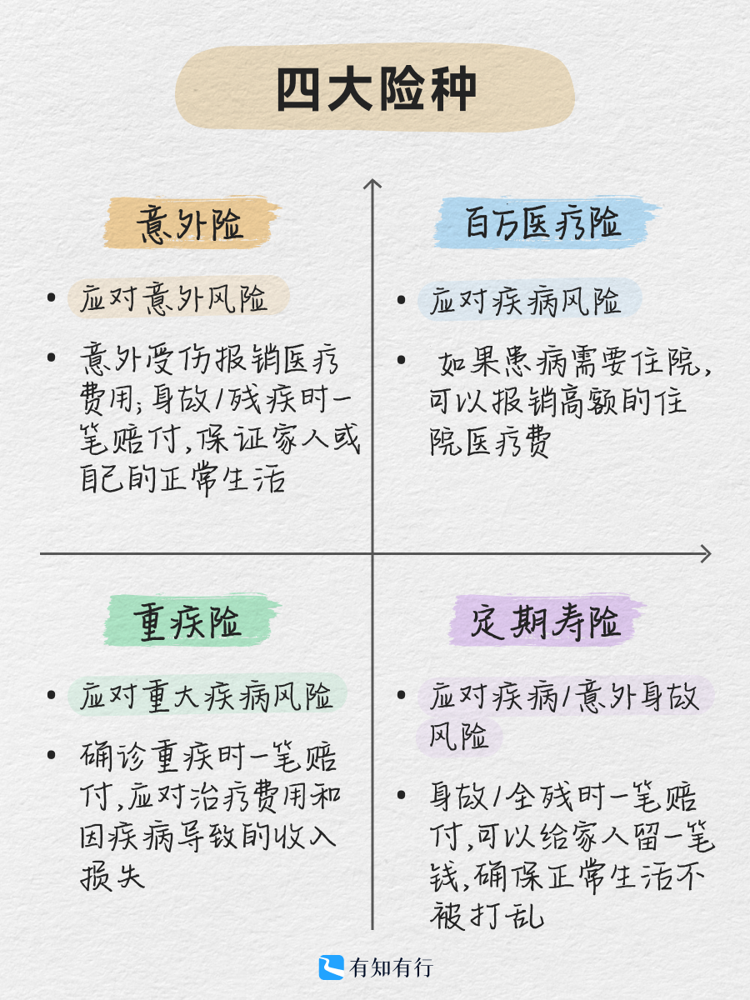

# 不同人生阶段，该配置什么保险？

买保险的第一步，也是最重要的一步，就是*确定需求。*

作为一种金融工具，保险解决的，是跟「钱」相关的问题。

借用投资的术语，保险是用来降低个人生活质量的波动率，给我们的人生「托底」。用一份小额的、确定的代价，去覆盖未来可能发生的、我们无力承受的开支。

那么，问题来了：我们究竟面临哪些风险，又该如何为自己和家人配置完备的保障？本文将讨论：

* 我们面临哪些风险
* 不同险种解决什么问题，适合谁？
* 不同人生阶段，该配置什么保险

[我们面临哪些风险](https://youzhiyouxing.cn#1)

[不同险种解决什么问题，适合谁？](https://youzhiyouxing.cn#2)

[不同人生阶段，该配置什么保险](https://youzhiyouxing.cn#3)

## 我们面临哪些风险

买保险前，不妨问问自己：

「我现在最害怕发生什么？万一发生了，会有哪些财务上的影响？」

对大部分家庭来说，可能面临的风险，不外乎疾病和意外：

小病小灾，日常磕碰，会带来病痛，会影响心情，会带来花费。但这些都在我们的承受范围内，此类问题，不需要通过保险来解决。

**保险解决的，是那些我们难以承受的风险**，比如大病，或者重大的意外，可能带来「病太重」或「过早离世」的灾难性后果。

「病太重」，既可能疾病引起的，如癌症、心脏病、中风，也可能是意外造成的，如严重的车祸。这类风险不仅带来身体的痛苦，还可能对家庭财务造成多重冲击。

首先是**直接的医疗费用***。*因癌症而迅速掏空家庭储蓄的例子，大家都并不陌生。

此外，还有一些容易被忽视的**隐形支出**，如前往大城市就医的交通和住宿费用、护工费、营养费以及后期康复费用。

如果患者是家庭经济支柱，重病可能导致短期甚至长期丧失工作能力，**收入中断**，而日常生活的支出却没有减少。即便是老人或孩子，生病后的高昂照护成本以及家人专职照顾带来的收入损失，也会给家庭带来沉重的财务压力。

意外或疾病导致家庭经济支柱在壮年时期过早离世，意味着家庭的**主要收入来源被切断***。*随之而来的是，家庭基本生活、还贷、赡养父母和子女教育等支出都将面临巨大压力。

## 不同险种解决什么问题，适合谁？

不同的险种，覆盖的风险是不同的：

我们一一来看：

在日常生活中，意外无处不在，大到交通事故、高架桥坍塌，小到猫抓狗咬、骨折扭伤，都属于意外。

意外险的保障内容通常包括**意外身故、意外伤残和意外医疗***。*如果发生重大意外导致身故或残疾，保险公司会按照合同约定赔付保险金；如果因意外导致医疗花费，则可以通过意外医疗进行报销。

不同年龄阶段的人都可能面临意外风险，但侧重点有所不同。**成人肩负家庭经济责任，意外身故和伤残的保额应足够；而老人和孩子，磕磕碰碰的情况较多，更应关注意外医疗保障。**

不同产品的保障责任有所不同，但市面上优质的意外险，意外医疗的免赔额通常可低至0-100元，且不限制社保用药，非常实用。在实际理赔中，意外医疗也是最常见的理赔类型。

意外险的保费低、杠杆高、保障责任明确，**建议每个人都配备一份***。*

医疗险是**报销**性质的。符合合同约定范围内的医疗费用，都可以报销。

医疗险的种类很多，其中**最适合普通人的是百万医疗险***。*它主要覆盖公立医院普通部的医疗费用，包括住院医疗费用、特殊门诊医疗费用，以及住院前后一定期限内的门诊急诊费用。

百万医疗险的报销额度非常高，通常达百万元以上，且不限社保用药。像癌症、糖尿病等大病的高额医疗费用，都可以通过它解决。

很多人可能会问：平时常见的头疼脑热、小病小痛的门诊费用怎么办？

确实有能报销门诊费用的医疗险，但它并不是保险配置的优先选项。正是因为就医频率高，所以这部分保费并不便宜，附加门诊责任并不一定划算。这种高频、小额的医疗费用，还是建议自付。

真正可能让家庭陷入困境的，是大病、重病导致的医疗开支。从配置优先级上看，百万医疗险的远高于门急诊医疗险。

虽然百万医疗险通常有一万元的免赔额，有一定的使用门槛，但也正因如此，它的价格非常亲民：年轻人每年几百元，老人和孩子每年一两千元左右。可以说是**花小钱解决大问题的典范***。*

大病带来的高额医疗费用，哪个年龄阶段都可能碰上。因此，**建议全家都尽可能配置医疗险，孩子、大人、老人都需要***。*

重疾险和医疗险的理赔方式不同，它是**给付**性质的。只要得了合同约定的重大疾病，就一笔赔付保险金。

很多人可能会疑惑：得了病后有社保和医疗险报销，为何还需要重疾险？

其实，重大疾病的开销远不止医疗费用。康复费用、照护成本等隐形支出，以及因病无法工作导致的收入损失，都会对家庭财务造成巨大压力。而这些，是医疗险无法覆盖的。

**理想的搭配是：医疗险报销治疗费用，重疾险则用于弥补医疗费用之外的开销，填补可能的收入缺口。**

无论家里谁得了大病，都很需要这样一笔钱。然而，重疾险并不适合所有人。

比如中老年人，因为健康状况限制，可能难以通过健康告知。而且，随着年龄增长，保费显著提高，性价比相对较低。因此，通常不建议长辈配置重疾险。

**少儿和成人，则都建议配置上。**

定期寿险，责任特别简单，一句话就可以概括：**保障期内人没了，或者全残，就赔钱。**

至于人是怎么没的，意外还是生病，没有限制。大部分产品，甚至投保两年后，自杀都可以赔。

定期寿险主要**应对「英年早逝」的风险，尤其适合家庭经济支柱购买，特别是上有老、下有小且身负房贷的人群。**孩子和老人，则不需要配置。

如果家庭的主要收入来源因疾病或意外去世，经济状况将面临巨大冲击。定期寿险的意义就在于，一旦发生不幸，至少能够保障家人平稳度过经济困难期。

尽管家庭经济支柱“英年早逝”的概率较低，但这一事件对家庭的潜在影响极大。因此，**建议家庭支柱都配上一份***。*

## 不同人生阶段，该配置什么保险

每个人都可能面临疾病或意外，但不同人生阶段，有不同的责任，遭遇风险时，带来的财务影响也不同，只买一个保险无法覆盖所有风险，需要根据特定阶段的需求，做好搭配。

对家庭**经济支柱**来说，他们承担着养家糊口的责任，保障就要尽量全面，建议配置：意外险 + 医疗险 + 重疾险 + 定期寿险。

如果家庭责任不重，定期寿险暂时就可以不需要了：

比如**新婚夫妻**：如果暂时没有房贷压力，父母也有养老金，那么投保意外险 + 医疗险 + 重疾险就足够了。

再比如，**刚参加工作的人**：趁年轻、健康时买保险，选择多，价格也便宜。最好配置意外险 + 医疗险 + 重疾险，保费预算实在有限的话，至少先投保意外险 + 医疗险，以后有条件了再慢慢补充。

**孩子**的保险以医疗险 + 意外险 + 重疾险为主。很多家长在有了孩子后，开始重视保险，常常会优先给孩子买。但其实保险的购买顺序应该是**先保障大人，再保障孩子**，因为大人出了问题，对家庭的影响更大。保费上也要合理分配，别因为孩子的保障，忽视了大人的需要。

**长辈**的保险建议优先配置医疗险 + 意外险。由于身体条件限制，长辈投保百万医疗险可能较难，但市场上已有许多健康告知非常宽松、甚至没有健康告知的医疗险可以选择，具体可以参考「[身体有异常，如何选择医疗险?](https://youzhiyouxing.cn/n/materials/1738)」。

总之，买保险要根据家庭责任和预算安排，先保障风险大的，再逐步完善，确保每个家庭成员都有合适的保护。

> 法律声明 本文所载内容皆以交流分享为目的，仅供参考。本文所涉保险对比/试算/报价比价等内容均来自保险机构自营平台齐欣云服，有知有行力求本文内容的准确可靠，但对相关信息的准确性、可靠性、时效性及完整性不作任何明示或暗示的保证。有知有行提示您，保险配置方案请您结合自身情况独立判断，或预约专属保险顾问进行咨询。如需转载或引用本文所述内容的任何文字、图片、音频或视频，请注明出处。转载前请与有知有行取得联系并经同意，转载时须注明来源及作者。
