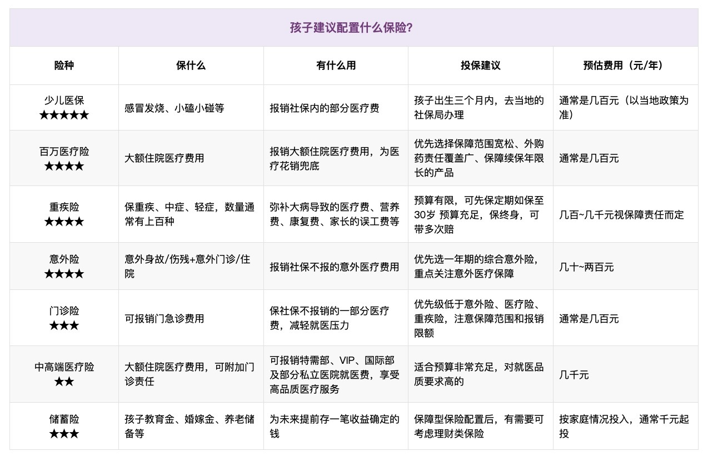
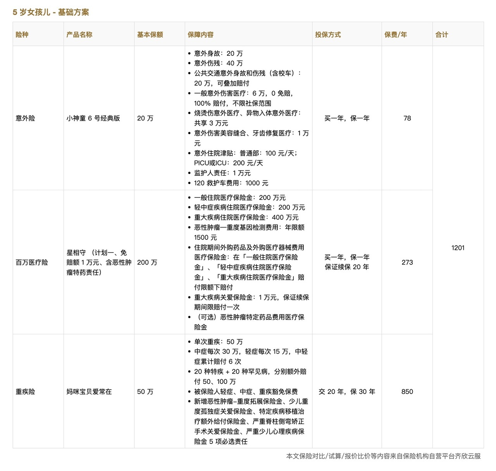
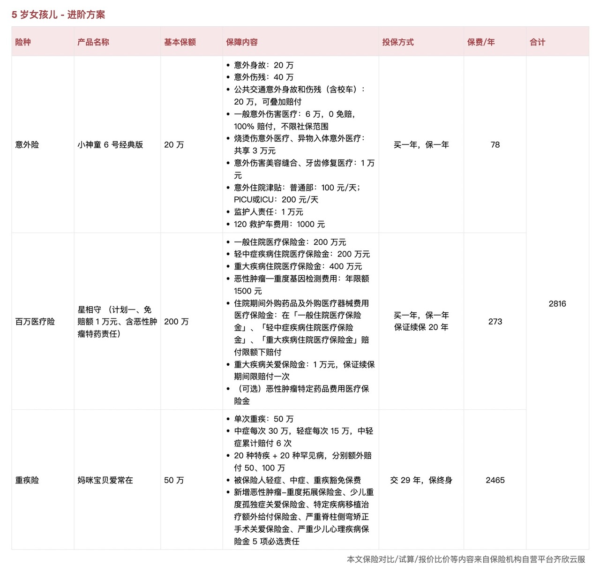
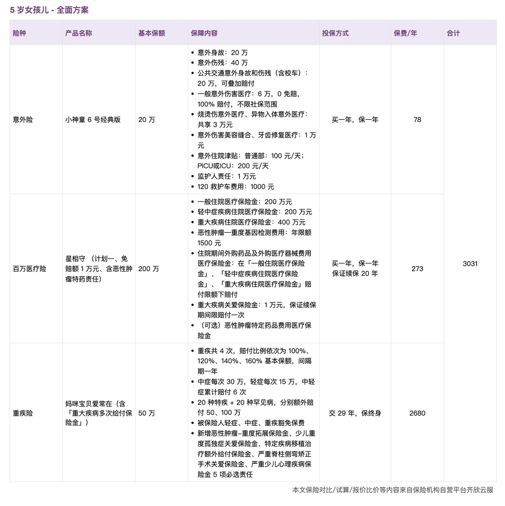
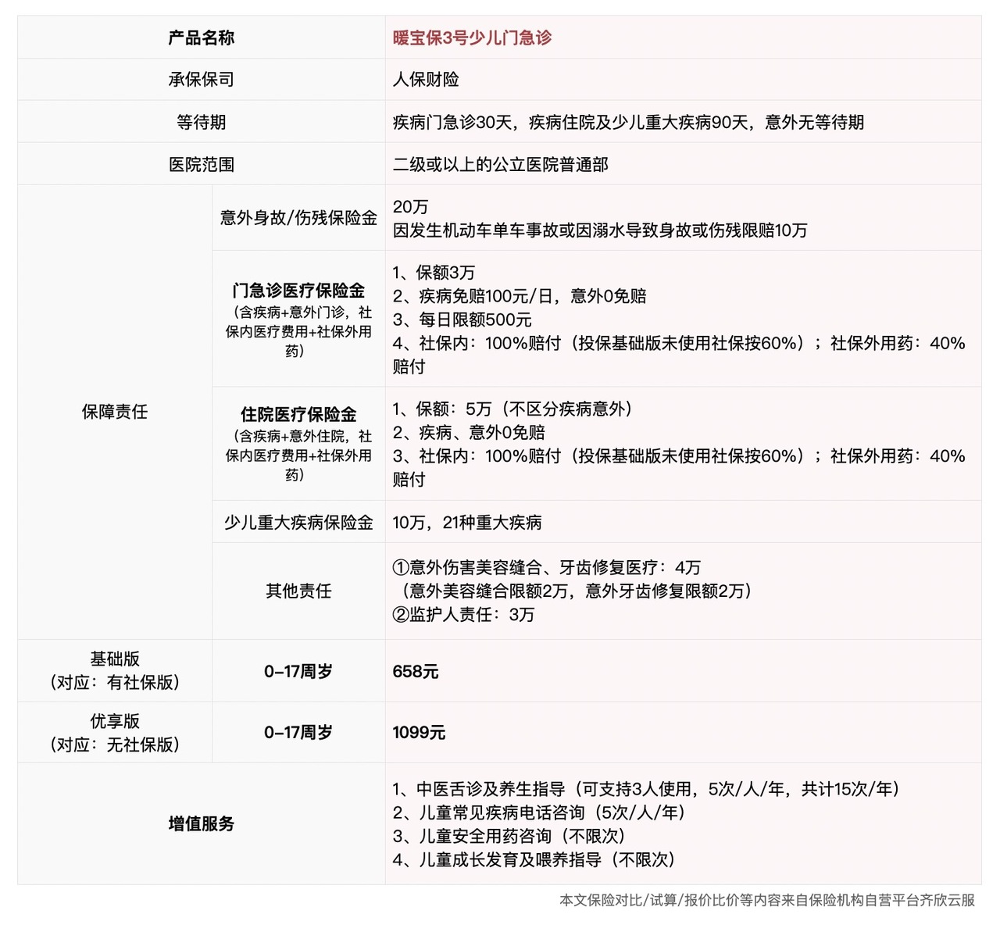

# 不同预算，如何为孩子买对保险？

孩子的健康和安全是每位家长最关心的事情。磕磕碰碰的小意外、突如其来的疾病都让家长揪心。

很多家长都是因为孩子，开始考虑配置保险。

那么孩子究竟需要配置哪些险种，不同险种该注意些什么，不同预算有哪些可行的方案？

这篇文章就来聊聊这些问题。

## 需要配置什么保险？

孩子的保障中，最基础、最重要的是**少儿医保**。它覆盖常见的住院和门急诊费用，费用低，报销范围广，是孩子保障的基石。在此基础上，再考虑商业保险。

在 [不同人生阶段，该配置什么保险?](https://youzhiyouxing.cn/n/materials/1825) 中，我们提到，不论成人还是孩子，风险主要来自**疾病和意外**。适合孩子的保险包括 **意外险、百万医疗险**和**重疾险**，不同险种，承担不同的保障责任。

我们逐一来看。

孩子天性活泼，磕磕碰碰、猫抓狗咬、摔伤烫伤等情况很常见。如果发生这些小意外，*意外险可以通过意外医疗责任报销治疗费用*，比如缝针、骨折、烫伤等，只要符合合同约定，保险都能报销。万一发生大意外导致身故或残疾，保险公司也会根据合同赔付相应的保险金。

给孩子选意外险时，需重点关注**意外医疗的保障，尽量选择不限社保，0免赔，报销比例高的**，这样能确保意外发生后，医疗费用能尽量报销。

国家对未成年人的身故赔付有严格限制，10岁以下最高不超过20万，10-17岁不超过50万。所以，在为孩子配置意外险时，*不必追求过高的身故保额。*不过，很多意外险产品的身故保额和伤残保额是一致的，如果想要更全面的伤残保障，也可以选择身故保额较高的版本。

百万医疗险主要用于**报销大额住院医疗费用**，不管是因为疾病还是意外住院，扣除免赔额后，都可以用百万医疗险报销，保额通常在百万级别，即使是癌症放疗化疗、ICU 住院费等，也能提供一定保障，能对医疗花销起到兜底作用。

挑选百万医疗险时，建议*优先选择保障范围宽松、外购药责任覆盖广、保障续保年限长的产品。*现在不少产品提供院外特药、住院绿通等增值服务，在就医资源紧张的情况下，这些服务能大幅提升就医体验。

重疾险不仅是医疗费用的补充，更重要的是**弥补因病造成的长期经济损失***。*

如果孩子罹患重疾，除了治疗费用，还涉及康复护理费、营养费，甚至家长请假或辞职照顾孩子的经济损失。重疾险是给付性质的，只要得了合同约定的重大疾病，就一笔赔付保险金。这些隐形成本，**重疾险可以提供资金支持***。*

孩子的重疾险保费通常比成人便宜。而且，孩子的健康状况较为稳定，投保重疾险时较少受到限制。因此，尽早为孩子配置重疾险，不仅可以享受较低的保费，还能避免宝宝长大后因健康状况变化而导致投保困难。

投保时，可以优选*选择少儿重疾险*，针对少儿高发重疾（如白血病、重症手足口病），少儿重疾险往往有更高的赔付额度，甚至可以额外赔付，针对性更强。

投保时，*保额要足够*，建议至少30-50万，这样即使发生疾病，也不会对家庭财务造成巨大冲击。

孩子小时候免疫力较弱，感冒、发烧、肺炎、肠胃炎等情况时常发生，去医院的次数很频繁。有些家长因此觉得门诊险是必需的，甚至优先考虑门诊保障。

但保险的核心作用是覆盖未来可能发生的、我们无法承受的高额支出，而门诊费用通常是小额、高频的，即使不买保险，大部分家庭也能负担。因此，**门诊险的优先级远低于意外险、百万医疗险和重疾险***。*

除了基本的门诊保险，一些家庭还关注就医品质。

每到流感、肺炎高发期，儿童医院人满为患，排队时间长，环境嘈杂，看病体验差。对于预算充足、对医疗质量要求较高的家庭，可以选择带门诊责任的中高端医疗险。这类保险的就诊环境更优、医生资源更好、报销范围更广，但价格相对较高，适合对医疗体验有更高要求的家庭。

孩子的保险，*核心是优先保障大风险，再考虑更细致的覆盖。*少儿医保是基础，商业保险的配置顺序建议是：意外险、百万医疗险、重疾险。这三种保险解决了孩子可能面临的意外、住院、重大疾病带来的高额经济损失。如果预算充足，或者孩子体质较弱、容易生病，再考虑门诊险或中高端医疗险，进一步完善保障。

父母总是希望为孩子的未来提前规划，无论是大学学费、海外留学，还是未来工作时的一笔启动资金，未雨绸缪能让孩子拥有更多选择的自由。

每年为孩子存下的一笔钱，或者攒下孩子的压岁钱，积少成多，未来用得上的时候就不用发愁。

积累教育金的方式有很多，比如*定投指数基金*，或是*储蓄类保险*。两者各有优势，股票类资产长期来看收益更高，而储蓄型保险胜则在稳定性和确定性，无论家庭情况如何变化，都能确保这笔资金专款专用。

大家可以根据自身的投资经验、风险偏好，选择合适的方式，或是两者结合，兼顾收益与确定性。

需要注意的是，不管怎么规划孩子的教育金，*先把基础保障做好*更安心。先有了保障，再去考虑存钱或投资，才能更踏实地为未来打算。

## 方案参考

买保险和其他消费一样，都需要结合自己的需求和预算来做取舍，丰俭由人。

有的人更看重高性价比，追求花小钱，办大事。有的人则希望尽可能完善，做到全面覆盖。这两种选择没有对错，关键是找到适合自己家庭的。

以 5 岁女孩儿为例，我们设计了三个不同预算的方案，分别为基础保障、进阶保障和全面保障。

意外险和医疗险的价格本身较低，调整空间不大。**主要的差异在于重疾险，可以通过调整保障期限、选择单次或多次赔付来适配不同预算。**

需要注意的是，保险产品更新迭代较快，以下方案仅供配置思路参考，具体产品建议参考每月更新的[「家庭保险配置清单」](https://youzhiyouxing.cn/n/materials/1877)（有知有行 App 中点击「有知 - 精选专题 - 保险配置思路」就能找到最新的清单）或直接查看[少儿方案产品列表](https://cps.qixin18.com/m/zc1059261/media.html)（有知有行 App 中点击「我的 - 家庭保险服务 - 少儿方案」）。

**保费：**每年 1000 出头。

这个方案以核心保障为主，保费不高但能覆盖大风险。重疾险选择了**定期 + 单次赔付**，保障 30 年，20 年缴费，先覆盖孩子成长期间的重疾风险。等孩子长大后，再由自己接力保障。

适合希望**先用较低的成本建立基本保障**，未来再根据情况补充的家庭。

**保费：**每年约 2800

相比基础方案，这个方案的核心变化是**将重疾险的保障期限延长至终身***。*

孩子的健康状况通常较好，投保时不会受到太多限制，选择终身保障可以避免孩子长大后因健康状况变化而导致投保困难。

适合希望**一次性解决孩子终身重疾保障的家庭**，避免后续可能的投保难题。

**保费：**每年约 3000

在进阶方案的基础上，这个方案勾选了可选责任中的「重大疾病多次给付保险金」，将**重疾险升级为多次赔付**，相比进阶方案，保费涨幅并不大。

随着医疗水平的提高，重疾治愈率不断提升，但患多次重疾的概率也在上升。如果孩子不幸罹患重疾，后续可能很难再购买新的重疾险，多次赔付的产品可以提供更长远的保障，确保即使经历一次重疾，依然能获得后续的保障。

适合**预算较充足**，且希望孩子一生都有**更全面保障**的家庭。

如果希望补充门诊保障，可以在以上方案的基础上额外叠加一款门诊险。但需要再次强调，门诊险的优先级低于意外险、百万医疗险和重疾险。

门诊险的作用主要是报销日常小病小痛的医疗费用，比如感冒、发烧、肺炎等。如果孩子体质较弱、就医频率较高，可以考虑额外配置。如果家长公司有补充医疗险，也可以先看看是否能附加上孩子的保障，通常比单独购买门诊险更划算。

## 最后

今天的文章已经很长了，关于中高端医疗、教育金的内容就不在此展开啦。如果大家有需要，我们后续再为大家详细介绍。

这篇文章主要聊的是方案的思路，没有涉及具体的、个性化的问题。

如果有任何疑问，建议 👉 [预约顾问](https://cps.qixin18.com/v3/m/bxz1101818/reservation?createTime=1741148627023)，与专业老师沟通，解决你们的困惑～

> 法律声明 本文所载内容皆以交流分享为目的，仅供参考。本文所涉保险对比/试算/报价比价等内容均来自保险机构自营平台齐欣云服，有知有行力求本文内容的准确可靠，但对相关信息的准确性、可靠性、时效性及完整性不作任何明示或暗示的保证。有知有行提示您，保险配置方案请您结合自身情况独立判断，或预约专属保险顾问进行咨询。如需转载或引用本文所述内容的任何文字、图片、音频或视频，请注明出处。转载前请与有知有行取得联系并经同意，转载时须注明来源及作者。
