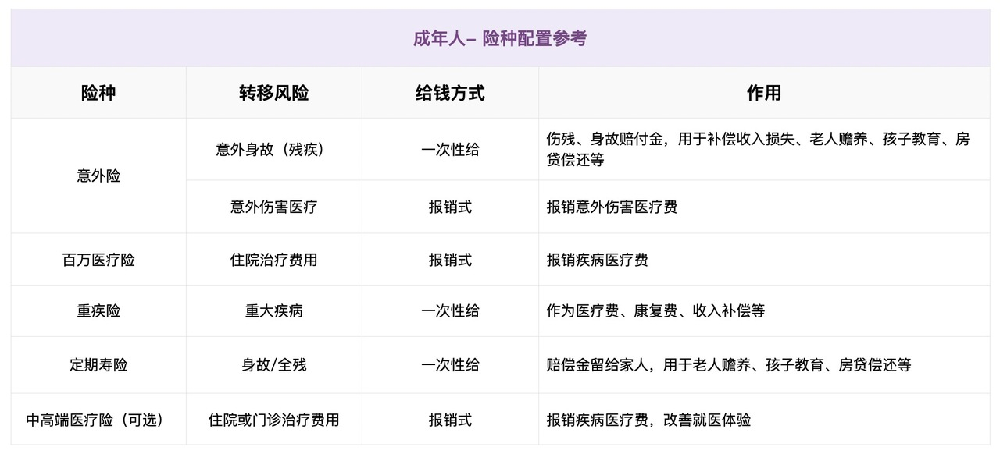
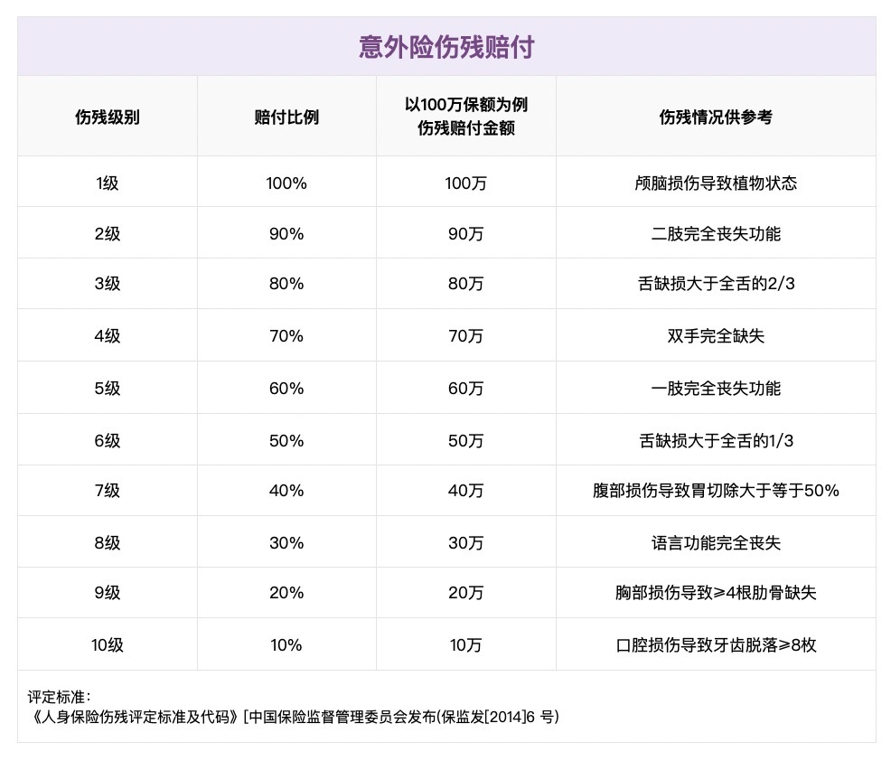
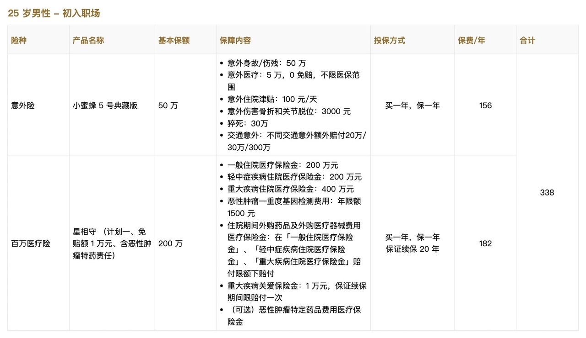
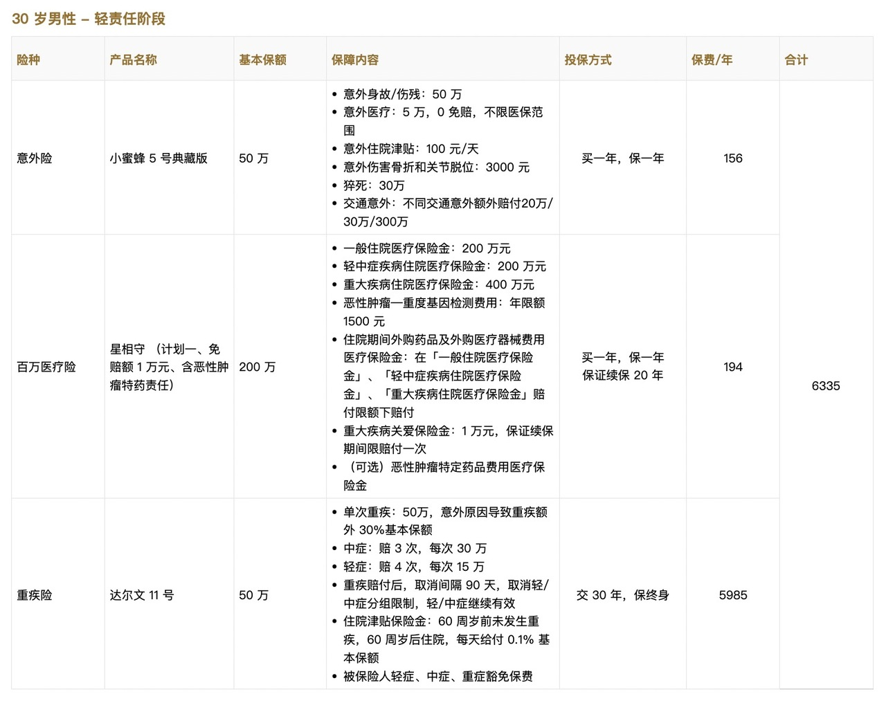
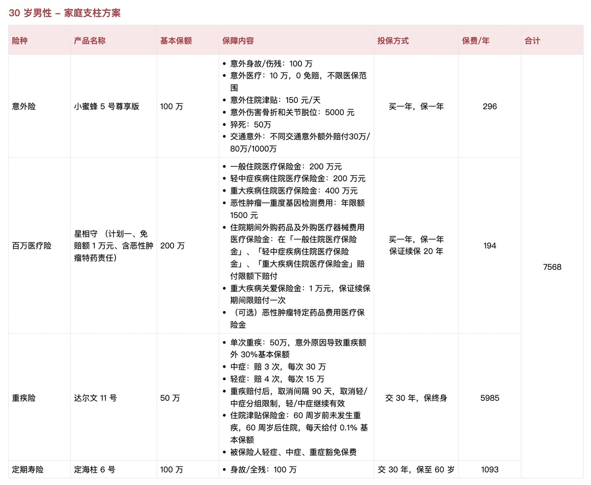
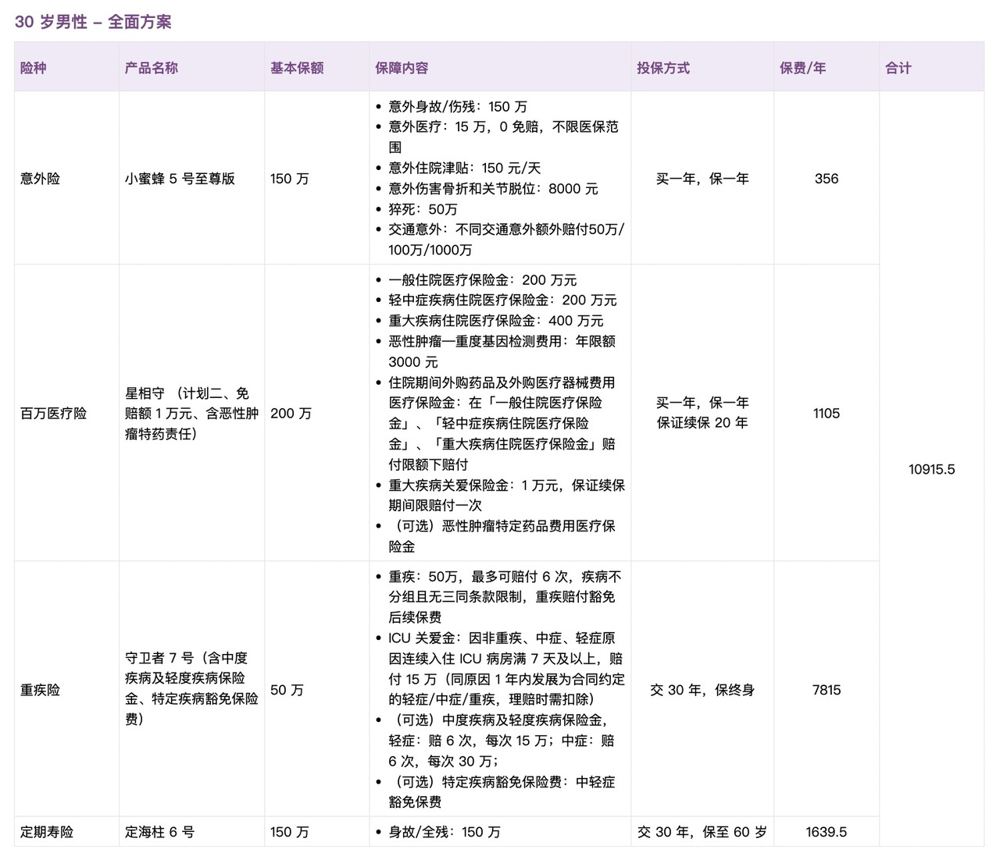

# 不同预算，如何为成年人买对保险？

之前写了[不同预算，如何为孩子买对保险?](https://youzhiyouxing.cn/n/materials/1887)，很多朋友咨询，成年人有没有类似的参考方案？

安排上了🫡，这篇文章我们一起了解：

* 成年人需要哪些保险
* 不同预算的保险配置方案

成年人需要哪些保险

不同预算的保险配置方案

## 成年人需要哪些保险？

成年人的风险，主要来自**疾病**和**意外**。

但和孩子不同，作为一个「大人」，我们往往肩负更多责任——赡养父母、支持伴侣、抚养孩子。即便暂时没有家庭负担，也至少要保障自己的生活，不成为他人的负担。一旦遭遇不幸，对财务的冲击是最大的。

因此，在配置保险时，应优先为成年人投保，先保障好家庭经济支柱，再考虑孩子和老人。一般来说，成年人需要配置的险种包括**意外险、百万医疗险、重疾险和定期寿险。**

如果公司福利较好，已经提供了团险。可以参考 👉 [「公司有团险，还需要自己买保险吗？能重复理赔吗？」](https://youzhiyouxing.cn/n/lite-posts/1569)，梳理清楚已有保障，再决定是否额外配置。但需要注意，**团险通常与工作绑定**，一旦离职可能就中断了，特别是医疗险和重疾险这类健康险，建议自行配置，避免未来因健康状况变化，影响投保。

接下来，我们逐一拆解成年人需要的保险，并聊聊挑选时的关键点。

意外险的基础保障包括**意外身故、意外伤残、意外医疗**。小意外可以通过意外医疗报销就医费用，发生大意外导致身故或伤残，则可获得一次性赔付。

有人可能会疑惑，「医疗险能报销治疗费用，寿险能赔身故，为什么还需要意外险？」

确实，这几个责任有部分重叠，但**如果因意外导致伤残，而又未达到重疾标准或全残的情况**，医疗险只能报销治疗费用，重疾险、寿险则都不会理赔。现实中，伤残不仅影响身体状况，**还会对工作、收入造成长期冲击***。*

这一块，只有**意外伤残**能提供补偿。

意外伤残责任通常按伤残等级赔付，比如**一级伤残赔付 100%，二级伤残赔付 90%，依次递减**，直到十级伤残赔付 10%。如果希望有较好的伤残保障，**意外险保额要买足***。*

相关文章：

[如何挑选意外险?](https://youzhiyouxing.cn/n/materials/1827)

百万医疗险主要用于**报销大额住院医疗费用**，不管是因为疾病还是意外住院，扣除免赔额后，都可以用百万医疗险报销，保额通常在百万级别，即使是**癌症放疗化疗、ICU 住院费**等，也能提供一定保障，对高额医疗开销起到兜底作用。

挑选百万医疗险时，建议优先选择保障范围宽松、外购药责任覆盖广、保证续保年限长的产品。

百万医疗险对健康状况有要求，成年人往往生活压力较大，体检又比较频繁，难免有异常，如果无法通过健康告知，可以选择长相安 3 号、众民保等针对非标体的产品。

相关文章：

[如何挑选百万医疗险?](https://youzhiyouxing.cn/n/materials/1813)

[新款百万医疗险评测，看病就医还有哪些好选择?](https://youzhiyouxing.cn/n/materials/1881)

[身体有异常，如何选择医疗险?](https://youzhiyouxing.cn/n/materials/1738)

[身体异常的朋友，医疗险有了新选择](https://youzhiyouxing.cn/n/materials/1856)

重疾险和医疗险的赔付方式不同，它是**给付型**的。确诊合同约定的疾病，就会一次性赔付保险金。

最近几年，「消费降级」成了热门话题，影响了很多人的保险预算，不少人开始犹豫，「每年花好几千块钱买重疾险，值得吗？」

大病对个人、对家庭的影响是全方位的。它不仅会带来高额的医疗费用，还可能导致收入中断、康复和照护成本上升，对家庭经济造成长期压力。医疗险能报销医疗费用，但不能填补这些额外支出。

在现实生活中，一旦家庭成员罹患重病，往往是全家倾尽所有，全力救治，不论家庭条件如何，财务和精神压力都极大。**重疾险能带来一笔确定的保险金，给家庭一个缓冲**，还是很有必要的。

尤其在医疗改革和未来就医环境存在诸多不确定性的情况下，一笔可以自由支配的钱，可以带来更大的安全感。

相关文章：

[如何挑选成人重疾险?](https://youzhiyouxing.cn/n/materials/1829)

定期寿险的责任特别简单，一句话就可以概括：保障期内人没了，或者全残，就赔钱。

它主要用于应对英年早逝的财务风险。对于**上有老、下有小，身负房贷的家庭经济支柱***，定期寿险是刚需。*

虽然英年早逝发生的概率较低，但一旦发生，对家庭的打击极大。因此，家庭支柱都应该配置定寿，确保即使自己不在了，家人仍然能维持正常生活。

定期寿险保障责任简单，理赔不易扯皮，所以选择起来也很简单，重点关注健康告知和免责条款就可以。

相关文章：

[如何挑选定期寿险?](https://youzhiyouxing.cn/n/materials/1828)

如果对医疗资源、医疗服务品质有要求，在预算充足的情况下，可以选择中高端医疗险。

在公立医院普通部之外，中端医疗险通常还会覆盖**公立医院的国际部、特需部**，例如大家比较熟悉的北京协和医院国际部、中日友好医院国际部、上海华山医院国际部等，少数中端医疗险还可覆盖部分指定的私立医院。

高端医疗险一般会覆盖更多的**私立医院**，甚至不限制具体医院清单，例如和睦家、新世纪、莱佛士、嘉会医疗、美中宜和等都可涵盖。

在之前聊到DRG医改时，我们也有提到，在医改的趋势下，公立医院普通部更多地是用来满足基本的医疗需求。而如果想在药品、治疗上拥有更多选择权，公立医院国际特需部、私立医院可能是更好的选择。

在中高端医疗险中，**住院仍然是核心的保障**。除此以外，中高端医疗险通常还可以**附加普通门诊保障**。当然如果要附加门诊保障，保费的价格自然会更高，如果预算充足、对门诊需求比较频繁可以考虑附加。

## 不同预算的保险配置方案

可以发现，以上险种中，*定期寿险与家庭责任有关*，如果当前家庭责任较轻，可以暂不配置，未来有需要时再补充。

*对价格影响较大的还是重疾险*，可以通过不同保障期限、赔付次数来调整价格。

意外险和百万医疗险的价格比较低，可调整的空间比较小。主要区别在于家庭责任不同，意外险的*保额*也随之变化，如果责任比较重，会选择保额更高的版本。

当然，如果预算充足，也可以将百万医疗险替换为中高端医疗险，以获得好的医疗资源和就医品质。

下面，我们例举了不同阶段、不同预算的方案，供大家参考。

需要注意的是，保险产品更新迭代较快，以下方案仅供配置思路参考，具体产品建议参考每月更新的[「家庭保险配置清单」](https://youzhiyouxing.cn/n/materials/1877)（有知有行 App 中点击「有知 - 精选专题 - 保险配置思路」就能找到最新的清单）或直接查看[成人方案产品列表](https://cps.qixin18.com/m/zc1059261/media.html)（有知有行 App 中点击「我的 - 家庭保险服务 - 成人方案」）。

**保费：**每年 300 出头

此方案适合*刚参加工作、保费预算有限的年轻人。*

方案中包含**意外险和百万医疗险**，可应对意外伤害和大病住院风险，确保关键时刻有保险兜底。

刚工作时，收入相对较低，日常花销也大，保险配置应尽量经济实惠。这个方案平均每月只需 28 元，几乎不会增加额外负担。随着收入增长，可以逐步补充其他保障。

需要提醒的是，年轻、健康时投保，选择更多，价格也更便宜。如果预算允许，还是建议尽早配置重疾险。

*保费：*每年约 6300

这个方案*适合无房贷、无养家压力的朋友*，比如无需赡养父母的单身人士，或无房贷压力的小夫妻。

相比上一个方案，此方案增加了重疾险。由于重疾险是「保费大户」，整体保费从每年几百元跃升至大几千元（ 25 岁同样的保障，重疾险保费为 5235 元）。

但相应地，保障也更加全面，万一罹患重疾，不仅有百万医疗险报销治疗费用，还能获得一笔确定的赔付，可以更为从容。

*保费：*每年约 7500 元

这个方案适合*已婚、有子女或有赡养父母责任的朋友。*

因为承担的责任较重，所以在上一个方案的基础上增加了定期寿险。意外的保额也相应提高了。

保额决定了出险时能赔多少钱，是保障作用最直观的体现。每个人的收入、负债和家庭支出不同，需要的保额也不同。保额的计算可以参考 👉 [买了不等于完事，一起给保单做个「年检」](https://youzhiyouxing.cn/n/materials/1851)。保险不是买了就行，保额还要买足，确保在风险发生时，这笔保障是有意义的。

*保费：*每年约 11000 元

这个方案适合*保险预算充足，追求全面保障，且对医疗品质有一定要求的朋友。*

在上一个方案的基础上，将百万医疗险换成了星相守（计划二特需版），其医院范围拓展至国际特需部。这样，可以以合理的价格，享受更优质的就医服务。

此外，重疾险也换成了保终身、多次赔付的产品。随着医疗水平的提高，重疾治愈率不断提升，患多次重疾的概率也在上升。如果预算允许，选择多次赔付的重疾是有意义的。但如果预算有限，相较于多次赔付产品，还是建议优先将单次重疾的保额配置充足 。

## 写在最后

朋友曾和我聊过她的一位做投资的朋友，在投保时经历的心理变化。

最初，他的思路很简单：买「刚需」保障，尽量控制预算。

在选择重疾险时，他只想投保至 70 岁的版本。但在投保过程中，因体检指标异常，健康告知被卡住了。复查又经历了一番波折，一度以为自己无法投保了。好在最终找到了一款健康告知宽松的产品，才顺利投保。经历了复查时的担惊受怕，他的想法发生了变化。最终，他选择了终身保障，并将孩子的重疾险更换为为多次赔付的产品。

《金钱心理学》提到，我们的理财决策，往往受过往经历的影响。经历过家人生病、出险的人，更能体会保障的意义，更愿意为确定性买单。

那么，保险是不是一定要买最贵、最全面的呢？

并不是。我想说的是，*保险既是理性的计算，也是感性的选择。*文章里列了多种方案，很多人会纠结该选哪种。其实，不必纠结最优解，*遵从自己的直觉、内心去选择去好。*

这篇文章主要聊的是方案的思路，没有涉及到大家个性化的问题。如果有任何疑问，建议预约顾问，与专业老师沟通，解决你们的困惑～

> 法律声明 本文所载内容皆以交流分享为目的，仅供参考。本文所涉保险对比/试算/报价比价等内容均来自保险机构自营平台齐欣云服，有知有行力求本文内容的准确可靠，但对相关信息的准确性、可靠性、时效性及完整性不作任何明示或暗示的保证。有知有行提示您，保险配置方案请您结合自身情况独立判断，或预约专属保险顾问进行咨询。如需转载或引用本文所述内容的任何文字、图片、音频或视频，请注明出处。转载前请与有知有行取得联系并经同意，转载时须注明来源及作者。
