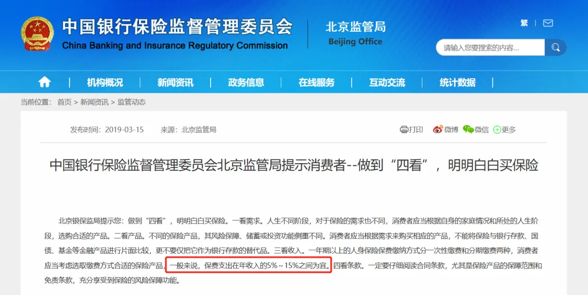

# 保费预算多少合适？

家庭资产记账中的「四笔钱」功能上线后，有知有行的伙伴们纷纷在群里晒起了自己的四笔钱分配图。

开心的是，发现伙伴们的保险意识真不错，保险都配得齐整的～震惊的是，有的伙伴保费是真的高呀。🤯

保费可是年年要交的，像重疾险、定寿险这样的长险，缴费期限动辄二三十年，预算超支，对家庭未来一段时间的结余和储蓄都会产生影响。

那么，保费多少比较合适呢？

保险行业流传着诸如「双十法则」、「普尔家庭资产象限图」等很多保费计算「法则」。企图以一条规则，一刀切地解决所有人的问题。

以双十法则举例，说的是，用家庭年收入的 10% 投保年收入 10 倍的保额。

看上去很简单，很好落地对不对？

先别着急，再仔细想想，就会发现好像有一点复杂...

首先，收入不是衡量家庭财务状况的唯一标准，同样年收入 30 万，单身贵族和二胎家庭的财务负担可大不一样。

再者，很多保险是需要交几十年的，今年的收入，并不代表未来的收入。身边有不少朋友，在收入预期比较高的时候买了不少保单，现在收入下降，保费就变成了沉重的负担😅

**参考这些标准，给自己划定一个保费范围是可以的，但想以此得到一个精确的值，就有些刻舟求剑了。**

之前银保监会的网站上给过一个保障类保费的收入占比建议，可以作为参考，**5% - 15% 的范围**还是比较宽的，大家可以结合自身情况灵活调整。

其实，现在线上保险产品性价比已经很高了，按照不同家庭成员的需求，配置好基础保障型产品，对大部分家庭来说，保费并不算很大的负担。

那不如换个角度思考，为什么有些朋友的保费还是这么高？

* 担心保险买了用不上，买亏了，选择带「返还」的产品
* 没有考虑自身的需求，跟风买了高额的港险
* 人情单，以为买的是医疗险，几年了才发现是高端医疗
* 初为人父/母，给孩子买了过多、过高的保障
* 收入预期高的时候买了缴费期长的、保费高的储蓄类产品

担心保险买了用不上，买亏了，选择带「返还」的产品

没有考虑自身的需求，跟风买了高额的港险

人情单，以为买的是医疗险，几年了才发现是高端医疗

初为人父/母，给孩子买了过多、过高的保障

收入预期高的时候买了缴费期长的、保费高的储蓄类产品

从这些案例可以看到，**大部分的人保险买得贵，还是因为「不懂」**。并不是说提及的这些产品不好，每个产品都有其适用的条件、场景，关键是要和需求匹配。如果你需要的是一个苹果，别人卖给你的是一个榴莲，自然会觉得买得贵且糟糕。

一份保单会陪伴我们很长时间，既然决定买保险，还是建议大家花一些时间，了解相关知识，免得被「坑」。

当然，在理解保险的基础上，也要做好压力测试，**家庭现金流的稳定性是关键，需要考虑收入和支出的实际情况，不要追求过度保障***。*如果预计未来有大的支出，比如购房或孩子的教育费用，那么在计算保费时应使用扣除这些费用后的结余来计算。

不同家庭成员的方案可以参考每月更新的家庭保险配置方案。如果觉得保费还是高，通过调整保障期限、保额来降低保费。或者先配置医疗险、意外险堵住大的风险敞口，等手头宽裕之后再慢慢配齐也是可以的。

我们每天都是在欲望和限制条件间权衡取舍，保险也是如此。没有完美的方案，但求买得明明白白。

> 法律声明 本文所载内容皆以交流分享为目的，仅供参考。本文所涉保险对比/试算/报价比价等内容均来自保险机构自营平台齐欣云服，有知有行力求本文内容的准确可靠，但对相关信息的准确性、可靠性、时效性及完整性不作任何明示或暗示的保证。有知有行提示您，保险配置方案请您结合自身情况独立判断，或预约专属保险顾问进行咨询。如需转载或引用本文所述内容的任何文字、图片、音频或视频，请注明出处。转载前请与有知有行取得联系并经同意，转载时须注明来源及作者。
