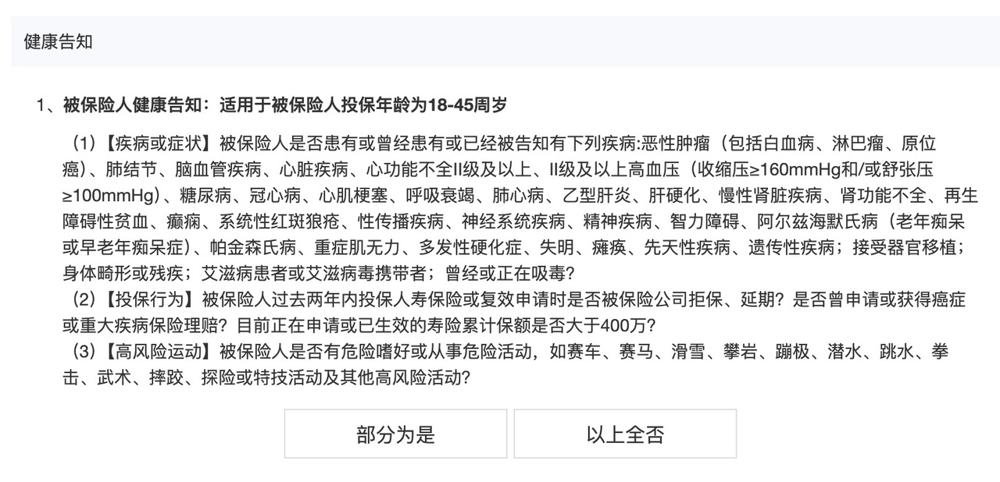

# 如何挑选定期寿险？

在四大基础保障险种中，「定期寿险」往往是最不受重视的一个。

许多人因为它的名称，误以为它复杂难懂，加上与寿命相关，难免带有一些忌讳。

然而，定期寿险其实是四大险种中**责任最简单、挑选难度最低的，保费也十分便宜**。更重要的是，它为家庭提供了关键的财务“防火墙”。

这篇文章我们一起来了解：

* 什么是定期寿险，适合谁？
* 定期寿险怎么选？
* 定期寿险怎么买？
* 值得推荐的定寿产品

[什么是定期寿险，适合谁？](https://youzhiyouxing.cn#1)

[定期寿险怎么选？](https://youzhiyouxing.cn#2)

[定期寿险怎么买？](https://youzhiyouxing.cn#3)

[值得推荐的定寿产品](https://youzhiyouxing.cn#4)

## 什么是定期寿险，适合谁？

定期寿险，责任特别简单，一句话就可以概括：**保障期内人没了，或者全残，就赔钱。**

至于人是怎么没的，意外还是生病，没有限制。甚至大部分产品，投保两年后自杀都可以赔。

定期寿险主要**应对「英年早逝」的风险，尤其适合家庭经济支柱购买，特别是上有老、下有小且身负房贷的人群。**孩子和老人，则不需要配置。

如果家庭的主要收入来源因疾病或意外去世，经济状况将面临巨大冲击。定期寿险的意义就在于，一旦发生不幸，至少能够保障家人平稳度过经济困难期。

尽管家庭经济支柱“英年早逝”的概率较低，但这一事件对家庭的潜在影响极大。因此，建议家庭支柱都配上一份。

## 定期寿险怎么选？

定期寿险保障责任简单，理赔不易扯皮，所以选择起来也很简单，重点关注健康告知和免责条款就可以。

相比医疗险和重疾险，定期寿险的健康告知，总体来说宽松很多，但不同产品的问询范围，存在一定差异。如果身体存在一些小状况，**首先需要做的，就是筛选出符合健康告知的、自己可以投保的产品。**

定期寿险健康告知示例

免责条款就是保险公司不赔付的责任，定期寿险基础的免责条款通常是这三条：

* 投保人对被保险人的故意杀害、故意伤害；
* 被保险人故意犯罪或抗拒依法采取的刑事强制措施；
* 被保险人自本合同成立或者合同效力恢复之日起两年内自杀，但自杀时为无民事行为能力人的除外。

投保人对被保险人的故意杀害、故意伤害；

被保险人故意犯罪或抗拒依法采取的刑事强制措施；

被保险人自本合同成立或者合同效力恢复之日起两年内自杀，但自杀时为无民事行为能力人的除外。

很多产品会再多一些（免责条款），比如被保险人主动吸食或注射毒品、酒后驾驶、无合法有效驾驶证驾驶或驾驶无有效行驶证。

免责条款的差异性也会反映在保费上。如果预算不受限，我**一般建议选择免责条款最少的产品。**

**做完以上两步筛选，剩下的产品里，选择保费最低的那个就可以了。**

## 

## 定期寿险怎么买？

选择好要投保的产品，还有两点需要我们确认：一、保额；二、保障期限。这两点取决于我们需要承担的家庭责任。

定期寿险的保额，取决于被保险人离世可能给家庭财务造成的缺口。直白一点，就是被保险人背负的经济责任：通常包括负债（房贷车贷）、父母养老金、子女教育金以及家庭日常支出等。

举个例子，比如小明还有 200 万房贷、10 万车贷。万一有个三长两短，希望留给父母 20 年养老钱，每年 10 万。给孩子和伴侣留 10 年教育金和生活费，每年 20 万。

那么保额 = 200 + 10 + 20 x 10 + 10 x 20 = 610 万

如果严格按照这种方法计算，将得到一个巨高的保额。对应的保费也让人难以承受。*所以在实际投保的时候，大部分人会取家庭负债总额，或者 10 倍年支出，或者 5 倍年收入作为基数，再根据预算上下调整。*

定期寿险的保障期限，取决于在多长时间内，被保险人是家庭收入的主要贡献者。

**大部分人会选择保障到退休**，在这个时间点，家庭已经有一定积蓄，儿女也已经成年，即使收入中断，也不会对家庭财务有太多影响。

此外，根据特定的需求选择保障期限，也是一种常见方法。比如，父母现在 60 岁，想要保证父母接下来 30 年的养老不受自己收入中断影响，那保障期限可以选择 30 年。

## 值得推荐的定寿产品

近期上线的 定海柱 6 号，保费更具优势，比此前推荐的 华贵大麦 2024 还要低。以 30 岁为例，100 万保额，交费 30 年，保障至 60 岁，男性年保费 1093 元，女性年保费 594 元。

相比健康险，定期寿险的健康告知本就宽松，而定海柱 6 号的健康告知更为友好，未询问乙肝和各种结节的情况，很适合压力大的打工人们。

产品链接：[定海柱6号定期寿险](https://cps.qixin19.com/apps/cps/bxz1101818/product/detail?prodId=104942&planId=130213&tenantId=0&createTime=1733307575808)

## 写在最后

我们忌讳谈到死亡，但如何帮助家人面对自己的死亡，这个话题，只能在活着的时候去思考。

对家庭支柱而言，承担着养家糊口的重担，责任在肩，赔率远比概率重要，我们不敢赌，更不能赌。

如果你也想为所爱之人增加一份确定性，不妨开始考虑这个险种。

> 法律声明 本文所载内容皆以交流分享为目的，仅供参考。本文所涉保险对比/试算/报价比价等内容均来自保险机构自营平台齐欣云服，有知有行力求本文内容的准确可靠，但对相关信息的准确性、可靠性、时效性及完整性不作任何明示或暗示的保证。有知有行提示您，保险配置方案请您结合自身情况独立判断，或预约专属保险顾问进行咨询。如需转载或引用本文所述内容的任何文字、图片、音频或视频，请注明出处。转载前请与有知有行取得联系并经同意，转载时须注明来源及作者。
