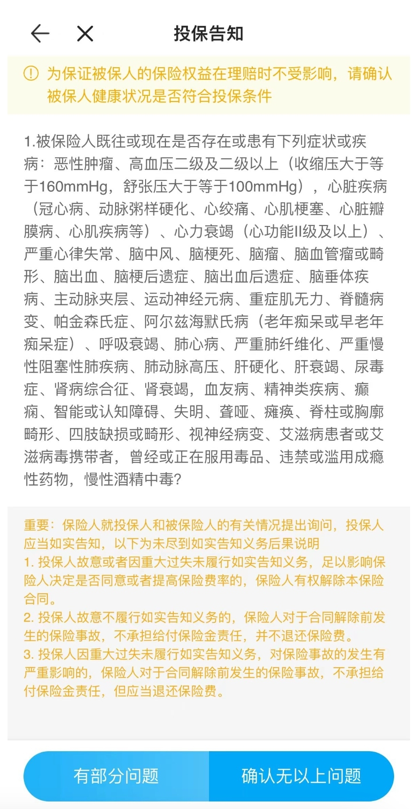
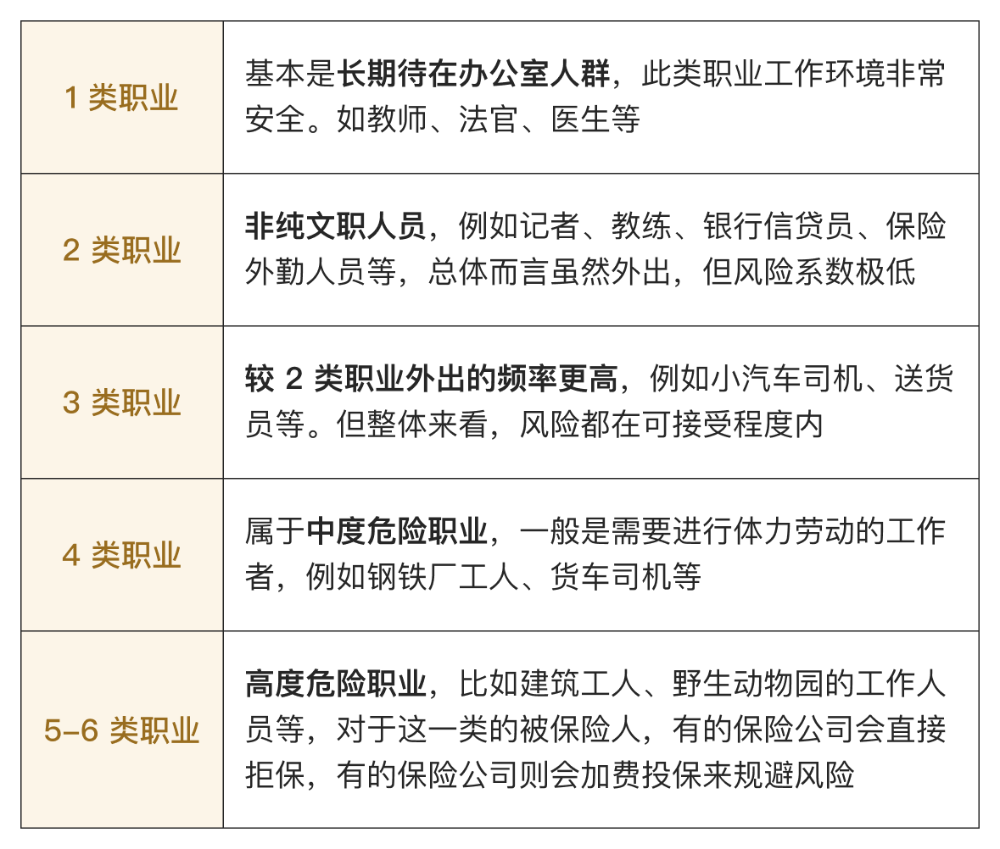

# 如何挑选意外险？

说起意外，大家可能会一下子想到交通事故、高架桥坍塌等这些常见于新闻中的事故。

其实，意外不只是这些，还包括猫抓狗咬、骨折扭伤这些小事故。在实际的理赔中，最常见的就是意外险理赔。

这篇文章，我们一起看看：

* 什么是「意外」？
* 意外险的保障责任
* 如何挑选意外险
* 值得推荐的意外险产品

[什么是「意外」？](https://youzhiyouxing.cn#1)

[意外险的保障责任](https://youzhiyouxing.cn#2)

[如何挑选意外险](https://youzhiyouxing.cn#3)

[值得推荐的意外险产品](https://youzhiyouxing.cn#4)

## 什么是「意外」？

了解意外险，就要先了解什么是「意外」。

这里的「意外」有严格的定义，需要具备以下四个要素：

* 外来因素造成的
* 非本意的
* 突发的
* 非疾病的

外来因素造成的

非本意的

突发的

非疾病的

前三个都比较好理解，跟大家对「意外」的认知也比较相符，容易引起纠纷的，是第四个因素「非疾病的」。

举个例子，下楼不小心踏空导致骨折，意外险是保的；但若是因突发心脏疾病导致摔倒而引发的骨折，虽也是意外事故，但起因是「疾病」，所以不在意外险的保障范围内。

再比如，不小心感冒了，不能算是「意外」。

## 意外险的保障责任

如果发生了符合上述条件的「意外」，意外险可以提供什么保障呢？

要回答这个问题，需要先看看*意外可能造成的后果，最严重的是身故，其次是残疾，比较轻的是需要跑一趟医院。*

意外险的常见保障责任，也跟意外可能造成的后果一一对应。

如果因意外导致身故，保险公司会赔付身故保险金。

举个例子，小明买了一份意外身故责任 100 万的意外险，如果不幸因意外去世，则受益人可以一次性得到保险公司赔付的 100 万身故保险金。

如果因意外导致残疾，保险公司会按照伤残等级按比例赔付伤残保险金。

一级伤残赔付保额的 100%，二级伤残赔付保额的 90%，依此类推，一直到十级伤残赔付保额的 10%。

意外伤残是意外险中很多人最在意的保障责任。如果不幸残疾，除了身心受创，工作和收入可能也会长期受到影响。对于不想成为他人负担的人来说，这笔钱无比重要。

意外医疗并不是意外险的必备责任，但市面上大多数产品都附加了此项保障责任。

意外医疗是“报销型”责任，比如意外烫伤、骨折这种意外受伤是能够养好的，只是会产生医疗费用，这种情况保险公司不会直接赔钱，而是根据实际的医疗费用报销。

除了以上三个常见责任，部分保险为了增加卖点，还会附加更多保障。比较常见的是住院津贴和猝死责任。

**住院津贴**：如果被保险人因意外住院治疗，保险公司将按合同规定的每日住院津贴金额乘以住院天数，给付住院津贴保险金。一般是 50 元/天 或者 100 元/天，更像是工资补偿，如果公司没有带薪病假的话，能有一丢丢安慰。

**猝死责任**：猝死大多是因疾病突然死亡，本来并不属于「意外」的范畴。但是现在大家普遍都对猝死产生恐慌，所以很多产品增加了猝死责任，当作一个卖点。但在理赔时，这一项通常需要医疗机构或者公安部门出具相关证明。

我请教了医生——如果是在医院外发生的死亡，医院一般是不会出具证明的。如果对死亡原因有争议，可以要求进行尸检。所以，理赔的难度其实并不低，如果在意身故责任，不如投保寿险，更令人踏实。

对我来说，*意外险中重要的是***意外身故、意外伤残和意外医疗。**附加的保障只是锦上添花，有的话挺好，没有也不是大问题。

## 如何挑选意外险

意外险保障责任简单，保费便宜，挑选起来也很简单。

在避雷一些返还型意外险，和一些保障责任不全的产品（只保全残，不保伤残，或者没有意外医疗责任）的基础上，可以着重参考以下两个因素：

意外险的投保也是有门槛的，主要体现在**健康告知、职业和年龄**三个方面。

很多人不知道，其实有些意外险也是有健康告知的。以小蜜蜂5号为例，它的健康告知如下👇

尽管相比健康险宽松许多。但像高血压二级及以上、冠心病等情况，但仍然会影响部分人群，给年轻长辈投保时需特别留意。

此外，意外风险随年龄段不同而变化，比如小孩子好奇心强，但对危险缺乏意识，意外发生的几率较高；中老年人则因身体素质下降，骨质疏松、行动迟缓，意外受伤的可能性也增加。因此，意外险通常按年龄段划分为成人、少儿和中老年人三类，其中老人和孩子的保费往往较高。

职业也对意外险影响很大。比如办公室职员的意外风险显著低于警察、建筑工人或驯兽师等高危职业。保险公司根据意外风险，将职业分为1-6类：

大多数意外险只限 1-3 类职业投保，风险等级更高的职业则需支付更多保费购买特定意外险。

意外医疗的使用概率是最高的，所以，不同产品的主要差异也集中在此，比较常见的有以下三点：

* 赔付范围：分为社保范围内报销和不限社保两种。
* 免赔额：顾名思义，免赔额指的是不赔的额度，在免赔额之上的保险费用，保险公司才进行报销。常见的免赔额为 0、100 元和 300 元。
* 赔付比例：赔付范围内，扣掉免赔额之后，保险公司按照比例来进行赔付，常见的赔付比例为 100% 和 90%。

**赔付范围**：分为社保范围内报销和不限社保两种。

**免赔额**：顾名思义，免赔额指的是不赔的额度，在免赔额之上的保险费用，保险公司才进行报销。常见的免赔额为 0、100 元和 300 元。

**赔付比例**：赔付范围内，扣掉免赔额之后，保险公司按照比例来进行赔付，常见的赔付比例为 100% 和 90%。

挑选的时候，当然是赔付范围不限社保，没有免赔额，100% 赔付的最好，意外险通常性价比很高，即使是意外医疗责任很好的产品，保费也很便宜。

## 值得推荐的意外险产品

人人都可能遭遇意外，所以意外险都要买，但侧重点有些不同。

家庭支柱，经济压力大，保额要买足，可以通过意外险提高身故保额，以及预防伤残导致的经济损失。

老人和小孩，他们的自我保护能力弱，容易发生磕碰摔伤等意外，主要用意外险报销医疗费。

成人意外险推荐**小蜜蜂 5 号综合意外险**。

一年 156 就能买到 50 万的保额。

交通意外额外赔付，出行不用单独再买航意险了。一般意外不保的猝死，也有 30 万保障。

意外医疗不限社保、0 免赔，要是因意外住院了还有津贴。

一个词总结：便宜大碗。

上文有提到，小蜜蜂 5 号有健康告知，如果因此无法投保，则可以看看无健康告知，投保条件更为宽松的*小蜜蜂（轻享版）*。

产品链接：

[小蜜蜂5号综合意外险](https://cps.qixin18.com/apps/cps/bxz1101818/product/detail?prodId=104716&planId=129797&tenantId=0&createTime=1731570638042)

[小蜜蜂(轻享版)综合意外险](https://cps.qixin18.com/apps/cps/bxz1101818/product/detail?prodId=104734&planId=129841&tenantId=0&createTime=1731570680537)

少儿意外险推荐*小神童 6 号*。

监管规定，不满 10 周岁的儿童，理赔时身故保额最高为 20 万，对多数家长来说，给孩子选身故保额 20 万的意外险就足够了。

通常，意外险的身故保额与伤残保额是一致的，这使得不少少儿意外险的伤残保额相对较低，保障力度有限。

小神童 6 号有 4 个版本，除基础版外，其他版本的意外伤残保障都能翻倍赔付，满足了很多家长对更高伤残保障的需求。就拿经典版来说，身故保额 20 万，伤残保额则为 40 万。此外，各版本还涵盖公共交通意外保障，可与意外身故 / 伤残责任叠加赔付，进一步提升保障力度。

在基础责任方面，小神童 6 号提供监护人责任、120 救护车费用、意外住院津贴、意外美容缝合、意外伤害牙齿修复医疗等多项保障，覆盖范围更全面，综合性价比更高。

同时，意外医疗不限社保、0 免赔，也很实用。

价格方面，基础版 66 元 / 年，经典版也只需 78 元 / 年，花小钱就能给孩子一份意外保障，很不错。

产品链接：[小神童6号少儿意外险](https://cps.qixin18.com/apps/cps/bxz1101818/product/detail?prodId=105007&planId=130322&tenantId=0&createTime=1739962802774)

51 - 85 岁的长辈推荐*孝心安 5 号*。

意外医疗不限社保、0 免赔，很实用，磕着碰着去医院也不用担心爸妈心疼钱了。

老年人意外险的保额通常较低，这款产品意外伤残、意外医疗的保额都是市面上比较充足的，针对高龄人群常遇到的意外骨折、叫救护车等场景也有额外保障。

这款产品有 4 个不同的计划，区别仅在于保额和价格，可以根据自己的预算按需选择。

很多人一听到「按需选择」就觉得头大😆，这里分享一下我自己的选择思路，供大家参考。

在为长辈挑选意外险时，我更看重意外医疗责任，对意外身故/伤残的保额则没那么高的要求。因此，我会优先考虑如何将意外医疗责任与已有医疗险的免赔额合理衔接。

举个例子，如果长辈已经配置了普通的百万医疗险，免赔额为1万元，那么在预算有限且对意外身故/伤残保额要求不高的情况下，可以选择保额和价格都较低的计划一。而如果配置的是惠民保、众民保这类报销门槛较高的医疗险，或者还未购买医疗险，则更适合选择计划二或计划三，这类保障更全面、意外医疗额度更高的方案。

产品链接：[孝心安5号老年人意外险](https://cps.qixin18.com/apps/cps/bxz1101818/product/detail?prodId=104932&planId=130196&tenantId=0&createTime=1733127955549)

前面说过，意外险对职业的要求很严格，4类以上职业保险公司赔付风险高，能保的意外险很少，*小蜜蜂（无畏版）*是为数不多的一个。

4-6 类职业，比如货车司机、煤矿工人等也能买，2米以上的高空作业都能保。保障也不差，意外身故、医疗和住院津贴都有。

产品链接：[小蜜蜂(无畏版)1-6类意外险](https://cps.qixin18.com/apps/cps/bxz1101818/product/detail?prodId=104778&planId=129923&tenantId=0&createTime=1731570800320)

## 写在最后

最后来说说意外险的优点吧，可太多了。

* 投保门槛低，年龄限制少，小到刚出生，大到七八十岁，都有产品可以选择；
* 价格很便宜，一两百块钱就可以买得到；
* 一般隔天或者下周就生效，买了就可以拥有保障；

投保门槛低，年龄限制少，小到刚出生，大到七八十岁，都有产品可以选择；

价格很便宜，一两百块钱就可以买得到；

一般隔天或者下周就生效，买了就可以拥有保障；

……

所以意外险很适合作为人生中的第一份保单。你买了吗？

> 法律声明 本文所载内容皆以交流分享为目的，仅供参考。本文所涉保险对比/试算/报价比价等内容均来自保险机构自营平台齐欣云服，有知有行力求本文内容的准确可靠，但对相关信息的准确性、可靠性、时效性及完整性不作任何明示或暗示的保证。有知有行提示您，保险配置方案请您结合自身情况独立判断，或预约专属保险顾问进行咨询。如需转载或引用本文所述内容的任何文字、图片、音频或视频，请注明出处。转载前请与有知有行取得联系并经同意，转载时须注明来源及作者。
