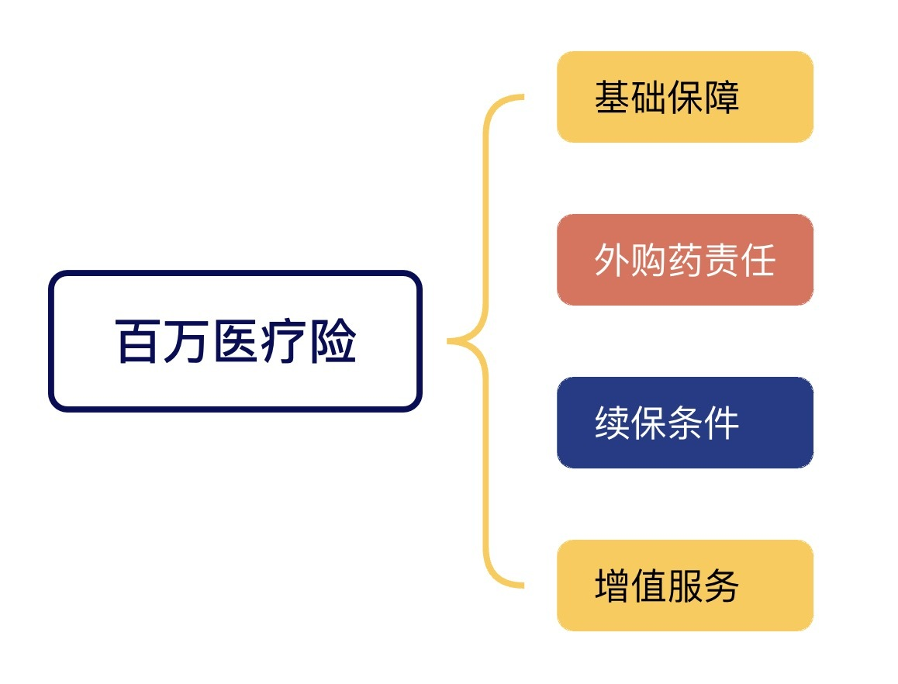
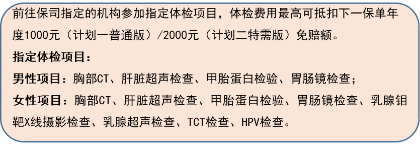

# 如何挑选百万医疗险？

很多人开始接触保险，就是因为担心医疗花销。「万一生大病，医保能报销的费用有限，该怎么办？」

百万医疗险保的就是大病。它可以**报销住院医疗费用，不限社保，保额高**至百万甚至几百万，对医疗花销起到兜底作用。

同时，因为免赔额和就医医院的限制，百万医疗险的**保费也很便宜**。可谓是花小钱办大事，四两拨千斤的典范。

无论是孩子、成人还是长辈，都建议配置一份。

由于医疗险无论是健康告知还是保险条款都相对复杂。

这篇文章，我们讨论：

* 如何挑选百万医疗险
* 投保前特别注意事项
* 投保行动指南
* 值得推荐的百万医疗险

[如何挑选百万医疗险](https://youzhiyouxing.cn#1)

[投保前特别注意事项](https://youzhiyouxing.cn#2)

[投保行动指南](https://youzhiyouxing.cn#3)

[值得推荐的百万医疗险](https://youzhiyouxing.cn#4)

如果你对百万医疗险还有疑问，相信这篇文章可以帮到你。

## 如何挑选百万医疗险

挑选百万医疗险时，大家可以重点关注以下四点：

百万医疗险的基础保障包括**住院费用、特殊门诊、住院前后门急诊**等。住院费用比较好理解，我们来看看另外两个责任的含义。

**特殊门诊**

日常感冒、不适去医院看的门诊，不在百万医疗险的保障范围内。

但是一些大病带来的、高费用的特定门急诊服务，百万医疗险是报销的。像肾透析、恶性肿瘤的放化疗、门诊手术、器官移植后的抗排异治疗等都属于特殊门诊。把这些给保了，可以减轻不小的压力。

这项责任百万医疗险通常都包含，需要留意的是**合同是否对此做了限制**。比如，某个疾病不保，某个治疗方式有限额。

之前有款大公司的产品，看似保障很好，却对癌症治疗和肾透析设置了单项限额，超过限额就不再赔付，这就是妥妥的「坑」了。

**基础保障还是限制越少越好**，有类似问题的产品，大家在挑选时还是尽量规避一下。

**住院前后门诊**

实际就医中，即使需要住院，也绕不开门诊。一般都是先看门诊，医生再给出住院治疗的建议。出院后，也需要回到门诊进行复诊。

住院前后的门急诊报销的就是这部分的费用，不同产品可报销的天数会略有差别。有的是前后 7 天，有的是 30 天。

在医疗资源比较紧张的地区，从决定住院到真正住上院，往往需要排队一段时间。因此，**选择更长的报销天数还是很有意义的**。

外购药，指的是在就医过程中，因为各种原因在医院内无法开出的，但又是治疗合理且必须的药品，医生会开处方，让患者到医院外的药店自行购买。

随着医保改革的推进，公立医院普通部大概率会提供基础实惠的药品，部分昂贵药品在医院内变得稀缺。未来院外购药的状况会越来越常见。而需要外购的，一般都是进口药或者特效药，价格不菲，普通家庭难以负担。因此，**选择涵盖外购药责任的百万医疗险，就很有必要了**。

目前主流百万医疗险大多覆盖了「癌症院外特药」，即治疗恶性肿瘤的特定药品，且约定了支持报销的「特药清单」。能覆盖所有院外药（不限医疗种类）的，目前只有小部分中端医疗险和大部分高端医疗险，这类产品保费高，并非适合所有人。退而求其次，含有癌症院外特药的百万医疗险虽然不完美，但在极端情况下，也能帮我们兜个底。

在选择百万医疗险时，一定要关注外购药责任，尽量选择保障范围广，报销限制少的。

医疗险都是一年一保，很多人会担心保障的可持续性。会不会理赔过就无法顺利续保呢？万一产品停售，自己身体条件又发生变化，买不了其它产品了，怎么办？

这就要说到保证续保了。简单理解，在合同约定的保证续保期限内，不管身体条件是否发生变化，即使已经多次理赔，投保人提出续保申请，保险公司都不得拒保，而且得按照原来的保险条款承保。

目前市面上最长的保证续保时限是 20 年。虽然给不了 100% 的确定性，但也是在可选项中相对较好的选择。

追求长期、稳定保障的朋友，*尽量选择保证续保年限长的产品*（是的，我的意思是 20 年）。

想象一下，如果体检医院给你打电话，说体检结果显示肺部疑似肿瘤，此刻你脑海中最先想到的是什么？

我猜肯定不是钱。

此刻更迫切的想法，是想搞清楚「我真的生病了吗？」「为什么是我？」「能治吗？」。此时，很多人会选择去大城市、大医院看病。但是挂号难、住院难、手术难也是大家需要面对的现实问题。

我自己的同事，本身就生活在北京，但是家人要手术排不上，只能无奈地等。如果是异地就医的患者，只会更煎熬。

相比其它金融产品，保险确实更有「人味」一些，不仅解决资金问题，也考虑「资源问题」。很多医疗险都会提供附加服务。比如，线上问诊、门诊协助、住院协助、就医陪诊、住院陪护、医疗费垫付......

在接触很多案例之后发现，这些服务还挺实用的。在选择产品的时候，增值服务不会成为我是否投保某个产品的决定因素，但*投保后，我都会特意查看下服务手册*，以防万一。要投保医疗险的你，也别忘记这点呀～

## 投保前特别注意事项

最重要的事放在最后说。投保前特别注意事项，就是「健康告知」。

大家日常压力大，体检又比以前频繁，难免有一些异常。很多人拍着胸脯跟我说，我很健康，肯定是标体。我都会叹口气回复，还是先看看体检报告吧。

保险公司对健康的定义和我们日常理解的不太一样。日常生活中，只要没什么病痛，那就是健康。但对于保险公司来说，卖出一份保险时，他们要考虑几十年后的动态变化，很多潜在的健康风险也在他们的评估范围内。所以，一些我们认为「常见」、「没事」的结节、囊肿等问题，在健康告知时，都变成了「问题」。

投保时，大家一定要先理清楚自己的身体状况，*做到如实告知*。

当然，很多朋友会说，看到条款和这么多医学术语我头都大了，不知道自己是否属于条款描述的情况。这很正常，*投保健康类险种时我都会建议大家先预约顾问*，请他们帮忙捋捋，专业的事儿交给专业的人，请他们协助投保，更安心。

如果买不了百万医疗，也不用灰心，还有其它的产品可以提供保障，之前写过 👉 [《身体有异常，如何选择医疗险？》](https://youzhiyouxing.cn/n/materials/1738)，有需要的朋友可以参考。

## 投保行动指南

医疗险的健康告知比较严格的，有时候不是人在挑产品，而是产品筛选人。

在实际投保时，我会建议大家把文章的顺序调个个儿，先别一头扎进同类产品的横向对比里。*在搞懂这个险种，决定投保之后，先预约顾问，让他们根据你的健康状况提供产品建议*。

如果身体情况不错，可以自由选择产品，再重点考察不同产品的以下几个方面：

* 基础保障：限制越少越好
* 外购药责任：保障范围越广越好
* 续保条款：保证续保年限越长越好
* 增值服务：虽然不是决定因素，但很实用，投保后可以特别留意一下

基础保障：限制越少越好

外购药责任：保障范围越广越好

续保条款：保证续保年限越长越好

增值服务：虽然不是决定因素，但很实用，投保后可以特别留意一下

## 值得推荐的百万医疗险

这款产品的一大亮点是**院外外购药无清单限制***。*

随着医保改革的推进，外购药保障越来越受重视。星相守将这一责任纳入基础保障，提供 20 年保证续保，并取消清单限制，只要符合合同约定的理赔条件，就能 100% 赔付。

不过，无清单限制并不意味着完全的用药自由，外购药仍需满足一系列条件，例如，很多产品会在合同中约定，必须由指定医疗机构的专科医生开具处方，且外购药品不能包含医保基本用药目录中已有且可正常采购的品种。在实际操作中，符合这些条件仍有一定难度。

此外，基础责任中的外购药不包含恶性肿瘤特定药品，这个保障在可选责任中，也是保证 20 年续保的，建议大家还是勾选上。

虽然有这样那样的限制，但相比没有外购药责任的产品，有保障总比没有好，限制少总比限制多好。我们需要保持合理预期，并在可选范围内找到最合适的方案。从这一点来看，星相守的优化方向是值得肯定的。

第二个亮点是，**免赔额选择灵活**，可选 0/1万/1.5万/2万，满足不同投保需求。家庭投保还可 共享免赔额，提高理赔使用率。若上一年度无理赔，免赔额每年可降低 1000 元，最高减少 5000 元。此外，前往指定机构参与体检项目，体检费用最高可抵扣下一保单年度1000元（计划一普通版）/2000元（计划二特需版）免赔额。

星相守提供两个计划。计划一（普通版） 是标准的百万医疗险。计划二（特需版） **额外涵盖公立医院国际部、特需部、VIP 部**。市面上带有国际部、特需医疗的产品，大多是一年期中高端医疗险，缺乏长期稳定性。星相守提供 20 年保证续保，是难得的长期选择。

需要注意的是，计划二的床位费限额 2500 元/天，陪床费限额 600 元/天。目前来看，大多数情况下足够，但未来医疗费用上涨，可能存在不足。

如果预算充足，希望提升就医品质，也可以选择计划二。

**产品链接：**

[星相守 - 个人版](https://cps.qixin18.com/apps/cps/bxz1101818/product/detail?prodId=105011&planId=130328&tenantId=0&createTime=1739948419824)

[星相守 - 家庭版](https://cps.qixin18.com/apps/cps/bxz1101818/product/detail?prodId=105012&planId=130329&tenantId=0&createTime=1739948441329)

现在市面上有一些没有健康告知，可以带病投保，保障责任也不错的适合非标体的百万医疗险险。

长相安 3 号就是其中一款。

虽然都叫「长相安」，但跟同系列的其它产品不同，长相安 3 号不是一款针对标体的、保证续保 20 年的产品。

产品设计上，长相安 3 号是对标着众民保来做的。

之前在[《身体有异常，如何选择医疗险？》](https://youzhiyouxing.cn/n/materials/1738)中，我们详细对比了惠民保、防癌医疗险和众民保，并介绍了选择思路。在 [《身体异常的朋友，医疗险有了新选择》](https://youzhiyouxing.cn/n/materials/1856)中我们对比了长相安 3 号和众民保的异同，感兴趣的朋友可以阅读了解。

产品链接：

长相安 3 号

[长相安3号 — 单人版](https://cps.qixin18.com/apps/cps/bxz1101818/product/detail?prodId=104987&planId=130294&tenantId=0&createTime=1736908933501)

[长相安3号 — 多人投保](https://cps.qixin18.com/apps/cps/bxz1101818/product/detail?prodId=104986&planId=130292&tenantId=0&createTime=1736908974445)

众民保

[众民保 — 单人版](https://cps.qixin18.com/apps/cps/bxz1101818/product/detail?prodId=104832&planId=130013&tenantId=0&createTime=1736909022609)

[众民保 — 多人投保](https://cps.qixin18.com/apps/cps/bxz1101818/product/detail?prodId=104833&planId=130015&tenantId=0&createTime=1736909052632)

希望每个人都能选到合适的医疗险产品，当然，更重要的是健健康康呀！

> 法律声明 本文所载内容皆以交流分享为目的，仅供参考。本文所涉保险对比/试算/报价比价等内容均来自保险机构自营平台齐欣云服，有知有行力求本文内容的准确可靠，但对相关信息的准确性、可靠性、时效性及完整性不作任何明示或暗示的保证。有知有行提示您，保险配置方案请您结合自身情况独立判断，或预约专属保险顾问进行咨询。如需转载或引用本文所述内容的任何文字、图片、音频或视频，请注明出处。转载前请与有知有行取得联系并经同意，转载时须注明来源及作者。
