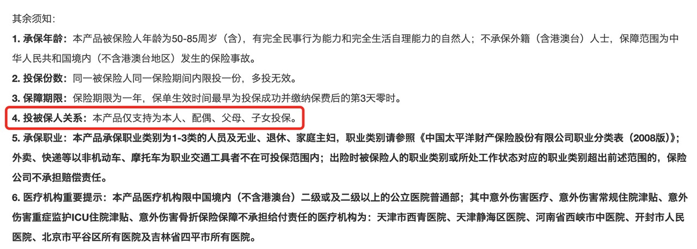

# 投保前，这些你得知道

前几天，我司一位伙伴告诉我，她的保单出险了。

去年七月，她通过「家庭保险服务」自行为家人配置了保险，其中包括为公公投保的一份意外险 —— 孝心安 3 号。

三月下旬，她的公公骑电动车外出时不慎摔倒，起初以为没事，但回家后却开始口齿不清，随后出现抽搐等症状。送医院检查后，确诊为脑出血，需要住院治疗。

了解了情况后，我查看了她的保单，结果一看吓一跳。

这份保单的投保人是她自己，被保险人是她的公公，但在投保人与被保险人的关系一栏，填写的是「女儿」。可这个产品的投保须知里写得非常清楚——仅支持为本人、配偶、父母、子女投保。配偶的父母，也就是公公婆婆，并不在其中。

这一点，为后续的理赔增加了很大的不确定性。

（截图自孝心安 3 号投保须知）

很多人觉得保险条款又长又绕，看不懂，干脆不看，凭感觉来操作，*觉得「常理如此就应该可以」。但保险并不总是遵循这种逻辑。*

就像这个案例，按常理讲，结了婚就是一家人了，叫公公「爸爸」也没毛病，为什么不能作为「女儿」给他买保险？

类似的「常理」与「条款」的冲突还不少：

* 医生说这个病没事，很多人都有，为什么买保险要告知呢？
* 投保时没提到的一些小毛病，理赔时怎么就成了拒赔理由？
* 明明说意外医疗「0免赔」，为什么去小区诊所看病不能报？
* 得了癌症，结果保险说只是「原位癌」，不给赔？
* ......

医生说这个病没事，很多人都有，为什么买保险要告知呢？

投保时没提到的一些小毛病，理赔时怎么就成了拒赔理由？

明明说意外医疗「0免赔」，为什么去小区诊所看病不能报？

得了癌症，结果保险说只是「原位癌」，不给赔？

......

保险确实能在关键时刻提供重要的经济支持，但也确实有很多容易被忽略的细节。对大多数人来说，这些限制和规则可能很陌生。

所以我们整理了一份实用清单，帮大家**避开投保时那些「你以为可以，其实不行」的「陷阱」。**

当然，正如前面所提到的，保险条款复杂，细节也很多，这份清单也无法覆盖所有情况，难免有所遗漏。

一方面，希望大家在评论区补充🙋*「仔细了解后，我才知道......」*，与同路人分享你留意到的问题。

另一方面，如果大家有投保需求，还是*建议大家先预约顾问*，顾问老师们大都非常专业，熟悉投保细节，任何不确定的问题都可以向他们咨询。多一次确认，就多一层安心。

很多朋友可能担心顾问推销产品，其实不必担心。出于保障完善的考虑，顾问老师会给大家一些投保建议，*如果你不需要，直接跟顾问老师说「不需要」即可。不需要有心理负担。*

好了，废话不多说，下面是我们整理的实用清单👇

* 不是想给谁买就能买。大多数产品支持为自己、配偶、父母、子女买保险，但是否能给配偶父母（如公公婆婆、岳父母）、祖父母、孙子孙女买，每款产品的规定可能不同，记得在投保前确认清楚。

**不是想给谁买就能买。**

大多数产品支持为自己、配偶、父母、子女买保险，但是否能给配偶父母（如公公婆婆、岳父母）、祖父母、孙子孙女买，每款产品的规定可能不同，记得在投保前确认清楚。

* 保险的权属很「讲究」。和其他金融产品比，保险在「钱归谁」这件事上特别清晰。投保人、被保险人、受益人一旦确定，权益归属就很明确。如果家庭关系复杂、涉及债务或有资产隔离需求，更要慎选三者的身份，建议找顾问聊一聊，别自己拍脑袋决定。

**保险的权属很「讲究」。**

和其他金融产品比，保险在「钱归谁」这件事上特别清晰。投保人、被保险人、受益人一旦确定，权益归属就很明确。如果家庭关系复杂、涉及债务或有资产隔离需求，更要慎选三者的身份，建议找顾问聊一聊，别自己拍脑袋决定。

* 受益人，别默认。是「法定」还是「指定」，会直接影响身故保险金的分配。如果你心里已经有想法，就务必明确写清楚：谁是受益人、顺序如何、比例怎么分。结婚、离婚、生娃后，也记得及时更新受益人信息。

**受益人，别默认。**

是「法定」还是「指定」，会直接影响身故保险金的分配。如果你心里已经有想法，就务必明确写清楚：谁是受益人、顺序如何、比例怎么分。结婚、离婚、生娃后，也记得及时更新受益人信息。

* 不是买完就生效。有的保险是「即时生效」，有的是「次日零时」，也可能「指定某天」生效。 另外，大部分健康险有等待期，这段时间内因疾病出险不赔，但因意外导致出险可以赔。别等身体出状况才想起买保险。

**不是买完就生效。**

有的保险是「即时生效」，有的是「次日零时」，也可能「指定某天」生效。 另外，大部分健康险有等待期，这段时间内因疾病出险不赔，但因意外导致出险可以赔。别等身体出状况才想起买保险。

* 买了不满意？你有“后悔权”。大部分长期险有 10～20 天的犹豫期，这期间退保能全额退款；短期险则可能没有犹豫期，或时间非常短。想退就别拖，不过最稳妥的方式，还是买前想清楚，买时不后悔。

**买了不满意？你有“后悔权”。**

大部分长期险有 10～20 天的犹豫期，这期间退保能全额退款；短期险则可能没有犹豫期，或时间非常短。想退就别拖，不过最稳妥的方式，还是买前想清楚，买时不后悔。

* 忘了续保咋办？有宽限期。多数长期保险会有宽限期，一般最长为60天，这期间就算忘了交保费，出险了也可能赔，不过要扣除原本应交的保费。但一旦超过时间，合同会进入中止期，通常为2年，在这期间保险公司不承担保险责任，但投保人可以申请恢复保单效力。一旦超过这2年，保单将失效、退还现金价值。建议投保时绑定常用储蓄卡+做好保单管理，别因为小疏忽让保障断档。

**忘了续保咋办？有宽限期。**

多数长期保险会有宽限期，一般最长为60天，这期间就算忘了交保费，出险了也可能赔，不过要扣除原本应交的保费。

但一旦超过时间，合同会进入中止期，通常为2年，在这期间保险公司不承担保险责任，但投保人可以申请恢复保单效力。一旦超过这2年，保单将失效、退还现金价值。

建议投保时绑定常用储蓄卡+做好保单管理，别因为小疏忽让保障断档。

* 缴费期长短，根据需求选。缴费期短：保费总支出低，但当下压力大。 缴费期长：每年轻松点，但总保费更高。 两者没有绝对的好坏，关键看现金流情况和预算。投保时需要衡量自己的长期缴费能力，避免日后无法交上保费造成损失。

**缴费期长短，根据需求选。**

缴费期短：保费总支出低，但当下压力大。 缴费期长：每年轻松点，但总保费更高。 两者没有绝对的好坏，关键看现金流情况和预算。投保时需要衡量自己的长期缴费能力，避免日后无法交上保费造成损失。

* 如实告知，是买保险的底线。很多保险产品都有「健康告知」环节，简单理解，就是保险公司会问你的身体情况，不能随便蒙。如果没有如实告知，理赔可能出问题。

**如实告知，是买保险的底线。**

很多保险产品都有「健康告知」环节，简单理解，就是保险公司会问你的身体情况，不能随便蒙。如果没有如实告知，理赔可能出问题。

* 我国实行「有限告知」。就是问什么答什么，没问的不用主动说。但问的内容，一定要按医院或体检机构等的检查结果回答，不要凭自己感觉。

**我国实行「有限告知」。**

就是问什么答什么，没问的不用主动说。但问的内容，一定要按医院或体检机构等的检查结果回答，不要凭自己感觉。

* 投保前不用特意体检。告知通常会问既往病史和近几年的检查异常，比如“近两年有没有XX症状”，你只需根据已有报告如实回答。如果保险公司要求补资料，再去做专项复查就行，投保前不用特意体检。

**投保前不用特意体检。**

告知通常会问既往病史和近几年的检查异常，比如“近两年有没有XX症状”，你只需根据已有报告如实回答。如果保险公司要求补资料，再去做专项复查就行，投保前不用特意体检。

* 有的病你觉得小事，保险不这么看。医生说没事的，有时也得告知。保险的判断标准和医学不完全一致，比如医生说甲状腺结节3级不会特别理会，但重疾险、医疗险基本都会问询。拿不准的地方建议请顾问协助。

**有的病你觉得小事，保险不这么看。**

医生说没事的，有时也得告知。保险的判断标准和医学不完全一致，比如医生说甲状腺结节3级不会特别理会，但重疾险、医疗险基本都会问询。拿不准的地方建议请顾问协助。

* 高风险职业有限制。很多保险产品对被保人的职业有要求，像高空作业、维修电工、外卖员等高风险职业有可能买不了某些产品，投保前一定要确认清楚。

**高风险职业有限制**。

很多保险产品对被保人的职业有要求，像高空作业、维修电工、外卖员等高风险职业有可能买不了某些产品，投保前一定要确认清楚。

* 免赔额，了解下医疗险常设有免赔额（比如一万元），意思是这一部分得你自己掏，超过的才开始赔。别忽略这个「门槛」，选产品时要看清。

**免赔额，了解下**

医疗险常设有免赔额（比如一万元），意思是这一部分得你自己掏，超过的才开始赔。别忽略这个「门槛」，选产品时要看清。

* 免责条款，别只看保什么，更要看不保什么。常见免责包括：高风险运动、妊娠相关、酒驾、吸毒、蓄意伤害等。别等出事才发现「不在赔付范围」。

**免责条款，别只看保什么，更要看不保什么。**

常见免责包括：高风险运动、妊娠相关、酒驾、吸毒、蓄意伤害等。别等出事才发现「不在赔付范围」。

* 就医医院有限制。保险对就医医院有限制，通常约定为二级及以上的公立医院。要是去小诊所、社区医院、民营医院可能报不了。就医时别随便选医院，选错了可能不赔。

**就医医院有限制。**

保险对就医医院有限制，通常约定为二级及以上的公立医院。要是去小诊所、社区医院、民营医院可能报不了。就医时别随便选医院，选错了可能不赔。

* 先用医保，赔付更多。多数医疗险和意外险会对“是否先使用医保”设定不同的赔付比例。如果你直接自费，可能赔得会少。异地就医也别忘了先备案+使用医保，否则影响赔付。

**先用医保，赔付更多。**

多数医疗险和意外险会对“是否先使用医保”设定不同的赔付比例。如果你直接自费，可能赔得会少。异地就医也别忘了先备案+使用医保，否则影响赔付。

* 重疾险不是确诊就赔。重疾险不是「一确诊就赔」，得达到合同规定的严重程度，比如接受某种手术或达到某种状态。不要听信「确诊即赔」这种过于简单的说法，看清合同定义最靠谱。

**重疾险不是确诊就赔。**

重疾险不是「一确诊就赔」，得达到合同规定的严重程度，比如接受某种手术或达到某种状态。不要听信「确诊即赔」这种过于简单的说法，看清合同定义最靠谱。

看到这里，大家可能会觉得保险过于复杂和「算计」。但它的另一面是，因为有了各种规则，才有可能为大家提供更公平的费率和保障、避开骗保行为等等。我们期望的也是一份明确而非含糊的保障，而这需要规则来建立。

好啦，今天的文章就到这里，如果你觉得这份清单有点长，看不懂记不住也没关系，有疑问的话，投保前问问 👉 [保险顾问](https://cps.qixin18.com/v3/m/bxz1101818/reservation?createTime=1744176616779)，准没错～

> 法律声明 本文所载内容皆以交流分享为目的，仅供参考。本文所涉保险对比/试算/报价比价等内容均来自保险机构自营平台齐欣云服，有知有行力求本文内容的准确可靠，但对相关信息的准确性、可靠性、时效性及完整性不作任何明示或暗示的保证。有知有行提示您，保险配置方案请您结合自身情况独立判断，或预约专属保险顾问进行咨询。如需转载或引用本文所述内容的任何文字、图片、音频或视频，请注明出处。转载前请与有知有行取得联系并经同意，转载时须注明来源及作者。
