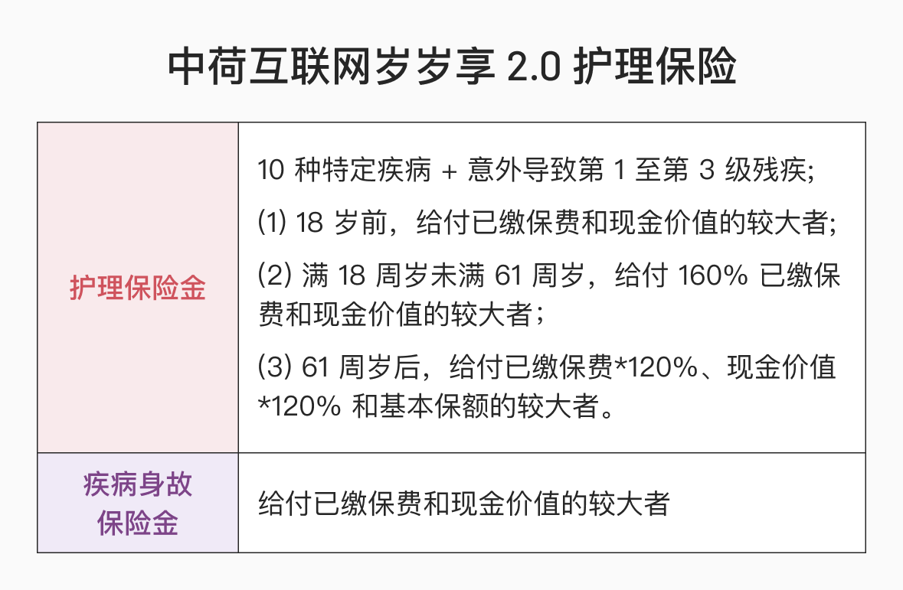
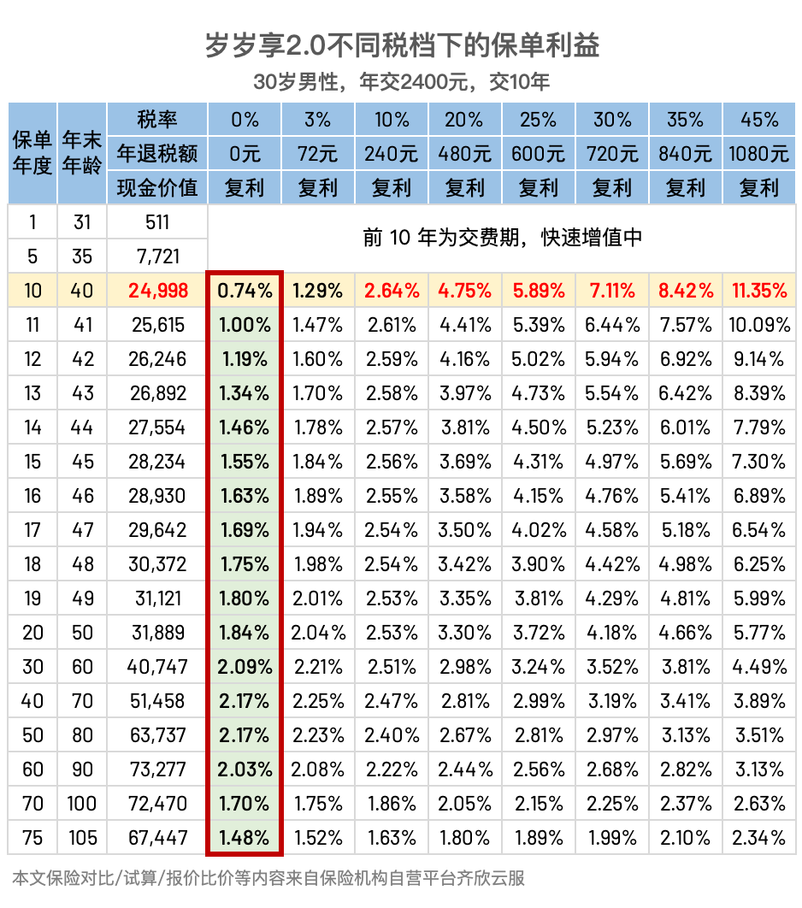
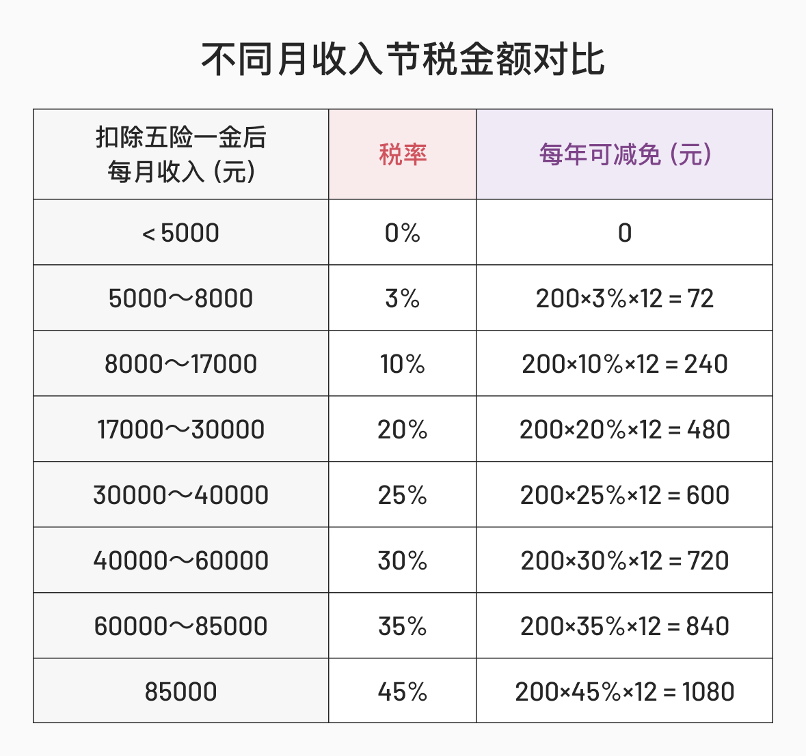
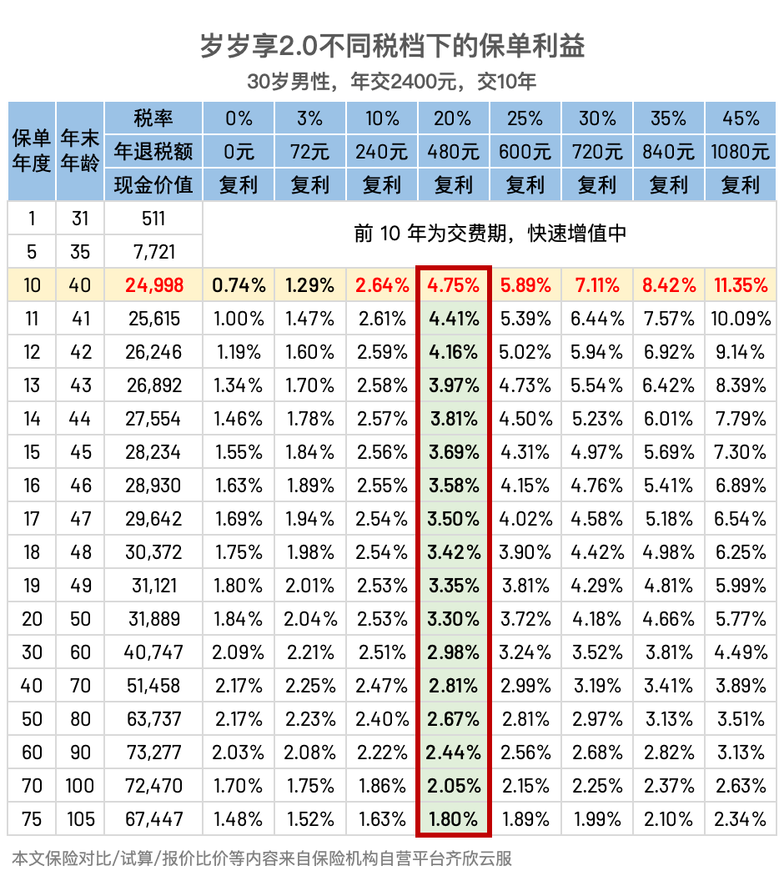
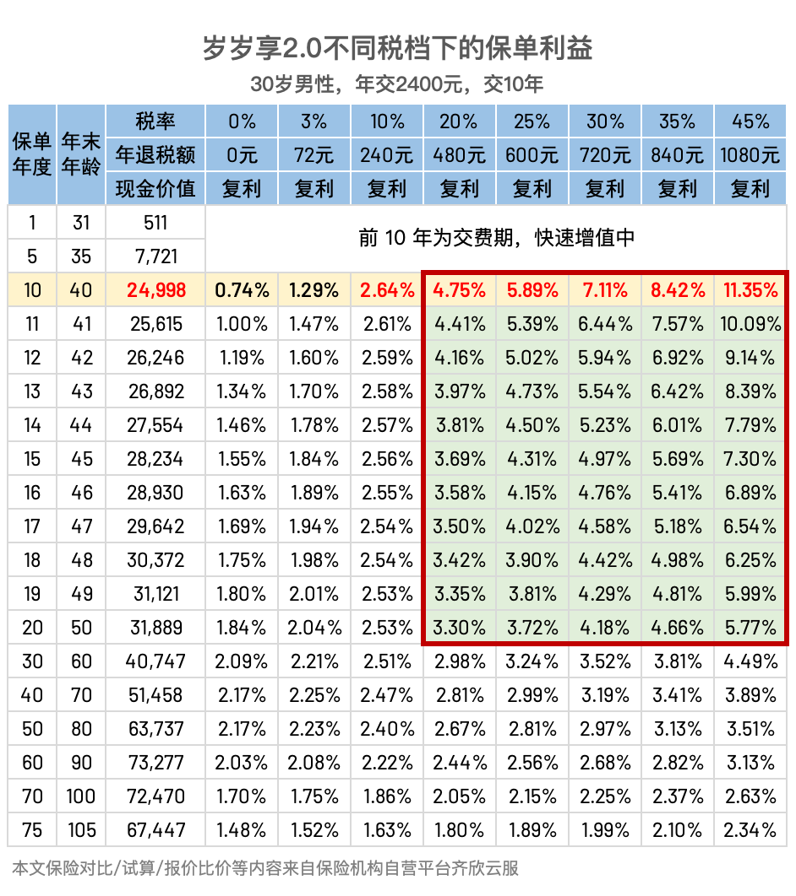

# 明明是护理险，为什么大家都用它来理财？

年中时，有一款叫「中荷岁岁享护理保险」的产品广受欢迎，后因预定利率下调而下线了。

近期，它的 2.0 版本回归了。

大家对四大险种已经很熟悉了，「护理险」是什么？为什么广受欢迎呢？

其实，大家买它不是出于保障目的，而是满足理财需求。对于个人所得税税率超过 20% 的人来说，叠加节税效果后，这个产品持有 10 年的真实复利可以超过 4%。

是不是有点动心，别着急，我们一起从以下三方面了解一下这款产品：

* 名不副实的护理险
* 叠加 buff 的增额寿
* 适合谁

[名不副实的护理险](https://youzhiyouxing.cn#1)

[叠加 buff 的增额寿](https://youzhiyouxing.cn#2)

[适合谁](https://youzhiyouxing.cn#3)

## 名不副实的护理险

作为一个长期漂泊在外的独生子女，父母照护一直是我很关心的话题。

保险是金融产品，当父母需要照护时，它无法解决困境，但可以提供财务支持。我脑海中比较理想的护理险，赔付方式更类似年金，每月提供稳定的现金流，覆盖请护工的费用，或者作为全职儿女的收入补充。

而岁岁享是给付制的，10 种特定疾病 + 意外导致第 1 至 3 级残疾，一笔赔付护理保险金。这个赔付方式跟长期照护的场景并不匹配。

加之，大家选择这个产品的很大原因是抵税，每年投保金额以 2400 居多，即使积累多年，出险时也是杯水车薪，来个例子就看得更清楚了：

> 40 周岁男性，选择年缴 2400 元，缴费 10 年，保障 25 年后，65 周岁时在市三甲医院经专科医生确诊为严重脑中风后遗症，一次性获赔 47744 元。

40 周岁男性，选择年缴 2400 元，缴费 10 年，保障 25 年后，65 周岁时在市三甲医院经专科医生确诊为严重脑中风后遗症，一次性获赔 47744 元。

如果是看中「护理」，无论是为父母，还是为自己投保，这个产品都不推荐。

## 叠加 buff 的增额寿

这个产品更类似增额寿，很多人看中收益，把它当成一个长期储蓄来买。

先看产品本身的收益，以 30 岁的男性举例，买一份岁岁享 2.0 ，每年保费 2400 ，缴费 10 年，保单利益是这样的：

平平无奇。

别着急，它还有大招没有发。

细心的朋友可能已经发现，在申报个税时，有一个扣除项目是「商业健康险」，每年最多可抵扣 2400 元。收入越高，抵扣金额越多。

而岁岁享 2.0 就是一款「税优健康险」。今年买了，明年就能抵税。相当于用更少的保费拿到了跟其它产品差不多的收益。

如果这位男士的税率稳定在 20%，叠加节税 buff，那么保单利益变成了

一下子，优势就很明显了。

可以看到，*这个产品高收益的核心原因，是在产品本身收益的基础上，叠加了节税效果。收入越高，节税效果越明显，收益越合适*。个人感受是，所得税率在 20% 以上，这个产品都值得考虑。

但需要注意的是，*随着持有时间的拉长，节税带来的影响随之下降*， IRR 明显下降，如果从理财角度出发，在 10 ～ 13 年之间退保，会比较合适。

另外，如果希望在明年就抵扣上，需要在 2024 年 12 月 31 日前投保。

## 身故保险金

如果在准备退保时间之前身故了怎么办呢？

这是护理险和增额寿的另一个区别。

它的身故责任只包含疾病身故的赔付，如果因疾病身故，赔付已缴保费和现金价值的较大者。若被保险人因意外身故，则保险公司退还现金价值，合同终止。

## 适合谁

很多人推荐这个产品时，会使用「薅羊毛」的说法，希望唤起大家损失厌恶的心理来促进销量。

可我认为，脱离需求讨论「薅羊毛」，吃亏的最终还是自己。

不管是日常消费决策还是金融决策，*我们购买某个产品的最终理由，是因为我需要它*，在此基础上，可以挑选同类产品中物美价廉的那个。若因为打折、降价、薅羊毛而买了不需要的东西，就得不偿失了。

最近两年，大家越来越能意识到家庭资产配置的重要性，会留出一部分更追求稳健的资金，配置于稳钱账户、债券基金、储蓄型保险等金融产品上。如果你有这类的需求，同时收入比较高（个人所得税税率在 20% 以上 ），那么岁岁享 2.0 很适合你。可以每年分配 2400 元到这个产品中，实现利益最大化。

如果已经决定投保，别忘了 2024 年 12 月 31 日之前投保的，年保费 ≥ 2400 且交费期 ≥ 10 年的订单会赠送价值 400 元的体检卡，自己用，家人用都可以。（再次提醒，买产品，有额外赠礼，很不错。但是为了小礼品买产品，就不值得了）

好啦，今天的文章就到这里。通过以上介绍，你对这个产品了解了吗？

受文章篇幅影响，关于如何查自己的税率、如何退税、怎么看未来的保单利益、体检套餐包含什么、怎么用等问题文中没有展开，如果感兴趣，可以预约顾问，详细咨询。

产品链接：[中荷岁享2.0护理保险](https://cps.qixin19.com/apps/cps/bxz1101818/product/detail?prodId=104901&planId=130142&tenantId=0&createTime=1730707097614)

预约顾问：[预约保险咨询顾问](https://cps.qixin18.com/v3/m/bxz1101818/reservation?createTime=1730707138117)

> 法律声明 本文所载内容皆以交流分享为目的，仅供参考。本文所涉保险对比/试算/报价比价等内容均来自保险机构自营平台齐欣云服，有知有行力求本文内容的准确可靠，但对相关信息的准确性、可靠性、时效性及完整性不作任何明示或暗示的保证。有知有行提示您，保险配置方案请您结合自身情况独立判断，或预约专属保险顾问进行咨询。如需转载或引用本文所述内容的任何文字、图片、音频或视频，请注明出处。转载前请与有知有行取得联系并经同意，转载时须注明来源及作者。
