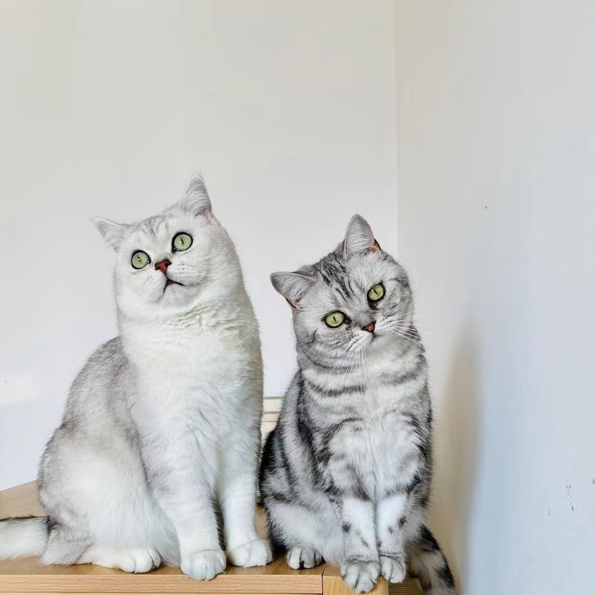
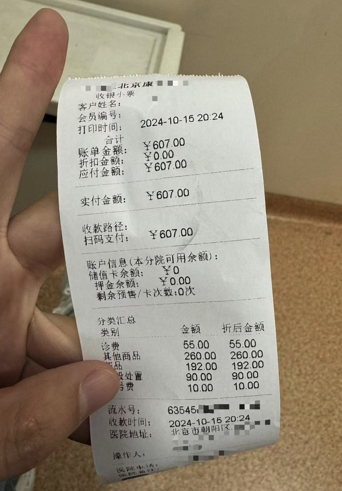
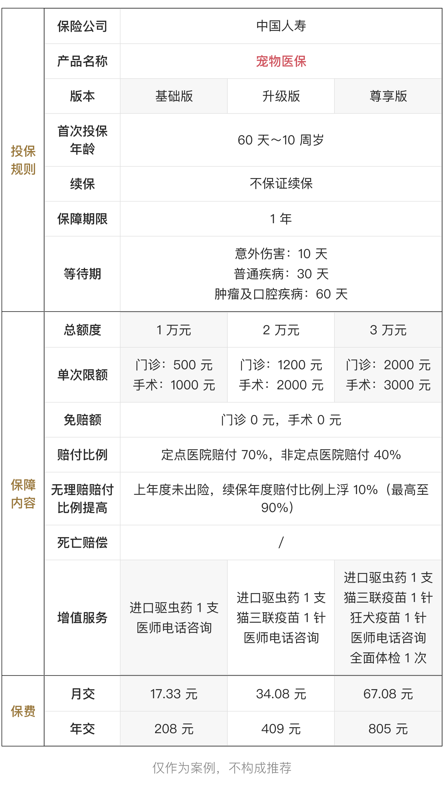
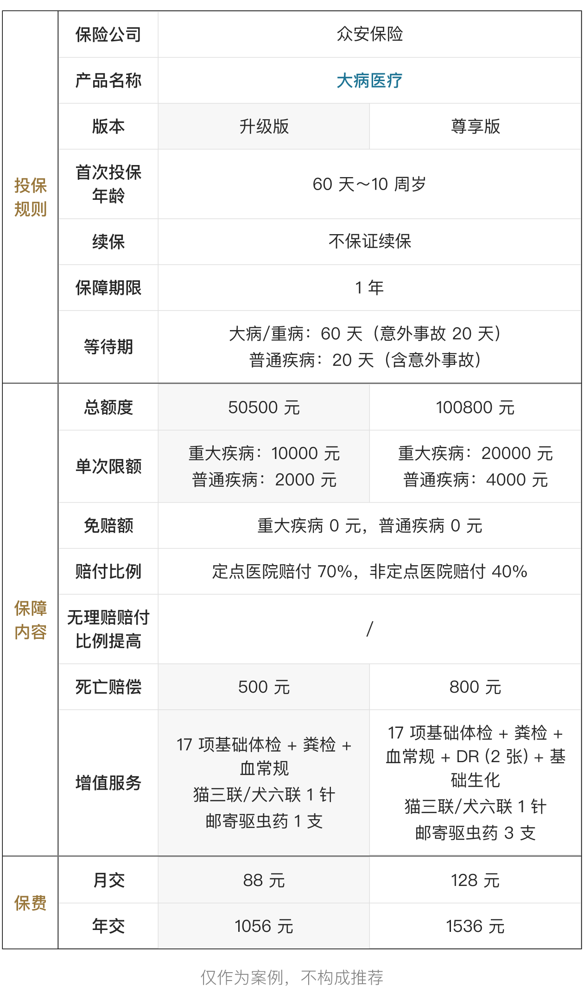
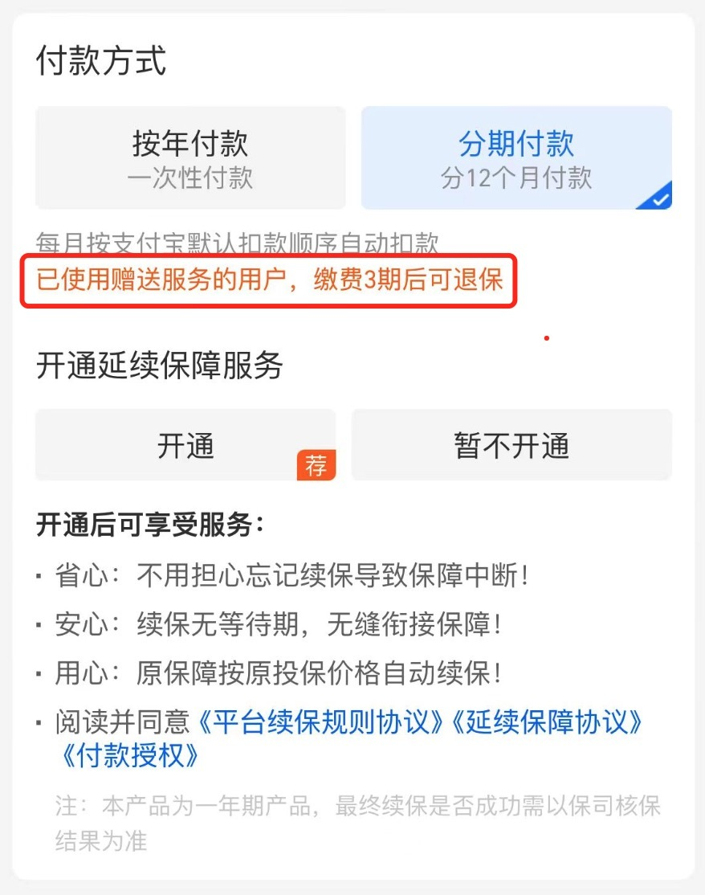
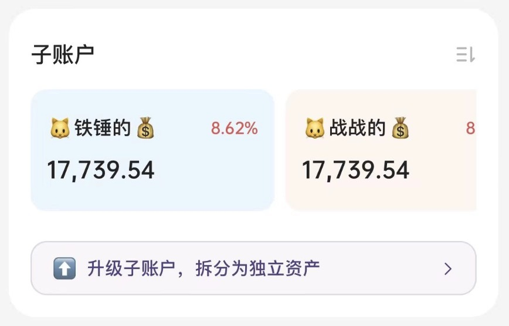
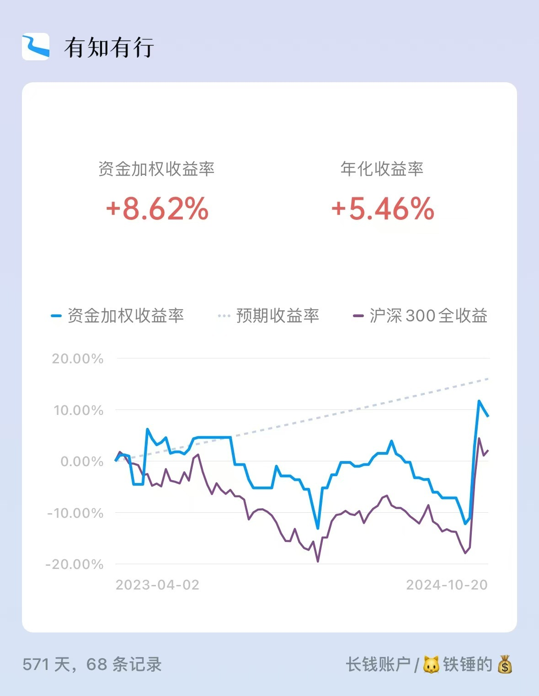

# 被兽医刺客背刺之后...

有知有行的老朋友对司猫「铁锤」都很熟悉了，社交媒体、壁纸和明信片上，都有过她的身影。

其实铁锤还有一个弟弟，叫「战战」，是一只胖头胖脑的银渐层。

上周战战看起来状态不对，pp 有点红肿，我确定这是一个小问题，但保险起见，还是带他去了医院。

医生说，只是轻微的肛门腺炎，清理伤口，打一剂消炎针，再开一瓶清洗剂清理几天就好。果然小问题，悬着心落了下来。

但一结账，傻眼了，607 块......那一刻，兽医刺客的尖刀扎中了我。

感受到我的惊讶，医生也有些尴尬，连忙问战战有保险吗，得知没有后，一直跟我推荐，「宠物保险很不错的，可以报销不少，还是应该买一个」。

之前就看过宠物保险，觉得不是很合适，所以没有投保。但这次的费用实在离谱，我决定认认真真再研究一遍。

*这篇文章记录的就是我研究产品、做决策的全过程。*不管你是想了解宠物保险，还是在纠结要不要投保某个产品，相信都会有所帮助。

叠个甲，全文无广，提及的产品仅作为案例分析，不构成推荐，不代表我最终投保了这个产品。给出的解决方案也综合考虑了所在地的宠物医疗花销水平及个人情况，仅供参考，大家做决策时，还是要结合自身情况，具体问题具体分析......

同一险种的主流产品差距一般都不大。因此，在新接触一个险种的时候，我习惯先吃透一个产品，再横向对比。否则，容易迷失在细节里，抓不到重点。

医生推荐在支付宝投保，结账柜台上也粘着支付宝的投保二维码，我也就从善入流，从这里开始。

支付宝主推的宠物医疗险有两款，一款是「宠物医保」，一款是「大病医疗」。这两款产品长这样👇*（仅作为案例，不构成推荐...*

## 保障范围

这两款产品都是医疗险，报销毛孩子看病的医疗费用，疾病、意外导致的就医都可以赔。

需要注意的是，*先天性疾病、遗传疾病，非因疾病或意外伤害而衍生的牙齿问题，怀孕、绝育及由此导致的并发症都属于免责范围*。

因为近亲繁殖现象的普遍存在，有先天疾病和遗传疾病的毛孩子并不在少数。像铁锤患有的横膈膜心包疝，就属于先天疾病，这个疾病及其并发症带来的医疗费用，宠物险是无法报销的。

支付宝的两款产品都明确列出了先天性疾病、先天性畸形和遗传病清单，大家可以对照看看。有些平台的产品没有列出明确的病种，但免责条款也是类似的，大家投保时不要抱有侥幸心理。

另一个需要注意的问题是，宠物险报销的是医疗费用，所有饲字号和卫消字号（非兽药字号）的产品（包括但不限于宠物粮及零食，处方粮、处方罐头、非治疗所必需营养品等），虽然花费不菲，但也不在报销范围内。并不是宠物医院的产生的花销都可以报销。

## 报销额度

除了总保额，宠物医疗险中有一个概念叫*「单次事故赔付上限」*。因同一原因或相关原因导致的疾病，从初诊到治愈，算一个事故。

有点拗口，举个 🌰 就明白了。

以升级版的「宠物医保」医保。假设因感冒就医，那么此次就医可报销的最高金额是 1200 元。治愈后，过了几个月，又感冒了，疾病原因跟上次无关，这次就医的额度重新计算，最高还是可报销 1200 元。

但如果毛孩子患的是慢性疾病，需要不间断持续治疗 2 年（假设续保没有问题），那这两年此种疾病带来的就医花销最高报销金额，也是 1200 元。

那么毛孩子治病的花销是怎么样的呢？随机采访了几位有知有行的伙伴：

> 小张家的「火箭」，被捡到时因肠胃问题窜稀，医院给了流浪猫特惠，买药 + 住院观察一周，共花费 300 元战战尿闭（英短的常见问题），全麻导尿，共花费 2000+永靖家的「炭炭」，应激导致尿闭、尿道炎，找了两家宠物医院才治好，共花费 5000+四火家的「沙发」 ，因猫瘟在成都住院一周，共花费 9300+...

* 小张家的「火箭」，被捡到时因肠胃问题窜稀，医院给了流浪猫特惠，买药 + 住院观察一周，共花费 300 元
* 战战尿闭（英短的常见问题），全麻导尿，共花费 2000+
* 永靖家的「炭炭」，应激导致尿闭、尿道炎，找了两家宠物医院才治好，共花费 5000+
* 四火家的「沙发」 ，因猫瘟在成都住院一周，共花费 9300+
* ...

小张家的「火箭」，被捡到时因肠胃问题窜稀，医院给了流浪猫特惠，买药 + 住院观察一周，共花费 300 元

战战尿闭（英短的常见问题），全麻导尿，共花费 2000+

永靖家的「炭炭」，应激导致尿闭、尿道炎，找了两家宠物医院才治好，共花费 5000+

四火家的「沙发」 ，因猫瘟在成都住院一周，共花费 9300+

...

大家也可以根据自己或身边人的花费来估算一下当地的宠物医疗费用水平。如果是比较大的问题，宠物医保的限额肯定是杯水车薪，即使投保了了大病医疗，以北京的宠物医疗花销看，也很难兜住底。

宠物就医，低频高单价的情况比较常见。在挑选产品时，单次事故赔付上限比总保额重要多了。

## 报销比例

赔付的计算公式是：

赔付金额 = （发票金额 - 非保障项 - 免赔额）*赔付比例 %

赔付比例是影响赔付金额的重要参数。有些宠物医疗险约定只要是正规医院产生的医疗费用，都按同比例报销。有些产品会区分定点医院和非定点医院。在定点医院就医，赔付比例更高。

*在投保前务必关注家附近有没有保险公司认可的定点医院。*

## 续保条件

我们平时买的百万医疗险，也是一年一保的。像长相安 2 号这样的百万医疗险保证 20 年续保，意味着，在保证续保期内，不会因为年龄增长或健康状况变化而拒绝续保。

但，宠物医疗险是不保证续保的。

若在上一年保单年度发生过理赔，再申请续保，可能能正常续保，也可能涨价，甚至拒保。

## 增值服务

这款产品附赠了一些增值服务，像驱虫药、疫苗什么的。如果已经投保，别忘了领取，毕竟这也是我们真金白银购买的服务的一部分。

需要注意的是，这些增值服务的使用是有限制的，有的产品会明确规定，如果已经使用赠送服务，在投保 x 个月前无法退保。

从保险公司的立场也很好理解，提供增值服务本质是还是为了鼓励大家注意毛孩子健康，降低发病率，节省一点理赔金，如果放任薅羊毛的行为，保险公司一下子就被薅秃了。

不管大家是否投保，都希望这是一个深思熟虑的决定，保险是一项长期决策，为了一点小利益冲动投保，就得不偿失了。

说实话，捋完产品之后，我陷入了长长的纠结。

*在给自己、家人配置保险时，我考虑的是「兜底」：*

* 可能遇到哪些风险？
* 这些风险会带来哪些金钱上的影响？哪些会对我的财务情况造成大的冲击？
* 有哪些险种可以转移这些风险？

可能遇到哪些风险？

这些风险会带来哪些金钱上的影响？哪些会对我的财务情况造成大的冲击？

有哪些险种可以转移这些风险？

回到毛孩子身上，可能遇到的风险是疾病、意外和身故，会带来财务影响的是疾病、意外带来的就医花销，如果就医费用非常高，虽然也能承受，但还是会对短期财务造成不小的影响。

可是显然，现有的宠物医疗保险无法解决这个问题。它们实在称不上安全网，最多就是被兽医刺客刺伤时的止痛散。

很想吐槽，但是想想这也是没有办法的事情。

如果是人就医，虽然同样的疾病可能花费有高有低，但总体来说，还是一个相对标准化的费用体系。保险公司可以根据大数法则去做精算。但宠物医疗的非标准化，既伤害了每一位家长，也让宠物的保险产品难以定价，产品设计难以尽如人意。宠物医疗也好，宠物保险也好，都还有漫长的路要走。

环境已然如此，作为家长该怎么办呢？

铁锤身体不是很好，她熟睡时，不时能听到她粗重的呼吸声。因此，这个问题也不时在我脑海闪现。

在投资记账上线子账户功能时，我就开始给铁锤、战战存钱，自己投入的时候也匀一部分到他们的账户，经过一年半的时间，他俩现在也是有产小猫咪了。日积月累，当他们年迈需要有大额花销的时候，可以理直气壮地说「麻麻，我的账户有钱，拿去花」。（有些人问我，不买保险可以吗？如果为应对风险准备好了足够的资金，也是 ok 的...

那保险还买吗？

买，作为一个轻微焦虑型的老母亲，在猫猫状态不对时，我很难做到「观察一下，等等看」。在这个前提下，用一个小额的保费花销去锁定宠物医疗定价的不确定性，还是值得的。

我最终的解决方案是，买一个价格适中、低免赔、单次赔付限额中等的宠物医疗险解决小病就医问题。存专款专用的钱，来解决大额医疗花销问题。极端情况下，储蓄不够就从麻麻的账户里扒拉。

当我们选择养宠物的时候，其实也是选择增加了一位家人。

我们之间有快乐与温馨，也有责任与义气。

就像此时，我知道当我敲完文章回到家，战战会蹲在家门口接我，当我窝在沙发上时，他会把圆乎乎的脑袋枕在我的腿上把我的心萌化。可同样也是在这个晚上，我要跟他斗智斗勇，按住百般挣扎的他给他洗 pp 🤣。这是生活真实的模样，也是陪伴该有的模样。

希望这篇文章可以给你一点帮助，花点时间思考一下自家毛孩子的养老和医疗问题。

好啦，下班，rua 猫去～

> 法律声明 本文所载内容皆以交流分享为目的，仅供参考。有知有行力求本文内容的准确可靠，但对相关信息的准确性、可靠性、时效性及完整性不作任何明示或暗示的保证。有知有行提示您，保险配置方案请您结合自身情况独立判断，或预约专属保险顾问进行咨询。如需转载或引用本文所述内容的任何文字、图片、音频或视频，请注明出处。转载前请与有知有行取得联系并经同意，转载时须注明来源及作者。
