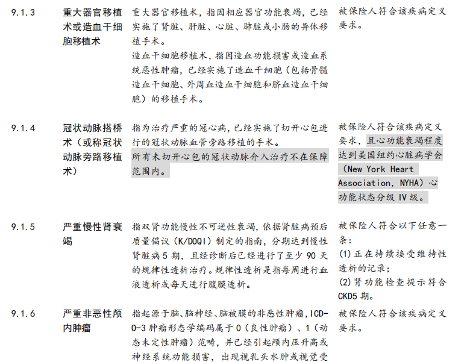
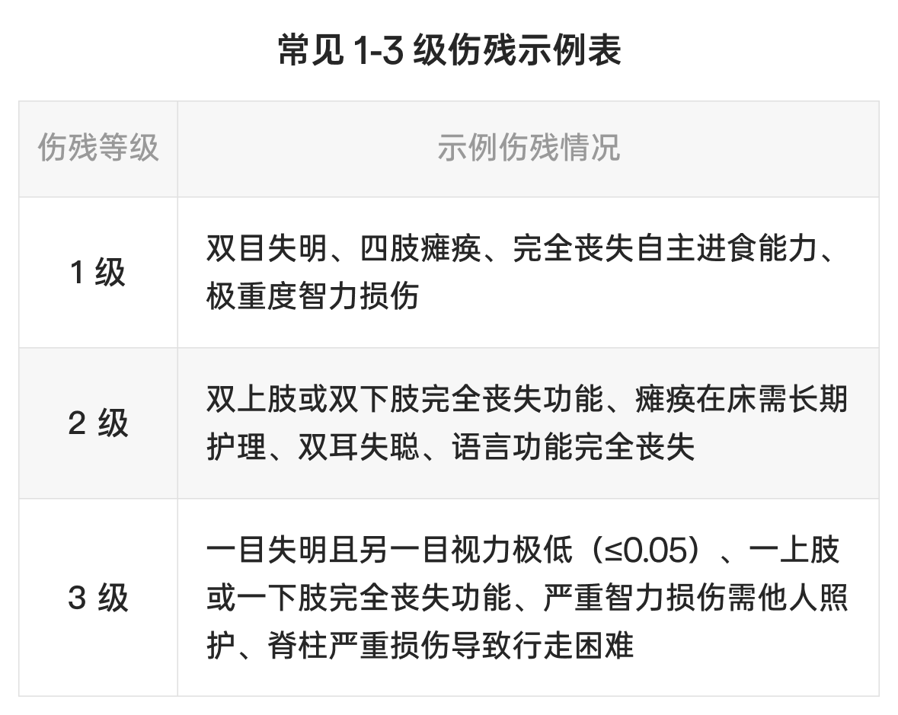
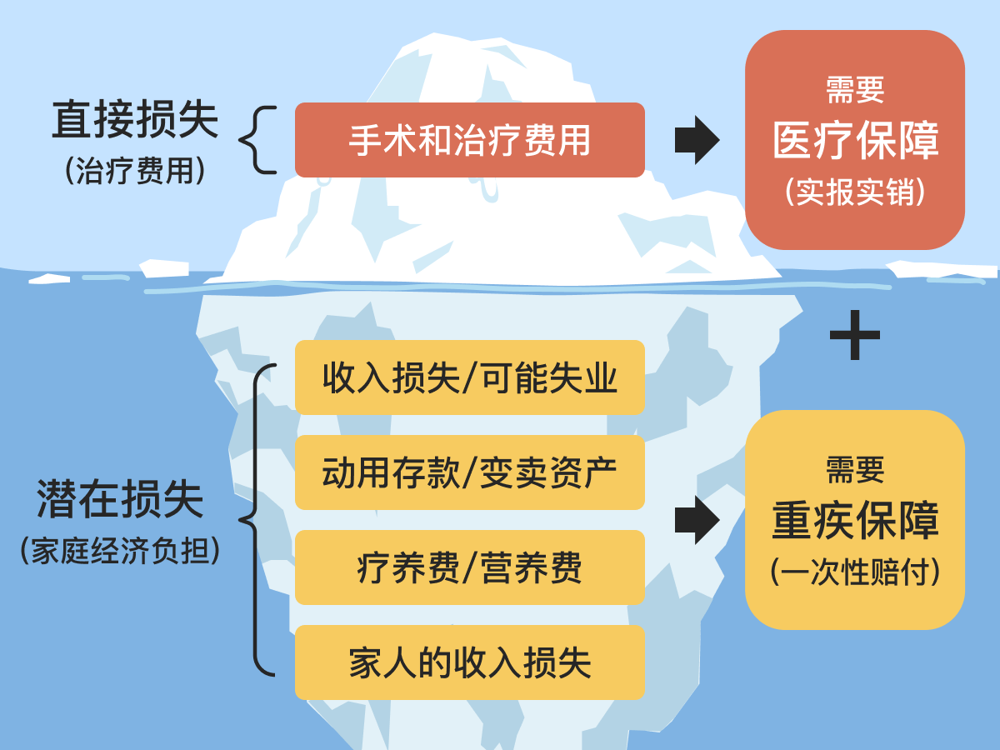
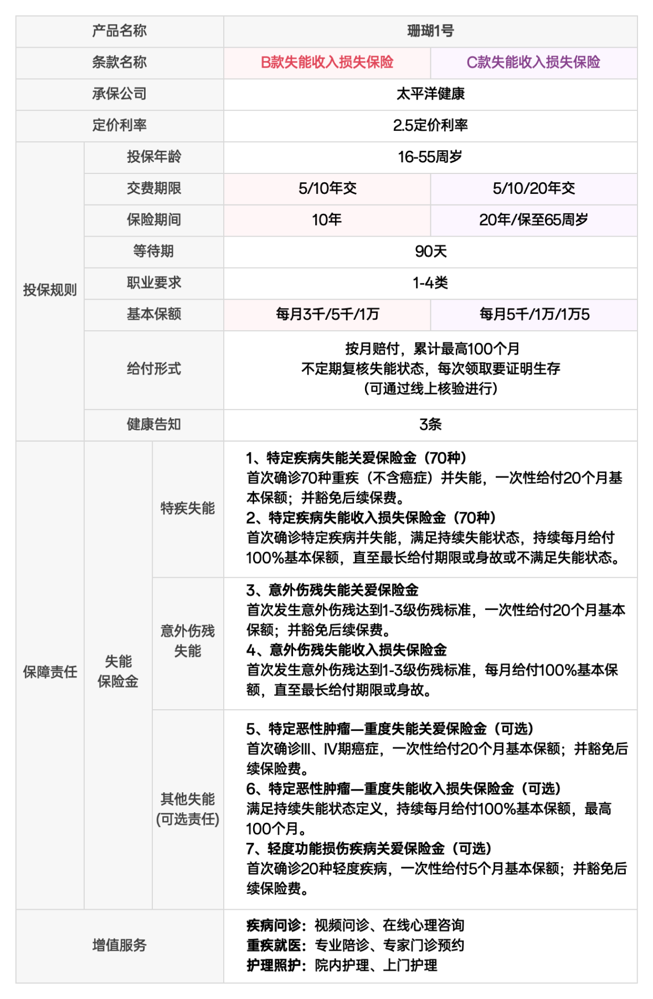
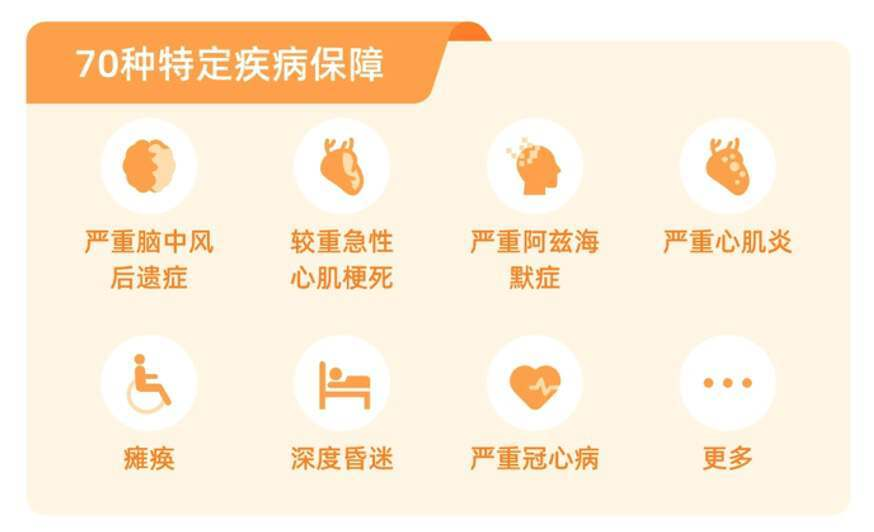
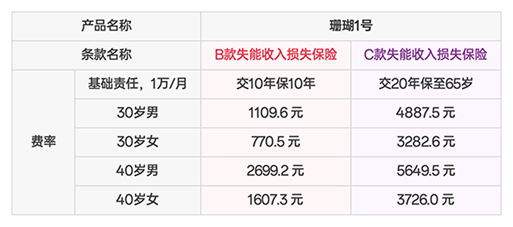

# 预算有限，重疾险太贵？失能险了解一下

近几年，大家都在讨论省钱，保险预算也开始收紧。

有些朋友还在犹豫，是否有必要花几千块配置一份重疾险；另一些朋友，虽然意识到需要加保，却迟迟没有行动。

重疾险的作用我们在之前的文章中介绍给 👉 [有了医疗险，还需要买重疾险吗?](https://youzhiyouxing.cn/n/materials/1830)，配置一份还是很有必要的。

但大家的顾虑我们也理解。所以今天，为大家介绍一个小众险种——**失能险**。对于那些因身体原因或预算问题未能配置重疾险的人，提供一个新的选择。

## 失能险是什么？

失能险全称「失能收入损失险」，属于健康保险的一种。

提到「失能」，很容易联想到瘫痪在床，没办法自己完成穿衣、移动、行动、如厕、进食、洗澡这些日常活动。

失能险的保障涵盖生活无法自理的状态，但和很多人想的不太一样，失能险不是为了持续提供护理金而存在的，这是护理险的保障范畴。

失能险的核心作用在于 **「收入补偿」**，这里所说的失能，主要指的是**工作能力的丧失。**

工作能力丧失，可能源于疾病，也可能是意外。

疾病失能，要满足两个条件：一是合同约定的特定疾病导致的，二是满足合同约定的失能状态。

（截图自珊瑚 1 号保险合同）

伤残失能，要看伤残等级，一般要求达到 1 - 3 级，这代表身体功能严重障碍或丧失。

（常见 1-3 级伤残示例表）

简单来说，失能险的保障责任就是，**只要因疾病或意外失去工作能力，并符合合同约定的失能标准，保险公司就会定期支付赔偿金。只要失能状态一直持续，赔偿金就会持续发放，直到达到合同约定的时间或者次数为止。**

可以看到，失能险的理赔条件相对严格，但正因如此，它的保费相对亲民。只需较少的投入，就能获得高额保障，保障属性很突出。

对于还没积累足够的存款，抗风险能力弱的**年轻打工人**、和那些肩负房贷、车贷、同时赡养父母、抚养子女的**家庭经济支柱**来说，有这样一份保障很重要。它能确保在失能期间有一定的收入来源，维持生活水平，减轻家庭经济负担。

## 失能险与重疾险

看到「收入补偿」，对保险比较了解的朋友已经迫不及待地举起了手，这个功能重疾险也有，它和失能险有什么异同呢？

补偿得重疾时的收入损失，确实是重疾险的核心功能之一，和失能险的作用有部分重叠。

但两类保险侧重点不同，重疾险聚焦合同约定的重大疾病，**确诊就一次性给付保险金**，能用于治病、康复和生活开销。

失能险关注疾病或意外导致的**失能状态**。部分产品确诊时也会一次性给钱，但关键是在持续失能期间，**长期、定期给付**，为失能生活提供长期经济支持。

两类产品定位不同，覆盖风险也不同。国外保险市场，失能收入损失保险很成熟，在健康险里占比超 30%。可在我国，据《2023 年度商业健康保险经营数据分析报告》，失能收入损失险保费占比仅 0.04%。

因为产品供给现状，多数人买保险时，还是靠重疾险转移失能收入损失风险。

好在现在不少保险公司关注失能险，市场上产品慢慢变多。它们通常**健康告知简单，保费也便宜。**

多了一个选择，也多了一份纠结，**重疾险和失能险，怎么选呢？**

如果已经有足额（尽量做到 30 - 50 万，对于一二线城市的家庭，通常建议保额 50 万起）的重疾险，可以不用再额外配置失能险。

要是重疾险保额不够，想增强责任期的保障，可以叠加一份失能险，以较低的成本填补保障缺口。

要是因为身体原因买不了重疾险，或者预算有限，想配置性价比更高的产品，那失能险是不错的选择，能在极端情况下，提供一份保障。

下面我们以太平洋健康保险的「珊瑚 1 号」为例，看看一款具体的失能险长什么样。

## 产品举例：珊瑚 1 号

珊瑚 1 号的保险责任分为必选责任和可选责任。

先看**必选责任**。

必选责任是投保后自动附带的保障，无需额外选择。它主要包含两项：一是特定疾病的保障，二是意外伤残的保障。

这两项保障内容相似，可以拆分为三个关键词：

> 一次性大额给付：当被保险人因特定疾病或意外，达到合同约定的失能状态，保险公司会先一次性赔付 20 个月的保额，缓解不幸初期的经济困难。豁免保费：赔付后，后续保费无需再缴纳，减轻支出压力。持续收入补偿：若被保险人持续处于失能状态，保险公司将按月赔付保额，直至达到最长给付期限，或被保险人身故，或不再满足失能状态，弥补被保险人的收入来源。

* 一次性大额给付：当被保险人因特定疾病或意外，达到合同约定的失能状态，保险公司会先一次性赔付 20 个月的保额，缓解不幸初期的经济困难。
* 豁免保费：赔付后，后续保费无需再缴纳，减轻支出压力。
* 持续收入补偿：若被保险人持续处于失能状态，保险公司将按月赔付保额，直至达到最长给付期限，或被保险人身故，或不再满足失能状态，弥补被保险人的收入来源。

**一次性大额给付**：当被保险人因特定疾病或意外，达到合同约定的失能状态，保险公司会先一次性赔付 20 个月的保额，缓解不幸初期的经济困难。

**豁免保费**：赔付后，后续保费无需再缴纳，减轻支出压力。

**持续收入补偿**：若被保险人持续处于失能状态，保险公司将按月赔付保额，直至达到最长给付期限，或被保险人身故，或不再满足失能状态，弥补被保险人的收入来源。

以赵女士为例，30 岁的她为自己购买了保额 1 万元的珊瑚 1 号 C 款失能收入损失险，缴费期限 20 年，保至 65 周岁，仅选择基础责任，每年需缴纳保费 3282.6 元。

35 岁时，赵女士不幸因车祸瘫痪，符合赔付条件，她可一次性获赔 20 万元，同时豁免后续 15 年保费。

此后，每月还能获得 1 万元赔付，直至恢复健康或身故。若一直处于失能状态，最多可获赔 100 个月，共计 100 万元。

再看**可选责任**。

可选责任主要是疾病保障的扩展。

一是恶性肿瘤的相关责任，在必选责任的「特定疾病」中，并不包含恶性肿瘤，如果在意这点的话，可以在可选责任中勾选此责任。其保障内容与特定疾病、意外伤残的保障一致，即达到失能状态时，一次性赔付 20 个月保额，豁免保费，后续持续失能则按月赔付。

（特定疾病示例）

二是轻度功能损伤责任人，若首次确诊合同约定的 20 种轻度疾病，一次给付 5 个月基本保额，豁免保费，类似于重疾的轻症责任。但需要注意的是，此项责任后续没有每月的失能保险金。

此外，珊瑚1号还提供专家门诊预约、专业就医陪护、重疾院内护理，院后上门护理等特色医疗服务，为失能群体的就医和康复提供大便利；在康复过程中，提供家庭医生在线问诊、专业心理咨询，不但为患者和家属缓解身心痛苦，也给整个家庭减少了照护方面的负担。

总体来说，这个产品的保险责任很好理解，但仍有几点需要留意：

1）失能保险金的赔付前提是，被保险人「持续处于失能状态」，也就是说：

* 被保险人必须处于生存状态，如果被保险人身故，则赔付终止；
* 若恢复后不再满足失能状态，则赔付终止，即使后续再次满足约定的失能状态，也不能继续赔了。

被保险人必须处于生存状态，如果被保险人身故，则赔付终止；

若恢复后不再满足失能状态，则赔付终止，即使后续再次满足约定的失能状态，也不能继续赔了。

2）特定疾病、意外、特定恶性肿瘤任一原因导致失能状态，领取赔偿后，其它原因再次导致失能，无法再领取保险金（轻度功能损伤不涉及这一条）；

* 举个例子，钱先生投保珊瑚 1 号至 65 岁，40 岁因车祸意外失能，领取了 20 个月的一次性赔偿和 5 个月的失能保险金后恢复；
* 63 岁时因严重脑中风后遗症再次满足失能条件，此时失能保险金、一次性赔偿都不能领了。

举个例子，钱先生投保珊瑚 1 号至 65 岁，40 岁因车祸意外失能，领取了 20 个月的一次性赔偿和 5 个月的失能保险金后恢复；

63 岁时因严重脑中风后遗症再次满足失能条件，此时失能保险金、一次性赔偿都不能领了。

3）即使合同到期，只要被保险人仍处于持续失能状态，就可继续获得赔付；

* 举个例子，若孙先生投保珊瑚 1 号至 65 岁， 63 岁严重脑中风后一直处于失能状态，除了可以领取 20 个月的一次性赔偿外，即便 2 年后保险合同到期，他仍能领取 100 个月的保险金。

举个例子，若孙先生投保珊瑚 1 号至 65 岁， 63 岁严重脑中风后一直处于失能状态，除了可以领取 20 个月的一次性赔偿外，即便 2 年后保险合同到期，他仍能领取 100 个月的保险金。

最后看**价格**。

一般来说，由于保障范围相对较窄，加之又是定期保障，所以，失能险的保费通常会比重疾险更加便宜。加上健康告知相对简单，失能险产品给预算不足、想加保重疾，或者是因为身体原因买不了重疾险的朋友提供了一个新的选择。

以 30 岁的赵女士为例，保额 1 万元，保至 65 岁，20 年缴费，每年保费 3282.6 元，这样的价格多数人都能接受。

当然，失能险还在发展初期，未来有望在保障范围、赔付条件等方面持续优化，给大家带来更完善的保障，感兴趣的朋友不妨持续关注。

## 写在最后

今年春节回家，和朋友小聚，偶然听说高中同学的妻子被诊断为白血病，正在等待骨髓移植手术，家里很困难。

我们曾一起读书、一起笑闹，而如今，曾经的朋友却要面对如此沉重的考验。

这样的事发生在自己身边、在同龄人身上，才真正感受到命运的无常。我们无法预知明天，但我们可以为自己和家人做好保障，避免因病或意外摧垮家庭。

失能险、重疾险，这些看似遥远的保障，实际上是关键时刻的支撑。生活的困难往往来得突然，但有保障，至少能让我们在困境中不至于束手无策。

不要等到事情发生后才后悔。提前做好准备，才能为自己和家人留下一份安心。

> 法律声明 本文所载内容皆以交流分享为目的，仅供参考。本文所涉保险对比/试算/报价比价等内容均来自保险机构自营平台齐欣云服，有知有行力求本文内容的准确可靠，但对相关信息的准确性、可靠性、时效性及完整性不作任何明示或暗示的保证。有知有行提示您，保险配置方案请您结合自身情况独立判断，或预约专属保险顾问进行咨询。如需转载或引用本文所述内容的任何文字、图片、音频或视频，请注明出处。转载前请与有知有行取得联系并经同意，转载时须注明来源及作者。
