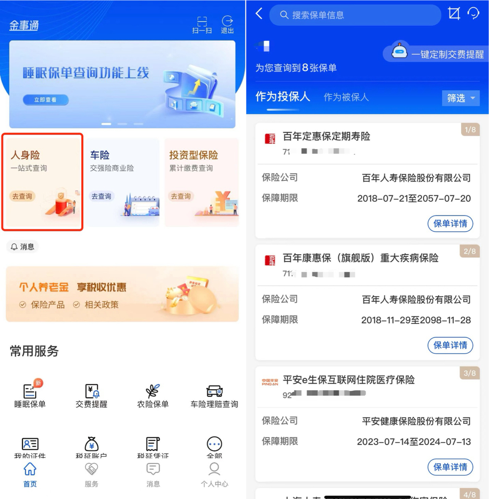
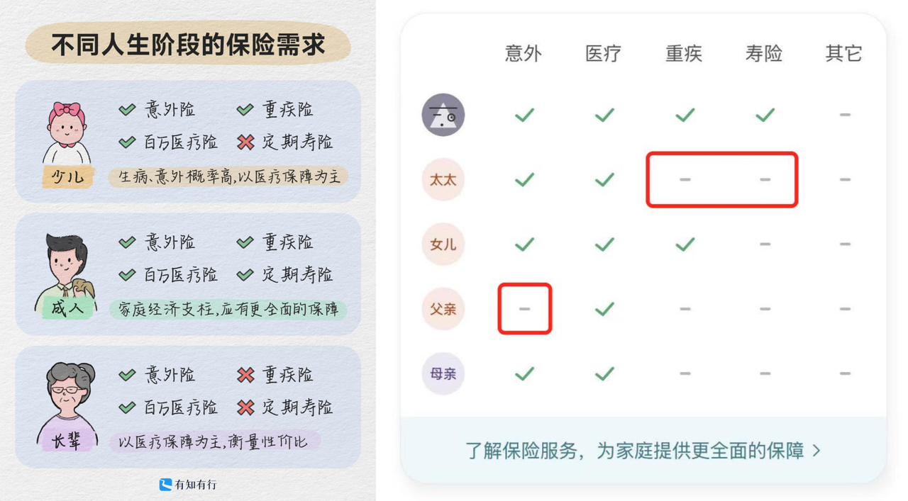
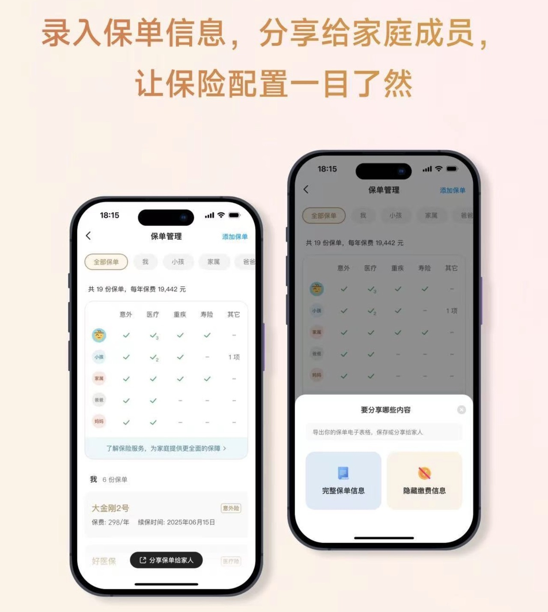
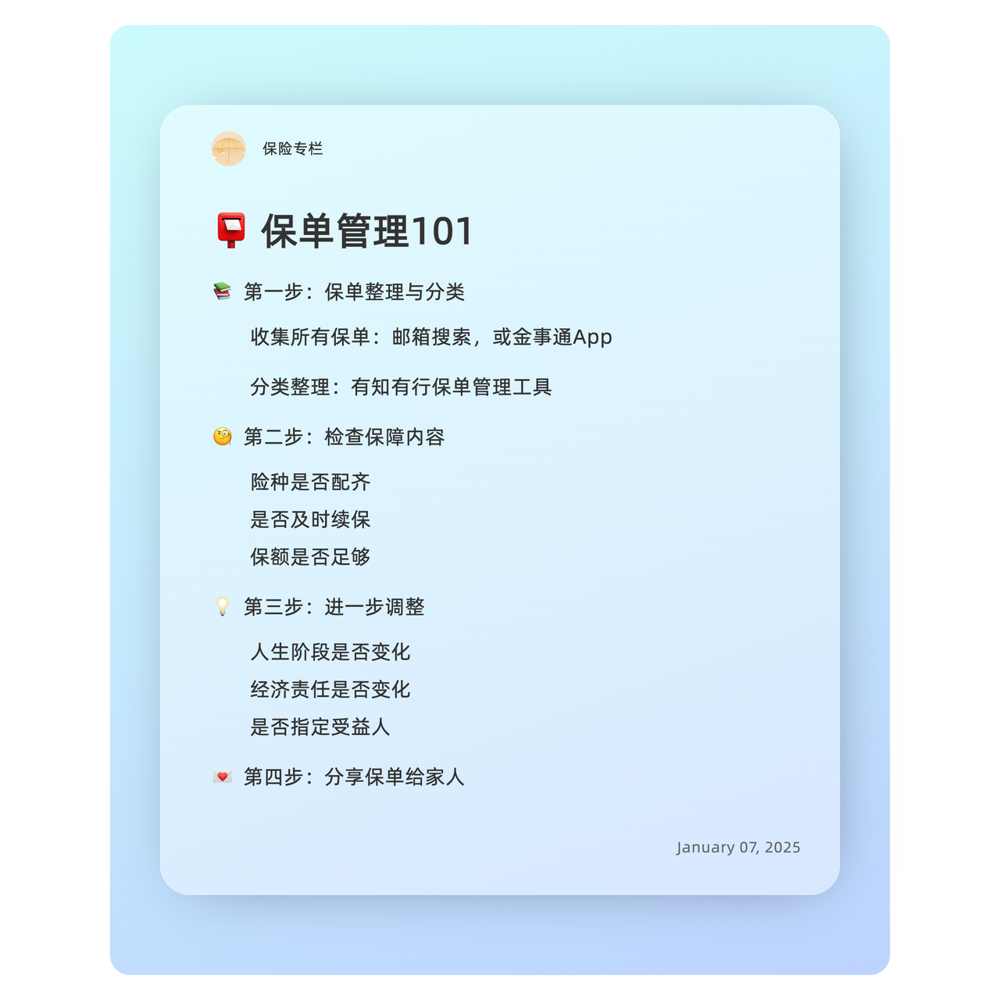

# 买了不等于完事，一起给保单做个「年检」

很多人买完保险，就觉得万事大吉，不再关注了。

但一份保险可能会陪伴我们几十年，甚至终身。刚投保时或许对保障内容很了解，但随着时间推移，许多保障细节会慢慢被遗忘。

此外，随着人生阶段的变化，家庭责任、收入水平以及负债情况也在不断变化，保险需求会随之改变，保险配置也需要动态调整。

定期进行「保单检视」很有必要。从频率上来说，每 2～3 年做一次全面检视是比较合理的。那么，保单检视应该怎么做？

这篇文章就来回答这个问题。文章比较长，可以点击下方目录，直接跳转到感兴趣的部分。

* 第一步 保单整理与分类
* 第二步 检查保障内容
* 第三步 进一步调整
* 第四步 分享给家人

[第一步 保单整理与分类](https://youzhiyouxing.cn#1)

[第二步 检查保障内容](https://youzhiyouxing.cn#2)

[第三步 进一步调整](https://youzhiyouxing.cn#3)

[第四步 分享给家人](https://youzhiyouxing.cn#4)

## 第一步 保单整理与分类

保单检视的第一步，就是把散落各处的保单整理清楚。

我们可能是在不同渠道，投保了不同保险公司的产品。时间一久，就忘记买过什么了。有两个常用方法，可以帮你找齐保单。

一是**「邮箱搜索」**，如果是线上投保，保险公司通常会把电子保单发送到投保时预留的邮箱里。以「保单」或者「保险」为关键词在邮箱里搜索一下，大多数都能找到。

这种方式的好处是邮件的附件往往会包含电子版的保险合同，下载后可以看到最为全面的保单信息，录入的时候比较方便。

如果你更换过邮箱，或者是有家庭成员、公司为你投保，那更推荐方式二 —— **金事通 App**。

这是由中国银行保险信息技术管理有限公司（简称“中国银保信”）开发的 App，这个公司受中国银行保险监督管理委员会直接监管，可以放心使用，无需担心信息安全问题。

在金事通上，可以查询与自己相关的人身险、车险和投资型保险的保单信息。

注册并实名认证后，点击「人身险」，可以查到自己做为投保人和被作为保险人的保单，也就是说你给家人买的，或者家人、公司给你买的都能查看到。

金事通展示的信息比较少，只有保险公司、产品名称、保单号、保险期限和缴费记录，如果想要记录更完备的信息，可以拿着保单号，直接联系对应的保险公司客服，进一步查询。

找齐保单后，可以**把信息汇总录入到有知有行的「保单管理」工具中，为下一步做准备。**

如果你曾经通过有知有行 App「我的」模块中的「家庭保险服务」投保，保单信息可以「一键导入」，同步到「保单管理」中。

导入的保单除了无需手动输入数据之外，后续每年的保费变化、续保时间、缴费年限保额等数据都会自动更新。已导入的保单还支持部分修改，可以关联/修改被保险人，也可填写你觉得有必要的备注。

## 第二步 检查保障内容

保单检视的第二步，则是查看已有保障是否齐全。

不同人生阶段，有不同的责任，遭遇风险时，带来的财务影响也不同，只买一个保险无法覆盖所有风险，需要根据特定阶段的需求，做好搭配。具体可以参考 👉 [不同人生阶段，该配置什么保险?](https://youzhiyouxing.cn/n/materials/1825)

有知有行的保单管理功能也展示了四大基础险种的配置情况，可以对照表格来查缺补漏。如果预算允许，没配置的，赶紧补上。

长期险需要确认是否已按时缴费，短期险则需要确认是否已及时续保，避免保障断档。

在保单管理工具中录入续保时间，下一个续保日当天下午 4 点，我们就会通过有知有行 App 给你发送续保提醒，不用担心忘记了。

保险不是买了就行，保额还要买足。保额决定了出险时能赔多少钱，是保障作用最直观的体现。计算保额时，需要综合考虑自己的收入、负债及家庭生活支出等因素。确保在风险发生时，这笔保障是有意义的。

大家通常配置的都是「百万医疗」，如果你也是，那无需纠结医疗险的保额问题。需要关注的是**意外险、重疾险和定期寿险的保额是否充足。**

**1）意外险**

为防止恶意骗保，针对老人、孩子的意外险产品，身故/伤残保额通常不会太高。

主要是**家庭支柱的保额，要买足。**

很多人存在一个误区，认为已经配置了寿险，万一身故可以获得赔付，意外险的保额就不用太高。但事实上，除了航空事故等极端情况，其他意外导致伤残的概率远远高于身故。

一旦因意外导致残疾，除了身心受创，工作和收入很可能会长期受到影响，给家庭带来沉重的负担。这时候，意外险的伤残责任就显得尤为重要。意外伤残责任通常是根据伤残等级按比例赔付的，如果保额不足，按比例赔付下来的金额可能远远不够用。

对于家庭支柱，建议意外险的保额**最低做到 50 万，如果预算充足，尽量配置100 万以上的保额。**

**2）重疾险**

重疾险要覆盖医疗和后期康复费用，**尽量做到 30~50 万，对于一二线城市的家庭，通常建议保额 50 万起。**

重疾险是给付型险种，在符合合同约定的情况下，多份重疾险可以重复理赔。如果因为预算问题不能一步到位，也可以先配置预算范围内的产品，未来再适当加保，逐步积累。

**3）定期寿险**

定期寿险的保额，取决于被保险人离世可能给家庭财务造成的缺口。直白一点，就是被保险人背负的经济责任：通常包括负债（房贷车贷）、父母养老金、子女教育金以及家庭日常支出等。

但如果严格按照这种方法计算，将得到一个巨高的保额。对应的保费也让人难以承受。所以在实际投保的时候，**大部分人会取家庭负债总额，或者 10 倍年支出，或者 5 倍年收入作为基数，再根据预算上下调整。**

## 

## 第三步 进一步调整

保险的配置从来不是一蹴而就的，它需要随着家庭状况、财务状况以及人生阶段的变化不断调整，才能始终契合你的实际需求。

或许是因为*人生发生了重大变化*，比如结婚了，需要把伴侣以及公公婆婆或岳父岳母的保障纳入考虑；又或者迎来了新生命，孩子的保险自然成为家庭规划中的重要一环。再比如，买了房子、背上房贷后，肩上的经济责任加重，原有的保险配置可能已经不足以覆盖新的风险。甚至有时候是因为预算更宽裕了，可以补充之前因为资金有限而未配置的保障。

但调整保单并不一定非要等到人生大事发生。其实，*随着年龄增长或人生阶段的推进*，心态也会悄然变化。以我自己为例，近一两年，我发现自己开始更注重医疗服务的品质，更渴望在不可预知的风险面前获得确定性。这种需求的变化，同样值得在保单中有所体现。

无论是因为什么原因，保险都值得我们静下心来定期审视和思考。每一次调整，都是对生活和未来的重新规划，是对自己和家人负责的体现。

填写受益人是投保时容易被忽视的环节，尤其是意外险，很多人默认受益人为「法定」。这个看似方便的做法，可能在实际理赔时带来麻烦。

如果不指定受益人，生前也未订立遗嘱，那么理赔时所有法定继承人都需要参与，这不仅会让理赔流程变得繁琐，还可能因为涉及多人分配而产生争议。而且，这种法定继承的分配方式，未必符合被保险人真实的意愿。

保单检视时可以确认一下带身故责任的保单是否都指定了受益人。如果人生状态发生变化，比如结婚、生子、离异等，也可以根据当下情况，看看是否需要调整。

## 

## 第四步 分享给家人

虽然谁都不希望真的用到保险，但如果有一天需要理赔，总得有人清楚你买了哪些保险，并协助处理相关事宜。所以，*将保单信息分享给家人是非常有必要的。*

在有知有行的保单管理工具中，只需点击「分享保单给家人」，就可以一键生成保单的 Excel 表格，方便地分享给家人。同时，工具还贴心地提供了「隐藏缴费信息」的选项，既能分享保单的核心内容，又避免暴露具体费用信息，兼顾了隐私和实用性。

这是保障真正落地的一步，千万别忘记了。

今天的内容看起来较多，但真正动手时，你会发现其实并没有想象中复杂。为你准备了一个保单检视清单，不妨对照着，动手试试吧～

最后，想了解更多保险知识，可以点击[保险配置思路](https://youzhiyouxing.cn/n/subjects/26)，或者打开有知有行 App，点击「有知」，下滑至专题部分就能找到我们为你精心准备的内容～

> 法律声明 本文所载内容皆以交流分享为目的，仅供参考。本文所涉保险对比/试算/报价比价等内容均来自保险机构自营平台齐欣云服，有知有行力求本文内容的准确可靠，但对相关信息的准确性、可靠性、时效性及完整性不作任何明示或暗示的保证。有知有行提示您，保险配置方案请您结合自身情况独立判断，或预约专属保险顾问进行咨询。如需转载或引用本文所述内容的任何文字、图片、音频或视频，请注明出处。转载前请与有知有行取得联系并经同意，转载时须注明来源及作者。
